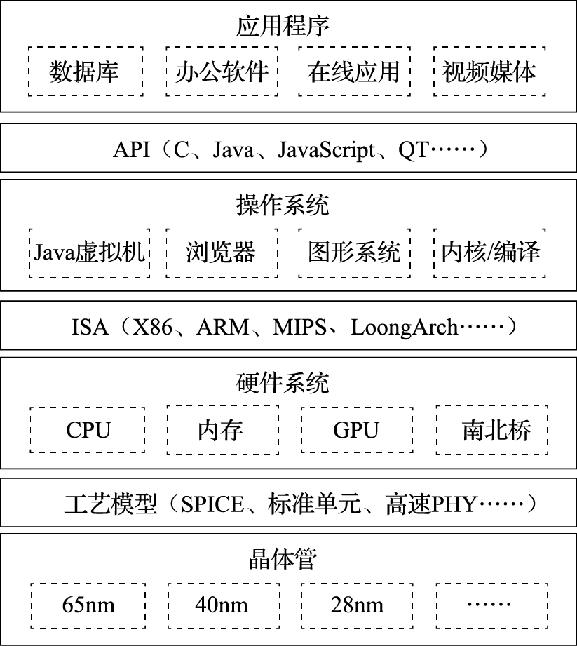
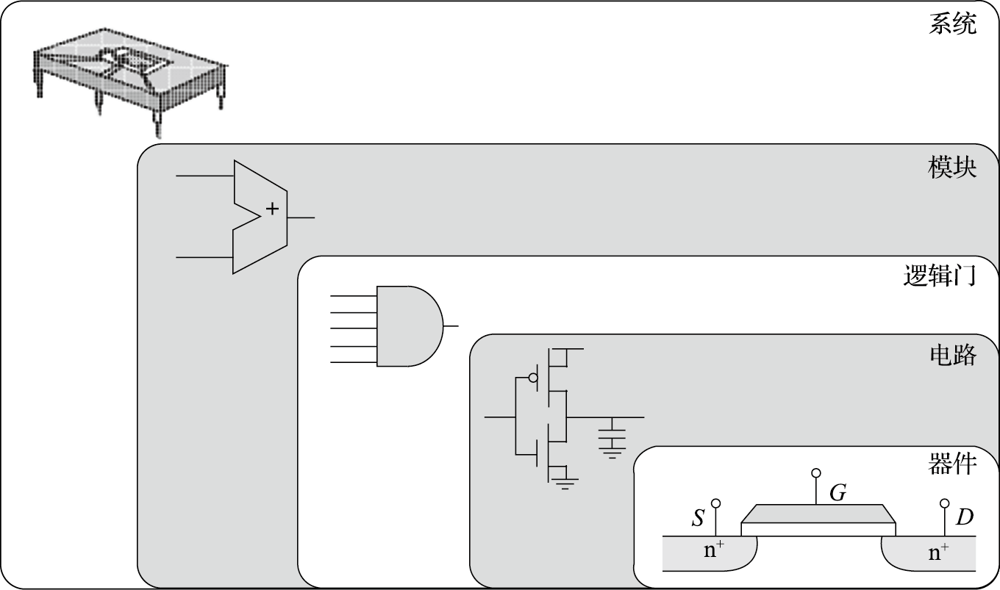
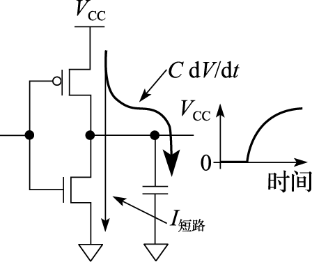
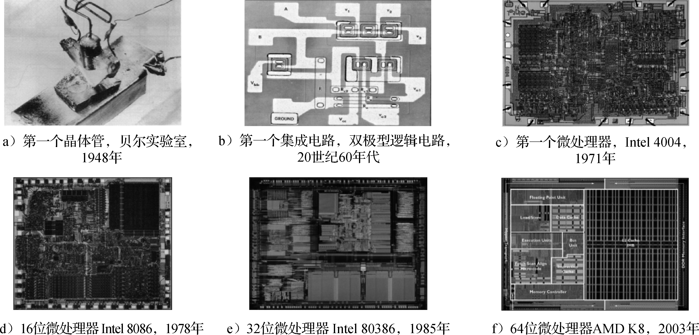
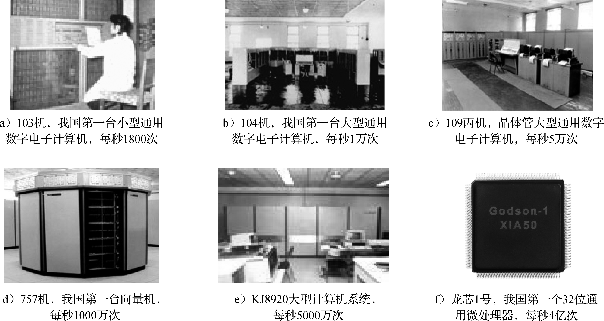

```{=latex}
% This chunk will only be processed when producing LaTeX output.
% The \frontmatter command makes the pages numbered in lowercase roman,
%    and makes chapters not numbered, although each chapter’s title
%    appears in the table of contents; if you use other sectioning
%    commands here, use the *-version (see Sectioning).
% The \mainmatter command changes the behavior back to the expected
%    version, and resets the page number.
% The \backmatter command leaves the page numbering alone but switches
%    the chapters back to being not numbered.
\mainmatter
```
# (PART) 引言 {-}

# 引言

要研究怎么造计算机，硬件方面要理解计算机组成原理和计算机体系结构，软件方面要理解操作系统和编译原理。计算机体系结构就是研究怎么做CPU的核心课程。信息产业的主要技术平台都是以中央处理器（Central Processing Unit，简称CPU）和操作系统（Operating System，简称OS）为核心构建起来的，如英特尔公司的X86架构CPU和微软公司的Windows操作系统构成的Wintel平台，ARM公司的ARM架构CPU和谷歌公司的Android操作系统构成的“AA”平台。龙芯正在致力于构建独立于Wintel和AA体系的第三套生态体系。

## 计算机体系结构的研究内容

计算机体系结构研究内容涉及的领域非常广泛，纵向以指令系统结构和CPU的微结构为核心，向下到晶体管级的电路结构，向上到应用程序编程接口（Application Programming Interface，简称API）；横向以个人计算机和服务器的体系结构为核心，低端到手持移动终端和微控制器（Micro-Controller Unit，简称MCU）的体系结构，高端到高性能计算机（High Performance Computer，简称HPC）的体系结构。

### 一以贯之

为了说明计算机体系结构研究涉及的领域，我们看一个很简单平常的问题：为什么我按一下键盘，PPT会翻一页？这是一个什么样的过程？在这个过程中，应用程序（WPS）、操作系统（Windows或Linux）、硬件系统、CPU、晶体管是怎么协同工作的？

下面介绍用龙芯CPU构建的系统实现上述功能的原理性过程。

按一下键盘，键盘会产生一个信号送到南桥芯片，南桥芯片把键盘的编码保存在南桥内部的一个寄存器中，并向处理器发出一个外部中断信号。该外部中断信号传到CPU内部后把CPU中一个控制寄存器的某一位置为“1”，表示收到了外部中断。CPU中另外一个控制寄存器有屏蔽位来确定是否处理这个外部中断信号。

屏蔽处理后的中断信号被附在一条译码后的指令上送到重排序缓冲（Re-Order Buffer，简称ROB）。外部中断是例外（Exception，也称“异常”）的一种，发生例外的指令不会被送到功能部件执行。当这条指令成为重排序缓冲的第一条指令时CPU处理例外。重排序缓冲为了给操作系统一个精确的例外现场，处理例外前要把例外指令前面的指令都执行完，后面的指令都取消掉。

重排序缓冲向所有的模块发出一个取消信号，取消该指令后面的所有指令；修改控制寄存器，把系统状态设为核心态；保存例外原因、发生例外的程序计数器（Program Counter，简称PC）等到指定的控制寄存器中；然后把程序计数器的值置为相应的例外处理入口地址进行取指（LoongArch中例外的入口地址计算规则可以参见其体系结构手册）。

处理器跳转到相应的例外处理器入口后执行操作系统代码，操作系统首先保存处理器现场，包括寄存器内容等。保存现场后，操作系统向CPU的控制寄存器读例外原因，发现是外部中断例外，就向南桥的中断控制器读中断原因，读的同时清除南桥的中断位。读回来后发现中断原因是有人敲了空格键。

操作系统接下来要查找读到的空格是给谁的：有没有进程处在阻塞状态等键盘输入。大家都学过操作系统的进程调度，知道进程至少有三个状态：运行态、阻塞态、睡眠态，进程在等IO输入时处在阻塞态。操作系统发现有一个名为WPS的进程处于阻塞态，这个进程对空格键会有所响应，就把WPS唤醒。

WPS被唤醒后处在运行状态。发现操作系统传过来的数据是个键盘输入空格，表示要翻页。WPS就把下一页要显示的内容准备好，调用操作系统中的显示驱动程序，把要显示的内容送到显存，由图形处理器（Graphic Processing Unit，简称GPU）通过访问显存空间刷新屏幕。达到了翻一页的效果。

再看一个问题：如果在翻页的过程中，发现翻页过程非常卡顿，即该计算机在WPS翻页时性能较低，可能是什么原因呢？首先得看看系统中有没有其他任务在运行，如果有很多任务在运行，这些任务会占用CPU、内存带宽、IO带宽等资源，使得WPS分到的资源不够，造成卡顿。如果系统中没有其他应用与WPS抢资源，还会卡顿，那是什么原因呢？多数人会认为是CPU太慢，需要升级。实际上，在WPS翻页时，CPU干的活不多。一种可能是下一页包含很多图形，尤其是很多矢量图，需要GPU画出来，GPU忙不过来了。另外一种可能是要显示的内容数据量大，要把大量数据从WPS的应用程序空间传给GPU使用的专门空间，内存带宽不足导致不能及时传输。在独立显存的情况下，数据如何从内存传输到显存有两种不同的机制：由CPU从内存读出来再写到显存需要CPU具有专门的IO加速功能，因为显存一般是映射在CPU的IO空间；不通过CPU，通过直接内存访问（Direct Memory Access，简称DMA）的方式直接从内存传输到显存会快得多。

“计算机体系结构”课程是研究怎么造计算机，而不是怎么用计算机。我们不是学习驾驶汽车，而是学习如何造汽车。一个计算机体系结构设计人员就像一个带兵打仗的将领，要学会排兵布阵。要上知天文、下知地理，否则就不会排兵布阵，或者只会纸上谈兵地排兵布阵，只能贻误军国大事。对计算机体系结构设计来说，“排兵布阵”就是体系结构设计，“上知天文”就是了解应用程序、操作系统、编译器的行为特征，“下知地理”就是了解逻辑、电路、工艺的特点。永远不要就体系结构论体系结构，要做到应用、系统、结构、逻辑、电路、器件的融会贯通。就像《论语》中说的“吾道一以贯之”。

```{r hierarchy1, fig.cap='通用计算机系统的层次结构', fig.align='center', out.width='50%', echo = FALSE}

```

图\@ref(fig:hierarchy1)给出了常见通用计算机系统的结构层次图。该图把计算机系统分成应用程序、操作系统、硬件系统、晶体管四个大的层次。注意把这四个层次联系起来的三个界面。第一个界面是应用程序编程接口API（Application Programming Interface），也可以称作“操作系统的指令系统”，介于应用程序和操作系统之间。API是应用程序的高级语言编程接口，在编写程序的源代码时使用。常见的API包括C语言、Fortran语言、Java语言、JavaScript语言接口以及OpenGL图形编程接口等。使用一种API编写的应用程序经重新编译后可以在支持该API的不同计算机上运行。所有应用程序都是通过API编出来的，在IT产业，谁控制了API谁就控制了生态，API做得好，APP（Application）就多。API是建生态的起点。第二个界面是指令系统ISA（Instruction Set Architecture），介于操作系统和硬件系统之间。常见的指令系统包括X86、ARM、MIPS、RISC-V和LoongArch等。指令系统是实现目标码兼容的关键，由于IT产业的主要应用都是通过目标码的形态发布的，因此ISA是软件兼容的关键，是生态建设的终点。指令系统除了实现加减乘除等操作的指令外，还包括系统状态的切换、地址空间的安排、寄存器的设置、中断的传递等运行时环境的内容。第三个界面是工艺模型，介于硬件系统与晶体管之间。工艺模型是芯片生产厂家提供给芯片设计者的界面，除了表达晶体管和连线等基本参数的SPICE（Simulation Program with Integrated Circuit Emphasis）模型外，该工艺所能提供的各种IP也非常重要，如实现PCIE接口的物理层（简称PHY）等。

需要指出的是，在API和ISA之间还有一层应用程序二进制接口（Application Binary Interface，简称ABI）。ABI是应用程序访问计算机硬件及操作系统服务的接口，由计算机的用户态指令和操作系统的系统调用组成。为了实现多进程访问共享资源的安全性，处理器设有“用户态”与“核心态”。用户程序在用户态下执行，操作系统向用户程序提供具有预定功能的系统调用函数来访问只有核心态才能访问的硬件资源。当用户程序调用系统调用函数时，处理器进入核心态执行诸如访问IO设备、修改处理器状态等只有核心态才能执行的指令。处理完系统调用后，处理器返回用户态执行用户代码。相同的应用程序二进制代码可以在相同ABI的不同计算机上运行。

学习计算机体系结构的人一定要把图\@ref(fig:hierarchy1)装在心中。从一般意义上说，计算机体系结构的研究内容包括指令系统结构、硬件系统结构和CPU内部的微结构。但做体系结构设计而上不懂应用和操作系统，下不懂晶体管级行为，就像带兵打仗排兵布阵的人不知天文、不晓地理，是做不好体系结构的。首先，指令系统就是从应用程序算法中抽取出来的“算子”。只有对应用程序有深入的了解，才能决定哪些事情通过指令系统由硬件直接实现，哪些事情通过指令组合由软件实现。其次，硬件系统和CPU的微结构要针对应用程序的行为进行优化。如针对媒体处理等流式应用，需要通过预取提高性能；CPU的高速缓存就是利用了应用程序访存的局部性；CPU的转移猜测算法就是利用了应用程序转移行为的重复性和相关性；CPU的内存带宽设计既要考虑CPU本身的访存需求，也要考虑由显示引起的GPU访问内存的带宽需求。再次，指令系统和CPU微结构的设计要充分考虑操作系统的管理需求。如操作系统通过页表进行虚存管理需要CPU实现TLB（Translation Lookaside Buffer）对页表进行缓存并提供相应的TLB管理指令；CPU实现多组通用寄存器高速切换的机制有利于加速多线程切换；CPU实现多组控制寄存器和系统状态的高速切换机制有利于加速多操作系统切换。最后，计算机中主要的硬件实体如CPU、GPU、南北桥、内存等都是通过晶体管来实现的，只有对晶体管行为有一定的了解才能在结构设计阶段对包括主频、成本、功耗在内的硬件开销进行评估。如高速缓存的容量是制约CPU主频和面积的重要因素，多发射结构的发射电路是制约主频的重要因素，在微结构设计时都是进行权衡取舍的重要内容。

### 什么是计算机

什么是计算机？大多数人认为计算机就是我们桌面的电脑，实际上计算机已经深入到我们信息化生活的方方面面。除了大家熟知的个人电脑、服务器和工作站等通用计算机外，像手机、数码相机、数字电视、游戏机、打印机、路由器等设备的核心部件都是计算机，都是计算机体系结构研究的范围。也许此刻你的身上就有好几台计算机。

看几个著名的计算机应用的例子。比如说美国国防部有一个ASCI（Accelerated Strategic Computing Initiative）计划，为核武器模拟制造高性能计算机。20世纪90年代，拥有核武器的国家签订了全面禁止核试验条约，凡是签这个条约的国家都不能进行核武器的热试验，或者准确地说不能做“带响”的核武器试验。这对如何保管核武器提出了挑战，核武器放在仓库里不能做试验，这些核武器放了一百年以后，拿出来还能不能用？会不会放着放着自己炸起来？想象一下一块铁暴露在空气中一百年会锈成什么样子。这就需要依靠计算机模拟来进行核武器管理，核武器的数字模拟成为唯一可以进行的核试验，这种模拟需要极高性能的计算机。据美国国防部估计，为了满足2010年核管理的需要，需要每秒完成$10^{16}\sim{}10^{17}$次运算的计算机。现在我们桌面电脑的频率在1GHz的量级（词头“G”表示$10^9$），加上向量化、多发射和多核的并行，现在的先进通用CPU性能大约在$10^{11}$的运算量级，即每秒千亿次运算，$10^{16}$运算量级就需要10万个CPU，耗电几十兆瓦。美国在2008年推出的世界上首台速度达到PFLOPS（每秒千万亿次运算，其中词头“P”表示$10^{15}$，FLOPS表示每秒浮点运算次数）的高性能计算机Roadrunner就用于核模拟。高性能计算机的应用还有很多。例如波音777是第一台完全用计算机模拟设计出来的飞机，还有日本的地球模拟器用来模拟整个地球的地质活动以进行地震方面的研究。高性能计算已经成为除了科学实验和理论推理外的第三种科学研究手段。

计算机的另外一个极端应用就是手机，手机也是计算机的一种。现在的手机里至少有一个CPU，有的甚至有几个。

希望大家建立一个概念，计算机不光是桌面上摆的个人计算机，它可以大到一个厅都放不下，需要专门为它建一个电站来供电，也可以小到揣在我们的兜里，充电两个小时就能用一整天。不管这个计算机的规模有多大，都是计算机体系结构的研究对象。计算机是为了满足人们各种不同的计算需求设计的自动化计算设备。随着人类科技的进步和新需求的提出，最快的计算机会越来越大，最小的计算机会越来越小。

### 计算机的基本组成

我们从小就学习十进制的运算，0、1、2、3、4、5、6、7、8、9十个数字，逢十进一。计算机中使用二进制，只有0和1两个数字，逢二进一。为什么用二进制，不用我们习惯的十进制呢？因为二进制最容易实现。自然界中二值系统非常多，电压的高低、水位的高低、门的开关、电流的有无等等都可以组成二值系统，都可以用来做计算机。二进制最早是由莱布尼茨发明的，冯·诺依曼最早将二进制引入计算机的应用，而且计算机里面的程序和数据都用二进制。从某种意义上说，中国古人的八卦也是一种二进制。

计算机的组成非常复杂，但其基本单元非常简单。打开一台PC的机箱，可以发现电路板上有很多芯片。如图\@ref(fig:device-to-chip)所示，一个芯片就是一个系统，由很多模块组成，如加法器、乘法器等；而一个模块由很多逻辑门组成，如非门、与门、或门等；逻辑门由晶体管组成，如PMOS管和NMOS管等；晶体管则通过复杂的工艺过程形成。所以计算机是一个很复杂的系统，由很多可以存储和处理二进制运算的基本元件组成。就像盖房子一样，再宏伟、高大的建筑都是由基本的砖瓦、钢筋水泥等材料搭建而成的。在CPU芯片内部，一根头发的宽度可以并排走上千根导线；购买一粒大米的钱可以买上千个晶体管。

```{r device-to-chip, fig.cap='芯片、模块、逻辑门、晶体管和器件', fig.align='center', out.width="50%", echo = FALSE}

```

现在计算机结构的基本思想是1945年匈牙利数学家冯·诺依曼结合EDVAC计算机的研制提出的，因此被称为冯·诺依曼结构。

我们通过一个具体的例子来介绍冯·诺依曼结构。比如说求式子（3×4＋5×7）的值，人类是怎么计算的呢？先计算3×4＝12，把12记在脑子里，接着计算5×7＝35，再计算12＋35＝47。我们在计算过程中计算和记忆（存储）都在一个脑袋里（但式子很长的时候需要把临时结果记在纸上）。

计算机的计算和记忆是分开的，负责计算的部分由运算器和控制器组成，称为中央处理器，就是CPU；负责记忆的部分称为存储器。存储器里存了两样东西，一是存了几个数，3、4、5、7、12、35、47，这个叫作数据；二是存储了一些指令。也就是说，操作对象和操作序列都保存在存储器里。

我们来看看计算机是如何完成（3×4＋5×7）的计算的。计算机把3、4、5、7这几个数都存在内存中，计算过程中的临时结果（12、35）和最终结果（47）也存在内存中；此外，计算机还把对计算过程的描述（程序）也存在内存中，程序由很多指令组成。表\@ref(tab:program-and-data)a给出了内存中在开始计算前数据和指令存储的情况，假设数据存在100号单元开始的区域，程序存在200号单元开始的区域。

```{r program-and-data, echo = FALSE, message=FALSE, tab.cap='程序和数据存储在一起'}
autonum <- run_autonum(seq_id = "tab", bkm = "program-and-data", bkm_all = TRUE)

readr::read_csv('./materials/chapter1/program_and_data.csv') %>%
flextable() %>%
set_caption(caption="程序和数据存储在一起", autonum = autonum) %>%
valign(i = NULL, j = NULL, valign = "top", part = "body") %>%
delete_part(part='header') %>%
theme_box() %>%
autofit()
```

计算机开始运算过程如下：CPU从内存200号单元取回第一条指令，这条指令就是“读取100号单元”，根据这条指令的要求从内存把“3”读进来；再从内存201号单元取下一条指令“读取101号单元”，然后根据这条指令的要求从内存把“4”读进来；再从内存202号单元取下一条指令“两数相乘”，乘出结果为“12”；再从内存203号单元取下一条指令“存入结果到104号单元”，把结果“12”存入104号单元。如此往复直到程序结束。表\@ref(tab:program-and-data)b是程序执行结束时内存的内容。

大家看看刚才这个过程，比我们大脑运算烦琐多了。我们大脑算三步就算完了，而计算机需要那么多步，又取指令又取数据，挺麻烦的。这就是冯·诺依曼结构的基本思想：数据和程序都在存储器中，CPU从内存中取指令和数据进行运算并把结果也放到内存中。把指令和数据都存在内存中可以让计算机按照事先规定的程序自动地完成运算，是实现图灵机的一种简单方法。冯·诺依曼结构很好地解决了自动化的问题：把程序放在内存里，一条条取进来，自己就做起来了，不用人来干预。如果没有这样一种自动执行的机制，让人去控制计算机做什么运算，拨一下开关算一下，程序没有保存在内存中而是保存在人脑中，就成算盘了。计算机的发展日新月异，但70多年过去了还是使用冯·诺依曼结构。尽管冯·诺依曼结构有很多缺点，例如什么都保存在内存中使访存成为性能瓶颈，但我们还是摆脱不了它。

虽然经过了长期的发展，以存储程序和指令驱动执行为主要特点的冯·诺依曼结构仍是现代计算机的主流结构。笔者面试研究生的时候经常问一个问题：冯·诺依曼结构最核心的思想是什么？结果很多研究生都会答错。有人说是由计算器、运算器、存储器、输入、输出五个部分组成；有人说是程序计数器导致串行执行；等等。实际上，冯·诺依曼结构就是数据和程序都存在存储器中，CPU从内存中取指令和数据进行运算，并且把结果也放在内存中。概括起来就是存储程序和指令驱动执行。


## 衡量计算机的指标

怎么样来衡量一台计算机的好坏呢？计算机的衡量指标有很多，其中性能、价格和功耗是三个主要指标。

### 计算机的性能

计算机的第一个重要指标就是性能。前面说的用来进行核模拟的高性能计算机对一个国家来说具有战略意义，算得越快越好。又如中央气象台用于天气预报的计算机每天需要根据云图数据解很复杂的偏微分方程，要是计算机太慢，明天的天气预报后天才算出来，那就叫天气后报，没用了。所以性能是计算机的首要指标。

什么叫性能？性能的最本质定义是“完成一个任务所需要的时间”。对中央气象台的台长来说，性能就是算明天的天气预报需要多长时间。如果甲计算机两个小时能算完24小时的天气预报，乙计算机一个小时就算完，显然乙的性能比甲好。完成一个任务所需要的时间可以由完成该任务需要的指令数、完成每条指令需要的拍数以及每拍需要的时间三个量相乘得到。完成任务需要的指令数与算法、编译器和指令的功能有关；每条指令需要的拍数与编译器、指令功能、微结构设计相关；每拍需要的时间，也就是时钟周期，与结构、电路设计、工艺等因素有关。

完成一个任务的指令数首先取决于算法。我们刚开始做龙芯的时候，计算所的一个老研究员讲过一个故事。说20世纪六七十年代的时候，美国的计算机每秒可以算一亿次，苏联的计算机每秒算一百万次，结果算同一个题目，苏联的计算机反而先算完，因为苏联的算法厉害。以对N个数进行排序的排序算法为例，冒泡排序算法的运算复杂度为O(N\*N)，快速排序算法的运算复杂度为O(N\*log2(N))，如果N为1024，则二者执行的指令数差100倍。

编译器负责把用户用高级语言（如C、Java、JavaScript等）写的代码转换成计算机硬件能识别的、由一条条指令组成的二进制码。转换出来的目标码的质量的好坏在很大程度上影响完成一个任务的指令数。在同一台计算机上运行同一个应用程序，用不同的编译器或不同的编译选项，运行时间可能有几倍的差距。

指令系统的设计对完成一个任务的指令数影响也很大。例如要不要设计一条指令直接完成一个FFT函数，还是让用户通过软件的方法来实现FFT函数，这是结构设计的一个取舍，直接影响完成一个任务的指令数。体系结构有一个常用的指标叫MIPS（Million Instructions Per Second）,即每秒执行多少百万条指令。看起来很合理的一个指标，关键是一条指令能干多少事讲不清楚。如果甲计算机一条指令就能做一个1024点的FFT，而乙计算机一条指令就算一个加法。两台计算机比MIPS值就没什么意义。因此后来有人把MIPS解释为Meaningless Indication of Processor Speed。现在常用一个性能指标MFLOPS（Million FLoating point Operations Per Second），即每秒做多少百万浮点运算，也有类似的问题。如果数据供不上，运算能力再强也没有用。

在指令系统确定后，结构设计需要重点考虑如何降低每条指令的平均执行周期（Cycles Per Instruction，简称CPI），或提高每个时钟周期平均执行的指令数（Instructions Per Cycle，简称IPC），这是处理器微结构研究的主要内容。CPI就是一个程序执行所需要的总的时钟周期数除以它所执行的总指令数，反之则是IPC。处理器的微结构设计对IPC的影响很大，采用单发射还是多发射结构，采用何种转移猜测策略以及什么样的存储层次设计都直接影响IPC。表\@ref(tab:spec-cpu)给出了龙芯3A1000和龙芯3A2000处理器运行SPEC CPU2000基准程序的分值。两个CPU均为64位四发射结构，主频均为1GHz，两个处理器运行的二进制码相同，但由于微结构不同，IPC差异很大，总体上说，3A2000的IPC是3A1000的2\~3倍。

```{r spec-cpu, echo = FALSE, message=FALSE, tab.cap='龙芯3A1000和龙芯3A2000的SPEC CPU2000分值'}
autonum <- run_autonum(seq_id = "tab", bkm = "spec-cpu", bkm_all = TRUE)

readr::read_csv('./materials/chapter1/spec_cpu2000.csv') %>%
flextable() %>%
set_caption(caption="龙芯3A1000和龙芯3A2000的SPEC CPU2000分值", autonum = autonum) %>%
valign(i = NULL, j = NULL, valign = "top", part = "body") %>%
delete_part(part='header') %>%
add_header_row(values=c('SPEC程序', '运行时间/秒','分值','运行时间/秒', '分值'), colwidths=c(1,1,1,1,1)) %>%
add_header_row(values=c('SPEC程序', '3A1000','3A2000'), colwidths=c(1,2,2)) %>%
merge_v(part='header') %>%
theme_box() %>%
autofit()
```

主频宏观上取决于微结构设计，微观上取决于工艺和电路设计。例如Pentium III的流水线是10级，Pentium IV为了提高主频，一发猛就把流水级做到了20级，还恨不得做到40级。Intel的研究表明，只要把Cache和转移猜测表的容量增加一倍，就能抵消流水线增加一倍引起的流水线效率降低。又如，从电路的角度来说，甲设计做64位加法只要1ns，而乙设计需要2ns，那么甲设计比乙设计主频高一倍。相同的电路设计，用不同的工艺实现出来的主频也不一样，先进工艺晶体管速度快，主频高。

可见在一个系统中不同层次有不同的性能标准，很难用一项单一指标刻画计算机性能的高低。大家可能会说，从应用的角度看性能是最合理的。甲计算机两个小时算完明天的天气预报，乙计算机只要一小时，那乙的性能肯定比甲的好，这总对吧。也对也不对。只能说，针对算明天的天气预报这个应用，乙计算机的性能比甲的好。但对于其他应用，甲的性能可能反而比乙的好。


### 计算机的价格

计算机的第二个重要指标是价格。20世纪80年代以来电脑越来越普及，就是因为电脑的价格在不断下降，从一味地追求性能（Performance per Second）到追求性能价格比（Performance per Dollar）。现在中关村卖个人电脑的企业利润率比卖猪饲料的还低得多。

不同的计算机对成本有不同的要求。用于核模拟的超级计算机主要追求性能，一个国家只需要一两台这样的高性能计算机，不太需要考虑成本的问题。相反，大量的嵌入式应用为了降低功耗和成本，可能牺牲一部分性能，因为它要降低功耗和成本。而PC、工作站、服务器等介于两者之间，它们追求性能价格比的最优设计。

计算机的成本跟芯片成本紧密相关，计算机中芯片的成本包括该芯片的制造成本和一次性成本NRE（如研发成本）的分摊部分。生产量对于成本很关键。随着不断重复生产，工程经验和工艺水平都不断提高，生产成本可以持续地降低。例如做衣服，刚开始可能做100件就有10件是次品，以后做1000件也不会做坏1件了，衣服的总体成本就降低了。产量的提高能够加速学习过程，提高成品率，还可以降低一次性成本。

随着工艺技术的发展，为了实现相同功能所需要的硅面积指数级降低，使得单个硅片的成本指数级降低。但成本降到一定的程度就不怎么降了，甚至还会有缓慢上升的趋势，这是因为厂家为了保持利润不再生产和销售该产品，转而生产和销售升级产品。现在的计算机工业是一个不断出售升级产品的工业。买一台计算机三到五年后，就需要换一台新的计算机。CPU和操作系统厂家一起，通过一些技术手段让一般用户五年左右就需要换掉电脑。这些手段包括：控制芯片老化寿命，不再更新老版本的操作系统而新操作系统的文档格式不与老的保持兼容，发明新的应用使没有升级的计算机性能不够，等等。主流的桌面计算机CPU刚上市时价格都比较贵，然后逐渐降低，降到200美元以下，就逐步从主流市场中退出。芯片公司必须不断推出新的产品，才能保持盈利。但是总的来说，对同一款产品，成本曲线是不断降低的。


### 计算机的功耗

计算机的第三个重要指标是功耗。手机等移动设备需要用电池供电。电池怎么用得久呢？低功耗就非常重要。高性能计算机也要低功耗，它们的功耗都以兆瓦（MW）计。兆瓦是什么概念？我们上大学时在宿舍里煮方便面用的电热棒的功率是1000W左右，几个电热棒一起用宿舍就停电了。1MW就是1000个电热棒的功率。曙光5000高性能计算机在中科院计算所的地下室组装调试时，运行一天电费就是一万多块钱，比整栋楼的电费还要高。计算机里产生功耗的地方非常多，CPU有功耗，内存条有功耗，硬盘也有功耗，最后为了把这些热量散发出去，制冷系统也要产生功耗。近几年来，性能功耗比（Performance per Watt）成为计算机非常重要的一个指标。


芯片功耗是计算机功耗的重要组成部分。芯片的功耗主要由晶体管工作产生，所以先来看晶体管的功耗组成。图\@ref(fig:power)是一个反相器的功耗模型。反相器由一个PMOS管和一个NMOS管组成。其功耗主要可以分为三类：开关功耗、短路功耗和漏电功耗。开关功耗主要是电容的充放电，比如当输出端从0变到1时，输出端的负载电容从不带电变为带电，有一个充电的过程；当输出端从1变到0时，电容又有一个放电的过程。在充电、放电的过程中就会产生功耗。开关功耗既和充放电电压、电容值有关，还和反相器开关频率相关。

```{r power, fig.cap='动态功耗和短路功耗', fig.align='center', out.width='50%', echo = FALSE}

```

短路功耗就是P管和N管短路时产生的功耗。当反相器的输出为1时，P管打开，N管关闭；输出为0时，则N管开，P管闭。但在开、闭的转换过程中，电流的变化并不像理论上那样是一个方波，而是有一定的斜率。在这个变化的过程中会出现N管和P管同时部分打开的情况，这时候就产生了短路功耗。

漏电功耗是指MOS管不能严格关闭时发生漏电产生的功耗。以NMOS管为例，如果栅极有电N管就导通；否则N管就关闭。但在纳米级工艺下，MOS管沟道很窄，即使栅极不加电压，源极和漏极之间也有电流；另外栅极下的绝缘层很薄，只有几个原子的厚度，从栅极到沟道也有漏电流。漏电流大小随温度升高呈指数增加，因此温度是集成电路的第一杀手。

优化芯片功耗一般从两个角度入手——动态功耗优化和静态功耗优化。升级工艺是降低动态功耗的有效方法，因为工艺升级可以降低电容和电压，从而成倍地降低动态功耗。芯片工作频率跟电压成正比，在一定范围内（如5%\~10%）降低频率可以同比降低电压，因此频率降低10%，动态功耗可以降低30%左右（功耗和电压的平方成正比，和频率成正比）。可以通过选择低功耗工艺降低芯片静态功耗，集成电路生产厂家一般会提供高性能工艺和低功耗工艺，低功耗工艺速度稍慢一些但漏电功耗成数量级降低。在结构和逻辑设计时，避免不必要的逻辑翻转可以有效降低翻转率，例如在某一流水级没有有效工作时，保持该流水级为上一拍的状态不翻转。在物理设计时，可以通过门控时钟降低时钟树翻转功耗。在电路设计时，可以采用低摆幅电路降低功耗，例如工作电压为1V时，用0.4V表示逻辑0，用0.6V表示逻辑1，摆幅就只有0.2V，大大降低了动态功耗。

芯片的功耗是一个全局量，与每一个设计阶段都相关。功耗优化的层次从系统级、算法级、逻辑级、电路级，直至版图和工艺级，是一个全系统工程。近几年在降低功耗方面的研究非常多，和以前片面追求性能不同，降低功耗已经成了芯片设计一个最重要的任务。

信息产业是一个高能耗产业，信息设备耗电越来越多。根据冯·诺依曼的公式，现在一位比特翻转所耗的电是理论值的$10^{10}$倍以上。整个信息的运算过程是一个从无序到有序的过程，这个过程中它的熵变小，是一个吸收能量的过程。但事实上，它真正需要的能量很少，因为我们现在用来实现运算的手段不够先进，不够好，所以才造成了$10^{10}$倍这么高的能耗，因此我们还有多个数量级的优化空间。这其中需要一些原理性的革命，材料、设计上都需要很大的革新，即使目前在用的晶体管，优化空间也是很大的。

有些应用还需要考虑计算机的其他指标，例如使用寿命、安全性、可靠性等。以可靠性为例，计算机中用的CPU可以分为商用级、工业级、军品级、宇航级等。比如北斗卫星上面的计算机，价格贵点没关系，慢一点也没关系，关键是要可靠，我国放了不少卫星，有的就是由于其中的元器件不可靠报废了。因此在特定领域可靠性要求非常高。再如银行核心业务用的计算机也非常在乎可靠性，只要一年少死机一次，价格贵一千万元也没关系，对银行来说，核心计算机死机，所有的储户就取不了钱，这损失太大了。

因此考评一个计算机好坏的指标非常多。本课程作为本科计算机体系结构基础课程，在以后的章节中主要关注性能指标。


## 计算机体系结构的发展

从事一个领域的研究，要先了解这个领域的发展历史。计算机体系结构是不断发展的。

20世纪五六十年代，由于工艺技术的限制，计算机都做得很简单，计算机体系结构主要研究怎么做加减乘除，Computer Architecture基本上等于Computer Arithmetic。以后我们会讲到先行进位加法器、Booth补码乘法算法、华莱士树等，主要是那时候的研究成果。现在体系结构的主要矛盾不在运算部件，CPU中用来做加减乘除的部件只占CPU中硅面积的很小一部分，CPU中的大部分硅面积用来给运算部件提供足够的指令和数据。

20世纪七八十年代的时候，以精简指令集（Reduced Instruction Set Computer，简称RISC）兴起为标志，指令系统结构（Instruction Set Architecture，简称ISA）成为计算机体系结构的研究重点。笔者上大学的时候系统结构老师告诉我们，计算机体系结构就是指令系统结构，是计算机软硬件之间的界面。

20世纪90年代以后，计算机体系结构要考虑的问题把CPU、存储系统、IO系统和多处理器也包括在内，研究的范围大大地扩展了。到了21世纪，网络就是计算机，计算机体系结构要覆盖的面更广了：向上突破了软硬件界面，需要考虑软硬件的紧密协同；向下突破了逻辑设计和工艺实现的界面，需要从晶体管的角度考虑结构设计。一方面，计算机系统的软硬件界面越来越模糊。按理说指令系统把计算机划分为软件和硬件是清楚的，但现在随着虚拟机和二进制翻译系统的出现，软硬件的界面模糊了。当包含二进制动态翻译的虚拟机执行一段程序时，这段程序可能被软件执行，也有可能直接被硬件执行；可能被并行化，也可能没有被并行化。因此，计算机结构设计需要更多地对软件和硬件进行统筹考虑。另一方面，随着工艺技术的发展，计算机体系结构需要更多地考虑电路和工艺的行为。工艺技术发展到纳米级，体系结构设计不仅要考虑晶体管的延迟，而且要考虑连线的延迟，很多情况下即使逻辑路径很短，如果连线太长也会导致其成为关键路径。

工艺技术的发展和应用需求的提高是计算机体系结构发展的主要动力。首先，半导体工艺技术和计算机体系结构技术互为动力、互相促进，推动着计算机工业的蓬勃发展。一方面，半导体工艺水平的提高，为计算机体系结构的设计提供了更多更快的晶体管来实现更多功能、更高性能的系统。例如20世纪60年代发展起来的虚拟存储技术通过建立逻辑地址到物理地址的映射，使每个程序有独立的地址空间，大大方便了编程，促进了计算机的普及。但虚拟存储技术需要TLB（Translation Lookaside Buffer）结构在处理器访存时进行虚实地址转换，而TLB的实现需要足够快、足够多的晶体管。所以半导体工艺的发展为体系结构的发展提供了很好的基础。另一方面，计算机体系结构的发展是半导体技术发展的直接动力。在2010年之前，世界上最先进半导体工艺都用于生产计算机用的处理器芯片，为处理器生产厂家所拥有（如IBM和英特尔）。其次，应用需求的不断提高为计算机体系结构的发展提供了持久的动力。最早计算机都是用于科学工程计算，只有少数人能够用，20世纪80年代IBM把计算机摆到桌面，大大促进了计算机工业发展；21世纪初网络计算的普及又一次促进了计算机工业的发展。

在2010年之前，计算机工业的发展主要是工艺驱动为主，应用驱动为辅，都是计算机工艺厂家先挖空心思发明出应用然后让大家去接受。例如英特尔跟微软为了利润而不断发明应用，从DOS到Windows，到Office，到3D游戏，每次都是他们发明了计算机的应用，然后告诉用户为了满足新的应用需求需要换更好的计算机。互联网也一样，没有互联网之前，人们根本没有想到它能干这么多事情，更没有想到互联网会成为这么大一个产业，对社会的发展产生如此巨大的影响。在这个过程中，当然应用是有拉动作用的，但这个力量远没有追求利润的动力那么大。做计算机体系结构的人总是要问一个问题，摩尔定律发展所提供的这么多晶体管可以用来干什么，很少有人问满足一个特定的应用需要多少个晶体管。但在2010年之后，随着计算机基础软硬件的不断成熟，IT产业的主要创新从工艺转向应用。可以预计，未来计算机应用对体系结构的影响将超过工艺技术，成为计算机体系结构发展的首要动力。


### 摩尔定律和工艺的发展

**1.工艺技术的发展**

摩尔定律不是一个客观规律，是一个主观规律。摩尔是Intel公司的创始人，他在20世纪六七十年代说集成电路厂商大约18个月能把工艺提高一代，即相同面积中晶体管数目提高一倍。大家就朝这个目标去努力，还真做到了。所以摩尔定律是主观努力的结果，是投入很多钱才做到的。现在变慢了，变成2～3年或更长时间更新一代，一个重要原因是新工艺的研发成本变得越来越高，厂商收回投资需要更多的时间。摩尔定律是计算机体系结构发展的物质基础。正是由于摩尔定律的发展，芯片的集成度和运算能力都大幅度提高。图\@ref(fig:ic-develop)通过一些历史图片展示了国际上集成电路和微处理器的发展历程。

```{r ic-develop, fig.cap='集成电路和微处理器的发展历程', fig.align='center', out.width='100%', echo = FALSE}

```

图\@ref(fig:china-design)给出了由我国自行研制的部分计算机和微处理器的历史图片。可以看出，随着工艺技术的发展，计算机从一个大机房到一个小芯片，运算能力大幅度提高，这就是摩尔定律带来的指数式发展的效果。其中的109丙机值得提一下，这台机器为“两弹一星”的研制立下了汗马功劳，被称为功勋机。

```{r china-design, fig.cap='我国自行研制的计算机和微处理器', fig.align='center', out.width='100%', echo = FALSE}

```

CMOS工艺正在面临物理极限。在21世纪之前的35年（或者说在0.13μm工艺之前），半导体场效应晶体管扩展的努力集中在提高器件速度以及集成更多的器件和功能到芯片上。21世纪以来，器件特性的变化和芯片功耗密度成为半导体工艺发展的主要挑战。随着线宽尺度的不断缩小，CMOS的方法面临着原子和量子机制的边界。一是蚀刻等问题越来越难处理，可制造性问题突出；二是片内漂移的问题非常突出，同一个硅片内不同位置的晶体管都不一样；三是栅氧（晶体管中栅极下面作为绝缘层的氧化层）厚度难以继续降低，65nm工艺的栅氧厚度已经降至了1.2nm，也就是五个硅原子厚，漏电急剧增加，再薄的话就短路了，无法绝缘了。

工程师们通过采用新技术和新工艺来克服这些困难并继续延续摩尔定律。在90/65nm制造工艺中，采用了多项新技术和新工艺，包括应力硅（Strained Silicon）、绝缘硅（SOI）、铜互连、低k（k指介电常数）介电材料等。45/32nm工艺所采用的高k介质和金属栅材料技术是晶体管工艺技术的又一个重要突破。采用高k介质（SiO2的k为3.9，高k材料的介电常数在20以上）如氧氮化铪硅（HfSiON）理论上相当于提升栅极的有效厚度，使漏电电流下降到10%以下。另外高k介电材料和现有的硅栅电极并不相容，采用新的金属栅电极材料可以增加驱动电流。该技术打通了通往32nm及22nm工艺的道路，扫清工艺技术中的一大障碍。摩尔称此举是CMOS工艺技术中的又一里程碑，将摩尔定律又延长了另一个10～15年。Intel公司最新CPU上使用的三维晶体管FinFET，为摩尔定律的发展注入了新的活力。

大多数集成电路生产厂家在45nm工艺之后已经停止了新工艺的研究，一方面是由于技术上越来越难，另一方面是由于研发成本越来越高。在32nm工艺节点以后，只有英特尔、三星、台积电和中芯国际等少数厂家还在继续研发。摩尔定律是半导体产业的一个共同预测和奋斗目标，但随着工艺的发展逐渐逼近极限，人们发现越来越难跟上这个目标。摩尔定律在发展过程中多次被判了“死刑”，20世纪90年代，笔者读研究生的时候就有人说摩尔定律要终结了，可是每次都能起死回生。但这次可能是真的大限到了。

摩尔定律的终结仅仅指的是晶体管尺寸难以进一步缩小，并不是硅平台的终结。过去50年，工艺技术的发展主要是按照晶体管不断变小这一个维度发展，以后还可以沿多个维度发展，例如通过在硅上“长出”新的材料来降低功耗，还可以跟应用结合在硅上“长出”适合各种应用的晶体管来。此外，伴随着新材料和器件结构的发展，半导体制造已经转向“材料时代”。ITRS中提出的非传统CMOS器件包括超薄体SOI、能带工程晶体管、垂直晶体管、双栅晶体管、FinFET等。未来有望被广泛应用的新兴存储器件主要有磁性存储器（MRAM）、纳米存储器（NRAM）、分子存储器（Molecular Memory）等。新兴的逻辑器件主要包括谐振隧道二极管、单电子晶体管器件、快速单通量量子逻辑器件、量子单元自动控制器件、自旋电子器件（Spintronic Storage）、碳纳米管（Carbon Nanotube）、硅纳米线（Silicon Nanowire）、分子电子器件（Molecular Electronic）等。


**2.工艺和计算机结构**

由摩尔定律带来的工艺进步和计算机体系结构之间互为动力、互相促进。从历史上看，工艺技术和体系结构的关系已经经历了三个阶段。

第一个阶段是晶体管不够用的阶段。那时计算机由很多独立的芯片构成，由于集成度的限制，计算机体系结构不可能设计得太复杂。

第二个阶段随着集成电路集成度越来越高，摩尔定律为计算机体系结构设计提供“更多、更快、更省电”的晶体管，微处理器蓬勃发展。

“更多”指的是集成电路生产工艺在相同面积下提供了更多的晶体管来满足计算机体系结构发展的需求。“更快”指的是晶体管的开关速度不断提高，提高了计算机频率。“更省电”指的是随着工艺进步，工作电压降低，晶体管和连线的负载电容也降低，而功耗跟电压的平方成正比，跟电容大小成正比。在0.13μm工艺之前，工艺每发展一代，电压就成比例下降，例如0.35μm工艺的工作电压是3.3V，0.25μm工艺的工作电压是2.5V，0.18μm工艺的工作电压是1.8V，0.13μm工艺的工作电压是1.2V。此外，随着线宽的缩小，晶体管和连线电容也相应变小。

这个阶段摩尔定律发展的另外一个显著特点就是处理器越来越快，但存储器只是容量增加，速度却没有显著提高。20世纪80年代这个问题还不突出，那时内存和CPU频率都不高，访问内存和运算差不多快。但是后来CPU主频不断提高，存储器只增加容量不提高速度，CPU的速度和存储器的速度形成剪刀差。什么叫剪刀差？就是差距像张开的剪刀一样，刚开始只差一点，到后来越来越大。从20世纪80年代中后期开始到21世纪初，体系结构研究的很大部分都在解决处理器和内存速度的差距问题，甚至导致CPU的含义也发生了变化。最初CPU就是指中央处理器，主要由控制器和运算器组成，但是现在的CPU中80%的晶体管是一级、二级甚至三级高速缓存。摩尔定律的发展使得CPU除了包含运算器和控制器以外，还包含一部分存储器，甚至包括一部分IO接口在里面。

现在进入了第三个阶段，晶体管越来越多，但是越来越难用，晶体管变得“复杂、不快、不省电、不便宜”。

“复杂”指的是纳米级工艺的物理效应，如线间耦合、片内漂移、可制造性问题等增加了物理设计的难度。早期的工艺线间距大，连线之间干扰小，纳米级工艺两根线挨得很近，容易互相干扰。90nm工艺之前，制造工艺比较容易控制，生产出来的硅片工艺参数分布比较均匀；90nm工艺之后，工艺越来越难控制，同一个硅片不同部分的晶体管也有快有慢（叫作工艺漂移）。纳米级工艺中物理设计还需要专门考虑可制造性问题以提高芯片成品率。此外，晶体管数目继续以指数增长，设计和验证能力的提高赶不上晶体管增加的速度，形成剪刀差。

“不快”主要是由于晶体管的驱动能力越来越小，连线电容相对变大，连线延迟越来越大。再改进工艺，频率的提高也很有限了。

“不省电”有三个方面的原因。一是随着工艺的更新换代漏电功耗不断增加，原来晶体管关掉以后就不导电了，纳米级工艺以后晶体管关掉后还有漏电，形成直流电流。二是电压不再随着工艺的更新换代而降低，在0.13μm工艺之前，电压随线宽而线性下降，但到90nm工艺之后，不论工艺怎么进步，工作电压始终在1V左右，降不下去了。因为晶体管的P管和N管都有一个开关的阈值电压，很难把阈值电压降得太低，而且阈值电压降低会增加漏电。三是纳米级工艺以后连线电容在负载电容中占主导，导致功耗难以降低。

“不便宜”指的是在28nm之前，随着集成度的提高，由于单位硅面积的成本基本保持不变，使得单个晶体管成本指数降低。如使用12英寸晶圆的90nm、65nm、45nm和28nm工艺，每个晶圆的生产成本没有明显提高。14nm开始采用FinFET工艺，晶圆生产成本大幅提高，14nm晶圆的生产成本是28nm的两倍左右，7nm晶圆的生产成本又是14nm的两倍左右。虽然单位硅面积晶体管还可以继续增加，但单个晶体管成本不再指数降低，甚至变贵了。

以前摩尔定律对结构研究的主要挑战在于“存储墙”问题，“存储墙”的研究不知道成就了多少博士和教授。现在可研究的内容更多了，存储墙问题照样存在，还多了两个问题：连线延迟成为主导，要求结构设计更加讲究互连的局部性，这种局部性对结构设计会有深刻的影响；漏电功耗很突出，性能功耗比取代性能价格比成为结构设计的主要指标。当然有新问题的时候，就需要研究解决这些问题。第三阶段结构设计的一个特点是不得已向多核（Multi-Core）发展，以降低设计验证复杂度、增加设计局部性、降低功耗。


### 计算机应用和体系结构

计算机应用是随时间迁移的。早期计算机的主要应用是科学工程计算，所以叫“计算”机；后来用来做事务处理，如金融系统、大企业的数据库管理；现在办公、媒体和网络已成为计算机的主要应用。

计算机体系结构随着应用需求的变化而不断变化。在计算机发展的初期，处理器性能的提高主要是为了满足科学和工程计算的需求，非常重视浮点运算能力，每秒的运算速度是最重要的指标。人类对科学和工程计算的需求是永无止境的。高性能计算机虽然已经不是市场的主流，但仍然在应用的驱动下不断向前发展，并成为一个国家综合实力的重要标志。现在最快的计算机已经达到百亿亿次（EFLOPS）量级，耗电量是几十兆瓦。如果按照目前的结构继续发展下去，功耗肯定受不了，怎么办呢？可以结合应用设计专门的处理器来提高效率。众核（Many-Core）处理器和GPU现在常常被用来搭建高性能计算机，美国的第一台千万亿次计算机也是用比较专用的Cell处理器做出来的。专用处理器结构结合特定算法设计，芯片中多数面积和功耗都用来做运算，效率高。相比之下，通用处理器什么应用都能干，但干什么都不是最好的，芯片中百分之八十以上的晶体管都用来做高速缓存和转移猜测等为运算部件提供稳定的数据流和指令流的结构，只有少量的面积用来做运算。现在高性能计算机越来越走回归传统的向量机这条道路，专门做好多科学和工程计算部件，这是应用对结构发展的一点启示。

计算机发展过程中的一个里程碑事件是桌面计算机/个人计算机的出现。当IBM把计算机从装修豪华的专用机房搬到桌面上时，无疑是计算机技术和计算机工业的一个划时代革命，一下子扩张了计算机的应用领域，极大地解放了生产力。桌面计算机催生了微处理器的发展，性价比成为计算机体系结构设计追求的重要目标。在桌面计算机主导计算机产业发展的二三十年（从20世纪80年代到21世纪初），CPU性能的快速提高和桌面应用的发展相得益彰。PC的应用在从DOS到Windows、从办公到游戏的过程中不断升级性能的要求。在这个过程中，以IPC作为主要指标的微体系结构的进步和以主频作为主要指标的工艺的发展成为CPU性能提高的两大动力，功劳不分轩轾。性能不断提高的微处理器逐渐蚕食了原来由中型机和小型机占领的服务器市场，X86处理器现已成为服务器的主要CPU。在游戏之后，PC厂家难以“发明”出新的应用，失去了动员用户升级桌面计算机的持续动力，PC市场开始饱和，成为成熟市场。

随着互联网和媒体技术的迅猛发展，网络服务和移动计算成为一种非常重要的计算模式，这一新的计算模式要求微处理器具有处理流式数据类型的能力、支持数据级和线程级并行性、更高的存储和IO带宽、低功耗、低设计复杂度和设计的可伸缩性，同时要求缩短芯片进入市场的周期。从主要重视运算速度到更加注重均衡的性能，强调运算、存储和IO能力的平衡，强调以低能耗完成大量的基于Web的服务、以网络媒体为代表的流处理等。性能功耗比成为这个阶段计算机体系结构设计的首要目标。云计算时代的服务器端CPU从追求高性能（High Performance）向追求高吞吐率（High Throughput）演变，一方面给了多核CPU更广阔的应用舞台，另一方面单芯片的有限带宽也限制了处理器核的进一步增加。随着云计算服务器规模的不断增加，供电成为云服务器中心发展的严重障碍，因此，低功耗也成为服务器端CPU的重要设计目标。

### 计算机体系结构发展

前面分析了工艺和应用的发展趋势，当它们作用在计算机体系结构上时，对结构的发展产生了重大影响。计算机体系结构过去几十年都是在克服各种障碍的过程中发展的，目前计算机体系结构的进一步发展面临复杂度、主频、功耗、带宽等障碍。

（1）复杂度障碍

工艺技术的进步为结构设计者提供了更多的资源来实现更高性能的处理器芯片，也导致了芯片设计复杂度的大幅度增加。现代处理器设计队伍动辄几百到几千人，但设计能力的提高还是远远赶不上复杂度的提高，验证能力更是成为芯片设计的瓶颈。另外，晶体管特征尺寸缩小到纳米级给芯片的物理设计带来了巨大的挑战。纳米级芯片中连线尺寸缩小，相互间耦合电容所占比重增大，连线间的信号串扰日趋严重；硅片上的性能参数（如介电常数、掺杂浓度等）的漂移变化导致芯片内时钟树的偏差；晶体管尺寸的缩小使得蚀刻等过程难以处理，在芯片设计时就要充分考虑可制造性。总之，工艺所提供的晶体管更多了，也更“难用”了，导致设计周期和设计成本大幅度增加。

在过去六七十年的发展历程中，计算机体系结构经历了一个由简单到复杂，由复杂到简单，又由简单到复杂的否定之否定过程。自从20世纪40年代发明电子计算机以来，最早期的处理器结构由于工艺技术的限制，不可能做得很复杂；随着工艺技术的发展，到20世纪60年代处理器结构变得复杂，流水线技术、动态调度技术、向量机技术被广泛使用，典型的机器包括IBM的360系列以及Cray的向量机；20世纪80年代RISC技术的提出使处理器结构得到一次较大的简化（X86系列从Pentium III开始，把CISC指令内部翻译成若干RISC操作来进行动态调度，内部流水线也采用RISC结构）；但后来随着深度流水、乱序执行、多发射、高速缓存、转移预测技术的实现，RISC处理器结构变得越来越复杂，现在的RISC微处理器普遍能允许数百条指令乱序执行，如Intel的Sunny Cov最多可以容纳352条指令。目前，包括超标量RISC和超长指令字（Very Long Instruction Word，简称VLIW）在内的指令级并行技术使得处理器核变得十分复杂，通过进一步增加处理器核的复杂度来提高性能已经十分有限，通过细分流水线来提高主频的方法也很难再延续下去。需要探索新的结构技术来在简化结构设计的前提下充分利用摩尔定律提供的晶体管，以进一步提高处理器的功能和性能。

（2）主频障碍

主频持续增长的时代已经结束。摩尔定律本质上是晶体管尺寸以及晶体管翻转速度变化的定律，但由于商业的原因，摩尔定律曾经被赋予每18个月处理器主频提高一倍的含义。这个概念是在Intel跟AMD竞争的时候提出来的。Intel的Pentium III主频不如AMD的K5/K6高，但其流水线效率高，实际运行程序的性能比AMD的K5/K6好，于是AMD就拿主频说事，跟Intel比主频；Intel说主频不重要，关键是看实际性能，谁跑程序跑得快。后来Intel的Pentium IV处理器把指令流水线从Pentium III的10级增加到20级，主频比AMD的处理器高了很多，但是相同主频下比AMD性能要低，两个公司反过来了；这时候轮到Intel拿主频说事，AMD反过来说主频不重要，实际性能重要。那段时间我们确实看到Intel处理器的主频在翻番地提高。Intel曾经做过一个研究，准备把Pentium IV的20级流水线再细分成40级，也就是一条指令至少40拍才能做完，做了很多模拟分析后得到一个结论，只要把转移猜测表做大一倍、二级Cache增加一倍，可以弥补流水级增加一倍引起的流水线效率降低。后来该项目取消了，Intel说4GHz以上做不上去了，改口说摩尔定律改成每两年处理器核的数目增加一倍。

事实上过去每代微处理器主频是其上一代的两倍多，其中只有1.4倍来源于器件的按比例缩小，另外1.4倍来源于结构的优化，即流水级中逻辑门数目的减少。目前的高主频处理器中，指令流水线的划分已经很细，每个流水级只有10～15级FO4（等效4扇出反相器）的延迟，已经难以再降低。电路延迟随晶体管尺寸缩小的趋势在0.13μm工艺的时候也开始变慢了，而且连线延迟的影响越来越大，连线延迟而不是晶体管翻转速度将制约处理器主频的提高。在Pentium IV的20级流水线中有两级只进行数据的传输，没有进行任何有用的运算。

（3）功耗障碍

随着晶体管数目的增加以及主频的提高，功耗问题越来越突出。现代的通用处理器功耗峰值已经高达上百瓦，按照硅片面积为1～2平方厘米计算，其单位面积的热密度已经远远超过了普通的电炉。以Intel放弃4GHz以上的Pentium IV项目为标志，功耗问题成为导致处理器主频难以进一步提高的直接因素。在移动计算领域，功耗更是压倒一切的指标。因此如何降低功耗的问题已经十分迫切。

如果说传统的CPU设计追求的是每秒运行的次数（运算速度）以及每一块钱所能买到的性能（性能价格比），那么在今天，每瓦特功耗所得到的性能（性能功耗比）已经成为越来越重要的指标。就像买汽车，汽车的最高时速是200公里还是300公里大部分人不在意，更在意的是汽车的价格要便宜，百公里油耗要低。

CMOS电路的功耗与主频和规模都成正比，与电压的平方成正比，而主频在一定程度上又跟电压成正比。由于晶体管的特性，0.13μm工艺以后工作电压不随着工艺的进步而降低，加上频率的提高，导致功耗密度随集成度的增加而增加。另外纳米级工艺的漏电功耗大大增加，在65nm工艺的处理器中漏电功耗已经占了总功耗的30%。这些都对计算机体系结构的低功耗设计提出了挑战。降低功耗需要从工艺技术、物理设计、体系结构设计、系统软件以及应用软件等多个方面共同努力。

（4）带宽障碍

随着工艺技术的发展，处理器片内的处理能力越来越强。按照目前的发展趋势，现代处理器很快将在片内集成十几甚至几十个高性能处理器核，而芯片进行计算所需要的数据归根结底是来自片外。高性能的多核处理器如不能低延迟、高带宽地同外部进行数据交互，则会出现“嘴小肚子大”“茶壶里倒饺子”的情况，整个系统的性能会大大降低。

芯片的引脚数不可能无限增加。通用CPU封装一般都有上千个引脚，一些服务器CPU有四五千个引脚，有时候封装成本已经高于硅的成本了。处理器核的个数以指数增加，封装不变，意味着每个CPU核可以使用的引脚数按指数级下降。

冯·诺依曼结构中CPU和内存在逻辑上是分开的，指令跟数据都存在内存中，CPU要不断从内存取指令和数据才能进行运算。传统的高速缓存技术的主要作用是降低平均访问延迟，解决CPU速度跟存储器速度不匹配的问题，但并不能有效解决访存带宽不够的问题。现在普遍通过高速总线来提高处理器的带宽，这些高速总线采用差分低摆幅信号进行传输。不论是访存总线（如DDR4、FBDIMM等）、系统总线（如HyperTransport）还是IO总线(如PCIe)，其频率都已经达到GHz级，有的甚至超过10GHz，片外传输频率高于片内运算频率。即便如此，由于片内晶体管数目的指数级增加，处理器体系结构设计也要面临每个处理器核的平均带宽不断减少的情况。进入21世纪以来，如果说功耗是摩尔定律的第一个“杀手”，导致结构设计从单核到多核，那么带宽问题就是摩尔定律的第二个“杀手”，必将导致结构设计的深刻变化。一些新型工艺技术，如3D封装技术、光互连技术，有望缓解处理器的带宽瓶颈。

上述复杂度、主频、功耗、带宽的障碍对计算机体系结构的发展造成严重制约，使得计算机体系结构在通用CPU核的微结构方面逐步趋于成熟，开始往片内多核、片上系统以及结合具体应用的专用结构方面发展。


## 体系结构设计的基本原则

计算机体系结构发展很快，但在发展过程中遵循一些基本原则，这些原则包括平衡性、局部性、并行性和虚拟化。

### 平衡性

结构设计的第一个原则就是要考虑平衡性。一个木桶所盛的水量的多少由最短的木板决定，一个结构最终体现出的性能受限于其瓶颈部分。计算机是个复杂系统，影响性能的因素很多。例如，一台个人计算机使用起来比较卡顿，一般人会觉得主要是由于CPU性能不够，实际上真正引起性能卡顿的可能是内存带宽、硬盘或网络带宽、GPU性能，或者是CPU和GPU之间数据传输不顺，等等。又如，一般的CPU微结构研究专注于其中某些重要因素如Cache命中率和转移猜测命中率的改善，但通用CPU微结构中影响性能的因素非常复杂，重排序缓冲项数、发射队列项数、重命名寄存器个数、访存队列项数、失效队列项数、转移指令队列项数与一级Cache失效延迟、二级Cache失效延迟、三级Cache失效延迟等需要平衡设计，有关队列大小应保证一级Cache和二级Cache的失效不会引起流水线的堵塞。

通用CPU设计有一个关于计算性能和访存带宽平衡的经验原则，即峰值浮点运算速度（MFLOPS）和峰值访存带宽（MB/s）为1∶1左右。表\@ref(tab:flops-and-bandwidth)给出了部分典型CPU的峰值浮点运算速度和访存带宽比。从表中可以看出，一方面，最新的CPU峰值浮点运算速度和访存带宽比逐步增加，说明带宽已经成为通用CPU的重要瓶颈，多核的发展是有限度的；另一方面，如果去除SIMD（Single Instruction Multiple Data）的因素，即去除128位SIMD浮点峰值为64位浮点的2倍，256位SIMD浮点峰值为64位浮点的4倍的因素，则浮点峰值和访存带宽还是基本保持着1∶1的关系，因为SIMD一般只有科学计算使用，一般的事务处理不会用SIMD的浮点性能。

```{r flops-and-bandwidth, echo = FALSE, message=FALSE, tab.cap='典型CPU的浮点峰值和访存带宽比'}
autonum <- run_autonum(seq_id = "tab", bkm = "flops-and-bandwidth", bkm_all = TRUE)

readr::read_csv('./materials/chapter1/flops_bandwidth.csv') %>%
flextable() %>%
set_caption(caption="典型CPU的浮点峰值和访存带宽比", autonum = autonum) %>%
valign(i = NULL, j = NULL, valign = "top", part = "body") %>%
fontsize(size=9, part="all") %>%
theme_box() %>%
autofit()
```

计算机体系结构中有一个著名的Amdahl定律。该定律指出通过使用某种较快的执行方式所获得的性能的提高，受限于不可使用这种方式提高性能的执行时间所占总执行时间的百分比，例如一个程序的并行加速比，最终受限于不能被并行化的串行部分。也就是性能的提升不仅跟其中的一些指令的运行时间的优化有关，还和这些指令在总指令数中所占的比例有关：

$$ ExTime_{new} = Extime_{old} * \left((1 - Fraction_{enhanced}) + \frac{Fraction_{enhanced}}{Speedup_{enhanced}}\right) $$

$$ Speedup_{overall} = \frac{Extime_{old}}{ExTime_{new}} $$

在计算机体系结构设计里Amdahl定律的体现非常普遍。比如说并行化，一个程序中有一些部分是不能被并行化的，而这些部分将成为程序优化的一个瓶颈。举一个形象的例子，一个人花一个小时可以做好一顿饭，但是60个人一起做不可能用一分钟就能做好，因为做饭的过程有一些因素是不可被并行化的。

结构设计要统筹兼顾，抓住主要因素的同时不要忽略次要因素，否则当主要的瓶颈问题解决以后，原来不是瓶颈的次要因素可能成为瓶颈。就像修马路，在一个本来堵车的路口修座高架桥，这个路口不堵车了，但与这个路口相邻的路口可能堵起来。体系结构设计的魅力正在于在诸多复杂因素中做到统筹兼顾。

### 局部性

局部性是事物普遍存在的性质。一个人认识宇宙的范围受限于光速和人的寿命，这是一种局部性；一个人只能认识有限的人，其中天天打交道的熟悉的人更少，这也是一种局部性。局部性在计算机中普遍存在，是计算机性能优化的基础。

体系结构利用局部性进行性能优化时，最常见的是利用事件局部性，即有些事件频繁发生，有些事件不怎么发生，在这种情况下要重点优化频繁发生的事件。当结构设计基本平衡以后，优化性能要抓主要矛盾，重点改进最频繁发生事件的执行效率。作为设计者必须清楚什么是经常性事件，以及提高这种情况下机器运行的速度对计算机整体性能有多大贡献。例如，假设我们把处理器中浮点功能部件执行的性能提高一倍，但是整个程序里面只有10%的浮点指令，总的性能加速比是1÷0.95=1.053，也就是说即使把所有浮点指令的计算速度提高了一倍，总的CPU性能只提高了5%。所以应该加快经常性事件的速度。把经常性的事件找出来，而且它占的百分比越高越好，再来优化这些事件，这是一个基本的原理。RISC指令系统的提出就是利用指令的事件局部性对频繁发生的事件进行重点优化的例子。硬件转移猜测则是利用转移指令跳转方向的局部性，即同一条转移指令在执行时经常往同一个方向跳转。

利用访存局部性进行优化是体系结构提升访存指令性能的重要方法。访存局部性包括时间局部性和空间局部性两种。时间局部性指的是一个数据被访问后很有可能多次被访问。空间局部性指的是一个数据被访问后，它邻近的数据很有可能被访问，例如数组按行访问时相邻的数据连续被访问，按列访问时虽然空间上不连续，但每次加上一个固定的步长，也是一种特殊的空间局部性。计算机体系结构使用访存局部性原理来提高性能的地方很多，如高速缓存、TLB、预取都利用了访存局部性。

### 并行性

计算机体系结构提高性能的另外一个方法就是开发并行性。计算机中一般可以开发三种层次的并行性。

第一个层次的并行性是指令级并行。指令级并行是20世纪最后20年体系结构提升性能的主要途径。指令级并行性可以在保持程序二进制兼容的前提下提高性能，这一点是程序员特别喜欢的。指令级并行分成两种。一种是时间并行，即指令流水线。指令流水线就像工厂生产汽车的流水线一样，汽车生产工厂不会等一辆汽车都装好以后再开始下一辆汽车的生产，而是在多道工序上同时生产多辆汽车。另一种是空间并行，即多发射，或者叫超标量。多发射就像多车道的马路，而乱序执行（Out-of-Order Execution）就是允许在多车道上超车，超标量和乱序执行常常一起使用来提高效率。在20世纪80年代RISC出现后，随后的20年指令级并行的开发达到了一个顶峰，2010年后进一步挖掘指令级并行的空间已经不大。

第二个层次的并行性是数据级并行，主要指单指令流多数据流（SIMD）的向量结构。最早的数据级并行出现在ENIAC上。20世纪六七十年代以Cray为代表的向量机十分流行，从Cray-1、Cray-2，到后来的Cray X-MP、Cray Y-MP。直到Cray-4后，SIMD沉寂了一段时间，现在又开始恢复活力，而且用得越来越多。例如X86中的AVX多媒体指令可以用256位通路做四个64位的运算或八个32位的运算。SIMD作为指令级并行的有效补充，在流媒体领域发挥了重要的作用，早期主要用在专用处理器中，现在已经成为通用处理器的标配。

第三个层次的并行性是任务级并行。任务级并行大量存在于Internet应用中。任务级并行的代表是多核处理器以及多线程处理器，是目前计算机体系结构提高性能的主要方法。任务级并行的并行粒度较大，一个线程中包含几百条或者更多的指令。

上述三种并行性在现代计算机中都存在。多核处理器运行线程级或进程级并行的程序，每个核采用多发射流水线结构，而且往往有SIMD向量部件。

### 虚拟化

所谓虚拟化，就是“用起来是这样的，实际上是那样的”，或者“逻辑上是这样的，物理上是那样的”。计算机为什么好用？因为体系结构设计者宁愿自己多费点事，也要尽量为用户提供一个友好界面的用户接口。虚拟化是体系结构设计者为用户提供友好界面的一个基本方法，虚拟化的本质就是在不好用的硬件和友好的用户界面之间架一座“桥梁”。

架得最成功的一座“桥梁”是20世纪60年代工艺的发展使处理器中可以包含像TLB这样较为复杂的结构，操作系统可以支持虚拟空间，大大解放了程序员的生产力。早期的计算机程序员编程的时候要直接跟物理内存和外存打交道，非常麻烦，虚拟存储解决了这个问题。每个进程都使用一个独立的、很大的存储空间，具体物理内存的分配和数据在内存和外存的调入调出都由操作系统自动完成。这座桥架得太漂亮了，给它评分肯定是“特优”。

如果说虚拟存储技术“虚拟”了内存，那么多线程和虚拟机技术则“虚拟”了CPU。多线程技术，尤其是同时多线程（Simultaneous Multi-Threading，简称SMT）技术，通过微结构的硬件支持，如设立多组通用寄存器等，使得在同一个CPU中实现两个或多个线程中的指令在流水线中混合地执行，或在同一个CPU中实现线程的快速切换，使用户在一个CPU上“同时”执行多个线程。虚拟机技术则通过微结构的硬件增强，如设立多组控制寄存器和系统状态等，实现多个操作系统的快速切换，达到在同一台计算机上“同时”运行多个操作系统的目的。这座桥架得也不错，作用没有虚拟存储那么明显，给它评分可以得“优”。

流水线和多发射结构也是架得很成功的一座“桥梁”。20世纪七八十年代以来，工艺的发展使得像流水线和多发射这样的结构得以实现，在维持串行编程模型的情况下提高了速度。但由于程序中相关性的存在，流水线和多发射的效率难以做得很好，例如在单发射结构中IPC达到0.5就不错了，在四发射结构中IPC达到1.5就不错了。流水线和多发射这座桥的评分可以得“优”。

另外一座比较成功的“桥梁”是Cache技术。CPU速度越来越快，内存大但是慢，通过Cache技术可以使程序员看到一个像Cache那么快、像内存那么大的存储空间，不用改应用程序就能提高性能。这座桥也对程序员屏蔽了结构细节（虽然程序员往往针对Cache结构进行精雕细刻的程序设计以增加局部性），但代价太大，现代处理器往往80%以上的晶体管都用在Cache上了，所以Cache这座桥的评分只能得“良好”。

还有一座比较典型的“桥梁”是分布式共享存储系统中的Cache一致性协议。Cache一致性协议可以在分布式存储的情况下给程序员提供一个统一的编程空间，屏蔽了存储器物理分布的细节；但Cache一致性协议并不能解决程序员需要并行编程、原有的串行程序不能并行运行的问题。因此Cache一致性协议这座桥评分可以得“及格”。如果哪天编译技术发展到程序员只要写串行程序，计算机能够自动并行化并在成千上万个处理器中运行该程序，那这座桥的评分可以得“特优”。

## 本章小结

本章介绍了计算机体系结构的研究内容，包括指令系统结构和以冯·诺依曼结构为基础的计算机组织结构，以及微体系结构和并行体系结构；衡量计算机的主要指标，性能、面积、功耗的评价和优化；计算机体系结构的发展简史，工艺和应用的发展对体系结构的影响，制约体系结构发展的因素；计算机体系结构设计应遵循的基本原则，包括平衡性、局部性、并行性、虚拟化等。

## 习题

1.	计算机系统可划分为哪几个层次，各层次之间的界面是什么？你认为这样划分层次的意义何在？

2.	在三台不同指令系统的计算机上运行同一程序P时，A机器需要执行$1.0\times{}10^9$条指令，B机器需要执行$2.0\times{}10^9$条指令，C机器需要执行$3.0\times{}10^9$条指令，但三台机器的实际执行时间都是100秒。请分别计算出这三台机器的MIPS，并指出运行程序P时哪台机器的性能最高。

3.	假设某程序中可向量化的百分比为P，现在给处理器中增加向量部件以提升性能，向量部件的加速比是S。请问增加向量部件后处理器运行该程序的性能提升幅度是多少？

4.	处理器的功耗可简单分为静态功耗和动态功耗两部分，其中静态功耗的特性满足欧姆定律，动态功耗在其他条件相同的情况下与频率成正比。现对某处理器进行功耗测试，得到如下数据：关闭时钟，电压1.0V时，电流为100mA；时钟频率为1GHz，电压1.1V时，电流为2100mA。请计算此处理器在时钟频率为2GHz、电压为1.1V时的总功耗。

5.	在一台个人计算机上进行SPEC CPU 2000单核性能的测试，分别给出无编译优化选项和编译优化选项为-O2的测试报告。

6.  分别在苹果手机、华为手机以及X86-Windows机器上测试浏览器Octane（参见https：//chromium.github.io/octane/）的分值，并简单评述。

\newpage
