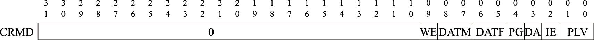
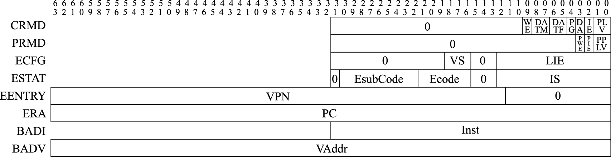
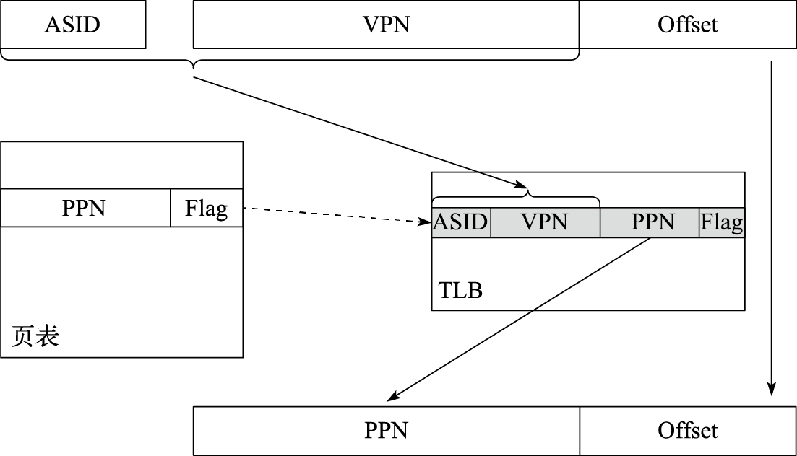
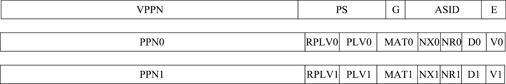
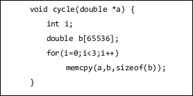

# 特权指令系统 {#sec-privileged-ISA}

## 特权指令系统简介

在计算机系统层次结构中，应用层^[特指直接运行在CPU上的应用，把虚拟机及其上运行的应用作为整体看待。]在操作系统层之上，只能看到和使用指令系统的一个子集，即指令系统的用户态部分。每个应用程序都有自己的寄存器、内存空间以及可执行的指令。现代计算机的指令系统在用户态子集之外还定义了操作系统核心专用的特权态部分，我们称之为特权指令系统。

特权指令系统的存在主要是为了让计算机变得更好用、更安全。操作系统通过特权指令系统管理计算机，使得应用程序形成独占CPU的假象，并使应用间相互隔离，互不干扰。应用程序只能在操作系统划定的范围内执行，一旦超出就会被CPU切换成操作系统代码运行。

不同指令系统的特权态部分差别较大，但就其机制而言，可以分为以下几类：

1）运行模式定义及其转换

现代计算机的操作系统都实现了保护模式，至少需要用户态和核心态两种运行模式。应用运行在用户态模式下，操作系统运行在核心态模式下。因此，指令系统必须有相应的运行模式以做区分。比如MIPS定义了user、supervisor、kernel三种模式，X86定义了Ring0\~Ring3四种模式，LoongArch定义了PLV0\~PLV3四种模式。

刚开机时，CPU初始化为操作系统核心态对应的运行模式，执行引导程序加载操作系统。操作系统做完一系列初始化后，控制CPU切换到操作系统用户态对应的运行模式去执行应用程序。应用程序执行过程中，如果出现用户态对应的运行模式无法处理的事件，则CPU会通过异常或中断回到核心态对应的运行模式，执行操作系统提供的服务程序。操作系统完成处理后再控制CPU返回用户态对应的运行模式，继续运行原来的应用程序或者调度另一个应用程序。在LoongArch指令系统中，CPU当前所处的运行模式由当前模式信息控制状态寄存器（CSR.CRMD）的PLV域的值确定，其值为0～3分别表示CPU正处于PLV0～PLV3四种运行模式（见图\@ref(fig:crmd)）。

```{r crmd, echo=FALSE, fig.align='center', fig.cap="LoongArch当前模式信息控制状态寄存器格式", out.width='100%'}

```

运行模式的转换过程与虚拟存储和异常中断紧密相关，共同构建出完备的保护模式。不少指令系统还支持虚拟机模式、调试模式等，使计算机系统更为易用。

2）虚拟存储管理

虚拟存储管理的基本思想是让软件（包括系统软件）运行在“虚地址”上，与真正访问存储的“实地址”（物理地址）相隔离。虚实地址的转换根据地址段属性的不同，有查表转换和直接映射两种方式。查表转换是应用程序使用的主要方式。不同的进程有自己独立的虚地址空间。CPU执行访存指令时，根据操作系统给出的映射表来完成虚地址空间到物理内存的转换。

直接映射的方式与使用物理地址差别不大，主要给操作系统使用，因为在初始化之前负责虚存管理的代码本身不能运行在被管理的虚地址空间。通常用户态应用程序无法使用直接映射方式。

\@ref(sec-memory-management)节将对存储管理做更详细的介绍。

3）异常与中断处理

异常与中断是一种打断正常的软件执行流，切换到专门的处理函数的机制。它在各种运行模式的转换中起到关键的纽带作用。比如用户态代码执行过程中，当出现对特权空间的访问，或者访问了虚实地址映射表未定义的地址，或者需要调用操作系统服务等情况时，CPU通过发出异常来切换到核心态，进入操作系统定义的服务函数。操作系统完成处理后，返回发生异常的代码并同时切换到用户态。

\@ref(sec-exception)节将对异常与中断做更详细的介绍。

4）控制状态寄存器

控制状态寄存器位于一个独立的地址空间，是支撑前面3种机制的具体实现，不同的指令系统差别较大。下面以LoongArch指令系统为例，列出其控制状态寄存器的功能。
```{r la-csr, echo = FALSE, message=FALSE, tab.cap='LoongArch处理器的控制寄存器', tab.id='la-csr'}
autonum <- run_autonum(seq_id = "tab", bkm = "la-csr", bkm_all = TRUE)
readr::read_csv('./materials/chapter3/csr.csv') %>%
flextable() %>%
set_caption(caption="LoongArch处理器的控制寄存器", autonum = autonum) %>%
merge_v() %>%
width(j=1, width=1.0) %>%
width(j=2, width=1.0) %>%
width(j=3, width=4.0) %>%
theme_box()
```

控制状态寄存器虽然重要，但对其操作的频率通常远远低于通用寄存器，所以指令系统中通常不会设计针对控制状态寄存器的访存和复杂运算指令。不过大多数指令系统至少会定义若干在控制状态寄存器和通用寄存器之间进行数据搬运的指令，从而可以将数据移动到通用寄存器中进行相关处理，或者进一步将处理结果写回控制状态寄存器中。在LoongArch指令系统中，就定义了CSRRD和CSRWR指令来完成控制状态寄存器的读写操作。例如，指令“csrrd \$t0, CSR_CRMD ^[这里CSR_CRMD是一个宏定义，表示一个立即数，其值为CRMD控制状态寄存器的编号0x0。使用CSR_CRMD这样的宏定义是为了便于代码理解。] ”将控制状态寄存器CRMD的值读出，然后写入通用寄存器\$t0中；指令“csrwr \$t0, CSR_CRMD”将通用寄存器\$t0中的值写入到控制状态寄存器CRMD中，同时将控制状态寄存器CRMD的旧值写入通用寄存器\$t0中。

## 异常与中断 {#sec-exception}

计算机通常按照软件的执行流进行顺序执行和跳转，但有时会需要中断正常的执行流程去处理其他任务，可以触发这一过程的事件统称为异常。

### 异常分类

从来源来看，异常可分为以下6种。

1）外部事件：来自CPU核外部^[这里“CPU核”可以更为严格地理解为CPU核的指令流水线，即旨在强调这些事件并非直接由指令引发。以定时中断为例，它由一个物理上独立于CPU指令流水线而存在的定时器触发，但是这个定时器既可以放置在CPU核内部也可以放置在CPU核外部。]的事件，来自处理器内部其他模块或者处理器外部的真实物理连线也称为中断。中断的存在使得CPU能够异步地处理多个事件。在操作系统中，为了避免轮询等待浪费CPU时间，与IO相关的任务通常都会用中断方式进行处理。中断事件的发生往往是软件不可控制的，因此需要一套健全的软硬件机制来防止中断对正常执行流带来影响。

2）指令执行中的错误：执行中的指令的操作码或操作数不符合要求，例如不存在的指令、除法除以0、地址不对齐、用户态下调用核心态专有指令或非法地址空间访问等。这些错误使得当前指令无法继续执行，应当转到出错处进行处理。

3）数据完整性问题：当使用ECC等硬件校验方式的存储器发生校验错误时，会产生异常。可纠正的错误可用于统计硬件的风险，不可纠正的错误则应视出错位置进行相应处理。

4）地址转换异常：在存储管理单元需要对一个内存页进行地址转换，而硬件转换表中没有有效的转换对应项可用时，会产生地址转换异常。

5）系统调用和陷入：由专有指令产生，其目的是产生操作系统可识别的异常，用于在保护模式下调用核心态的相关操作。

6）需要软件修正的运算：常见的是浮点指令导致的异常，某些操作和操作数的组合硬件由于实现过于复杂而不愿意处理，寻求软件的帮助。

下表列举了LoongArch指令系统中主要的异常。

```{r exception, echo = FALSE, message=FALSE, tab.cap='LoongArch指令系统的异常一览表', tab.id='exception'}
autonum <- run_autonum(seq_id = "tab", bkm = "exception", bkm_all = TRUE)
readr::read_csv('./materials/chapter3/exception.csv') %>%
flextable() %>%
set_caption(caption="LoongArch指令系统的异常一览表", autonum = autonum) %>%
add_header_row(values=c('异常代号','异常编号','异常说明','所属异常类别'), colwidths=c(1,2,1,1)) %>%
merge_h(part='header') %>%
merge_v(part='header') %>%
merge_v(j=c('Ecode'), part='body') %>%
width(j=1:3, width=0.8) %>%
width(j=4:5, width=1.8) %>%
theme_box()
```

### 异常处理

#### 异常处理流程

异常处理的流程包括异常处理准备、确定异常来源、保存执行状态、处理异常、恢复执行状态并返回等。主要内容是确定并处理异常，同时正确维护上下文环境。异常处理是一个软硬件协同的过程，通常CPU硬件需要维护一系列控制状态寄存器（域）以用于软硬件之间的交互。LoongArch指令系统中与异常（含中断）处理相关的控制状态寄存器格式如图\@ref(fig:ex-csr)所示。

```{r ex-csr, echo=FALSE, fig.align='center', fig.cap="LoongArch异常处理相关控制状态寄存器", out.width='100%'}

```

下面对异常处理流程的五个阶段进行介绍。

1）异常处理准备。当异常发生时，CPU在转而执行异常处理前，硬件需要进行一系列准备工作。

首先，需要记录被异常打断的指令的地址（记为EPTR）。这里涉及精确异常的概念，指发生任何异常时，被异常打断的指令之前的所有指令都执行完，而该指令之后的所有指令都像没执行一样。在实现精确异常的处理器中，异常处理程序可忽略因处理器流水线带来的异常发生位置问题。异常处理结束后将返回EPTR所在地址，重新执行被异常打断的指令^[这只是通常的处理流程，但并非始终如此，存在某些异常处理场景，其结束后返回执行的并非最初被该异常打断的指令。例如，当执行SYSCALL指令而陷入系统调用异常处理时，肯定不能在处理结束后返回触发异常的SYSCALL指令，否则将陷入死循环。再譬如，当发生中断并陷入操作系统核心进行处理时，处理结束后，操作系统可能将其他进程或线程调度到该CPU上执行，显然此时返回执行的并不是最初被中断打断的那条指令。]，因此需要将EPTR记录下来。EPTR存放的位置因不同指令集而不同，LoongArch存于CSR.ERA ^[其实TLB重填异常发生时，这一信息将被记录在CSR.TLBRBERA中;机器错误异常发生时，这一信息将被记录在CSR.MERRERA中。更多细节请见下文中的说明。]，PowerPC存于SRR0/CSRR0，SPARC存于TPC[TL]，X86则用栈存放CS和EIP组合。

其次，调整CPU的权限等级（通常调整至最高特权等级）并关闭中断响应。在LoongArch指令系统中，当异常发生时，硬件会将CSR.CRMD的PLV域置0以进入最高特权等级，并将CSR.CRMD的IE域置0以屏蔽所有中断输入。

再次，硬件保存异常发生现场的部分信息。在LoongArch指令系统中，异常发生时会将CSR.CRMD中的PLV和IE域的旧值分别记录到CSR.PRMD的PPLV和PIE域中，供后续异常返回时使用。

最后，记录异常的相关信息。异常处理程序将利用这些信息完成或加速异常的处理。最常见的如记录异常编号以用于确定异常来源。在LoongArch指令系统中，这一信息将被记录在CSR.ESTAT的Ecode和EsubCode域，前者存放异常的一级编号，后者存放异常的二级编号。除此以外，有些情况下还会将引发异常的指令的机器码记录在CSR.BADI中，或是将造成异常的访存虚地址记录在CSR.BADV中。

2）确定异常来源。不同类型的异常需要各自对应的异常处理。处理器确定异常来源主要有两种方式：一种是将不同的异常进行编号，异常处理程序据此进行区分并跳转到指定的处理入口；另一种是为不同的异常指定不同的异常处理程序入口地址，这样每个入口处的异常处理程序自然知晓待处理的异常来源。X86由硬件进行异常和中断号的查询，根据编号查询预设好的中断描述符表（Interrupt Descriptor Table，简称IDT），得到不同异常处理的入口地址，并将CS/EIP等压栈。LoongArch将不同的异常进行编号，其异常处理程序入口地址采用“入口页号与页内偏移进行按位逻辑或”的计算方式，入口页号通过CSR.EENTRY配置，每个普通异常处理程序入口页内偏移是其异常编号乘以一个可配置间隔（通过CSR.ECFG的VS域配置）。通过合理配置EENTRY和ECFG控制状态寄存器中相关的域，可以使得不同异常处理程序入口地址不同。当然，也可以通过配置使得所有异常处理程序入口为同一个地址，但是实际使用中通常不这样处理。

3）保存执行状态。在操作系统进行异常处理前，软件要先保存被打断的程序状态，通常至少需要将通用寄存器和程序状态字寄存器的值保存到栈中。

4）处理异常。跳转到对应异常处理程序进行异常处理。

5）恢复执行状态并返回。在异常处理返回前，软件需要先将前面第3个步骤中保存的执行状态从栈中恢复出来，在最后执行异常返回指令。之所以要采用专用的异常返回指令，是因为该指令需要原子地完成恢复权限等级、恢复中断使能状态、跳转至异常返回目标等多个操作。在LoongArch中，异常返回的指令是ERTN，该指令会将CSR.PRMD的PPLV和PIE域分别回填至CSR.CRMD的PLV和IE域，从而使得CPU的权限等级和全局中断响应状态恢复到异常发生时的状态，同时该指令还会将CSR.ERA中的值作为目标地址跳转过去。X86的IRET指令有类似效果。

#### 异常嵌套

在异常处理的过程中，又有新的异常产生，这时就会出现异常嵌套的问题。当产生异常嵌套时，需要保存被打断的异常处理程序的状态，这会消耗一定的栈资源，因此无限的异常嵌套是无法容忍的。异常嵌套通常基于优先级，只有优先级更高的异常才能进行嵌套，低优先级或同优先级的异常只能等待当前异常处理完成，系统支持的优先级级数就是异常嵌套的最大层数。

在LoongArch指令系统中，异常嵌套时被打断的异常处理程序的状态的保存和恢复主要交由软件处理，这就需要保证异常处理程序在完成当前上下文的保存操作之前，不会产生新的异常，或者产生的新异常不会修改当前需要保存的上下文。这两方面要求仅通过异常处理程序开发人员的精心设计是无法完全保证的，因为总有一些异常的产生原因是事先无法预知的，如中断、机器错、TLB重填等。为此需要设计硬件机制以保证这些情况发生时不至于产生嵌套异常，或即使产生嵌套异常也能保证软件可以获得所要保存上下文的正确内容。例如，可以在跳转到异常入口的过程中关闭全局中断使能以禁止中断异常发生，还可以在发生嵌套异常的时候将可能被破坏而软件又来不及保存的上下文信息由硬件暂存到指定的控制状态寄存器或内存区域。


### 中断

异常处理的流程是通用的，但有两类异常出现的机会确实比其他类型大很多。一类是地址转换异常，当片内从虚地址到物理地址的地址转换表不包含访问地址时，就会产生缺页异常，在\@ref(sec-memory-management)节中我们将进行详细介绍。另一类常见的异常就是中断，中断在外部事件想要获得CPU注意时产生。由于外部事件的不可控性，中断处理所用的时间较为关键。在嵌入式系统中，CPU的主要作用之一就是处理外设相关事务，因此中断发生的数量很多且非常重要。本节以LoongArch指令系统为例介绍中断相关的重要内容。

#### 中断传递机制

中断从系统中各个中断源传递到处理器主要有两种形式：中断线和消息中断。

用中断线传递是最简便直接的方式。当系统的中断源不多时，直接连到处理器引脚即可。若中断源较多，可使用中断控制器汇总后再与处理器引脚相连。由于连线会占用引脚资源，一般只在片上系统(System On Chip,简称SoC)中才会给每个外设连接单独的中断线，板级的中断线一般采用共享的方式。比如PCI上有四根中断线，供所有的设备共享。中断处理程序在定位到哪根中断线发生中断后，逐个调用注册在该中断线的设备中断服务。

LoongArch指令系统支持中断线的中断传递机制，共定义了13个中断，分别是：1个核间中断（IPI），1个定时器中断（TI），1个性能监测计数溢出中断（PMI），8个外部硬中断（HWI0\~HWI7），2个软中断（SWI0\~SWI1）。其中所有中断线上的中断信号都采用电平中断，且都是高电平有效。当有中断发生时，这种高电平有效中断方式输入给处理器的中断线上将维持高电平状态直至中断被处理器响应处理。无论中断源来自处理器核外部还是内部，是硬件还是软件置位，这些中断信号都被不间断地采样并记录到CSR.ESTAT中IS域的对应比特位上。这些中断均为可屏蔽中断，除了CSR.CRMD中的全局中断使能位IE外，每个中断各自还有其局部中断使能控制位，在CSR.ECFG的LIE域中。当CSR.ESTAT中IS域的某位为1且对应的局部中断使能和全局中断使能均有效时，处理器就将响应该中断，并进入中断处理程序入口处开始执行。

用中断线方式传递中断有一些限制。首先是扩展性不够强，在搭建较复杂的板级系统时会引入过多的共享，降低中断处理的效率。其次，中断处理过程需要通过查询中断控制器以及设备上的状态寄存器来确认中断和中断原因，中间有较长的延迟，同样不利于提高效率。在多处理器平台中，高性能外设（如万兆网卡）对中断处理的性能有更高的要求，需要实现多处理器的负载均衡、中断绑定等功能，传统的中断线方式难以做到。而这正好是消息中断的长处。

消息中断以数据的方式在总线上传递。发中断就是向指定的地址写一个指定的数。相比总线外增加专门的中断线的“带外”（Side-Band)传输形式，消息中断在“带内”(In-Band）传输。增加中断时不需要改动消息传递的数据通路，因而有较高的扩展性和灵活性，也为更高程度的优化提供了可能。比如一个设备可以申请更多的中断号，使中断处理程序无须查询设备状态，只根据中断号就能知道应当做什么处理。

#### 向量化中断

LoongArch指令系统默认支持向量化中断^[尽管将ECFG控制状态寄存器中的VS域置0后，所有的异常处理程序入口地址将变为同一个，此时中断不再是向量中断形式，但这种模式并不是LoongArch指令系统推荐的方式。]，其13个线中断各自具有独立的中断处理程序入口地址。在LoongArch指令系统中，中断被视作一类特殊的异常进行处理，因此在具体计算中断处理程序入口地址时将SWI0～IPI这13个中断依次“视作”异常编号64～76的异常，用异常处理程序入口地址的统一计算方式进行计算。向量化中断的好处之一是省去了中断处理程序开头处识别具体中断源的开销，可以进一步加速中断的处理。

X86指令系统支持的向量化中断方案更复杂一些，其在地址空间的指定位置处存放中断向量表（IVT，实模式下默认为0地址）或中断描述符表（IDT，保护模式），中断向量表中存放中断入口地址的段地址和偏移量，中断描述符表还包含权限等级和描述符类别的信息。X86的向量化中断机制最多可支持256个中断和异常，0\~19号为系统预设的异常和NMI，20\~31是Intel保留的编号，32号开始可用于外部中断，详细的实现可参考Intel相关手册。

#### 中断的优先级

在支持多个中断源输入的指令系统中，需要规范在多个中断同时触发的情况下，处理器是否区别不同来源的中断的优先级。当采用非向量中断模式的时候，处理器通常不区别中断优先级，此时若需要对中断进行优先级处理，可以通过软件方式予以实现，其通常的实现方案是：

1）软件随时维护一个中断优先级（IPL），每个中断源都被赋予特定的优先级。

2）正常状态下，CPU运行在最低优先级，此时任何中断都可触发。

3）当处于最高中断优先级时，任何中断都被禁止。

4）更高优先级的中断发生时，可以抢占低优先级的中断处理过程。

当采用向量中断模式的时候，处理器通常不可避免地需要依照一套既定的优先级规则来从多个已生效的中断源中选择一个，跳转到其对应的处理程序入口处。LoongArch指令系统实现的是向量中断，采用固定优先级仲裁机制，具体规则是硬件中断号越大优先级越高，即IPI的优先级最高，TI次之，…，SWI0的优先级最低。

#### 中断使能控制位的原子修改

在中断处理程序中，经常会涉及中断使能控制位的修改，如关闭、开启全局中断使能。在大多数指令系统中，这些中断使能控制位位于控制状态寄存器中，因此软件在进行中断使能控制调整时，必须关注修改的原子性问题。以LoongArch指令系统为例，全局中断使能控制位IE位于CRMD控制寄存器的第2位。如果仅用CSRRD和CSRWR指令访问CRMD控制寄存器，那么需要通过下面的一段程序才能完成开启中断使能的功能：

```        
    li		$t1, IE_BITMASK
    csrrd	$t0, CSR_CRMD
1:
    andn	$t0, $t0, $t1
    or		$t0, $t0, $t1
2:
    csrwr	$t0, CSR_CRMD
```

这段程序本身也可能被中断，若在标号1和2之间被中断且中断处理程序修改了CRMD控制寄存器的值，则在返回时该中断处理程序对CRMD控制寄存器的改写会被这段程序覆盖。若不想让这种情况发生，就需要保证这段程序不会被打断，更正式地说是保证这段程序的原子性。保证原子性的方法有很多种，例如添加专门的位原子修改指令、在程序执行时禁用中断、不允许中断处理程序修改SR，或者使用通用的方法保证程序段的原子性，即将被访问的控制寄存器作为临界区来考虑。LoongArch指令系统中定义了按位掩码修改控制寄存器的指令CSRXCHG。使用该指令时，上述开启全局中断使能的代码改写如下：

```
    li		 $t0, IE_BITMASK
    csrxchg	 $t0, $t0, CSR_CRMD
```

上面的例子中，CRMD寄存器的IE位置1的操作仅通过csrxchg一条指令完成，所以自然确保了修改的原子性。

## 存储管理 {#sec-memory-management}

处理器的存储管理部件（Memory Management Unit，简称MMU）支持虚实地址转换、多进程空间等功能，是通用处理器体现“通用性”的重要单元，也是处理器和操作系统交互最紧密的部分。

本节将介绍存储管理的作用、意义和一般性原理，并以Linux/LoongArch系统为例重点介绍存储管理中TLB的结构、操作方式以及TLB地址翻译过程中所涉及异常的处理。

### 存储管理的原理

存储管理构建虚拟的内存地址，并通过MMU进行虚拟地址到物理地址的转换。存储管理的作用和意义包括以下方面。

1）隐藏和保护：用户态程序只能访问受限内存区域的数据，其他区域只能由核心态程序访问。引入存储管理后，不同程序仿佛在使用独立的内存区域，互相之间不会影响。此外，分页的存储管理方法对每个页都有单独的写保护，核心态的操作系统可防止用户程序随意修改自己的代码段。

2）为程序分配连续的内存空间：MMU可以由分散的物理页构建连续的虚拟内存空间，以页为单元管理物理内存分配。

3）扩展地址空间：在32位系统中，如果仅采用线性映射的虚实地址映射方式，则至多访问4GB物理内存空间，而通过MMU进行转换则可以访问更大的物理内存空间。

4）节约物理内存：程序可以通过合理的映射来节约物理内存。当操作系统中有相同程序的多个副本在同时运行时，让这些副本使用相同的程序代码和只读数据是很直观的空间优化措施，而通过存储管理可以轻松完成这些。此外，在运行大型程序时，操作系统无须将该程序所需的所有内存都分配好，而是在确实需要使用特定页时再通过存储管理的相关异常处理来进行分配，这种方法不但节约了物理内存，还能提高程序初次加载的速度。

页式存储管理是一种常见而高效的方式，操作系统将内存空间分为若干个固定大小的页，并维护虚拟页地址和物理页地址的映射关系（即页表）。页大小涉及页分配的粒度和页表所占空间，目前的操作系统常用4KB的页。此时，虚拟内存地址可表示为虚拟页地址和页内偏移两部分，在进行地址转换时通过查表的方式将虚拟页地址替换为物理页地址就可得到对应的物理内存地址。

在32位系统中，采用4KB页时，单个完整页表需要1M项，对每个进程维护页表需要相当可观的空间代价，因此页表只能放在内存中。若每次进行地址转换时都需要先查询内存，则会对性能产生明显的影响。为了提高页表访问的速度，现代处理器中通常包含一个转换后援缓冲器（Translation Lookaside Buffer，简称TLB）来实现快速的虚实地址转换。TLB也称页表缓存或快表，借由局部性原理，存储当前处理器中最经常访问页的页表。一般TLB访问与Cache访问同时进行，而TLB也可以被视为页表的Cache。TLB中存储的内容包括虚拟地址、物理地址和保护位，可分别对应于Cache的Tag、Data和状态位。包含TLB的地址转换过程如图\@ref(fig:tlb-convert)所示。

```{r tlb-convert, echo=FALSE, fig.align='center', fig.cap="包含TLB的地址转换过程", out.width='50%'}

```

处理器用地址空间标识符（Address Space Identifier，简称ASID）和虚拟页号（Virtual Page Number，简称VPN）在TLB中进行查找匹配，若命中则读出其中的物理页号（Physical Page Number，简称PPN）和标志位（Flag）。标志位用于判断该访问是否合法，一般包括是否可读、是否可写、是否可执行等，若非法则发出非法访问异常；物理页号用于和页内偏移（Offset）拼接组成物理地址。若未在TLB中命中，则需要将页表内容从内存中取出并填入TLB中，这一过程通常称为TLB重填（TLB Refill）。TLB重填可由硬件或软件进行，例如X86、ARM处理器采用硬件TLB重填，即由硬件完成页表遍历（Page Table Walker），将所需的页表项填入TLB中；而MIPS、LoongArch处理器默认采用软件TLB重填，即查找TLB发现不命中时，将触发TLB重填异常，由异常处理程序进行页表遍历并进行TLB填入。

在计算机中，外存、内存、Cache、通用寄存器可以组织成速度由慢到快的存储层次。TLB在存储层次中的位置和作用与Cache类似，可视为页表这种特殊内存数据的专用Cache。

### TLB的结构和使用

#### 地址空间和地址翻译模式

在介绍LoongArch指令系统中TLB相关的存储管理的机制前，首先简要了解一下LoongArch中地址空间和地址翻译模式的基本内容。LoongArch处理器支持的内存物理地址空间范围表示为0 - 2^PALEN^-1。在LA32架构下，PALEN理论上是一个不超过36的正整数；在LA64架构下，PALEN理论上是一个不超过60的正整数。

LoongArch指令系统中的虚拟地址空间是线性平整的。对于PLV0级来说，LA32架构下虚拟地址空间大小为2^32^字节，LA64架构下虚拟地址空间大小为2^64^字节。不过对于LA64架构来说，2^64^字节大小的虚拟地址空间并不都是合法的，可以认为存在一些虚拟地址的空洞。合法的虚拟地址空间与地址映射模式紧密相关。

LoongArch指令系统的MMU支持两种虚实地址翻译模式：直接地址翻译模式和映射地址翻译模式。在直接地址翻译模式下，物理地址默认直接等于虚拟地址（高位不足补0、超出截断），此时可以认为整个虚拟地址空间都是合法的。当CSR.CRMD中的DA域为1且PG域为0时CPU处于直接地址翻译模式。CPU复位结束后将进入直接地址翻译模式。

当CSR.CRMD中的DA域为0且PG域为1时CPU处于映射地址翻译模式。映射地址翻译模式又分为直接映射地址翻译模式（简称“直接映射模式”）和页表映射地址翻译模式（简称“页表映射模式”）两种。在映射地址翻译模式下，地址翻译时将优先看其能否按照直接映射模式进行地址翻译，无法进行后再通过页表映射模式进行翻译。

直接映射模式通过直接映射配置窗口机制完成虚实地址翻译，简单来说就是将一大段连续的虚地址空间线性连续地映射至一段相同大小的物理地址空间。这里被翻译的一整段地址空间的大小通常远大于页表映射模式下所使用的页的大小，因此需要的配置信息更少。LoongArch中将一对直接映射关系称为一个直接映射配置窗口，共定义了四个直接映射配置窗口。四个窗口的配置信息存于CSR.DMW0~CSR.DMW3中，每个窗口的配置信息包含该窗口对应的地址范围、该窗口在哪些权限等级下可用以及该窗口上的访存操作的存储访问类型。

LoongArch指令系统中的页表映射模式，顾名思义，通过页表映射完成虚实地址转换。在该模式下，合法虚拟地址的[63:PALEN]位必须与[PALEN-1]位相同，即虚地址第[PALEN-1]位之上的所有位是该位的符号扩展。

#### TLB结构

页表映射模式存储管理的核心部件是TLB。LoongArch指令系统下TLB分为两个部分，一个是所有表项的页大小相同的单一页大小TLB（Singular-Page-Size TLB，简称STLB），另一个是支持不同表项的页大小可以不同的多重页大小TLB（Multiple-Page-Size TLB，简称MTLB）。STLB的页大小可通过STLBPS控制寄存器进行配置。

在虚实地址转换过程中，STLB和MTLB同时查找。相应地，软件需保证不会出现MTLB和STLB同时命中的情况，否则处理器行为将不可知。MTLB采用全相联查找表的组织形式，STLB采用多路组相联的组织形式。对于STLB，如果其有2^INDEX^组，且配置的页大小为2^PS^字节，那么硬件查询STLB的过程中，是将虚地址的\[PS+INDEX:PS\]位作为索引值来访问各路信息的。接下来介绍LoongArch64指令系统中TLB单个表项的结构，如图\@ref(fig:tlb-entry)所示。

```{r tlb-entry, echo=FALSE, fig.align='center', fig.cap="LoongArch64指令系统中TLB表项结构", out.width='100%'}

```

在TLB表项中，E表示该TLB表项是否存在，E为0的项在进行TLB查找时将被视为无效项；ASID标记该TLB表项属于哪个地址空间，只有CPU中当前的ASID（由CSR.ASID的ASID域决定）与该域相同时才能命中，ASID用于区分不同进程的页表；G位域表示全局域，为1时关闭ASID匹配，表示该TLB表项适用于所有的地址空间；PS表示该页表项中存放的页大小，数值是页大小的2的幂指数，有6比特宽，因此LoongArch指令系统的页大小理论上可以任意变化，处理器可以实现其中的一段范围；VPPN表示虚双页号，在LoongArch指令系统中，TLB的每项把两个连续的虚拟页映射为两个物理页；PPN为物理页号，这个域的实际有效宽度取决于该处理器支持的物理内存空间的大小；PLV表示该页表项对应的权限等级；RPLV为受限权限等级使能，当RPLV=0时，该页表项可以被任何权限等级不低于PLV的程序访问，否则，该页表项仅可以被权限等级等于PLV的程序访问；MAT控制落在该页表项所在地址空间上的访存操作的存储访问类型，如是否可通过Cache缓存等；NX为不可执行位，为1表示该页表项所在地址空间上不允许执行取指操作；NR为不可读位，为1表示该页表项所在地址空间上不允许执行load操作；D被称为“脏”（Dirty）位，为1表示该页表项所对应的地址范围内已有脏数据；V为有效位，为1表明该页表项是有效且被访问过的。

#### TLB虚实地址翻译过程

用TLB进行虚实地址翻译时，首先要进行TLB查找，将待查虚地址vaddr和CSR.ASID中ASID域的值asid一起与STLB中每一路的指定索引位置项以及MTLB中的所有项逐项进行比对。如果TLB表项的E位为1，且vaddr对应的虚双页号vppn与TLB表项的VPPN相等（该比较需要根据TLB表项对应的页大小，只比较地址中属于虚页号的部分），且TLB表项中的G位为1或者asid与TLB表项的ASID域的值相等，那么TLB查找命中该TLB表项。如果没有命中项，则触发TLB重填异常（TLBR）。如果查找到一个命中项，那么根据命中项的页大小和待查虚地址确定vaddr具体落在双页中的哪一页，从奇偶两个页表项取出对应页表项作为命中页表项。如果命中页表项的V等于0，说明该页表项无效，将触发页无效异常，具体将根据访问类型触发对应的load操作页无效异常（PIL）、store操作页无效异常（PIS）或取指操作页无效异常（PIF）。如果命中页表项的V值等于1，但是访问的权限等级不合规，将触发页权限等级不合规异常（PPI）。权限等级不合规体现为，该命中页表项的RPLV值等于0且CSR.CRMD中PLV域的值大于命中页表项中的PLV值，或是该命中页表项的RPLV=1且CSR.CRMD中PLV域的值不等于命中页表项中的PLV值。如果上述检查都合规，还要进一步根据访问类型进行检查。如果是一个load操作，但是命中页表项中的NR值等于1,将触发页不可读异常（PNR）；如果是一个store操作，但是命中页表项中的D值等于0,将触发页修改异常（PME）；如果是一个取指操作，但是命中页表项中的NX值等于1,将触发页不可执行异常（PNX）。如果找到了命中项且经检查上述异常都没有触发，那么命中项中的PPN值和MAT值将被取出，前者用于和vaddr中提取的页内偏移拼合成物理地址paddr，后者用于控制该访问操作的内存访问类型属性。

当触发TLB重填异常时，除了更新CSR.CRMD外，CSR.CRMD中PLV、IE域的旧值将被记录到CSR.TLBRPRMD的相关域中，异常返回地址也将被记录到CSR.TLBRERA的PC域中 ^[PC域不包含指令地址的最低两位，因为能触发TLB重填异常的指令的PC最低两位一定为0，所以这两位不需要记录。]，处理器还会将引发该异常的访存虚地址填入CSR.TLBRBAV的VAddr域并从该虚地址中提取虚双页号填入CSR.TLBREHI的VPPN域。当触发非TLB重填异常的其他TLB类异常时，除了像普通异常发生时一样更新CRMD、PRMD和ERA这些控制状态寄存器的相关域外，处理器还会将引发该异常的访存虚地址填入CSR.BADV的VAddr域并从该虚地址中提取虚双页号填入CSR.TLBEHI的VPPN域。

#### TLB相关控制状态寄存器

除了上面提到的TLB查找操作外，LoongArch指令系统中定义了一系列用于访问和控制TLB的控制状态寄存器，用于TLB内容的维护操作。

LoongArch指令系统中用于访问和控制TLB的控制状态寄存器大致可以分为三类：第一类用于非TLB重填异常处理场景下的TLB访问和控制，包括TLBIDX、TLBEHI、TLBELO0、TLBELO1、ASID和BADV；第二类用于TLB重填异常处理场景，包括此场景下TLB访问控制专用的TLBREHI、TLBRELO0、TLBRELO1和TLBRBADV以及此场景下保存上下文专用的TLBRPRMD、TLBRERA和TLBRSAVE；第三类用于控制页表遍历过程，包括PGDL、PGDH、PGD、PWCL和PWCH。三类寄存器的具体格式如图\@ref(fig:tlb-reg)所示。

```{r tlb-reg, echo=FALSE, fig.align='center', fig.cap="LoongArch指令系统TLB相关控制寄存器", out.width='100%'}

```

上述寄存器中，第二类专用于TLB重填异常处理场景（CSR.TLBRERA的IsTLBR域值等于1）的控制寄存器，其设计目的是确保在非TLB重填异常处理程序执行过程中嵌套发生TLB重填异常处理后，原有异常处理程序的上下文不被破坏。例如，当发生TLB重填异常时，其异常处理返回地址将填入CSR.TLBRERA而非CSR.ERA，这样被嵌套的异常处理程序返回时所用的返回目标就不会被破坏。因硬件上只维护了这一套保存上下文专用的寄存器，所以需要确保在TLB重填异常处理过程中不再触发TLB重填异常，为此，处理器因TLB重填异常触发而陷入异常处理后，硬件会自动将虚实地址翻译模式调整为直接地址翻译模式，从而确保TLB重填异常处理程序第一条指令的取指和访存^[如果第一条指令即为访存指令]一定不会触发TLB重填异常，与此同时，软件设计人员也要保证后续TLB重填异常处理返回前的所有指令的执行不会触发TLB重填异常。

在访问和控制TLB的控制状态寄存器中，ASID中的ASID域、TLBEHI中的VPPN域、TLBELO0和TLBELO1中的所有域、TLBIDX中的PS和E域所构成的集合对应了一个TLB表项中的内容（除了TLB表项中的G位域），ASID中的ASID域、TLBREHI中的VPPN和PS域、TLBRELO0和TLBRELO1中的所有域所构成的集合也对应了一个TLB表项中的内容（除了G位域和E位域）。这两套控制状态寄存器都用来完成TLB表项的读写操作，前一套用于非TLB重填异常处理场景，而后一套仅用于TLB重填异常处理场景。写TLB时把上述寄存器中各个域存放的值写到TLB某一表项（将TLBELO0和TLBELO1的G位域相与或者将TLBRELO0和TLBRELO1的G位域相与后写入TLB表项的G位域），读TLB时将TLB表项读到并写入上述寄存器中的对应域（将TLB表项的G位域的值同时填入TLBELO0和TLBELO1的G位域，或者同时填入TLBRELO0和TLBRELO1的G位域）。

上述第三类寄存器的工作及使用方式将在后面\@ref(sec-tlb-ex)节中予以介绍。

#### TLB访问和控制指令

为了对TLB进行维护，除了上面提到的TLB相关控制状态寄存器外，LoongArch指令系统中还定义了一系列TLB访问和控制指令，主要包括TLBRD、TLBWR、TLBFILL、TLBSRCH和INVTLB。

TLBRD是读TLB的指令，其用CSR.TLBIDX中Index域的值作为索引读出指定TLB表项中的值并将其写入CSR.TLBEHI、CSR.TLBELO0、CSR.TLBELO1以及CSR.TLBIDX的对应域中。

TLBWR是写TLB的指令，其用CSR.TLBIDX中Index域的值作为索引将CSR.TLBEHI、CSR.TLBELO0、CSR.TLBELO1以及CSR.TLBIDX相关域的值（当处于TLB重填异常处理场景时，这些值来自CSR.TLBREHI、CSR.TLBRELO0和CSR.TLBRELO1）写到对应的TLB表项中。

TLBFILL是填入TLB的指令，其将CSR.TLBEHI、CSR.TLBELO0、CSR.TLBELO1以及CSR.TLBIDX相关域的值（当处于TLB重填异常处理场景时，这些值来自CSR.TLBREHI、CSR.TLBRELO0和CSR.TLBRELO1）填入TLB中的一个随机位置。该位置的具体确定过程是，首先根据被填入页表项的页大小来决定是写入STLB还是MTLB。当被填入的页表项的页大小与STLB所配置的页大小（由CSR.STLBPS中PS域的值决定）相等时将被填入STLB，否则将被填入MTLB。页表项被填入STLB的哪一路，或者被填入MTLB的哪一项，是由硬件随机选择的。

TLBSRCH为TLB查找指令，其使用CSR.ASID中ASID域和CSR.TLBEHI中VPPN域的信息（当处于TLB重填异常处理场景时，这些值来自CSR.ASID和CSR.TLBREHI）去查询TLB。如果有命中项，那么将命中项的索引值写入CSR.TLBIDX的Index域，同时将其NE位置为0；如果没有命中项，那么将该寄存器的NE位置1。

INVTLB指令用于无效TLB中符合条件的表项，即从通用寄存器rj和rk得到用于比较的ASID和虚地址信息，依照指令op立即数指示的无效规则，对TLB中的表项逐一进行判定，符合条件的TLB表项将被无效掉。

### TLB地址翻译相关异常的处理 {#sec-tlb-ex}

上一节介绍了LoongArch指令系统中与TLB相关的硬件规范，这些设计为操作系统提供了必要的支持，而存储管理则需要CPU和操作系统紧密配合，CPU硬件在使用TLB进行地址翻译的过程中将产生相关异常，再由操作系统介入进行异常处理。本节将重点讲述这些异常处理的过程。

#### 多级页表结构

Linux操作系统通常采用多级页表结构。对于64位的LoongArch处理器，如果其有效虚地址位宽为48位，那么当Linux操作系统采用16KB页大小时，其页表为三级结构，如图\@ref(fig:page-table)所示。33位的虚双页号（VPPN）分为三个部分：最高11位作为一级页表（页目录表PGD）索引，一级页表中每一项保存一个二级页表（页目录表PMD）的起始地址；中间11位作为二级页表索引，二级页表中每一项保存一个三级页表（末级页表PTE）的起始地址；最低11位作为三级页表索引。每个三级页表包含2048个页表项，每个页表项管理一个物理页，大小为8字节，包括RPLV、NX、NR、PPN、W、P、G、MAT、PLV、D、V的信息。“P”和“W”两个域分别代表物理页是否存在，以及该页是否可写。这些信息虽然不填入TLB表项中，但用于页表遍历的处理过程。每个进程的PGD表基地址放在进程上下文中，内核进程进行切换时把PGD表的基地址写到CSR.PGDH的Base域中，用户进程进行切换时把PGD表的基地址写到CSR.PGDL的Base域中。

```{r page-table, echo=FALSE, fig.align='center', fig.cap="Linux/LoongArch三级页表结构", out.width='100%'}

```

#### TLB重填异常处理

当TLB重填异常发生后，其异常处理程序的主要处理流程是根据CSR.TLBRBADV中VAddr域记录的虚地址信息以及从CSR.PGD中得到的页目录表PGD的基址信息，遍历发生TLB重填异常的进程的多级页表，从内存中取回页表项信息填入CSR.TLBRELO0和CSR.TLBRELO1的相应域中，最终用TLBFILL指令将页表项填入TLB。前面在讲述TLBFILL指令写操作过程时，提到此时写入TLB的信息除了来自CSR.TLBRELO0和CSR.TLBRELO1的各个域之外，还有来自CSR.ASID中ASID域和CSR.TLBREHI中VPPN域的信息。在TLB重填异常从发生到进行处理的过程中，软硬件都没有修改CSR.ASID中的ASID域，所以在执行TLBFILL指令时，CSR.ASID中的ASID域记录的就是发生TLB重填异常的进程对应的ASID。至于CSR.TLBREHI中的VPPN域，在TLB重填异常发生并进入异常入口时，已经被硬件填入了触发该异常的虚地址中的虚双页号信息。

整个TLB重填异常处理过程中，遍历多级页表是一个较为复杂的操作，需要数十条普通访存、运算指令才能完成，而且如果遍历的页表级数增加，则需要更多的指令。LoongArch指令系统中定义了LDDIR和LDPTE指令以及与之配套的CSR.PWCL和CSR.PWCH来加速TLB重填异常处理中的页表遍历。LDDIR和LDPTE指令的功能简述如表\@ref(tab:lddir-ldpte)所示。

```{r lddir-ldpte, echo = FALSE, message=FALSE, tab.cap='LoongArch软件页表遍历指令', out.width='100%'}
autonum <- run_autonum(seq_id = "tab", bkm = "lddir-ldpte", bkm_all = TRUE)
data.frame('指令' = c('LDDIR rd, rj, level', 'LDPTE rj, seq'), 
           '描述' = c('将rj寄存器中的值作为当前页目录表的基地址，同时根据CSR.TLBRBADV中VAddr域存放的TLB缺失地址以及PWCL、PWCH寄存器中定义的页目录表level索引的起始位置和位宽信息计算出当前目录页表的偏移量，两者相加作为访存地址，从内存中读取待访问页目录表/页表的基址，写入rd寄存器中。',
                      '将rj寄存器中的值作为末级页表的基地址，同时根据CSR.TLBRBADV中VAddr域存放的TLB缺失地址以及PWCL、PWCH寄存器中定义的末级页表索引的起始位置和位宽信息计算出末级页表的偏移量，两者相加作为访存地址，从内存中读取偶数号(seq=0)或奇数号(seq=1)页表项的内容，将其写入到TLBRELO0或TLBRELO1寄存器中。')) %>%
flextable() %>%
set_caption(caption="LoongArch软件页表遍历指令", autonum = autonum) %>%
merge_v() %>%
width(j=1, width=1.5) %>%
width(j=2, width=4.5) %>%
theme_box()
```

CSR.PWCL和CSR.PWCH用来配置LDDIR和LDPTE指令所遍历页表的规格参数信息，其中CSR.PWCL中定义了每个页表项的宽度（PTEwidth域）以及末级页表索引的起始位置和位宽（PTbase和PTwidth域）、页目录表1索引的起始位置和位宽（Dir1_base和Dir1_width域）、页目录表2索引的起始位置和位宽（Dir2_base和Dir2_width域）,CSR.PWCH中定义了页目录表3索引的起始位置和位宽（Dir3_base和Dir3_width域）、页目录表4索引的起始位置和位宽（Dir4_base和Dir4_width域）。在Linux/LoongArch64中，当进行三级页表的遍历时，通常用Dir1_base和Dir1_width域来配置页目录表PMD索引的起始位置和位宽，用Dir3_base和Dir3_width域来配置页目录表PGD索引的起始位置和位宽，Dir2_base和Dir2_width域、Dir4_base和Dir4_width域空闲不用。

使用上述指令，TLB重填异常处理程序如下。可见，遍历一个三级页表的处理过程只需要执行9条指令，且每增加一级页表只需增加一条LDDIR指令即可。

```
	csrwr	$t0, CSR_TLBRSAVE
	csrrd	$t0, CSR_PGD
	lddir	$t0, $t0, 3	#访问页目录表PGD
	lddir	$t0, $t0, 1	#访问页目录表PMD
	ldpte	$t0, 0		#取回偶数号页表项
	ldpte	$t0, 1		#取回奇数号页表项
	tlbfill
    csrrd	$t0, CSR_TLBRSAVE
	ertn
```


#### 其它TLB地址翻译相关异常处理

除了TLB重填异常外，LoongArch指令系统下常见的TLB类异常有取指操作页无效异常、load操作页无效异常、store操作页无效异常和页修改异常。这四种异常在Linux/LoongArch中处理的伪代码如下所示，其中取指操作页无效异常和load操作页无效异常的处理流程一致。伪代码中的load pte函数遍历页表并取得页表项，DO_FAULT函数在内存中分配物理页并把该页内容从对换区中取到内存，_PAGE_PRESENT、_PAGE_READ和_PAGE_WRITE分别表示相应的物理页是否在内存中、是否可读、是否可写。

```
TLB modified exception:

(1)load pte;

(2)if(_PAGE_WRITE) set VALID|DIRTY, reload tlb, tlbwr;

else DO_FAULT(1);


TLB load exception:

(1)load pte;

(2)if(_PAGE_PRESENT && _PAGE_READ) set VALID, reload tlb, tlbwr;

else DO_FAULT(0);


TLB store exception:

(1)load pte;

(2)if(_PAGE_PRESENT && _PAGE_WRITE) set VALID|DIRTY, reload tlb, tlbwr;

else DO_FAULT(1);
```


下面通过一个例子来深入分析处理器、操作系统以及应用程序间的交互。图3.9是一个分配数组和对数组赋值的小程序。从程序员的角度看，这个程序很简单，但从结构和操作系统的角度看，这个程序的执行却涉及复杂的软硬件交互过程。

```
    array=(int *)malloc(0x1000);
    for(i=0;i<1024;i++) array[i]=0;
```

该用户程序首先调用内存分配函数malloc来分配大小为0x1000字节的空间，假设返回一个虚地址0x450000。操作系统在进程的vma_struct链表里记录地址范围0x450000\~0x451000为已分配地址空间，并且是可读、可写的。但操作系统只是分配了一个地址范围，还没有真实分配内存的物理空间，也没有在页表里建立页表项，TLB里更没有——因为如果进程没有访问，就不用真为其分配物理空间。接下来的for循环对数组array进行赋值，用户程序写地址为0x450000的单元。store操作在完成地址运算后查找TLB，由于TLB里面没有这一表项，因此引起TLB重填异常。TLB重填异常处理程序从相应的页表位置取页表内容填入TLB，但此时这个地址空间的页表还没有有效的页表项信息。当异常处理返回用户程序重新开始访问时，TLB里面有了对应的虚地址，但是还没有物理地址。因为还没有分配具体的物理空间，所以引起store操作页无效异常。处理store操作页无效异常时，操作系统需要查找vma_struct这个结构，如果判断出这个地址已经分配，处于可写状态，这时操作系统才真正分配物理页面，并分配物理页表，将物理地址填入页表，更新TLB相应的表项。store操作页无效异常处理完成之后返回，store操作再次执行，这次就成功了，因为TLB里已经有了相应的表项，并且是有效、可写的。由于分配的页面恰好为4KB大小，且在同一页中，因此后续的地址访问都会在TLB中命中，不会再产生异常。产生两次异常而非一次完成所有操作的原因是保证TLB重填异常的处理速度。

## 本章小结

本章介绍了异常的类型和通用处理过程，并对中断这类特殊异常进行了探讨。在计算机系统中，处理器全速地执行指令，而异常与中断起到纽带的作用，使得运行级别、存储管理等机制有机结合，共同打造安全、高效、易用的系统。

本章首先介绍存储管理的意义并引出对页表进行硬件加速的结构TLB；随后以LoongArch指令系统为例介绍TLB的结构和使用方法；最后介绍TLB异常的类型和处理方法。存储管理在计算机系统中得到了广泛的应用，为使存储管理系统流畅运行，硬件设计、软件设计需紧密配合，协同优化。

## 习题

1.	请说明LoongArch指令系统中为何要定义ERTN指令用于异常处理的返回。
2.	简述LoongArch与X86在异常处理过程中的区别。
3.	简述精确异常与非精确异常的区别，并在已有的处理器产品实现中找出一个非精确异常示例。
4.	在一台Linux/LoongArch机器上执行如下程序片段，假设数组a和b的起始地址都是8KB边界对齐的，操作系统仅支持4KB页大小。处理器中的TLB有32项，采用LRU替换算法。如果在该程序片段开始执行前数组a和b均从未被访问过，且程序片段执行过程中未发生中断，同时忽略程序代码和局部变量i所占地址空间的影响，请问执行该程序片段的过程中会发生多少次与TLB地址翻译相关的异常？

```{r memcpy-program, echo=FALSE, fig.align='center', out.width='50%'}

```
5.	请用C语言伪代码形式描述一台64位LoongArch机器上的TLB进行访存虚实地址转换的过程（包含TLB地址翻译相关异常的判定过程）。（提示：①可以将TLB的每一项定义为一个结构体，将整个TLB视作一个结构体数组；②无须直接体现过程中电路的并发执行特性，只需要确保最终逻辑状态一致即可。）

\newpage
