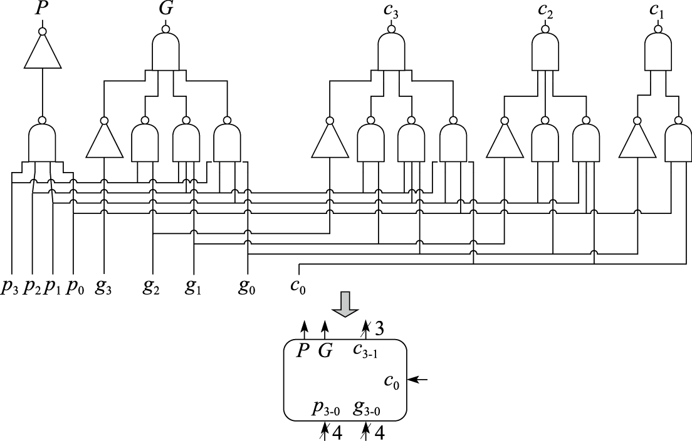
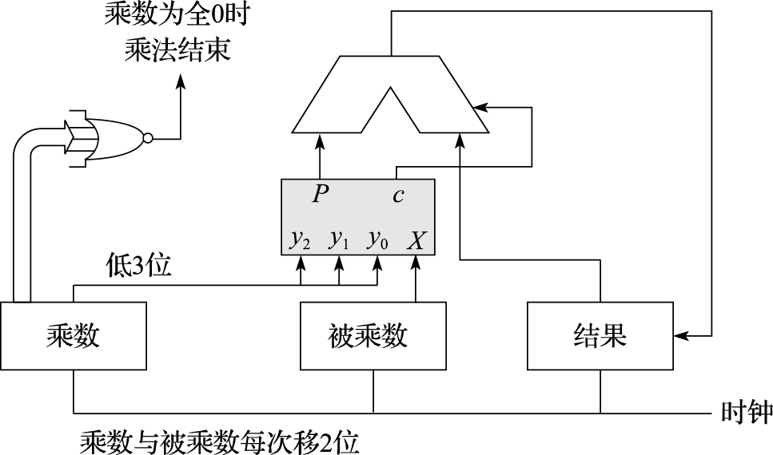
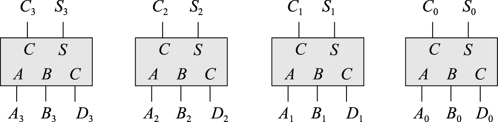
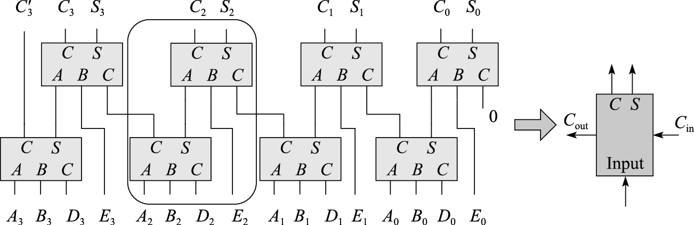
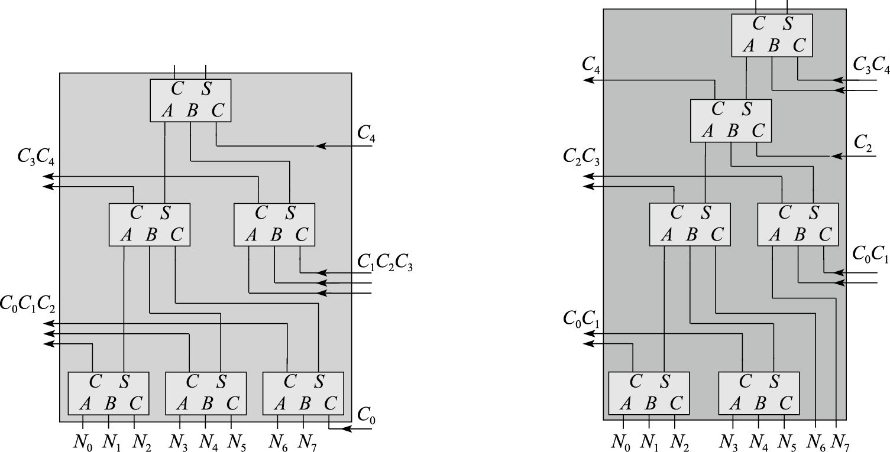
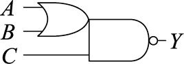

# (PART) CPU的微结构 {-}

# 运算器设计

## 二进制与逻辑电路

### 计算机中数的表示 {#sec-number-presentation}

人们使用计算机处理信息。无论被处理信息的实质形态如何千差万别，计算机内部只能处理离散化的编码后的数据。目前，计算机系统内部的所有数据均采用二进制编码。这样做的原因主要有两点。

1）二进制只有“0”和“1”两个数，其编码、计数和运算规则都很简单，特别是其中的符号“0”和“1”恰好可以与逻辑命题的“假”和“真”两个值相对应，因而能通过逻辑电路方便地实现算术运算。

2）二进制只有两种基本状态，使用有两个稳定状态的物理器件就能表示二进制数的每一位，而制造有两个稳定状态的物理器件要比制造有多个稳定状态的物理器件容易得多。例如，电压的“高” “低”，磁极的“N”“S”，脉冲的“正”“负”，磁通量的“有”“无”。半导体工艺无论是TTL、ECL还是CMOS，都是用电压的高低来表示二进制的两个基本状态。

所有数据在计算机内部最终都交由机器指令处理，被处理的数据分为数值数据和非数值数据两类。数值数据用于表示数量的多少；非数值数据就是一个二进制比特串，不表示数量多少。对于给定的一个二进制比特串，要确定其表达的数值，需要明确三个要素：进位制、定/浮点表示和编码规则。


1.二进制

二进制同人们日常使用的十进制原理是相同的，区别仅在于两者的基数不同。

一般地，任意一个R进制数（R是正整数）

$$A=a_{n}a_{n-1}\ldots a_{1}a_{0}.a_{-1}a_{-2}\ldots a_{1-m}a_{-m} (m,n为正整数)$$

其值可以通过如下方式求得：

$$\begin{aligned}Value(A)&=a_{n}\times R^{n}+a_{n-1}\times R^{n-1}+\ldots +a_{1}\times R^{1}+a_{0}\times R^{0}+a_{-1}\times R^{-1}\\ &\ +a_{-2}\times R^{-2}+\ldots +a_{1-m}\times R^{1-m}+a_{-m}\times R^{-m}\end{aligned}$$

其中R称为基数，代表每个数位上可以使用的不同数字符号的个数。$R_{i}$称为第i位上的权，即采用“逢R进一”。

二进制即是上述一般性定义中R=2的具体情况。

上面的定义只回答了非负数或无符号整数的二进制表示问题。有关正负整数的表示问题会在\@ref(sec-number-presentation)节讨论。下面举例说明无符号二进制整数的表示和加法。

例用4位二进制编码，计算5+9。

解5的4位二进制表示为$0101_{2}$，9的4位二进制表示为$1001_{2}$。5+9列竖式计算如下：

```{r vertical-calculation, echo = FALSE, message=FALSE}
readr::read_csv('./materials/chapter8/vertical_calculation.csv') %>%
flextable() %>%
border_remove() %>%
delete_part(part='header') %>%
align(i = NULL, j = NULL, align = "right", part = "all") %>%
hline(i = 2, j = NULL) %>%
#hline_top() %>%
autofit()
```


上面的竖式计算过程和人们日常的十进制竖式加法计算过程极为相似。所不同的仅在于，十进制是“逢十进一”，二进制是“逢二进一”。

计算机内部的所有数据都采用二进制编码表示，但是在表示绝对值较大的数据时需要很多位，不利于书写和阅读，因此经常采用十六进制编码来记录数据。因为16恰为$2^4$，所以二进制和十六进制相互转换时不会出现除不尽的情况，可以非常快捷地进行两种进制的转换运算。具体做法是，将一个数由二进制编码转换为十六进制编码时，从小数点开始，向左、向右两个方向，每4个二进制位一组（不足时小数点左侧的左补0，小数点右侧的右补0），直接替换为一个十六进制位。十六进制编码转换为二进制编码的方法类似，只是每个十六进制位替换为4个二进制位。

2. 定点数的表示

常见的数有整数和实数之分，整数的小数点固定在数的最右边，通常省略不写，而实数的小数点则不是固定的。但是，计算机中只能表示0和1，无法表示小数点，因此计算机中表示数值数据必须要解决小数点的表示问题。我们通过约定小数点的位置来解决该问题。小数点位置约定在固定位置的数称为定点数，小数点位置约定为可以浮动的数称为浮点数。其中浮点数的表示将在下面介绍。这里将介绍计算机中最常见的两种定点数表示方法：原码和补码。

在明确了进位制和小数点位置的约定之后，整数在计算机中的表示还有一个正负号如何表示的问题要解决。针对这一问题，原码和补码这两种编码规则采用了不同的解决思路。

（1）原码

数的原码表示采用“符号-数值”的表示方式，即一个形如$A=a_{n-1}a_{n-2}\ldots a_{1}a_{0}$的原码表示，最高位$a_{n-1}$是符号位，0表示正数，1表示负数；其余位$a_{n-2}\ldots a_{1}a_{0}$表示数值的绝对值。如果$a_{n-1}$是0，则A表示正数$+a_{n-2}\ldots a_{1}a_{0}$；如果$a_{n-1}$是1，则A表示负数$-a_{n-2}\ldots a_{1}a_{0}$。例如，对于+19和-19这两个数，如果用8位二进制原码表示，则+19的原码是$00010011_{2}$，-19的原码是$10010011_{2}$。

原码表示有两大优点：

1）与人们日常记录正负数的习惯接近，与真实数值之间的对应关系直观，利于与真实数值相互转换。

2）原码实现乘除运算比较简便直接。

但是原码表示亦存在两个缺点：

1）存在两个0，即一个+0，一个-0。这不仅有悖于人们的习惯，也给使用带来不便。

2）原码的加减运算规则复杂，这对于逻辑实现的影响很大。在进行原码加减运算时，需要首先判断是否为异号相加或同号相减的情况，如果是的话则必须先根据两个数的绝对值的大小关系来决定结果的正负号，再用绝对值大的数减去绝对值小的数。

权衡上述利弊，现代计算机中基本不使用原码来表示整数。原码仅在表示浮点数的尾数部分时采用。

（2）补码

补码是定点数的另一种表示方法。现代计算机中基本都是采用补码来表示整数。它最大的好处就是可以用加法来完成减法运算，实现加减运算的统一。这恰好解决了原码表示所存在的最大问题。

在补码表示中，其最高位同原码一样也作为符号位，0表示正数，1表示负数。补码表示和原码表示的差异在于其数值的计算方法。对于一个形如$A=a_{n-1}a_{n-2}\ldots a_{1}a_{0}$的补码表示，其值等于$-2^{n-1}\times a_{n-1}+a_{n-2}\ldots a_{1}a_{0}$。如果$a_{n-1}$是0，则补码和原码一样，A表示正的$a_{n-2}\ldots a_{1}a_{0}$；如果$a_{n-1}$是1，则A表示$a_{n-2}\ldots a_{1}a_{0}$减去$10\ldots 0_{2}$（共n-1个0）得到的数。

求一个数的补码是个取模运算。关于模运算系统的准确数学描述，感兴趣的读者可以自行查阅相关资料。这里举一个最为常见的模运算系统的例子——时钟。这个模系统的模数为12。假定现在时钟指向6点，需要将它拨向10点，那么你有两种拨法，一种是顺时针向前拨4个小时，另一种是逆时针向后拨8个小时。这种相同的效果用数学的语言来说即4≡-8 (mod 12)。基于模运算系统的概念，对于具有1位符号位和n-1位数值位的n位二进制整数的补码来说，其补码的定义是：

$$[X]_{\mbox{补}}=2^{n}+X (mod 2^{n})，-2^{n-1}≤X<2^{n-1}$$

利用补码基于模运算的这个特点，可以把减法转换成加法来做，因此在计算机中不用把加法器和减法器分开，只要有加法器就可以做减法。

根据上述补码的定义并不容易写出一个数值的补码形式，而前面提到的原码可以很直观地与其数值进行转换。这里介绍一个原码和补码之间的转换方法：最高位为0时，原码与补码相同；最高位是1时，原码的最高位不变，其余位按位取反后末位加1。举个例子，譬如+19这个数，如果用8位二进制原码表示是$00010011_{2}$，最高位是0，所以其二进制补码也是$00010011_{2}$。那么对于-19这个数，其原码就是把+19原码的最高位从0变为1，即$10010011_{2}$。在求-19的补码时，原码最高位的1保持不变，原码余下的7位$0010011_{2}$按位取反得到$1101100_{2}$，末位再加一个1，得到$1101101_{2}$，最终得到-19的8位补码是$11101101_{2}$，这个值实际上是由+19的8位补码减去$10000000_{2}(128_{10})$得到的。

（3）溢出

无论采用原码表示还是补码表示，当一个二进制数的位数确定后，其能够覆盖的数值范围也就确定了。例如n位的二进制有符号数，其原码表示范围是[$-2^{n-1}+1$ , $2^{n-1}-1$]，其补码表示范围是[$-2^{n-1}$ , $2^{n-1}-1$]。当同符号数相加或异符号数相减时，结果的数值就可能会超过该长度编码下可表示的范围，称之为溢出。例如，使用4位二进制编码计算-7+5，-7的补码是$1001_{2}$，+5的补码是$0101_{2}$，两者相加是$1110_{2}(-2_{10})$，两异号数相加不会溢出。又比如，使用4位二进制编码计算5+4，+5的补码是$0101_{2}$，+4的补码是$0100_{2}$，两者相加得到$1001_{2}(-7_{10})$，这显然是溢出，两个正数相加得到了一个负数。

加法溢出的判断方法是：如果A和B的最高位一样，但是A+B结果的最高位与A和B的最高位不一样，表示溢出，即两个正数相加得到负数，或两个负数相加得到正数。减法溢出的判断方法类似，即负数减正数结果是正数，或正数减负数结果是负数，这就表示溢出。


3. 浮点数的表示

计算机中用于数据存储、传输和运算的部件的位数都是有限的，所以采用定点数表示数值数据时有一个不足之处，就是表示范围有限，太大或太小的数都不能表示。同时定点数表示精度也有限，用定点做除法不精确。此外，定点数也无法表示数学中的实数。所以，计算机还定义了浮点数，用来表示实数并弥补定点数的不足。

（1）二进制的科学记数法

在具体介绍计算机浮点数表示规格前，我们先回忆一下日常书写实数时所采用的科学记数法。譬如$0.000000001_{10}$可以记为$1.0_{10}\times 10^{-9}$，$-31576000_{10}$可以记为$-3.1576_{10}\times 10^{7}$。一个采用科学记数法表示的数，如果尾数没有前导零且小数点左边只有一位整数，则可称为规格化数。既然我们可以用科学记数法来表示十进制实数，也可以用科学记数法来表示二进制实数。其一般的表示形式为：

$$(-1)^{s}\times f\times 2^{e}$$

其中s表示符号，f为尾数域的值，e为指数域的值。

譬如二进制实数的科学记数法表示：$1.1_{2}\times 2^{4}=2.4_{10}\times 10^{1}$，$-1.0_{2}\times 2^{-7}=-7.8125_{10}\times 10^{-3}$。


（2）IEEE 754浮点数标准

计算机中的浮点数表示沿用了科学记数法的表示方式，即包含了符号、尾数和阶码三个域。符号用一位二进制码表示，0为正，1为负。然而在计算机内部位宽是有限的，余下的尾数和阶码两者间存在一个此消彼长的关系，需要设计者在两者间权衡：增加尾数的位宽会提高表示的精度但是会减少表示的范围，而增加阶码的位宽虽然扩大了表示的范围但是会降低表示的精度。因为浮点数规格的定义融入了设计者自身的考虑，所以直到20世纪80年代初，浮点数表示格式还没有统一标准，不同厂商的计算机内部的浮点数表示格式存在差异。这导致在不同厂商计算机之间进行含有浮点数的数据传送或程序移植时，必须进行数据格式的转换，更为糟糕的是，有时这种数据格式转换会带来运算结果不一致的问题。因此，从20世纪70年代后期开始，IEEE成立委员会着手制定统一的浮点数标准，最终在1985年完成了浮点数标准IEEE 754的制定。该标准的主要起草者是美国加州大学伯克利分校数学系教授William Kahan，他帮助Intel公司设计了8087浮点协处理器，并以此为基础形成了IEEE 754标准，他本人也因此获得了1987年的图灵奖。自IEEE 754标准颁布后，目前几乎所有的计算机都遵循该标准来表示浮点数。在过去的几十年间，IEEE 754标准也根据工业界在CPU研发过程中遇到的新需求、实现的新结构，及时进行演进和完善。其中一个比较重要的版本是2008年更新的IEEE 754-2008。该版本中明确了有关融合乘加（Fused Multiply-Add）运算、半精度浮点数等方面的内容。本书仅介绍IEEE 754标准中涉及单精度、双精度浮点数表示的基本内容，对其他内容感兴趣的读者可查阅相关文献。

（3）IEEE 754标准浮点数格式

IEEE 754标准中定义了两种基本的浮点数格式：32位的单精度格式和64位的双精度格式，如图\@ref(fig:IEEE754float)所示。


```{r IEEE754float, fig.cap='IEEE 754浮点数格式', fig.align='center', echo = FALSE, out.width='100%'}
knitr::include_graphics('./images/chapter8/IEEE754_float.png')
```


32位单精度格式中包含1位符号、8位阶码和23位尾数；64位双精度格式中包含1位符号、11位阶码和52位尾数。两种格式下基数均隐含为2。

IEEE 754标准中，尾数用原码表示。由于表示同一个数的时候尾数可以有多种表示，例如$0.001_{2}$可以表示为$0.1_{2}\times 2^{-2}$，也可以表示成$1.0_{2}\times 2^{-3}$，因此需要一个规格化的表示来使得表示唯一。IEEE 754标准中规格化尾数的表示统一为1.xxxx的形式。尾数规格化后第一位总为1，因而可以在尾数中缺省这一位1。隐藏该位后尾数可以多一位表示，精度提高一位。

IEEE 754标准中，阶码是用加偏置常量的移码表示，但是所用的偏置常量并不是通常n位移码所用的$2^{n-1}$，而是$(2^{n-1}-1)$，因此，单精度和双精度浮点数的偏置常量分别为127和1023。

IEEE 754标准对浮点数的一些情况做了特殊的规定，总的来说可以分为5种情况，主要用阶码进行区分，表\@ref(tab:tabIEEE754float)给出了IEEE 754标准中单精度和双精度不同浮点数的表示。


```{r tabIEEE754float, echo = FALSE, message=FALSE, tab.cap='IEEE 754 浮点数格式'}
readr::read_csv('./materials/chapter8/IEEE754float.csv') %>%
flextable() %>%
colformat_md() %>%
#align(i = NULL, j = NULL, align = "center", part = "all") %>%
delete_part(part='header') %>%

add_header_row(values=c(' ', '符号','阶码','尾数','值', '符号','阶码','尾数','值')) %>%
add_header_row(values=c(' ', '单精度','单精度','单精度','单精度','双精度','双精度','双精度','双精度')) %>%
merge_v(part='header') %>%
merge_h(part='header') %>%
#align(i = NULL, j = NULL, align = "center", part = "all") %>%
theme_box() %>%
align(i = NULL, j = NULL, align = "center", part = "all") %>%
autofit()
```

（1）无穷大（阶码全1尾数全0）

引入无穷大是为了在出现浮点计算异常时保证程序能够继续执行下去，同时也为程序提供一种检测错误的途径。$+\infty$在数值上大于所有有限浮点数，$-\infty$在数值上小于所有有限浮点数。无穷大不仅可以是运算的结果，也可以作为运算的源操作数。当无穷大作为源操作数时，根据IEEE 754标准规定，可以得到无穷大或非数的结果。

（2）非数（阶码全1尾数非0）

非数（NaN）表示一个没有定义的数。引入非数的目的是检测非初始化值的使用，而且在计算出现异常时程序能够继续执行下去。非数根据尾数的内容又可以分为发信号非数（Signaling NaN）和不发信号非数（Quiet NaN）两种。如果源操作数是Quiet NaN，则运算结果还是Quiet NaN；如果源操作数是Signaling NaN，则会触发浮点异常。

（3）规格化非0数（阶码非全0非全1）

阶码e的值落在[1, 254]（单精度）和[1, 2046]（双精度）范围内且尾数f是非0值的浮点数是规格化的非0数。其尾数经过规格化处理，最高位的1被省略，因此如果符号位是0，则表示数值为$1.f\times 2^{e-127}$（单精度）和$1.f\times 2^{e-1023}$（双精度）；如果符号位是1，则表示数值为$-1.f\times 2^{e-127}$（单精度）和$-1.f\times 2^{e-1023}$（双精度）。

（4）非规格化非0数（阶码全0尾数非0）

在规格化非0数中，能表示的浮点数的最小阶值是-126（单精度）和-1022（双精度），如果浮点数的绝对值小于$1.0\times 2^{-126}$（单精度）和$1.0\times 2^{-1022}$（双精度），该如何表示呢？IEEE 754允许特别小的非规格化数，此时阶码为0，尾数的小数点前面的那个1就不再添加了。因此如果符号位是0，则表示数值为$0.f\times 2^{-126}$（单精度）和$0.f\times 2^{-1022}$（双精度）；如果符号位是1，则表示数值为$-0.f\times 2^{-126}$（单精度）和$-0.f\times 2^{-1022}$（双精度）。非规格化数填补了最小的规格化数和0之间的一段空隙，使得浮点数值可表示的精度进一步提升了很多。

（5）零（阶码全0尾数全0）

根据符号位的取值，分为+0和-0。


### MOS晶体管工作原理 {#sec-MOS-principle}

从原理上看，只要有一个二值系统，并且系统中能够进行与、或、非这样的基本操作，就能够搭建出一台计算机。最早期的电子计算机使用继电器或电子管实现二值系统，而现代计算机中则采用晶体管来实现二值系统。晶体管可以根据控制端电压或电流的变化来实现“开启”和“关闭”的功能，从而表达二进制。晶体管主要分为双极型晶体管（Bipolar Junction Transistor）和金属-氧化物半导体场效应晶体管（Metal Oxide Semiconductor Field Effect Transistor，简称MOSFET或MOS）。当前绝大多数CPU都采用MOS晶体管实现，其中又以CMOS（Complementary Metal Oxide Semiconductor）晶体管电路设计最为常见。

1. 半导体

MOS晶体管使用硅作为基本材料。在元素周期表中，硅是IV族元素，它的原子最外层有4个电子，可以与相邻的4个硅原子的最外层电子配对形成共价键。图\@ref(fig:silicium)a给出了纯净硅中原子连接关系的一个简单二维平面示意，实际上纯净硅中原子构成的是一个正四面体立体网格。通过与相邻原子形成的共价键，纯净硅中所有原子的最外层都具有8个电子，达到相对稳定，所以纯净硅的导电性很弱。但是，如果在纯净硅中掺杂少量5价的原子（如磷），这些原子将挤占原有硅原子的位置，而由于这些原子的最外层有5个电子，除了与原有硅原子形成共价键用掉4个电子外，还多余一个处于游离状态的电子，如图\@ref(fig:silicium)b所示。在电场的作用下，处于游离状态的电子就会逆着电场方向流动，形成负电流。这类材料被称为N（Negative）型材料。同样，如果在纯净的硅中掺杂少量3价的原子（如硼），那么这些原子挤占原有硅原子的位置后，其最外层还缺少一个电子和相邻的硅原子形成共价键，形成空穴，如图\@ref(fig:silicium)c所示。在电场的作用下，周围的电子就会跑过来填补这个空穴，从而留下一个新的空穴，相当于空穴也在顺着电场方向流动，形成正电流。这类材料被称为P（Positive）型材料。当非4价元素掺杂的含量较小时，产生的电子和空穴也就比较少，用—号表示；当非4价元素掺杂的含量较大时，产生的电子和空穴也就比较多，用+号表示。因此，P-表示掺杂浓度低的P型材料，里面只有少量的空穴；N+表示掺杂浓度高的N型材料，里面有大量电子。


```{r silicium, fig.cap='半导体硅原子结构示意图', fig.align='center', echo = FALSE, out.width='100%'}
knitr::include_graphics('./images/chapter8/sicicium_atomic_structure.png')
```

2. NMOS和PMOS晶体管
如图\@ref(fig:MOS-struc)所示，MOS晶体管是由多层摞放在一起的导电和绝缘材料构建起来的。每个晶体管的底部叫作衬底，是低浓度掺杂的半导体硅。晶体管的上部接出来3个信号端口，分别称为源极（Source）、漏极（Drain）和栅极（Gate）。源极和漏极叫作有源区，该区域内采用与衬底相反极性的高浓度掺杂。衬底是低浓度P型掺杂，有源区是高浓度N型掺杂的MOS晶体管叫作NMOS晶体管；衬底是低浓度N型掺杂，有源区是高浓度P型掺杂的MOS晶体管叫作PMOS晶体管。无论是NMOS管还是PMOS管，其栅极与衬底之间都存在一层绝缘体，叫作栅氧层，其成分通常是二氧化硅（SiO~2~）。最早期的MOS晶体管栅极由金属制成，后来的栅极采用掺杂后的多晶硅制成。掺杂后的多晶硅尽管其电阻比金属大，但却比半导体硅的电阻小很多，可以作为电极。并且同普通金属相比，多晶硅更耐受高温，不至于在MOS晶体管生产过程中融化。不过最新的工艺又有重新采用金属栅极的。

```{r MOS-struc, fig.cap='MOS晶体管组成结构示意图', fig.align='center', echo = FALSE, out.width='100%'}
knitr::include_graphics('./images/chapter8/MOS_structure.png')
```

上面简述了MOS晶体管的基本构成，下面以NMOS晶体管为例介绍MOS晶体管的工作原理。如果单纯在源极、漏极之间加上电压，两极之间是不会有电流流过的，因为源极和漏极之间相当于有一对正反相对的PN结，如图\@ref(fig:NMOS-work)a所示。如果先在栅极上加上电压，因为栅氧层是绝缘的，就会在P衬底里形成一个电场。栅极上的正电压会把P衬底里面的电子吸引到栅氧层的底部，形成一个很薄的沟道电子层，相当于在源极和漏极之间架起了一座导电的桥梁。此时如果再在源极、漏极之间加上电压，那么两极之间的电流就能流过来了，如图\@ref(fig:NMOS_work)b所示。NMOS的基本工作原理就是这样，但是其实际的物理现象却很复杂。

```{r NMOS-work, fig.cap='NMOS晶体管工作原理示意图', fig.align='center', echo = FALSE, out.width='80%'}
knitr::include_graphics('./images/chapter8/NMOS_workingprinciple.png')
```

当我们屏蔽掉底层的物理现象细节，对MOS晶体管的工作行为进行适度抽象后，NMOS晶体管的工作行为就是：在栅极上加上电就通，不加电就断。PMOS晶体管的工作行为与NMOS晶体管的恰好相反，加上电就断，不加电就通。这样我们可以简单地把MOS晶体管当作开关。NMOS晶体管是栅极电压高时打开，栅极电压低时关闭；PMOS晶体管反过来，栅极电压低时打开，栅极电压高时关闭。如图\@ref(fig:MOS-switch)所示。随着工艺的发展，MOS晶体管中栅氧层的厚度越来越薄，使得开启所需的栅极电压不断降低。晶体管的工作电压从早期工艺的5.0V，降到后来的2.5V、1.8V，现在都是1V左右或更低。

```{r MOS-switch, fig.cap='MOS晶体管开关行为', fig.align='center', echo = FALSE, out.width='50%'}
knitr::include_graphics('./images/chapter8/MOS_switch.png')
```

尽管MOS晶体管可以表现出开关的行为，但是单纯的PMOS晶体管或者NMOS晶体管都不是理想的开关。例如，NMOS晶体管适合传输0而不适合传输1；PMOS晶体管恰好相反，适合传输1而不适合传输0。在后面讲述常见CMOS电路时，将会论及如何解决这一问题。

### CMOS逻辑电路

在了解了MOS晶体管的组成和基本原理后，我们接下来了解如何用MOS晶体管构建逻辑电路。

1. 数字逻辑电路

（1）布尔代数

数字逻辑基于的数学运算体系是布尔代数。布尔代数是在二元集合{0, 1}基础上定义的。最基本的逻辑运算有三种：与（AND，&）、或（OR，|）、非（NOT，~）。这三种逻辑关系定义如下：

```{r boolean, echo = FALSE, message=FALSE}
readr::read_csv('./materials/chapter8/boolean.csv') %>%
flextable() %>%
border_remove() %>%
align(i = NULL, j = NULL, align = "center", part = "all") %>%
vline(i = NULL, j = 2) %>%
hline_top() %>%
autofit()
```

常用的布尔代数运算定律有：

恒等律：$A \ |\  0 = A,\ A \ \&\  1 = A$；

0/1律：$A \ |\ 1 = 1,\ A \ \&\ 0 = 0$；

互补律：$A \ |\ ( \sim A) = 1,\ A \ \&\ (\sim A) = 0$；

交换律：$A \ |\ B = B \ |\ A,\ A \ \&\ B = B \ \&\ A$；

结合律：$A \ |\ (B \ |\ C) = (A \ |\ B) \ |\ C,\ A \ \&\ (B \ \&\ C) = (A \ \&\ B) \ \&\ C$；

分配律：$A \ \&\ (B \ |\ C) = (A \ \&\ B) \ |\ (A \ \&\ C),\ A \ |\ (B \ \&\ C) = (A \ |\ B) \ \&\ (A \ |\ C)$；

德摩根（DeMorgan）定律：$\sim (A \ \&\ B) = (\sim A) \ |\ (\sim B),\ \sim (A \ |\ B) = (\sim A) \ \&\ (\sim B)$。

上述定律虽然很简单，但使用起来变化无穷。

根据电路是否具有数据存储功能，可将数字逻辑电路分为组合逻辑电路和时序逻辑电路两类。

（2）组合逻辑

组合逻辑电路中没有数据存储单元，电路的输出完全由当前的输入决定。在组合逻辑的各种表达方式中，最简单的就是真值表，即对每一种可能的输入组合给出输出值。显然一个N输入的电路就有$2^{N}$种不同的输入组合。常见的门级组合逻辑除了与门（AND）、或门（OR）、非门（NOT），还有与非门（NAND）、或非门（NOR）、异或门（XOR）。图\@ref(fig:logicgate)给出了这些常见的门逻辑符号及其真值表。

```{r logicgate, fig.cap='常用基本逻辑门电路', fig.align='center', echo = FALSE, out.width='100%'}
knitr::include_graphics('./images/chapter8/logic_gate.png')
```

利用基本逻辑门电路可以构成具有特定功能的更大规模的组合逻辑部件，如译码器、编码器、多路选择器、加法器等。加法器和乘法器两类运算逻辑电路我们将在后续章节中介绍。表\@ref(tab:3-8decoder)所示是3-8译码器真值表，把3位信号译码成8位输出，当输入000时，8个输出里面最低位为1，输入为001时，次低位为1，依次类推。表\@ref(tab:8-1selector)所示是一个8选1选择器的真值表，当CBA为000的时候选择输出第0路$D_{0}$，为001的时候选择输出第1路$D_{1}$，依次类推。可以看出选择器可以用译码器加上与门来实现。


```{r 3-8decoder, echo = FALSE, message=FALSE, tab.cap='3-8译码器真值表'}
readr::read_csv('./materials/chapter8/3-8decoder_true_table.csv') %>%
flextable() %>%
colformat_md() %>%
delete_part(part='header') %>%
add_header_row(values=c('输入', '输入','输入','输出','输出','输出','输出','输出','输出','输出','输出')) %>%
merge_h(part='header') %>%
vline(i = NULL, j = 3) %>%
hline_top(part='all') %>%
align(i = NULL, j = NULL, align = "center", part = "all") %>%
autofit()
```

```{r 8-1selector, echo = FALSE, message=FALSE, tab.cap='8选1选择器真值表'}
#readr::read_csv('./materials/chapter8/3-8decoder_true_table.csv') %>%
readr::read_csv('./materials/chapter8/8-1selector_true_table.csv') %>%
flextable() %>%
colformat_md() %>%
delete_part(part='header') %>%
add_header_row(values=c('输入', '输入','输入','输出')) %>%
merge_h(part='header') %>%
vline(i = NULL, j = 3) %>%
hline_top(part='all') %>%
align(i = NULL, j = NULL, align = "center", part = "all") %>%
autofit()
```

（3）时序逻辑

时序逻辑电路包含时钟信号和数据存储单元两个要素。时序逻辑电路的特点在于，其输出不但与当前输入的逻辑有关，而且与在此之前曾经输入过的逻辑值有关。

时钟信号是时序逻辑电路的基础，它用于确定时序逻辑元件中的状态在何时发生变化。如图\@ref(fig:clocksignal)所示，时钟信号是具有固定周期的标准脉冲信号。每个时钟周期分为高、低电平两部分，其中低电平向高电平变化的边沿称为上升沿，高电平向低电平变化的边沿称为下降沿。在CPU设计中，通常使用边沿触发方式来确定时序逻辑状态变化的时间点。所谓边沿触发就是将时钟信号的上升沿或下降沿作为采样的同步点，在每个采样同步点，对时序逻辑电路的状态进行采样，并存储到数据存储单元中。


```{r clocksignal, fig.cap='时钟信号', fig.align='center', echo = FALSE, out.width='80%'}
knitr::include_graphics('./images/chapter8/clock_signal.png')
```


数据存储单元是时序逻辑电路中的核心。数据存储单元多由锁存器构成。首先介绍RS锁存器。图\@ref(fig:RSlatch)是RS锁存器的逻辑图和真值表。RS锁存器包含置位端S（Set）和复位端R（Reset）两个输入端口，R为0、S为1时置输出为1，R为1、S为0时输出为0。在图\@ref(fig:RSlatch)中，下面与非门的输出接到上面与非门的一个输入，同样上面与非门的输出接到下面与非门的一个输入，通过两个成蝶形连接的与非门构成RS锁存器。RS锁存器与组合逻辑的不同在于，当（R, S）的值从（0, 1）或（1, 0）变成（1, 1）时能够保持输出值的状态不变，从而实现数据的存储。组合的输出只跟输入相关；但是RS锁存器的输入变了，它的输出还能保持原来的值。

```{r RSlatch, fig.cap='RS锁存器', fig.align='center', echo = FALSE, out.width='50%'}
knitr::include_graphics('./images/chapter8/RS_latch.png')
```

在RS锁存器前面连接上两个与非门，再用时钟C（Clock）控制D输入就构成了如图\@ref(fig:Dlatch)a所示的电路。当C=0时，R和S都为1，RS锁存器处于保持状态，也就是说当时钟处于低电平时，无论输入D怎样变化，输出都保持原来的值。当C=1时，输出Q与输入D值相同，相当于直通。这就是D锁存器（D Latch）的原理，通过时钟C的电平进行控制，高电平输入，低电平保持。

两个D锁存器以图\@ref(fig:Dlatch)b所示的方式串接起来就构成了一个D触发器（D Flip-Flop）。当C=0时，第一个D锁存器直通，第二个D锁存器保持；当C=1时，第一个D锁存器保持，第二个D锁存器直通；C从0变为1时，D的值被锁存起来。这就是D触发器的基本原理，它是通过时钟的边沿进行数据的锁存。

```{r Dlatch, fig.cap='D锁存器和D触发器', fig.align='center', echo = FALSE, out.width='100%'}
knitr::include_graphics('./images/chapter8/D_latch.png')
```


实际情况下，由于器件中电流的速度是有限的，并且电容充放电需要时间，所以电路存在延迟。为了保证D触发器正常工作，需要满足一定的延迟要求。例如为了把D的值通过时钟边沿锁存起来，要求在时钟变化之前的某一段时间内D的值不能改变，这个时间叫作建立时间（Setup Time）。另外，在时钟跳变后的一段时间内，D的值也不能变，这个时间就是保持时间（Hold Time）。建立时间和保持时间可以是负数。此外D触发器还有一个重要的时间参数叫作“Clock-to-Q”时间，也就是时钟边沿到来后Q端数据更新为新值的时间。D触发器整个的访问延迟是建立时间加上“Clock-to-Q”时间。图\@ref(fig:Dlatchtime)给出了上升沿触发的D触发器的建立时间、保持时间以及“Clock-to-Q”时间的示意。

```{r Dlatchtime, fig.cap='D触发器建立时间、保持时间和Clock-to-Q时间', fig.align='center', echo = FALSE, out.width='50%'}
knitr::include_graphics('./images/chapter8/Dlatch_timing.png')
```


2. 常见CMOS电路

本节通过若干具体示例，讲述如何用MOS晶体管实现逻辑电路，且所列举的电路都是CMOS电路。关于CMOS电路的基本特点，将在“非门”示例之后予以说明。

（1）非门

```{r NOTgate, fig.cap='CMOS电路：非门', fig.align='center', echo = FALSE, out.width='100%'}
knitr::include_graphics('./images/chapter8/CMOS_NOT_gate.png')
```


图\@ref(fig:NOTgate)a是非门（也称作反相器）的CMOS电路，它由一个PMOS晶体管和一个NMOS晶体管组成，其中PMOS晶体管（以下简称“P管”）的源极接电源，NMOS晶体管（以下简称“N管”）的源极接地，两管的漏极连在一起作为输出，栅极连在一起作为输入。如果输入为0（接地），则P管导通，N管关闭，P管的电阻为0（实际电路中P管其实有一定的电阻，大约在几千欧姆），N管的电阻无穷大，输出端的电压就是电源电压$V_{dd}$，如图\@ref(fig:NOTgate)b所示。反之，当输入为1的时候，N管导通，P管关闭，N管的电阻为0（实际电路中N管其实有一定的电阻，大约在几千欧姆），P管的电阻无穷大，输出端与电源断开，与地导通，输出端电压为0，如图\@ref(fig:NOTgate)c所示。这就是反相器CMOS电路的工作原理。

从反相器的工作原理可以看出CMOS电路的基本特征，其关键就在“C”（Complementary，互补）上，即由上下两个互补的部分组成电路，上半部分由P管构成，下半部分由N管构成。上半部分打开的时候下半部分一定关上，下半部分打开的时候上半部分一定关闭。这种电路设计的好处是：在稳定状态，电路中总有一端是关死的，几乎没有直流电流，可以大幅度降低功耗。

（2）与非门

图\@ref(fig:NANDgate)所示的是一个两输入与非门的CMOS电路，电路上面两个P管并联，下面两个N管串联。两个P管并联后，一头接电源，另一头与两个串联的N管连接。两个N管串联后，一头与并联的P管连接，另一头接地。与非门的两个输入A和B分别连接到一个N管和一个P管，输出端是Y。当A和B中有一个为0，则上面的P管网络导通，下面的N管网络断开，输出端被连接到电源上，即输出Y为1。

```{r NANDgate, fig.cap='CMOS电路：与非门', fig.align='center', echo = FALSE, out.width='50%'}
knitr::include_graphics('./images/chapter8/CMOS_NAND_gate.png')
```


（3）或非门

```{r NORgate, fig.cap='CMOS电路：或非门', fig.align='center', echo = FALSE, out.width='50%'}
knitr::include_graphics('./images/chapter8/CMOS_NOR_gate.png')
```


图\@ref(fig:NORgate)所示的是一个两输入或非门的CMOS电路，电路上面两个P管串联，下面两个N管并联。两个P管串联后，一头接电源，另一头与两个并联的N管连接。两个N管并联后，一头与串联的P管连接，另一头接地。或非门的两个输入A和B分别连接到一个N管和一个P管，输出端是Y。当A和B中有一个为1，则上面的P管网络断开，下面的N管网络导通，输出端与电源断开，连通到地上，即输出Y为0。

（4）传输门


```{r TRANSgate, fig.cap='CMOS电路：传输门', fig.align='center', echo = FALSE, out.width='40%'}
knitr::include_graphics('./images/chapter8/CMOS_TRANS_gate.png')
```


前面提到过单纯的PMOS晶体管或是NMOS晶体管都不是理想的开关，但是在设计电路时有时需要一个接近理想状态的开关，该开关无论对于0还是1都可以传递得很好。解决的方式也很直观，如图\@ref(fig:TRANSgate)所示，一个P管和一个N管彼此源极连在一起，漏极连在一起，两者的栅极上接上一对极性相反的使能信号。当$EN$=0、$\overline{EN}$=1时，P管和N管都关闭；当$EN$=1、$\overline{EN}$=0时，P管和N管都开启。当P管和N管都开启时，无论信号是0还是1，都可以通过最适合传递该信号的MOS晶体管从A端传递到B端。

（5）D触发器

在前面讲述逻辑电路时介绍过如何用逻辑门搭建D触发器，在用CMOS电路实现D触发器时，我们也可以利用CMOS的逻辑门搭建出RS锁存器，进而搭建出D锁存器，并最终得到D触发器。但是考虑到构建D触发器时我们其实真正需要的是开关电路和互锁电路，所以这种构建D触发器的方式消耗的资源过多。图\@ref(fig:DFlipFlop)中给出现代计算机中常用的一种D触发器电路结构。该电路的左边（虚线框内部）可以视作一个去除了输出缓冲器的D锁存器，该锁存器存储的值体现在其内部N1点的状态。当$CLK$=0，$\overline{CLK}$=1时，传输门G1开启、G2关闭，D点的值经由反相器I1和传输门G1传递进来，并通过反相器I2和三态反相器T1反馈至N1点，使该点到达一个稳定状态。当$CLK$=1，$\overline{CLK}$=0时，传输门G1关闭、G2开启，D点值的变化不再影响到内部N1点，同时N1点的状态经由传输门G2，并通过反相器I3和三态反相器T2反馈至N2点，使N2点处于稳定状态，并将该值传递至输出端Q。

```{r DFlipFlop, fig.cap='CMOS电路：D触发器', fig.align='center', echo = FALSE, out.width='100%'}
knitr::include_graphics('./images/chapter8/CMOS_D_Flip-Flop.png')
```


3. CMOS电路延迟

前面在介绍MOS晶体管原理的时候曾经提到过，真实世界中，PMOS晶体管和NMOS晶体管即便是在导通状态下源极和漏极之间也是有电阻的，栅极和地之间也存在寄生电容。因此CMOS电路工作时输入和输出之间存在延迟，该延迟主要由电路中晶体管的RC参数来决定。

图\@ref(fig:inverter)a是一个CMOS反相器的示意图。其输出端有一个对地电容，主要由本身P管和N管漏极的寄生电容、下一级电路的栅电容以及连线电容组成。反相器输出端从0到1变化时，需要通过P管的电阻对该电容充电；从1到0变化时，该电容的电荷需要通过N管的电阻放电到地端。图\@ref(fig:inverter)b示意了输出电容的充放电过程，其中左图代表充电过程，右图代表放电过程。因此，该反相器输出从0到1变化时的延迟由P管打开时的电阻和输出电容决定；从1到0变化时的延迟由N管打开时的电阻和输出电容决定。图\@ref(fig:inverter)c示意了在该反相器输入端从0变到1、再变回到0的过程中（图中虚线表示），输出端值变化的过程。从中可以看出，反相器从输入到输出的变化是有延迟的，而且反相器的输出不是理想的矩形，而是存在一定的斜率。


```{r inverter, fig.cap='CMOS反相器的延迟', fig.align='center', echo = FALSE, out.width='80%'}
knitr::include_graphics('./images/chapter8/CMOS_inverter_delay.png')
```


在芯片设计的时候，需要根据单元的电路结构建立每个单元的延迟模型。一般来说，一个单元的延迟由其本身延迟和负载延迟所构成，而负载延迟又与该单元的负载相关。需要指出的是，用早期工艺生成的晶体管，其负载延迟与负载呈线性关系，但对于深亚微米及纳米工艺，晶体管的负载延迟不再与负载呈线性关系。在工艺厂家给出的单元延迟模型中，通常通过一个二维的表来描述每个单元的延迟，其中一维是输入信号的斜率，另外一维是输出负载。即一个单元的延迟是由输入信号的斜率和输出负载两个值通过查表得到的。

## 简单运算器设计

在计算机发展的早期阶段，运算部件指的就是算术逻辑单元（Arithmetic Logic Unit,简称ALU）。ALU可以做算术运算、逻辑运算、比较运算和移位运算。后来功能部件不断发展扩充，可以执行乘法、除法、开方等运算。本节主要介绍定点补码加法器的设计。

加法是许多运算的基础。根据不同的性能和面积需求，加法器有很多种实现方式。进位处理是加法器的核心。根据进位处理方法的不同，常见的加法器包括：行波进位加法器（Ripple Carry Adder, 简称RCA），先行进位加法器（Carry Look-ahead Adder, 简称CLA），跳跃进位加法器（Carry Skip Adder, 简称CSKA），进位选择加法器（Carry Select Adder, 简称CSLA），进位递增加法器（Carry Increment Adder, 简称CIA），等等。其中行波进位加法器最为简单直接，而先行进位加法器使用较为广泛。

### 定点补码加法器

1.一位全加器

一位全加器是构成加法器的基本单元。一位全加器实现两位本地二进制数以及低位的进位位相加，求得本地和以及向高位的进位。它有三个1位二进制数输入A、B和Cin，其中A和B分别为本地的加数和被加数，C~in~为低位来的进位。它有两个1位二进制数输出S和C~out~，其中S是本地和，C~out~是向高位的进位。一位全加器的真值表如表\@ref(tab:fulladder-truetable)所示。

根据表\@ref(tab:fulladder-truetable)，可以写出全加器的逻辑表达式如下：

$$S=\sim A \ \& \ \sim B \ \& \ C_{in} \ | \ \sim A \ \& \ B \ \& \ \sim C_{in} \ | \ A \ \& \ \sim B \ \& \ \sim C_{in} \ | \ A \ \& \ B \ \& \ C_{in}$$
$$C_{out}=A \ \& \ B \ | \ A \ \& \ C_{in} \ | \ B \ \& \ C_{in}$$

上述表达式中，\~表示取反操作，&表示与操作，|表示或操作，其中~操作的优先级最高，&操作次之，|操作优先级最低。上述表达式还可以简单解释为：当输入的三个数中有奇数个1时，本地和为1；当输入的三个数中有两个1时，向高位的进位为1。

```{r fulladder-truetable, echo = FALSE, message=FALSE, tab.cap='一位全加器真值表'}
readr::read_csv('./materials/chapter8/fulladder_truetable.csv') %>%
flextable() %>%
vline(i = NULL, j = 3) %>%
align(i = NULL, j = NULL, align = "center", part = "all") %>%
colformat_md(part="all") %>%
autofit()
```

根据上面的逻辑表达式，图\@ref(fig:FULLadder)给出了用非门和与非门搭建的一位全加器的逻辑电路图及其示意图。如果我们不严格区分非门和与非门，以及不同数目输入与非门之间的延迟差异，则可近似认为每个一位全加器需要2或3级的门延迟。

```{r FULLadder, fig.cap='一位全加器逻辑电路图与示意图', fig.align='center', echo = FALSE, out.width='100%'}
knitr::include_graphics('./images/chapter8/1bit_full_adder_circuit.png')
```


接下来将介绍如何用一位全加器构建一个N（N>1）位的带进位加法器。


2.行波进位加法器

构建N位带进位加法器的最简单的方法是将N个一位全加器逐个串接起来。图\@ref(fig:32bitRCA)给出了32位行波进位加法器的示意图。其中输入A=a~31~\ldots a~0~和B=b~31~\ldots b~0~分别是加数和被加数，C~in~是最低位的进位；输出加和S=s~31~\ldots s~0~以及最高位向上的进位C~out~。所谓“行波”，是指每一级的一位全加器将来自低位的一位全加器的进位输出C~out~作为本级的进位输入C~in~，如波浪一般层层递进下去。这种串行的进位传递方式与人们日常演算十进制加法时采用的进位方式原理一样，非常直观。但是，这种加法器的电路中每一位的数据相加都必须等待低位的进位产生之后才能完成，即进位在各级之间是顺序传递的。回顾一下上一节关于一位全加器的延迟的大致估算，可知一位全加器输入到S的最长延迟是3级门、输入到C~out~的最长延迟是2级门。因此，32位行波进位加法器中，从最低位的输入A~0~、B~0~、C~in~到最高位的进位输出C~out~存在一条进位链，其总延迟为2×32=64级门，从最低位的输入A~0~、B~0~、C~in~到最高位的进位输入C~in~的延迟为2×31=62级门，所以从最低位的输入A~0~、B~0~、C~in~到最高位的加和S~31~的总延迟为62+3=65级门。从这个例子可以看出，虽然行波进位加法器直观简单，但是其延迟随着加法位数N的增加而线性增长，N越大时，行波进位加法器的延迟将越发显著。在CPU设计中，加法器的延迟是决定其主频的一个重要参数指标，如果加法器的延迟太长，则CPU的主频就会降低。例如，对于一个64位的高性能通用CPU来说，在良好的流水线切分下，每级流水的延迟应控制在20级门以内，所以64位行波进位加法器高达129级门的延迟太长了。

```{r 32bitRCA, fig.cap='32位行波进位加法器', fig.align='center', echo = FALSE, out.width='100%'}
knitr::include_graphics('./images/chapter8/32bit_RCA.png')
```


3.先行进位加法器

为了改进行波进位加法器延迟随位数增加增长过快的缺点，人们提出了先行进位加法器的电路结构。其主要思想是先并行地计算每一位的进位，由于每一位的进位已经提前算出，这样计算每一个的结果只需要将本地和与进位相加即可。下面详细介绍先行进位（或者说并行进位）加法器的设计原理。

（1）并行进位逻辑

假设两个N位数A和B相加，A记作a~N-1~a~N-2~$\ldots$a~i~a~i-1~\ldots a~1~a~0~，B记作b~N-1~b~N-2~$\ldots$b~i~b~i-1~$\ldots$b~1~b~0~。定义第i位的进位输入为c~i~，进位输出为c~i+1~，且将加法器的输入C~in~记作c~0~以方便后面描述的统一。每一位进位输出c~i+1~的计算为：$$c_{i+1}=a_{i}\ \&\ b_{i}\ |\ a_{i}\ \&\ c_{i}\ |\ b_{i}\ \&\ c_{i}=a_{i}\ \&\ b_{i}\ |\ (a_{i}\ |\ b_{i}）\ \&\ c_{i}$$

设$g_{i} = a_{i} \ \&\ b_{i}，p_{i} = a_{i} \ |\ b_{i}$，则c~i+1~的计算可以表达为：

$$c_{i+1}=g_{i} \ |\ p_{i} \ \& \ c_{i}$$

从上式可以看出，当g~i~=1时，在c~i+1~必定产生一个进位，与c~i~无关；当p~i~=1时，如果c~i~有一个进位输入，则该进位可以被传播至c~i+1~。我们称g~i~为第i位的进位生成因子，p~i~为第i位的进位传递因子。

下面以4位加法器的进位传递为例，根据公式$c_{i+1}=g_{i} \ |\ p_{i}\ \&\ c_{i}$逐级展开可得到：

$c_{1}=g_{0} \ |\ p_{0} \ \&\ c_{0}$

$c_{2}=g_{1}\ |\ p_{1}\ \&\ g_{0}\ |\ p_{1}\ \&\ p_{0}\ \&\ c_{0}$

$c_{3}=g_{2}\ |\ p_{2}\ \&\ g_{1}\ |\ p_{2}\ \&\ p_{1} \ \&\ g_{0} \ |\ p_{2}\ \&\ p_{1}\ \&\ p_{0}\ \&\ c_{0}$

$c_{4}=g_{3}\ |\ p_{3}\ \&\ g_{2}\ |\ p_{3}\ \&\ p_{2}\ \&\ g_{1}\ |\ p_{3}\ \&\ p_{2}\ \&\ p_{1}\ \&\ g_{0}\ |\ p_{3}\ \&\ p_{2}\ \&\ p_{1}\ \&\ p_{0}\ \&\ c_{0}$

扩展之后，每一位的进位输出c~i+1~可以由仅使用本地信号生成的g和p直接得到，不用依赖前一位的进位输入c~i~。图\@ref(fig:4bitCLA)给出了4位先行进位的逻辑电路图及其示意图。从图\@ref(fig:4bitCLA)中可以看出，采用先行进位逻辑，产生第4位的进位输出只需要2级门延迟，而之前介绍的行波进位逻辑则需要8级门延迟，先行进位逻辑的延迟显著地优于行波进位逻辑。当然，这里为了电路逻辑的简洁以及计算的简便，我们使用了四输入、五输入的与非门，这些与非门的延迟比行波进位逻辑中采用的二输入、三输入的与非门的延迟要长，但我们不再做进一步细致的区分，均视作相同延迟。而且实际实现时也很少采用五输入的与非门，其N管网络上串接5个NMOS管，电阻值较大，电路速度慢。

```{r 4bitCLA, fig.cap='块内并行的4位先行进位逻辑', fig.align='center', echo = FALSE, out.width='100%'}
knitr::include_graphics('./images/chapter8/4bit_CLA.png')
```


（2）块内并行、块间串行逻辑

理论上可以把上述并行进位方法扩展成更多位的情况，但那需要很多输入的逻辑门，在实现上是不现实的。实现更多位的加法器时通常采用分块的进位方法，将加法器分为若干个相同位数的块，块内通过先行进位的方法计算进位，块间通过行波进位的方法传递进位。图\@ref(fig:32bitCLA)给出了16位加法器中采用该方式构建的进位逻辑。由于块内并行产生进位只需要2级门延迟，因此从p~i~和g~i~产生c~16~最多只需要18级门延迟，而非行波进位逻辑的32级门延迟。

```{r 32bitCLA, fig.cap='块内并行块间串行的16位先行进位加法器的进位逻辑', fig.align='center', echo = FALSE, out.width='100%'}
knitr::include_graphics('./images/chapter8/32bit_CLA.png')
```


（3）块内并行、块间并行逻辑

为了进一步提升加法器的速度，可以在块间也采用先行进位的方法，即块内并行、块间也并行的进位实现方式。与前面类似，对于块内进位，定义其的进位生成因子为g和进位传递因子为p，对于块间的进位传递，定义其进位生成因子为G和块间进位传递因子为P，则其表达式如下：

$$P= p_{3}\ \&\ p_{2}\ \&\ p_{1}\ \&\ p_{0}$$

$$G= g_{3}\ |\ p_{3}\ \&\ g_{2}\ |\ p_{3}\ \&\ p_{2}\ \&\ g_{1}\ |\ p_{3}\ \&\ p_{2}\ \&\ p_{1}\ \&\ g_{0}$$

上面的表达式可以解释为，当G为1时表示本块有进位输出生成，当P为1时表示当本块有进位输入时该进位可以传播至该块的进位输出。图\@ref(fig:4bitCLAwithc)给出了包含块间进位生成因子和进位传递因子的4位先行进位的逻辑电路及其示意图。

定义上述的块间进位生成因子和进位传递因子是因为这种逻辑设计具有很好的层次扩展性，即以层次化的方式构建进位传递逻辑，把下一级的P和G输出作为上一级的p~i~和g~i~输入。图\@ref(fig:16bitCLA)给出了一个采用两层并行进位结构的16位先行进位逻辑，采用了5块4位先行进位逻辑。其计算步骤是：

1）下层的4块4位先行进位逻辑根据各块所对应的p~i~和g~i~生成各自的块间进位生成因子G和块间进位传递因子P；

2）上层的4位先行进位逻辑把下层的先行进位逻辑生成的P和G作为本层的p~i~和g~i~输入，生成块间的进位c~4~、c~8~；

3）下层的每块4位先行进位逻辑分别把c~0~以及上层计算出的c~4~、c~8~和c~12~作为各自块的进位输入c~0~，再结合本地的p~i~和g~i~分别计算出本块内部所需要的每一位进位。

```{r 4bitCLAwithc, fig.cap='包含块间进位生成因子和进位传递因子的4位先行进位逻辑', fig.align='center', echo = FALSE, out.width='100%'}

```


```{r 16bitCLA, fig.cap='块内并行且块间并行的16位先行进位逻辑', fig.align='center', echo = FALSE, out.width='100%'}
knitr::include_graphics('./images/chapter8/16bit_CLA.png')
```


可以看出，从p~i~和g~i~生成下层各块的P、G需要2级门延迟，上层根据自身p~i~和g~i~输入生成进位输出c~1~\~c~3~需要2级门延迟，下层各块从c~0~输入至生成进位输出c~1~\~c~3~也需要2级门延迟。所以整体来看，从p~i~和g~i~生成进位c~1~\~c~16~最长的路径也只需要6级门延迟，这比前面介绍的块内并行但块间串行的电路结构更快。而且进一步分析可知，块间并行的电路结构中，最大的与非门的扇入为4，而前面分析块间串行电路结构延迟时，那个电路中最大的与非门的扇入为5。

这种块间并行的电路结构在设计更多位的加法器时，只需要进一步进行层次化级联就可以。例如，仍采用4位先行进位逻辑作为基本块，通过3层的树状级联就可以得到64位加法器的进位生成逻辑，其从p~i~和g~i~输入到所有进位输出的最长路径的延迟为10级门。感兴趣的读者可以自行推导一下其具体的结构和连接关系。

采用块内并行且块间并行的先行进位逻辑所构建的加法器，其延迟随着加法位数的增加以对数的方式增长，因而在高性能通用CPU设计中被广泛采用。

### 减法运算实现

在\@ref(sec-number-presentation)节中我们提到，现代通用计算机中定点数都是用补码表示的。补码表示的一个显著优点就是补码的减法可以通过补码加法来实现，即补码运算具有如下性质：

$$[A]_{\mbox{补}}-[B]_{\mbox{补}}=[A-B]_{\mbox{补}}=[A]_{\mbox{补}}+[-B]_{\mbox{补}}$$

而-B~补~可以通过将B~补~“按位取反，末位加1”的法则进行计算。所以，只需要将被减数直接接到加法器的A输入，减数按位取反后接到加法器的B输入，同时将加法器的进位输入C~in~置为1，就可以用加法器完成A~补~-B~补~的计算了，如图\@ref(fig:SUBer)a所示。在此基础之上，可以将加法和减法统一到一套电路中予以实现，如图\@ref(fig:SUBer)b所示，其中SUB作为加、减法的控制信号。当SUB信号为0时，表示进行加法运算；当SUB信号为1时，表示进行减法运算。

```{r SUBer, fig.cap='利用加法器实现减法', fig.align='center', echo = FALSE, out.width='50%'}
knitr::include_graphics('./images/chapter8/subtracter.png')
```

### 比较运算实现

常见基本运算中除了加减法外还有比较运算。比较运算主要包含两种类型：一是判断两个数的相等情况，二是判断两个数的大小情况。

判断两个数相等所需要的逻辑电路比较简单，图\@ref(fig:comparer)给出了一个4位相等比较的逻辑电路及其示意图。电路首先采用异或逻辑逐位比较输入A和B的对应位是否相同，所得到的结果中只要出现一个1则表示两者不相等，输出结果为0，否则结果为1。更多位数的相等比较的电路原理与所举的例子基本一致，只是在实现时判断异或结果中是否有1需要多级逻辑完成以降低逻辑门的扇入数目。

```{r comparer, fig.cap='4位相等比较器逻辑电路及其示意图', fig.align='center', echo = FALSE, out.width='50%'}
knitr::include_graphics('./images/chapter8/4bit_comparer.png')
```


我们通过分析A-B的结果来比较A和B的大小。这里需要注意的是结果溢出的情况。如果减法操作没有发生溢出，则减法结果的符号位为1时表示A < B；如果发生溢出，则结果符号位为0时才表示A < B。假设A和B是两个64位的有符号数，A=a~63~$\ldots$a~0~，B=b~63~$\ldots$b~0~，A-B的结果为S=s~63~$\ldots$s~0~，则A < B成立的条件可以表示为：

$$\begin{aligned}Cond_{A< B}&=\ \sim Overflow \ \&\ s_{63} \ |\ Overflow \ \&\ s_{63} \\ &=\ a_{63}\ \&\ s_{63}\ |\ \sim b_{63}\ \&\ s_{63}\ |\ a_{63}\ \&\ \sim b_{63}\end{aligned}$$

当然，最终的表示方式也可以直接得到，即A < B成立的条件仅包括三种情况：A是负数且B是非负数；A是负数（且B也是负数）且结果是负数；B是非负数（且A是非负数）且结果是负数。

由于能够通过减法来做大小的比较，且相等比较的逻辑资源并不多，所以在设计ALU时，比较操作的实现并不会新增很多逻辑资源消耗。

### 移位器

常见基本运算中除了加减、比较运算外，还有移位运算。移位运算不仅在进行位串处理时十分有用，而且常用于计算乘以或除以2的幂次方。移位运算通常有四种：逻辑左移、逻辑右移、算术右移和循环右移。其中左移、右移的概念如同其名字中的表述，是直观明了的。逻辑右移和算术右移的区别在于前者从高位移入的是0，后者从高位移入的是源操作数的符号位。算术右移之所以名字中使用“算术”这个词，是因为当用移位操作计算有符号数（补码表示）除以2的幂次方时，只有从高位移入符号位才能保证结果的正确。由此也可以知晓为什么没有定义“算术左移”这种移位操作。因为无论是有符号数还是无符号数，其乘以2的幂次方都只需要在低位移入0就可以了。循环右移操作，顾名思义，右移时从最低位移出去的比特位并不被丢弃，而是重新填入到结果的最高位。也正是因为这种循环移位的特点，循环左移操作其实可以用循环右移操作来实现，故不单独定义循环左移操作。例如：5位二进制数11001，其逻辑左移2位的结果是00100，逻辑右移2位的结果是00110，算术右移2位的结果是11110，循环右移2位的结果是01110。

N位数的移位器实现，实质上是N个N:1的多路选择器。图\@ref(fig:shifter)中依次给出了4位数的逻辑左移、逻辑右移、算术右移和循环右移的逻辑电路示意图。其中A=a~3~a~2~a~1~a~0~是被移位数，shamt~1..0~是移位量，Y=y~3~y~2~y~1~y~0~是移位结果。更多位数的移位器的实现原理与示例一致，只是选择器的规模更大。由于位数多时多路选择器消耗的电路资源较多，所以在实现时，可以将逻辑右移、算术右移和循环右移的电路糅合到一起，以尽可能复用多路选择器的资源。

```{r shifter, fig.cap='4位移位器逻辑', fig.align='center', echo = FALSE, out.width='100%'}
knitr::include_graphics('./images/chapter8/4bit_shifter.png')
```

## 定点补码乘法器

本节介绍定点补码乘法器的设计。乘法指令在科学计算程序中很常见，矩阵运算、快速傅里叶变换操作中都有大量的定点或浮点乘法操作。在计算机发展的早期，由于硬件集成度较低，只通过ALU实现了加减法、移位等操作，乘法这样的复杂操作需要由软件通过迭代的移位-累加操作来实现。随着处理器运算部件的升级，现代处理器已经使用硬件方式来实现定点和浮点乘法操作。

### 补码乘法器

对于定点乘法器而言，最简单的实现方式就是通过硬件来模拟软件的迭代操作，这种乘法实现方式被称为移位加。其逻辑结构如图\@ref(fig:iter-sourcecode-MUL)所示。


```{r iter-sourcecode-MUL, fig.cap='迭代式硬件原码乘法器', fig.align='center', echo = FALSE, out.width='50%'}
knitr::include_graphics('./images/chapter8/iterative_sourcecode_multipilier.png')
```


以两个8位数的乘法为例，乘法器的输入包括一个8位的乘数和一个8位的被乘数，输出则是16位的乘法结果。通过触发器将这3个数存储下来，并执行以下步骤：

1）最初时，将乘法结果设置为0。

2）在每个时钟周期，判断乘数的最低位，如果值为1，则将被乘数加到乘法结果；如果值为0，则不进行加法操作。此后将乘数右移1位，将被乘数左移1位，将参与运算的3个数锁存，进入下一个时钟周期。

3）执行8次操作，得到正确的乘法结果。

实现上述移位加算法需要的硬件很简单，组合逻辑延迟也较小，缺点是完成一条乘法需要很多个时钟周期，对于64位的乘法而言就需要64拍。但是，上述算法是将操作数视为一个无符号二进制数来设计的，如果计算的输入是补码形式，那么就需要先根据输入的正负情况判断出结果的符号位，随后将输入转换为其绝对值后进行上述迭代运算，最后再根据结果符号位转换回补码形式。很显然这样操作略显复杂，有没有直接根据补码形式进行运算的方法呢？

在8.1.1小节中介绍过，现代处理器中的定点数都是按照补码形式来存储的，同时有[X]~补~+[Y]~补~=[X+Y]~补~的特性。那么，应该如何计算[X×Y]~补~呢？是否可以简单地将[X]~补~与[Y]~补~相乘得到呢？

还是以8位乘法为例。假定有8位定点数Y，[Y]~补~的二进制格式写作y~7~y~6~y~5~y~4~y~3~y~2~y~1~y~0~，根据补码定义，Y的值等于：

$$Y=-y_{7}\times 2^{7}+y_{6}\times 2^{6}+y_{5}\times 2^{5}+\ldots +y_{1}\times 2^{1}+y_{0}\times 2^{0}$$

由此推出：

$$\begin{aligned}[X\times Y]_{\mbox{补}}&=[X\times (-y_{7}\times 2^{7}+y_{6}\times 2^{6}+\ldots +y_{1}\times 2^{1}+y_{0}\times 2^{0})]_{\mbox{补}} \\ &=[X\times -y_{7}\times 2^{7}+X\times y_{6}\times 2^{6}+\ldots +X\times y_{1}\times 2^{1}+X\times y_{0}\times 2^{0}]_{\mbox{补}}\end{aligned}$$

根据补码加法具有的特性，有：

$$[X\times Y]_{\mbox{补}}=[X\times -y_{7}\times 2^{7}]_{\mbox{补}}+[X\times y_{6}\times 2^{6}]_{\mbox{补}}+\ldots +[X\times y_{0}\times 2^{0}]_{\mbox{补}}$$

需要注意，这个公式中位于方括号外的加法操作为补码加法，而之前两个公式中位于方括号内部的加法为算术加法。由于y~i~只能取值为0或者1，再根据补码减法的规则，继续推导公式，有：

$$[X\times Y]_{\mbox{补}}=-y_{7}\times [X\times 2^{7}]_{\mbox{补}}+y_{6}\times [X\times 2^{6}]_{\mbox{补}}+\ldots +y_{0}\times [X\times 2^{0}]_{\mbox{补}}$$

公式中最开头的减号是补码减法操作。为了继续运算，需要引入一个定理：

$$[X\times 2^{n}]_{\mbox{补}}=[X]_{\mbox{补}}\times 2^{n}$$

该定理的证明可以较容易地根据补码的定义得出，留作本章的课后习题。据此定理，补码乘法的公式可以继续推导如下：

$$\begin{aligned}[X\times Y]_{\mbox{补}}&=-[X]_{\mbox{补}}\times （y_{7}\times 2^{7}）+[X]_{\mbox{补}}\times （y_{6}\times 2^{6}）+\ldots +[X]_{\mbox{补}}\times （y_{0}\times 2^{0}）\\ &=[X]_{\mbox{补}}\times （-y_{7}\times 2^{7}+y_{6}\times 2^{6}+\ldots +y_{0}\times 2^{0}）\end{aligned}$$

最后得到的公式与移位加算法的原理很类似，但是存在两个重要区别：第一，本公式中的加法、减法均为补码运算；第二，最后一次被累加的部分积需要使用补码减法来操作。这就意味着[X]~补~×[Y]~补~不等于[X×Y]~补~。图\@ref(fig:complement-MUL)给出两个4位补码相乘的例子。注意在补码加法运算中，需要进行8位的符号位扩展，并仅保留8位结果。


```{r complement-MUL, fig.cap='补码乘法计算示例', fig.align='center', echo = FALSE, out.width='70%'}
knitr::include_graphics('./images/chapter8/complement_multiplication.png')
```


简单地修改之前的迭代式硬件原码乘法器，就可以实现补码乘法，如图\@ref(fig:iter-complement-MUL)所示。


```{r iter-complement-MUL, fig.cap='迭代式硬件补码乘法器', fig.align='center', echo = FALSE, out.width='70%'}
knitr::include_graphics('./images/chapter8/iterative_complement_multipilier.png')
```


依此方法，也可以计算32位数、64位数的补码乘法。运算数据更宽的乘法需要更多的时钟周期来完成。


### Booth乘法器

Booth乘法器由英国的Booth夫妇提出。按照8.3.1小节中的补码乘法算法，需要特地挑出第N个部分积，并使用补码减法操作，这就需要实现一个额外的状态机来控制，增加了硬件设计复杂度。因此他们对补码乘法公式进行变换，试图找到更适合于硬件实现的算法。

Booth一位乘变换的公式推导如下：

$$\begin{aligned}&\quad（-y_{7}\times 2^{7}+y_{6}\times 2……{6}+\ldots +y_{1}\times 2^{1}+y_{0}\times 2^{0}）\\
&=（-y_{7}\times 2^{7}+（y_{6}\times 2^{7}-y_{6}\times 2^{6}）+（y_{5}\times 2^{6}-y_{5}\times 2^{5}）+\ldots + \\ &\quad（y_{1}\times 2^{2}-y_{1}\times 2^{1}）+（y_{0}\times 2^{1}-y_{0}\times 2^{0}）+（0\times 2^{0}））\\
&=（y_{6}-y_{7}）\times 2^{7}+（y_{5}-y_{6}）\times 2^{6}+\ldots +（y_{0}-y_{1}）\times 2^{1}+（y_{-1}-y_{0}）\times 2^{0}\end{aligned}$$

其中y~-1~取值为0。经过变换，公式变得更加规整，不再需要专门对最后一次部分积采用补码减法，更适合硬件实现。这个新公式被称为Booth一位乘算法。

为了实现Booth一位乘算法，需要根据乘数的最末两位来确定如何将被乘数累加到结果中，再将乘数和被乘数移一位。根据算法公式，很容易得出它的规则，如表\@ref(tab:booth-one-mul-rule)所示。

```{r booth-one-mul-rule, echo = FALSE, message=FALSE, tab.cap='Booth一位乘运算规则'}
readr::read_csv('./materials/chapter8/booth_one_rule.csv') %>%
flextable() %>%
colformat_md(part='all') %>%
merge_h(part='header') %>%
vline(i = NULL, j = 2) %>%
#hline_top(part='all') %>%
align(i = NULL, j = NULL, align = "center", part = "all") %>%
autofit()
```


注意算法开始时，要隐含地在乘数最右侧补一个y-1的值。图\@ref(fig:Booth-1-mul)给出了Booth一位乘算法的示例。


```{r Booth-1-mul, fig.cap='Booth一位乘示例', fig.align='center', echo = FALSE, out.width='80%'}
knitr::include_graphics('./images/chapter8/booth_one_multiplication.png')
```

在Booth一位乘算法中，为了计算N位的补码乘法，依然需要N-1次加法。而数据宽度较大的补码加法器面积大、电路延迟长，限制了硬件乘法器的计算速度，因此重新对补码乘法公式进行变换，得到Booth两位乘算法：

$$\begin{aligned}&\quad（-y_{7}\times 2^{7}+y_{6}\times 2^{6}+\ldots +y_{1}\times 2^{1}+y_{0}\times 2^{0}）\\
&=（-2\times y_{7}\times 2^{6}+y_{6}\times 2^{6}+（y_{5}\times 2^{6}-2\times y_{5}\times 2^{4}）+\ldots \\
&\quad +y_{1}\times 2^{2}-2\times y_{1}\times 2^{0}）+y_{0}\times 2^{0}+y_{-1}\times 2^{0}）\\
&=（y_{5}+y_{6}-2y_{7}）\times 2^{6}+（y_{3}+y_{4}-2y_{5}）\times 2^{4}+\ldots +（y_{-1}+y_{0}-2y_{1}）\times 2^{0}\end{aligned}$$

根据Booth两位乘算法，需要每次扫描3位的乘数，并在每次累加完成后，将被乘数和乘数移2位。根据算法公式，可以推导出操作的方式，参见表\@ref(tab:booth-two-mul-rule)。注意被扫描的3位是当前操作阶数i加上其左右各1位。因此操作开始时，需要在乘数最右侧隐含地补一个0。

```{r booth-two-mul-rule, echo = FALSE, message=FALSE, tab.cap='Booth两位乘运算规则'}
readr::read_csv('./materials/chapter8/booth_two_rule.csv') %>%
flextable() %>%
colformat_md(part='all') %>%
merge_h(part='header') %>%
vline(i = NULL, j = 3) %>%
#hline_top(part='all') %>%
align(i = NULL, j = NULL, align = "center", part = "all") %>%
autofit()
```


还是以4位补码乘法为例，如图\@ref(fig:Booth-2-mul)所示。


```{r Booth-2-mul, fig.cap='Booth两位乘示例', fig.align='center', echo = FALSE, out.width='80%'}
knitr::include_graphics('./images/chapter8/Booth_two_multiplication.png')
```


如果使用Booth两位乘算法，计算N位的补码乘法时，只需要N/2-1次加法，如果使用移位加策略，则需要N/2个时钟周期来完成计算。龙芯处理器就采用了Booth两位乘算法来实现硬件补码乘法器，大多数现代处理器也均采用该算法。

同理，可以推导Booth三位乘算法、Booth四位乘算法。其中Booth三位乘算法的核心部分为：

$$（y_{i-1}+y_{i}+2y_{i+1}-4y_{i+2}）\times 2^{i}   (i=0, 每次循环i+3)$$

对于Booth三位乘而言，在扫描乘数低位时，有可能出现补码加3倍[X]~补~的操作。不同于2倍[X]~补~可以直接通过将[X]~补~左移1位来实现，3倍[X]~补~的值很难直接获得，需要在主循环开始之前进行预处理，算出3倍[X]~补~的值并使用额外的触发器记录下来。对于越复杂的Booth算法，需要的预处理过程也越复杂。所以，相比之下Booth两位乘算法更适合硬件实现，更为实用。本节接下来将介绍这个算法的电路实现方式。

Booth乘法的核心是部分积的生成，共需要生成N/2个部分积。每个部分积与[X]~补~相关，总共有-X、-2X、+X、+2X和0 五种可能，而其中减去[X]~补~的操作，可以视作加上按位取反的[X]~补~再末位加1。为了硬件实现方便，将这个末位加1的操作提取出来，假设[X]~补~的二进制格式写作x~7~x~6~x~5~x~4~x~3~x~2~x~1~x~0~,再假设部分积P等于p~7~p~6~p~5~p~4~p~3~p~2~p~1~p~0~+c，那么有：

$$p_{i}=
\begin{cases}
\sim x_{i}& \text{选择-X}\\
\sim x_{i-1}&  \text{选择-2X}\\
x_{i}& \text{选择+X}\\
x_{i-1}& \text{选择+2X}\\
0& \text{选择0}
\end{cases}$$

$$c=
\begin{cases}
1& \text{选择-X或-2X}\\
0& \text{选择+X或+2X或0}
\end{cases}$$

当部分积的选择为2X时，可以视作X输入左移1位，此时p~i~就与x~i-1~相等。如果部分积的选择是-X或者-2X，则此处对x~i~或者x~i-1~取反，并设置最后的末位进位c为1。

根据上述规则，经过卡诺图分析，可以得出每一位p~i~的逻辑表达式：

$$p_{i}=\sim (\sim (S_{-X}\ \&\ \sim x_{i})\ \&\ \sim (S_{-2X}\ \&\ \sim x_{i-1})\ \&\ \sim (S_{+X}\ \&\ x_{i})\ \&\ \sim (S_{+2X}\ \&\ x_{i-1}))$$

其中S~+x~信号在部分积选择为+X时为1，其他情况为0；另外三个S信号含义类似。画出p~i~的逻辑图，如图\@ref(fig:Booth-select-logic)所示。


```{r Booth-select-logic, fig.cap='Booth结果选择逻辑', fig.align='center', echo = FALSE, out.width='80%'}
knitr::include_graphics('./images/chapter8/Booth_select_logic.png')
```


下文将使用图中箭头右侧的小示意图来代表p~i~的生成逻辑。生成逻辑中需要使用部分积选择信号，因此还需要考虑如何根据y~i-1~、y~i~和y~i+1~三个信号生成图\@ref(fig:Booth-selectsignal)用到的4个选择信号。根据表\@ref(tab:booth-two-mul-rule)中的规则，很容易通过卡诺图化简得到：

$$\begin{aligned}S_{-x}&=\sim (\sim（y_{i+1}\ \&\ y_{i}\ \&\ \sim y_{i-1})\ \&\ \sim (y_{i+1}\ \&\ \sim y_{i}\ \&\ y_{i-1})) \\ S_{+x}&=\sim (\sim（\sim y_{i+1}\ \&\ y_{i}\ \&\ \sim y_{i-1})\ \&\ \sim (\sim y_{i+1}\ \&\ \sim y_{i}\ \&\ y_{i-1})) \\ S_{-2x}&=\sim (\sim (y_{i+1}\ \&\ \sim y_{i}\ \&\ \sim y_{i-1})) \\ S_{+2x}&=\sim (\sim (\sim y_{i+1}\ \&\ y_{i}\ \&\ y_{i-1}))\end{aligned}$$


画出选择信号生成部分的逻辑图，并得到如图\@ref(fig:Booth-selectsignal)所示的示意图。：


```{r Booth-selectsignal, fig.cap='Booth选择信号生成逻辑', fig.align='center', echo = FALSE, out.width='80%'}
knitr::include_graphics('./images/chapter8/Booth_selectsignal_logic.png')
```


将两部分组合起来，形成每个Booth部分积的逻辑图，并得到如图\@ref(fig:Booth-partial-product)所示的示意图。


```{r Booth-partial-product, fig.cap='Booth部分积生成逻辑', fig.align='center', echo = FALSE, out.width='80%'}
knitr::include_graphics('./images/chapter8/Booth_partial_product.png')
```


这个逻辑就是两位Booth乘法的核心逻辑。调用该逻辑，并通过移位加策略实现两位Booth补码乘的结构，如图\@ref(fig:Booth-SHIFT)所示。


```{r Booth-SHIFT, fig.cap='使用移位加实现Booth乘法', fig.align='center', echo = FALSE, out.width='50%'}

```


乘法操作开始时，乘数右侧需要补1位的0，而结果需要预置为全0。在每个时钟周期的计算结束后，乘数算术右移2位，而被乘数左移2位，直到乘数为全0时，乘法结束。对于N位数的补码乘法，操作可以在N/2个时钟周期内完成，并有可能提前结束。在这个结构中，被乘数、结果、加法器和Booth核心的宽度都为2N位。

### 华莱士树

即使采用了Booth两位乘算法，使用移位加策略来完成一个64位的乘法操作也需要32个时钟周期，并且不支持流水操作，即第一条乘法全部完成之后才能开始计算下一条。现代处理器通常可以实现全流水、4个时钟周期延迟的定点乘法指令，其核心思想就是将各个部分积并行地加在一起，而非串行迭代累加。

以64位数据的乘法为例，共有32个部分积，如果按照二叉树方式来搭建加法结构，第一拍执行16个加法，第二拍执行8个加法，以此类推，就可以在5个时钟周期内结束运算。这个设计还支持流水式操作：当上一条乘法指令到达第二级，此时第一级的16个加法器已经空闲，可以用来服务下一条乘法指令了。

这种设计的硬件开销非常大，其中128位宽度的加法器就需要31个，而用于锁存中间结果的触发器更是接近4000个。本节将要介绍的华莱士树（Wallace Tree）结构可以大幅降低多个数相加的硬件开销和延迟。

```{r 1bit-full-adder, fig.cap='一位全加器示例', fig.align='center', echo = FALSE, out.width='30%'}
knitr::include_graphics('./images/chapter8/1bit_full_adder.png')
```


华莱士树由全加器搭建而成。根据8.2.1节的介绍，全加器的示例如图\@ref(fig:1bit-full-adder)所示。

$$\begin{aligned}S&=\sim A\ \&\ \sim B\ \&\ C\ |\ \sim A\ \&\ B\ \&\ \sim C\ |\ A\ \&\ \sim B\ \&\ \sim C\ |\ A\ \&\ B\ \&\ C \\ C&=A \ \&\ B\ |\ A\ \&\ C\ |\ B\ \&\ C\end{aligned}$$


全加器可以将3个1位数A、B、C的加法转换为两个1位数S和C的错位加法：

A+B+C=S+(C≪1)

如果参与加法的数据较宽，可以通过调用多个全加器，将3个数的加法转换为两个数的加法。图\@ref(fig:4full-adder)给出了3个4位数相加的例子。


```{r 4full-adder, fig.cap='使用全加器实现3个4位数相加', fig.align='center', echo = FALSE, out.width='100%'}

```


其中4位数A的二进制表示为A~3~A~2~A~1~A~0~，可以很容易得知：

$$\{A_{3}A_{2}A_{1}A_{0}\}+\{B_{3}B_{2}B_{1}B_{0}\}+\{D_{3}D_{2}D_{1}D_{0}\}=\{S_{3}S_{2}S_{1}S_{0}\}+\{C_{2}C_{1}C_{0}0\}$$

公式中所有加法都为补码加法，操作宽度为4位，结果也仅保留4位的宽度，这也导致C~3~位没有被使用，而是在C~0~右侧再补一个0参与补码加法运算。

那么问题来了，如果需要相加的数有4个，又应该如何呢？很自然地想到，可以先将其中3个数相加，再调用一层全加器结构，将刚得到的结果与第4个数相加即可。不过要注意，全加器的C输出需要左移1位才能继续参与运算。如图\@ref(fig:full-adder-for4number)所示。


```{r full-adder-for4number, fig.cap='使用全加器实现4个4位数相加', fig.align='center', echo = FALSE, out.width='100%'}

```


最后结果中，最高位进位C~3~和C~3'~都不会被使用。第二级的最右侧全加器需要在其中一个输入位置补0参与运算。从图\@ref(fig:full-adder-for4number)中可以看出，整个结构呈现重复特征，提取出圆角矩形框选中的部分，这部分称为一位华莱士树。准确地说，图中灰色部分呈现的是4个数相加的一位华莱士树结构，它除了输入的4个被加数、输出的C与S之外，还有级联的进位信号。通过M个这样的一位华莱士树，就可以实现4个M位数的相加。

可以简单地计算一下使用华莱士树进行相加的优势。根据图\@ref(fig:full-adder-for4number)的结构，4个数相加的华莱士树需要两层全加器，当前位的进位信号在第一层产生，并接到了下一位的第二层，这意味着C~out~与C~in~无关。全加器的S输出需要3级门延迟，而C输出需要2级门延迟，因此不论参与加法的数据宽度是多少位，将4个数相加转换为两个数相加最多只需要6级门延迟，最后把这两个数加起来还需要一个加法器。整套逻辑需要一个加法器的面积，再加上两倍数据宽度个全加器的面积。如果不使用华莱士树，而是先将四个数逐对相加，再把结果相加，计算的延迟就是两倍的加法器延迟，面积则是3倍的加法器面积。对于64位或者更宽的加法器，它的延迟肯定是远远超过6级门的，面积也比64个全加器要大得多。

因此使用华莱士树进行多个数相加可以明显地降低计算延迟，数据宽度越宽，其效果越明显。通过本节后续的介绍可以归纳出，使用华莱士树进行M个N位数相加，可以大致降低延迟logN倍，而每一层华莱士树包含的全加器个数为⌊2M'/3⌋（M'是当前层次要加的数字个数）。

回到本节最开始的问题，Booth乘法需要实现N/2个2N宽度的部分积相加，如果可以先画出N/2个数的一位华莱士树结构，通过2N次使用，就可以达到这个要求。为了描述的简洁，下面我们具体分析N=16即8个数相加情况下的一位华莱士树结构，如图\@ref(fig:1bit-wallace-tree-for8)所示。

```{r 1bit-wallace-tree-for8, fig.cap='8个数相加的一位华莱士树', fig.align='center', echo = FALSE, out.width='100%'}
knitr::include_graphics('./images/chapter8/1bit_wallace_tree_for8.png')
```


从图\@ref(fig:1bit-wallace-tree-for8)中可以看出，通过华莱士树可以用4级全加器即12级门的延迟把8个数转换成两个数相加。华莱士树的精髓在于：通过连线实现进位传递，从而避免了复杂的进位传递逻辑。不过需要指出的是，在华莱士树中，每一级全加器生成本地和以及向高位的进位，因此在每一级华莱士树生成的结果中，凡是由全加器的进位生成的部分连接到下一级时要连接到下一级的高位。像图\@ref(fig:wrong-wallace-tree)中左侧的搭建方法就是没有保证这一点，所以是错误的。


```{r wrong-wallace-tree, fig.cap='两种错误的8个数相加的一位华莱士树', fig.align='center', echo = FALSE, out.width='100%'}

```


图\@ref(fig:wrong-wallace-tree)右侧的搭建方式修正了图左侧级间进位传递逻辑的错误，但是它的搭建方式依然存在问题。为了理解问题出在哪里，我们需要从整个乘法器的设计入手。

为了构成一个16位定点补码乘法器，需要使用8个Booth编码器，外加32个8个数相加的一位华莱士树，再加上一个32位加法器。值得注意的是，根据上一节提出的Booth乘法核心逻辑，除了有8个部分积需要相加之外，还有8个“末位加1”的信号。在华莱士树中，最低位对应的华莱士树上有空闲的进位输入信号，根据图\@ref(fig:1bit-wallace-tree-for8)的结构，共有6个进位输入，可以接上6个“末位加1”的信号。还剩下两个“末位加1”的信号，只能去最后的加法器上想办法：最后的加法器负责将华莱士树产生的2N位的C和S信号错位相加，其中C信号左移一位低位补0。据此设计，这两个“末位加1”的信号可以一个接到加法器的进位输入上，另一个接到C左移后的补位上。分析到这里，应该能够理解为什么说图\@ref(fig:1bit-wallace-tree-for8)中的华莱士树才是合适的，因为这种搭建方法才能出现6个进位输入。

最终的乘法器示意图如图\@ref(fig:16bitmulti-unit)所示。


```{r 16bitmulti-unit, fig.cap='16位乘法器示意图', fig.align='center', echo = FALSE, out.width='100%'}
knitr::include_graphics('./images/chapter8/16bit_multiplying_unit.png')
```


图中间标注为switch的部分，负责收集8个Booth核心生成的8个32位数，进行类似矩阵转置的操作，重新组织为32组、8个一位数相加的格式，输出给华莱士树，并将Booth核心生成的8个“末位加1”信号从switch部分右侧接出，提供给华莱士树最右侧的一位树及最后的加法器。此外图中没有画出的是，被乘数X送到8个Booth编码器时需要先扩展到32位，并按照编码器所处的位置进行不同偏移量的左移操作。

## 本章小结

本章首先回顾了计算机中数的二进制编码及定点数和浮点数的表示，介绍了晶体管原理以及由晶体管构建的基本逻辑电路。然后介绍了CPU中简单运算器设计时常见的加法、减法、比较和移位运算的实现，重点是补码加法器的设计实现。最后介绍了定点补码乘法器的设计，重点是补码乘法的规则、两位Booth算法和华莱士树。

## 习题

1.	请将下列无符号数据在不同的进制表达间进行转换。

	a)	二进制转换为十进制：101011~2~、001101~2~、01011010~2~、0000111010000101~2~。
	b)	十进制转换为二进制：42~10~、79~10~、811~10~、374~10~。
	c)	十六进制转换为十进制：8AE~16~、C18D~16~、B379~16~、100~16~。
	d)	十进制转换为十六进制：81783~10~、1922~10~、345208~10~、5756~10~。

2.	请给出32位二进制数分别视作无符号数、原码、补码时所表示的数的范围。
3.	请将下列十进制数表示为8位原码和8位补码，或者表明该数据会溢出：45~10~、-59~10~、-128~10~、119~10~、127~10~、128~10~、0、-1~10~。
4.	请将下列数据分别视作原码和补码，从8位扩展为16位：00101100~2~、11010100~2~、10000001~2~、00010111~2~。
5.	请将下列浮点数在不同进制间进行转换。

	a)	十进制数转换为单精度数：0、116.25、-4.375。
	b)	十进制数转换为双精度数：-0、116.25、-2049.5。
	c)	单精度数转换为十进制数：0xff800000、0x7fe00000。
	d)	双精度数转换为十进制数：0x8008000000000000、0x7065020000000000。

6.	请写出下图所示晶体管级电路图的真值表，并给出对应的逻辑表达式。
```{r hwCMOS, fig.align='center', echo = FALSE, out.width='40%'}
knitr::include_graphics('./images/chapter8/hwCMOS.png')
```
7.	请写出下图所示逻辑门电路图的真值表。
```{r hwlogicgate, fig.align='center', echo = FALSE, out.width='30%'}

```
8.	请用尽可能少的二输入NAND门搭建出一个具有二输入XOR功能的电路。
9.	请用D触发器和常见组合逻辑门搭建出一个具有同步复位为0功能的触发器的电路。
10.	证明[X+Y]~补~=[X]~补~+[Y]~补~。
11.	证明[X-Y]~补~=[X]~补~+[-Y]~补~。
12.	假设每个“非门”“与非门”“或非门”的扇入不超过4个且每个门的延迟为T，请给出下列不同实现的32位加法器的延迟。

	a)	行波进位加法器；
	b)	4位一块且块内并行、块间串行的加法器；
	c)	4位一块且块内并行、块间并行的加法器。

13.	作为设计者，在什么情况下会使用行波进位加法器而非先行进位加法器？
14.	请利用图\@ref(fig:4bitCLAwithc)所示的4位先行进位逻辑组建出块内并行且块间并行的64位先行进位加法器的进位逻辑，并证明其正确性。
15.	请举例说明[X×Y]~补~≠[X]~补~×[Y]~补~。
16.	请证明[X×2^n^]~补~=[X]~补~×2^n^。
17.	假设每个“非门” “与非门”“或非门”的扇入不超过4个且每个门的延迟为T，请给出下列不同实现将4个16位数相加的延迟：

	a)	使用多个先行进位加法器；
	b)	使用华莱士树及先行进位加法器。

18.	请系统描述采用两位Booth编码和华莱士树的补码乘法器是如何处理[-X]~补~和[-2X]~补~的部分积的。
19.	用Verilog语言设计一个32位输入宽度的定点补码乘法器，要求使用Booth两位一乘和华莱士树。
20.	单精度和双精度浮点数能表示无理数$\pi$吗？为什么？
