# 指令流水线

本章介绍如何使用流水线来设计处理器。冯·诺依曼原理的计算机由控制器、运算器、存储器、输入设备和输出设备组成，其中控制器和运算器合起来称为中央处理器，俗称处理器或CPU。前一章重点介绍了ALU和乘法器的设计，它们都属于运算器。本章介绍控制器，并应用流水线技术，搭建出高性能的处理器。

## 单周期处理器

本节先引入一个简单的CPU模型。这个CPU可以取指令并执行，实现程序员的期望。根据第\@ref(sec-ISA)章的介绍，指令系统按照功能可以分为运算指令、访存指令、转移指令和特殊指令四类。根据指令集的定义，可以得知CPU的数据通路包括以下组成要素：

* 程序计数器，又称PC，指示当前指令的地址；
* 指令存储器，按照指令地址存储指令码，接收PC，读出指令；
* 译码部件，用于分析指令，判定指令类别；
* 通用寄存器堆，用于承载寄存器的值，绝大多数指令都需要读取及修改寄存器；
* 运算器，用于执行指令所指示的运算操作；
* 数据存储器，按照地址存储数据，主要用于访存指令。

将这些组成要素通过一定规则连接起来，就形成了CPU的数据通路。图\@ref(fig:chapter9-simpleCPUdatapath)给出了这个简单CPU的数据通路。

```{r chapter9-simpleCPUdatapath, fig.cap='简单CPU的数据通路', fig.align='center', echo = FALSE, out.width='50%'}
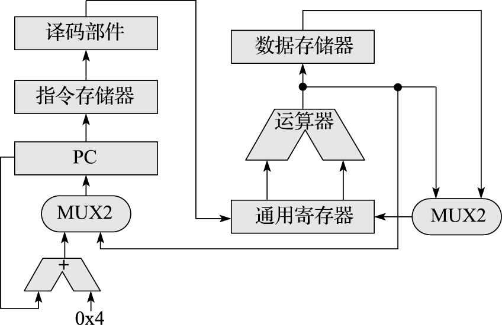
```

数据通路上各组成要素间的具体连接规则如下：根据PC从指令存储器中取出指令，然后是译码部件解析出相关控制信号，并读取通用寄存器堆；运算器对通用寄存器堆读出的操作数进行计算，得到计算指令的结果写回通用寄存器堆，或者得到访存指令的地址，或者得到转移指令的跳转目标；load指令访问数据存储器后，需要将结果写回通用寄存器堆。通用寄存器堆写入数据在计算结果和访存结果之间二选一。由于有控制流指令的存在，因此新指令的PC既可能等于顺序下一条指令的PC（当前指令PC加4），也可能来自转移指令计算出的跳转目标。

译码部件在这个数据通路中有非常重要的作用。译码部件要识别不同的指令，并根据指令要求，控制读取哪些通用寄存器、执行何种运算、是否要读写数据存储器、写哪个通用寄存器，以及根据控制流指令来决定PC的更新。这些信息从指令码中获得，传递到整个处理器中，控制了处理器的运行。根据LoongArch指令的编码格式，可以将指令译码为op、src1、src2、src3、dest和imm几个部分，示例见图\@ref(fig:chapter9-decode)。

```{r chapter9-decode, fig.cap='译码功能示意', fig.align='center', echo = FALSE, out.width='100%'}
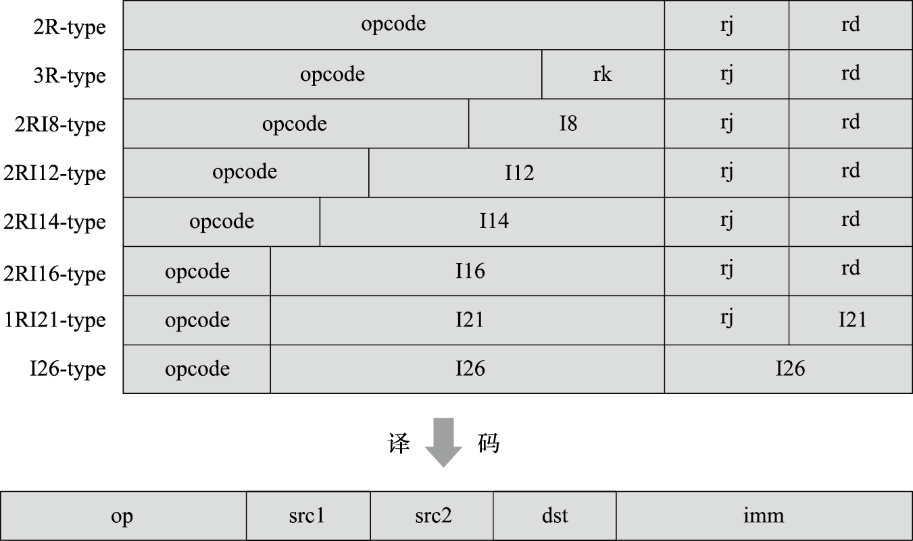
```

图\@ref(fig:chapter9-datapathWithClk)展示了带控制逻辑的数据通路，图中虚线是新加入的控制逻辑。此外，还加入了时钟和复位信号。引入时钟是因为更新PC触发器、写通用寄存器以及store类访存指令写数据存储器时都需要时钟。而引入复位信号是为了确保处理器每次上电后都是从相同位置取回第一条指令。数据通路再加上这些逻辑，就构成了处理器。

```{r chapter9-datapathWithClk, fig.cap='带有时序控制逻辑的数据通路', fig.align='center', echo = FALSE, out.width='100%'}
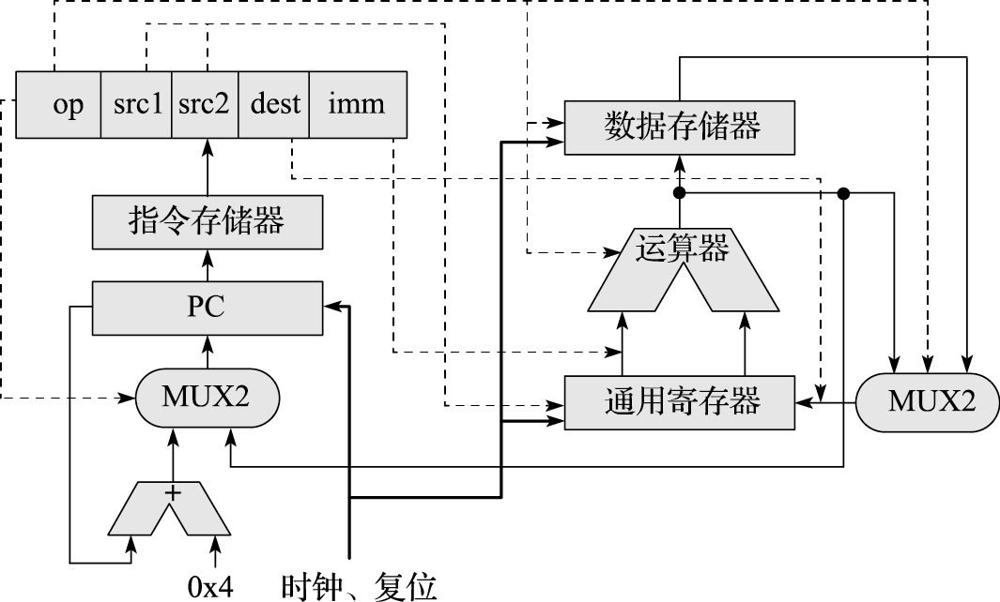
```

简要描述一下这个处理器的执行过程：

1) 复位信号将复位的PC装载到PC触发器内，之后的第一个时钟周期内，使用PC取指、译码、执行、读数据存储器、生成结果；
2) 当第二个时钟周期上升沿到来时，根据时序逻辑的特性，将新的PC锁存，将上一个时钟周期的结果写入寄存器堆，执行可能的数据存储器写操作；
3) 第二个时钟周期内，就可以执行第二条指令了，同样按照上面两步来执行。

依此类推，由一系列指令构成的程序就在处理器中执行了。由于每条指令的执行基本在一拍内完成，因此这个模型被称为单周期处理器。

## 流水线处理器 {#sec-pipeline-cpu}

根据\@ref(sec-MOS-principle)小节给出的CMOS电路延迟的介绍，当电路中组合逻辑部分延迟增大时，整个电路的频率就会变低。在上一节的单周期处理器模型中，每个时钟周期必须完成取指、译码、读寄存器、执行、访存等很多组合逻辑工作，为了保证在下一个时钟上升沿到来之前准备好寄存器堆的写数据，需要将每个时钟周期的间隔拉长，导致处理器的主频无法提高。使用流水线技术可以提高处理器的主频。在引入流水线技术之前，先介绍一下多周期处理器的概念。

在单周期处理器中，每个时钟周期内执行的功能可以比较明显地进行划分。举例而言，按照取指、译码并读寄存器、执行、访存和准备写回划分为5个阶段。如果我们在每段操作前后加上触发器，看起来就能减少每个时钟周期的工作量，提高处理器频率。在图\@ref(fig:chapter9-multicycle)中，加粗框线的是触发器。


```{r chapter9-multicycle, fig.cap='多周期处理器的结构图', fig.align='center', echo = FALSE, out.width='100%'}
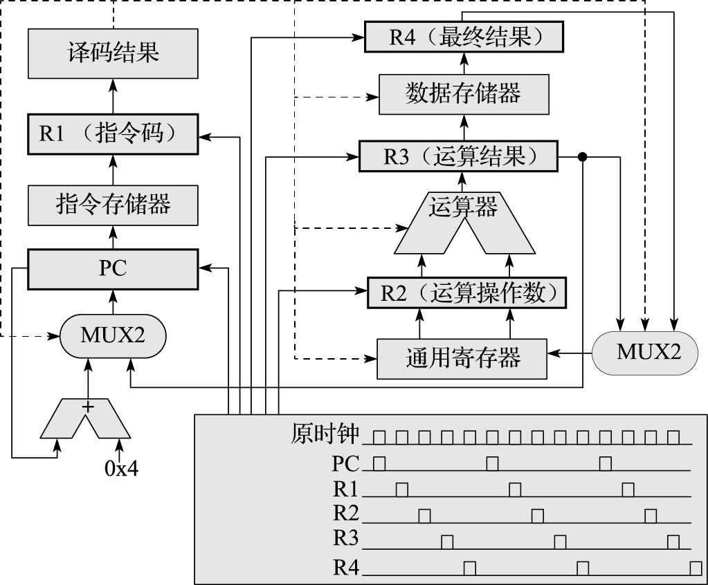
```

为了清晰，图中省略了控制逻辑的部分连线，没有画出通用寄存器和数据存储器的写入时钟。先将原始时钟接到所有的触发器，按照这个示意图设计的处理器是否可以使用呢？按照时序逻辑特性，每个时钟上升沿，触发器的值就会变成其驱动端D端口的新值，因此推算一下：

1) 在第1个时钟周期，通过PC取出指令，在第2个时钟上升沿锁存到指令码触发器R1；
2) 在第2个时钟周期，将R1译码并生成控制逻辑，读取通用寄存器，读出结果在第3个时钟上升沿锁存到触发器R2；
3) 在第3个时钟周期，使用控制逻辑和R2进行ALU运算。

推算到这里就会发现，此时离控制逻辑的生成（第2个时钟周期）已经隔了一个时钟周期了，怎么保证这时候控制逻辑还没有发生变化呢？

使用分频时钟或门控时钟可以做到这一点。如图\@ref(fig:chapter9-multicycle)右下方所示，将原始的时钟通过分频的方式产生出5个时钟，分别控制图中PC、R1\~R4这5组触发器。这样，在进行ALU运算时，可以保证触发器R1没有接收到下一个时钟上升沿，故不可能变化，因此可以进行正确的ALU运算。同理，包括写寄存器、执行访存等，都受到正确的控制。

经过推算，可以将这种处理器执行指令时的指令-时钟周期的对照图画出来，如图\@ref(fig:chapter9-multicycleflow)。这种图可以被称为处理器执行的时空图，也被称为流水线图。画出流水线图是分析处理器行为的直观、有效的方法。

```{r chapter9-multicycleflow, fig.cap='多周期处理器的流水线时空图', fig.align='center', echo = FALSE, out.width='100%'}
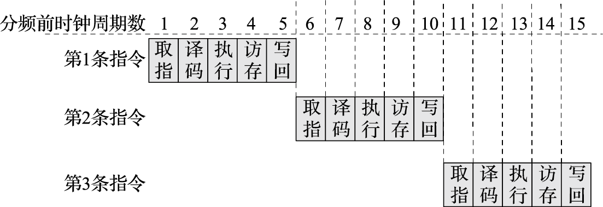
```

这种增加触发器并采用分频时钟的处理器模型称为多周期处理器。多周期处理器设计可以提高运行频率，但是每条指令的执行时间并不能降低（考虑到触发器的Setup时间和Clk-to-Q延迟则执行时间会增加）。我们可以将各个执行阶段以流水方式组织起来，同一时刻不同指令的不同执行阶段（流水线中的“阶段”也称为“级”）重叠在一起，进一步提高CPU执行效率。

从多周期处理器演进到流水线处理器，核心在于控制逻辑和数据通路对应关系维护机制的变化。多周期处理器通过使用分频时钟，可以确保在同一条指令的后面几个时钟周期执行时，控制逻辑因没有接收到下一个时钟上升沿所以不会发生变化。流水线处理器则通过另一个方法来保证这一点，就是在每级流水的触发器旁边，再添加一批用于存储控制逻辑的触发器。指令的控制逻辑藉由这些触发器沿着流水线逐级传递下去，从而保证了各阶段执行时使用的控制逻辑都是属于该指令的，如图\@ref(fig:chapter9-pipelinestruct)所示。

```{r chapter9-pipelinestruct, fig.cap='流水线处理器的结构图', fig.align='center', echo = FALSE, out.width='80%'}
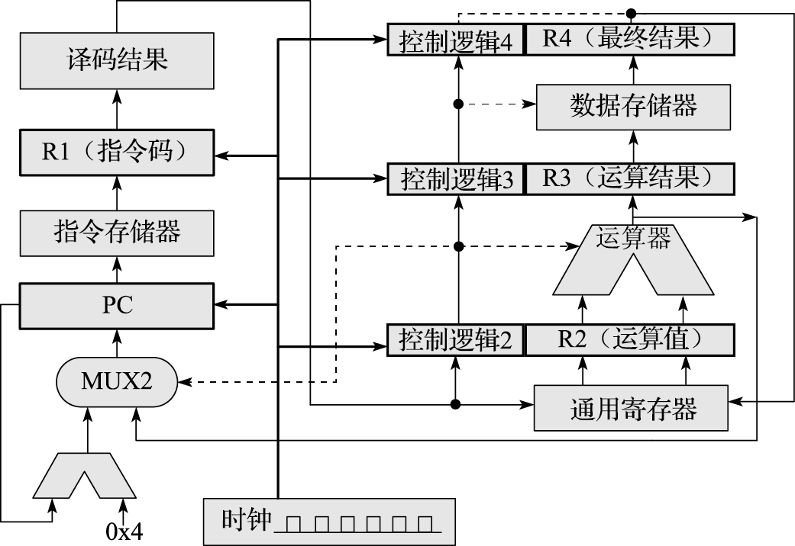
```

从图\@ref(fig:chapter9-pipelinestruct)中的虚线可以看出，控制运算器进行计算的信息来自控制逻辑2，即锁存过一次的控制逻辑，刚好与R2中存储的运算值同属一条指令。图中取消了R3阶段写通用寄存器的通路，而是将R3的内容锁存一个时钟周期，统一使用控制逻辑4和R4来写。

可以先设计几条简单指令，画出时空图，看看这个新的处理器是如何运行的。示例见图\@ref(fig:chapter9-pipelineflow)。

```{r chapter9-pipelineflow, fig.cap='流水线处理器的流水线时空图', fig.align='center', echo = FALSE, out.width='100%'}
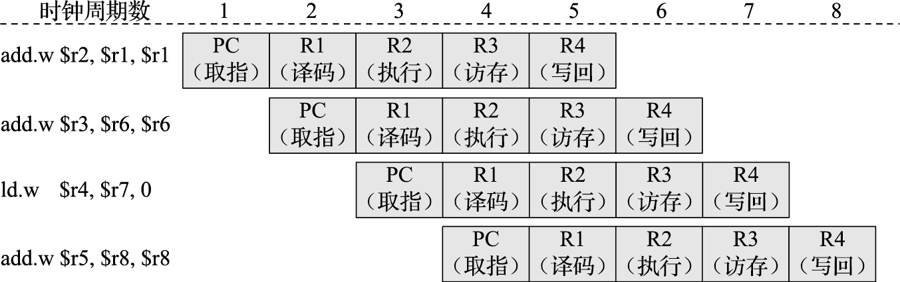
```

要记得图中R2、R3和R4实际上还包括各自对应的控制逻辑触发器，所以到下一个时钟周期后，当前部件及对应触发器已经不再需要给上一条指令服务，新的指令才可以在下一个时钟周期立即占据当前的触发器。

如果从每个处理器部件的角度，也可以画出另一个时空图，见图\@ref(fig:chapter9-componentflow)。图中不同下标的I代表不同的指令。

```{r chapter9-componentflow, fig.cap='处理器部件时空图', fig.align='center', echo = FALSE, out.width='100%'}
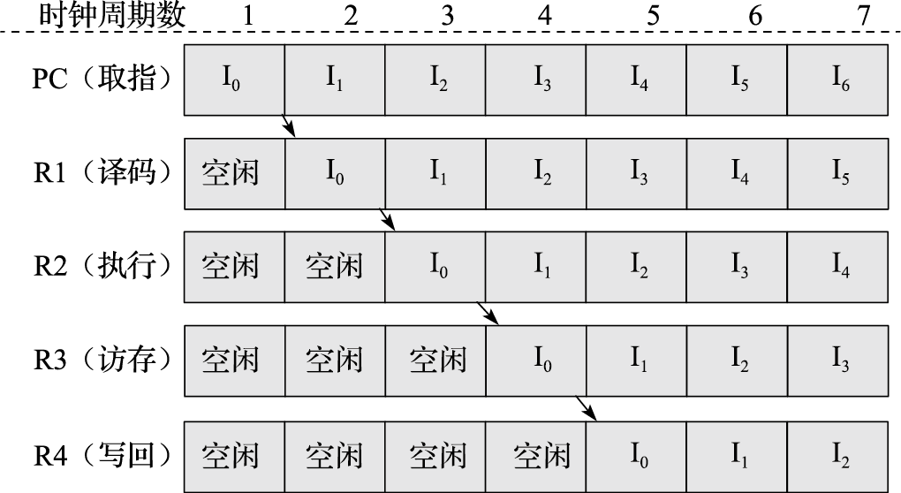
```

从这个角度看过去，处理器的工作方式就像一个5人分工合作的加工厂，每个工人做完自己的部分，将自己手头的工作交给下一个工人，并取得一个新的工作，这样可以让每个工人都一直处于工作状态。这种工作方式被称为流水线，采用这种模型的处理器被称为流水线处理器。

## 指令相关和流水线冲突 {#sec-hazard}

前面设计的流水线处理器在执行图\@ref(fig:chapter9-pipelineflow)中所示的简单指令序列时可以很顺畅，每个时钟周期都能执行完一条指令。但是程序中的指令序列并不总是这么简单，通常会存在指令间的相关，这就有可能导致流水线处理器执行出错。举例来说，对于“add.w \$r2, \$r1, \$r1; add.w \$r3, \$r2, \$r2”这个指令序列，第1条指令将结果写入r2寄存器，第2条指令再用r2寄存器的值进行计算。在前面设计的5级静态流水线处理器中，第1条指令在第5级写回阶段才把结果写回到寄存器，但是第2条指令在第2级译码阶段（此时第1条指令尚在第3级执行阶段）就已经在读寄存器的值了，所以第2条指令读取的是r2寄存器的旧值，从而造成了运算结果错误。因此本节将重点探讨如何在流水线处理器结构设计中处理好指令相关，从而保证程序的正确执行。

指令间的相关可以分为3类：数据相关、控制相关和结构相关。在程序中，如果两条指令访问同一个寄存器或内存单元，而且这两条指令中至少有1条是写该寄存器或内存单元的指令，那么这两条指令之间就存在数据相关。上面举的例子就是一种数据相关。如果两条指令中一条是转移指令且另一条指令是否被执行取决于该转移指令的执行结果，则这两条指令之间存在控制相关。如果两条指令使用同一份硬件资源，则这两条指令之间存在结构相关。

在程序中，指令间的相关是普遍存在的。这些相关给指令增加了一个序关系，要求指令的执行必须满足这些序关系，否则执行的结果就会出错。为了保证程序的正确执行，处理器结构设计必须满足这些序关系。指令间的序关系有些是很容易满足的，例如两条相关的指令之间隔得足够远，后面的指令开始取指执行时前面的指令早就执行完了，那么处理器结构设计就不用做特殊处理。但是如果两条相关的指令挨得很近，尤其是都在指令流水线的不同阶段时，就需要用结构设计来保证这两条指令在执行时满足它们的相关关系。

相关的指令在一个具体的处理器结构中执行时可能会导致冲突（hazard）。例如本节开头所举例子中，数据相关指令序列在5级静态流水线处理器中执行时碰到的读数时机早于写数的情况就是一个冲突。下面将具体分析5级静态流水线处理器中存在的冲突及其解决办法。

### 数据相关引发的冲突及解决办法

数据相关根据冲突访问读和写的次序可以分为3种。第1种是写后读（Read After Write,简称RAW）相关，即后面指令要用到前面指令所写的数据，也称为真相关。第2种是写后写（Write After Write,简称WAW）相关，即两条指令写同一个单元，也称为输出相关。第3种是读后写（Write After Read,简称WAR）相关，即后面的指令覆盖前面指令所读的单元，也称为反相关。在\@ref(sec-pipeline-cpu)节所介绍的5级简单流水线中，只有RAW相关会引起流水线冲突，WAR相关和WAW相关不会引起流水线冲突。但是在\@ref(sec-dynamic)节中将要介绍的乱序执行流水线中，WAR相关和WAW相关也有可能引起流水线冲突。

下面重点分析RAW相关所引起的流水线冲突并讨论其解决方法。对于如下指令序列

    add.w $r2, $r1, $r1
    add.w $r3, $r2, $r2
    ld.w $r4, $r3, 0
    add.w $r5, $r4, $r4


其中第1、2条指令间，第2、3条指令间，第3、4条指令间存在RAW相关。这3条指令在\@ref(sec-pipeline-cpu)节所介绍的5级简单流水线处理器中执行的流水线时空图如图\@ref(fig:chapter9-raw)所示。


```{r chapter9-raw, fig.cap='RAW数据相关的流水线时空图', fig.align='center', echo = FALSE, out.width='100%'}
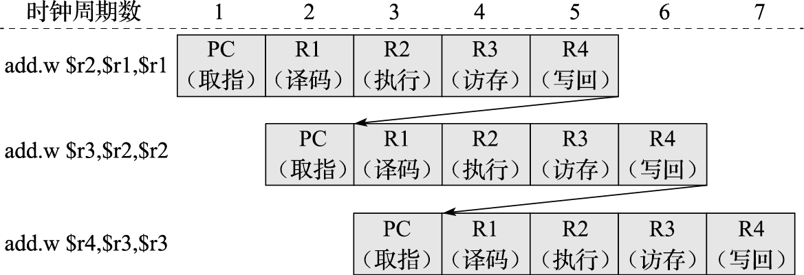
```

图\@ref(fig:chapter9-raw)中从第1条指令的写回阶段指向第2条指令的译码阶段的箭头以及从第2条指令的写回阶段指向第3条指令的译码阶段的箭头都表示RAW相关会引起冲突。这是因为如果第2条指令要使用第1条指令写回到寄存器的结果，就必须保证第2条指令读取寄存器的时候第1条指令的结果已经写回到寄存器中了，而现有的5级流水线结构如果不加控制，第2条指令就会在第1条指令写回寄存器之前读取寄存器，从而引发数据错误。为了保证执行的正确，一种最直接的解决方式是让第2条指令在译码阶段等待（阻塞）3拍，直到第1条指令将结果写入寄存器后才能读取寄存器，进入后续的执行阶段。同样的方式亦适用于第2、3条指令之间和第3、4条指令之间。采用阻塞解决数据相关的流水线时空图如图\@ref(fig:chapter9-stallflow)所示。


```{r chapter9-stallflow, fig.cap='用阻塞解决数据相关的流水线时空图', fig.align='center', echo = FALSE, out.width='100%'}
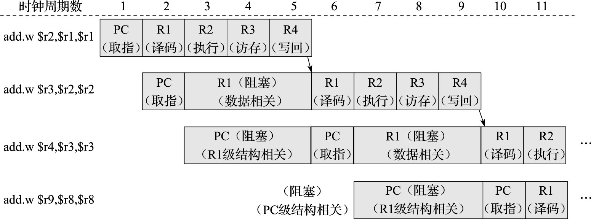
```

阻塞功能在处理器流水线中的具体电路实现是：将被阻塞流水级所在的寄存器保持原值不变，同时向被阻塞流水级的下一级流水级输入指令无效信号，用流水线空泡（Bubble）填充。对于图\@ref(fig:chapter9-stallflow)所示的流水线阻塞，从每个处理器部件的角度所看到的时空图如图\@ref(fig:chapter9-componentflowWithStall)所示。


```{r chapter9-componentflowWithStall, fig.cap='有阻塞的处理器部件时空图', fig.align='center', echo = FALSE, out.width='100%'}
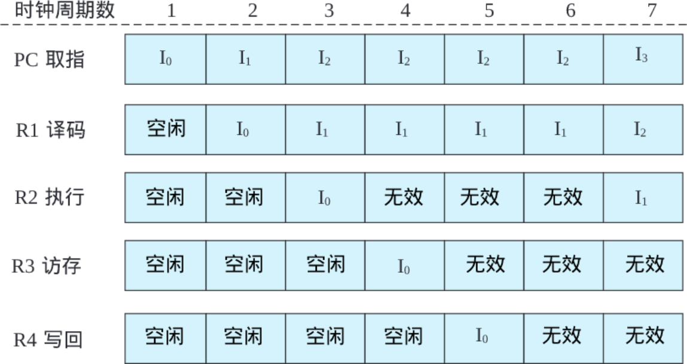
```

#### 流水线前递技术

采用阻塞的方式虽然能够解决RAW相关所引发的流水线冲突，但是阻塞势必引起流水线执行效率的降低，为此需要更为高效的解决方式。继续分析前面所举的例子，可以发现第2条指令位于译码阶段的时候，虽然它所需要的第1条指令的结果还不在寄存器中，但是这个值已经在流水线的执行阶段计算出来了，那么何必非要等着这个值沿着流水线一级一级送下去写入寄存器后再从寄存器中读出呢？直接把这个值取过来用不也是可行的吗？顺着这个思路就产生了流水线前递（Forwarding）技术。其具体实现是在流水线中读取指令源操作数的地方通过多路选择器直接把前面指令的运算结果作为后面指令的输入。考虑到加法指令在执行级就完成了运算，因此能够设计一条通路，将这个结果前递至读寄存器的地方，即有一条从执行级到译码级的前递通路。除此之外，还可以依次添加从访存级、写回级到译码级的前递通路。新的流水线时空图如图\@ref(fig:chapter9-forwarding)所示。


```{r chapter9-forwarding, fig.cap='加入前递的数据相关时空图', fig.align='center', echo = FALSE, out.width='100%'}
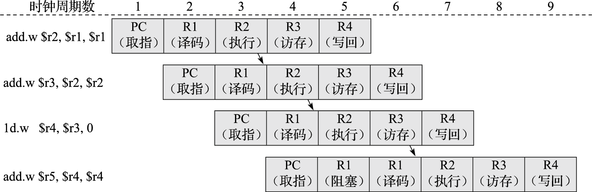
```


可以看出，加入前递技术之后，执行这4条指令的性能有大幅提高。

通过前面对于指令相关的分析，我们需要在处理器中加入阻塞流水线的控制逻辑以及前递通路。演进后的处理器结构如图\@ref(fig:chapter9-instHazardPipeline)所示。为了表达清晰，图中省略了时钟信号到每组触发器的连接线。

```{r chapter9-instHazardPipeline, fig.cap='处理指令相关的流水线结构图', fig.align='center', echo = FALSE, out.width='100%'}
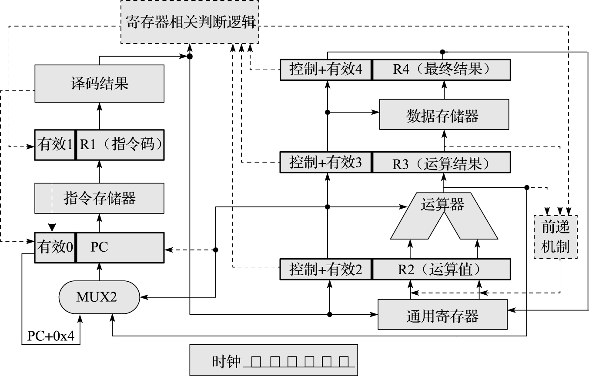
```

图\@ref(fig:chapter9-instHazardPipeline)中虚线框中是新加入的逻辑。为了解决数据相关，加入了寄存器相关判断逻辑，收集当前流水线中处于执行、访存及写回级的最多3条指令的目的寄存器信息，与译码级的源寄存器比较，并根据比较结果决定是否阻塞译码级R1；为了解决控制相关，加入了译码级和执行级能够修改PC级有效位的通路；为了解决结构相关，加入了译码级到PC级的阻塞控制逻辑；为了支持前递，加入了从执行级、访存级到译码级的数据通路，并使用寄存器相关判断逻辑来控制如何前递。可以看出，大多数机制都加在了前两级流水线上。

### 控制相关引发冲突及解决方法 {#sec-control-hazard}

控制相关引发的冲突本质上是对程序计数器PC的冲突访问引起的。图\@ref(fig:chapter9-ctrlHazard)中的箭头即表示控制相关所引发的冲突。

```{r chapter9-ctrlHazard, fig.cap='控制相关示意图', fig.align='center', echo = FALSE, out.width='100%'}
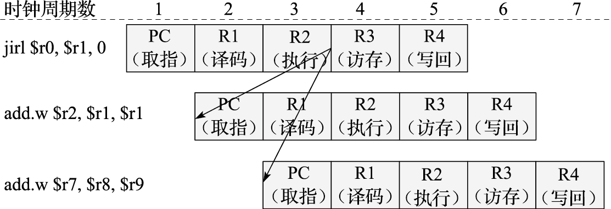
```

按照图\@ref(fig:chapter9-pipelinestruct)给出的处理器设计，执行阶段R2触发器所存储的值经过计算之后才能给出转移指令的正确目标并在下一个时钟上升沿更新PC，但是图\@ref(fig:chapter9-instHazardPipeline)中转移指令尚未执行结束时，PC已经更新完毕并取指了，从而可能导致取回了错误的指令。为了解决这个问题，可以通过在取指阶段引入2拍的流水线阻塞来解决，如图\@ref(fig:chapter9-ctrlHazardFlow)所示。

在单发射5级静态流水线中，如果增加专用的运算资源将转移指令条件判断和计算下一条指令PC的处理调整到译码阶段，那么转移指令后面的指令只需要在取指阶段等1拍。调整后的前述代码序列的执行流水线的时空图如图\@ref(fig:chapter9-ctrlHazardFlow1)所示。采用这种解决控制相关的方式，继续改进流水线处理器结构，得到如图\@ref(fig:chapter9-ctrlHazardStruct)所示的结构设计。

```{r chapter9-ctrlHazardFlow, fig.cap='解决控制相关的流水线时空图', fig.align='center', echo = FALSE, out.width='100%'}
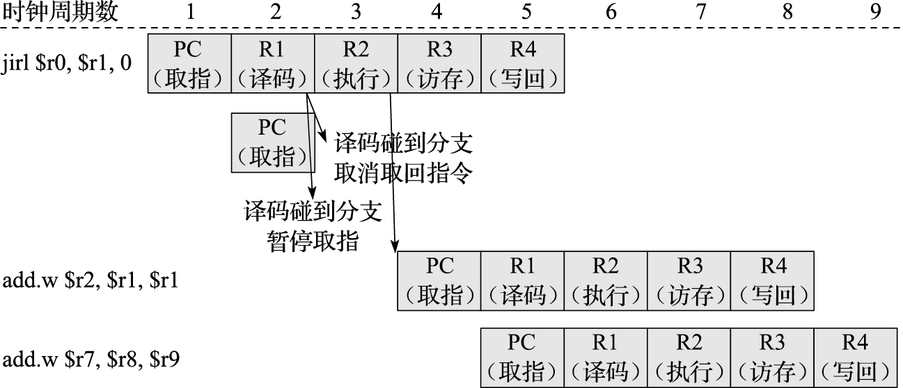
```

```{r chapter9-ctrlHazardFlow1, fig.cap='优化控制相关处理后的流水线时空图', fig.align='center', echo = FALSE, out.width='100%'}
knitr::include_graphics('./images/chapter9/ctrlHazardFlow1.png')
```

```{r chapter9-ctrlHazardStruct, fig.cap='改进后的解决控制相关的流水线结构图', fig.align='center', echo = FALSE, out.width='100%'}
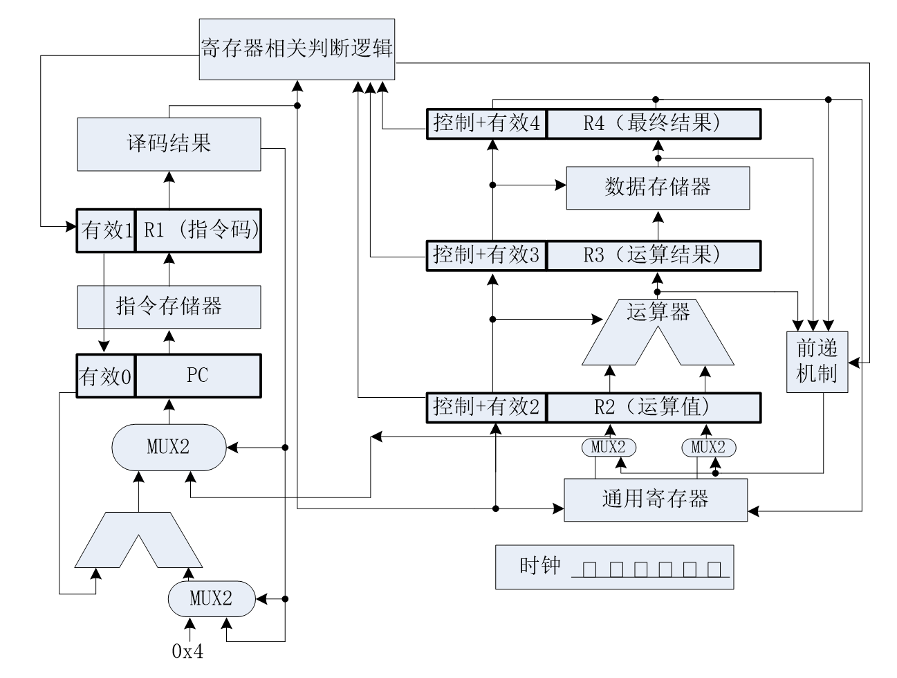
```

为更进一步减少由控制相关引起的阻塞，可以采用转移指令的延迟槽技术，在定义指令系统的时候就明确转移指令延迟槽指令的执行不依赖于转移指令的结果，这样转移指令后面的指令在取指阶段1拍也不用等。总之，在单发射5级静态流水线处理器中，通过在译码阶段对转移指令进行处理和利用转移指令延迟槽技术，就可以避免控制相关引起的流水线阻塞。但是这两项技术并不一定适用于其他结构，后面\@ref(sec-branch-predict)小节讨论转移预测技术时将做进一步分析。

### 结构相关引发冲突及解决办法

结构相关引起冲突的原因是两条指令要同时访问流水线中的同一个功能部件。回顾前面图\@ref(fig:chapter9-stallflow)中所示的指令序列执行情况，由于流水线中只有一个译码部件，所以第3条指令因为结构相关在第7个时钟周期之前不能进入译码阶段，否则就将覆盖第2条指令的信息，导致第2条指令无法正确执行。同样，可以看到不存在任何数据相关的第4条指令，由于存在结构相关也被多次阻塞，甚至被堵得还无法进入取指阶段。

## 流水线与异常处理 {#sec-precise-exception}

这里简要介绍一下如何在流水线处理器中支持异常处理。在第\@ref(sec-privileged-ISA)章曾介绍过，异常产生的来源包括：外部事件、指令执行中的错误、数据完整性问题、地址转换异常、系统调用和陷入以及需要软件修正的运算等。在流水线处理器中，这些不同类型的异常可能在流水线的不同阶段产生。例如访存地址错异常可以在取指阶段和访存阶段产生，保留指令异常和系统调用异常在译码阶段产生，整数溢出异常在执行阶段产生，而中断则可以在任何时候发生。

异常可以分为可恢复异常和不可恢复异常。不可恢复的异常通常发生在系统硬件出现了严重故障的时候，此时异常处理后系统通常面临重启，所以处理器响应不可恢复异常的机制很简单，只要立即终止当前的执行，记录软件所需的信息然后跳转到异常处理入口即可。但是，可恢复异常的处理就比较难，要求做得非常精确，这也就是常常提到的精确异常概念。精确异常要求处理完异常之后，回到产生异常的地方接着执行，还能执行正确，就好像没有发生过异常一样。要达成这个效果，要求在处理异常时，发生异常的指令前面的所有指令都执行完（修改了机器状态），而发生异常的指令及其后面的指令都没有执行（没有修改机器状态）。

在流水线处理器中，同时会有多条指令处于不同阶段，不同阶段都有发生异常的可能，那么如何实现精确异常呢？这里给出一种可行的设计方案。为什么说是可行的以及结构设计该如何修改，作为课后作业留给同学们思考。

1) 任何一级流水发生异常时，在流水线中记录下发生异常的事件，直到写回阶段再处理。
2) 如果在执行阶段要修改机器状态（如状态寄存器），保存下来直到写回阶段再修改。
3) 指令的PC值随指令流水前进到写回阶段为异常处理专用。
4) 将外部中断作为取指的异常处理。
5) 指定一个通用寄存器（或一个专用寄存器）为异常处理时保存PC值专用。
6) 当发生异常的指令处在写回阶段时，保存该指令的PC及必需的其他状态，置取指的PC值为异常处理程序入口地址。

在前面3节的介绍中，由简至繁地搭建出一个可以正常执行各种指令的流水线处理器。回顾设计过程，其中的设计要点有两个：第一是通过加入大量触发器，实现了流水线功能；第二是通过加入大量控制逻辑，解决了指令相关问题。

## 提高流水线效率的技术

我们通常以应用的执行时间来衡量一款处理器的性能。应用的执行时间等于指令数乘以CPI（Cycles Per Instruction，每指令执行周期数）再乘以时钟周期。当算法、程序、指令系统、编译器都确定之后，一个应用的指令数就确定下来了。时钟周期与结构设计、电路设计、生产工艺以及工作环境都有关系，不作为这里讨论的重点。我们主要关注CPI的降低，即如何通过结构设计提高流水线效率。上一节中提到指令相关容易引起流水线的阻塞。因此，流水线处理器实际的CPI等于指令的理想执行周期数加上由于指令相关引起的阻塞周期数：

$$流水线CPI=理想CPI+结构相关阻塞周期数+RAW阻塞周期数+WAR阻塞周期数+WAW阻塞周期数+控制相关阻塞周期数$$

从上面的公式可知，要想提高流水线效率（即降低Pipeline CPI），可以从降低理想CPI和降低各类流水线阻塞这些方面入手。

### 多发射数据通路

我们首先讨论如何降低理想CPI。最直观的方法就是让处理器中每级流水线都可以同时处理更多的指令，这被称为多发射数据通路技术。例如双发射流水线意味着每一拍用PC从指令存储器中取两条指令，在译码级同时进行两条指令的译码、读源寄存器操作，还能同时执行两条指令的运算操作和访存操作，并同时写回两条指令的结果。那么双发射流水线的理想CPI就从单发射流水线的1降至0.5。

要在处理器中支持多发射，首先就要将处理器中的各种资源翻倍，包括采用支持双端口的存储器。其次还要增加额外的阻塞判断逻辑，当同一个时钟周期执行的两条指令存在指令相关时，也需要进行阻塞。包括数据相关、控制相关和结构相关在内的阻塞机制都需要改动。我们来观察几条简单指令在双发射流水线中的时空图，如图\@ref(fig:chapter9-dualIssue)所示。

```{r chapter9-dualIssue, fig.cap='双发射处理器的流水线时空图', fig.align='center', echo = FALSE, out.width='100%'}
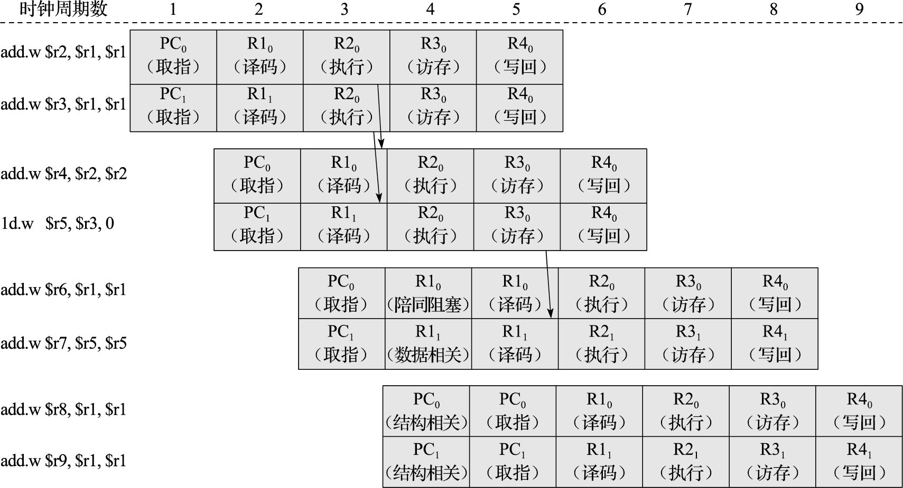
```

在图\@ref(fig:chapter9-dualIssue)中，为了流水线控制的简化，只有同一级流水线的两条指令都不被更早的指令阻塞时，才能让这两条指令一起继续执行，所以第6条指令触发了陪同阻塞。

多发射数据通路技术虽然从理论上而言可以大幅度降低处理器的CPI，但是由于各类相关所引起的阻塞影响，其实际执行效率是要大打折扣的。所以我们还要进一步从减少各类相关引起的阻塞这个方面入手来提高流水线的执行效率。

### 动态调度 {#sec-dynamic}

如果我们用道路交通来类比的话，多发射数据通路就类似于把马路从单车道改造为多车道，但是这个多车道的马路有个奇怪的景象——速度快的车（如跑车）不能超过前面速度慢的车（如马车），即使马车前面的车道是空闲的。直觉上我们肯定觉得这样做效率低，只要车道有空闲，就应该允许后面速度快的车超过前面速度慢的车。这就是动态调度的基本出发点。用本领域的概念来描述动态的基本思想就是：把相关的解决尽量往后拖延，同时前面指令的等待不影响后面指令继续前进。下面我们通过一个例子来加深理解：假定现在有一个双发射流水线，所有的运算单元都有两份，那么在执行下列指令序列时：

    div.w $r3, $r2, $r1
    add.w $r5, $r4, $r3
    sub.w $r8, $r7, $r6

由于除法单元采用迭代算法实现，所以div.w指令需要多个执行周期，与它有RAW相关的add.w指令最早也只能等到div.w指令执行完毕后才能开始执行。但是sub.w指令何时可以开始执行呢？可以看到sub.w指令与前两条指令没有任何相关，采用动态调度的流水线就允许sub.w指令越过前面尚未执行完毕的div.w指令和add.w指令，提前开始执行。因为sub.w是在流水线由于指令间的相关引起阻塞而空闲的情况下“见缝插针”地提前执行了，所以这段程序整体的执行延迟就减少了。

要完成上述功能，需要对原有的流水线做一些改动。首先，要将原有的译码阶段拆分成“译码”和“读操作数”两个阶段。译码阶段进行指令译码并检查结构相关，随后在读操作数阶段则一直等待直至操作数可以读取。处在等待状态的指令不能一直停留在原有的译码流水级上，因为这样它后面的指令就没法前进甚至是进入流水线，更不用说什么提前执行了。所以我们会利用一个结构存放这些等待的指令，这个结构被称为保留站，有的文献中也称之为发射队列，这是动态调度中必需的核心部件。除了存储指令的功能，保留站还要负责控制其中的指令何时去执行，因此保留站中还会记录下描述指令间相关关系的信息，同时监测各条指令的执行状态。如果指令是在进入保留站前读取寄存器，那么保留站还需要监听每条结果总线，获得源操作数的最新值。

保留站在处理器中的大致位置如图\@ref(fig:chapter9-dynamic)所示。保留站通常组织为一个无序的队列结构，其中每一项对应一条指令，包含多个域，存放这个指令的监听结果和后续执行所需各类信息，包括有效位、指令执行控制信息（如操作码）、源操作数的就绪状态、源操作的监听对象以及源操作数的数据。如果采用了后面将要提到的寄存器重命名技术，那么保留站通常还要存放该指令目的寄存器重命名后的信息。译码并读寄存器的指令进入保留站，保留站会每个时钟周期选择一条没有被阻塞的指令，送往执行逻辑，并退出保留站，这个动作称为“发射”。

```{r chapter9-dynamic, fig.cap='动态调度流水线结构示意', fig.align='center', echo = FALSE, out.width='100%'}
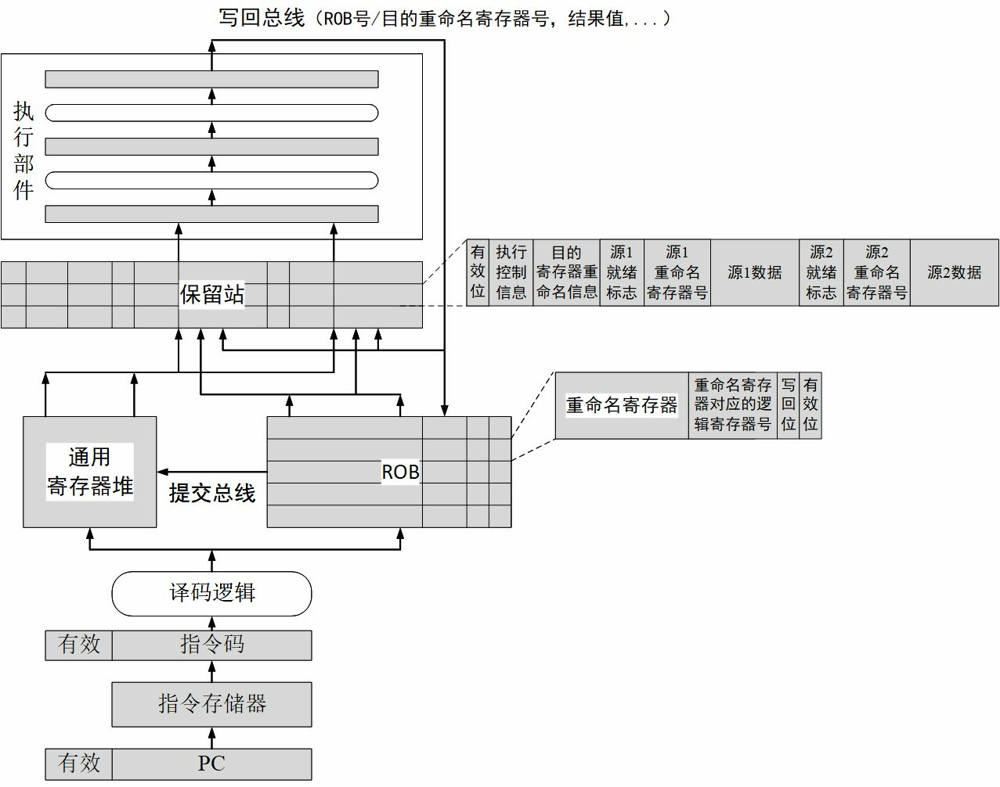
```

保留站调度算法的核心在于“挑选没有被阻塞的指令”。从保留站在流水线所处的位置来看，保留站中的指令不可能因为控制相关而被阻塞。结构相关所引起的阻塞的判定条件也是直观的，即检查有没有空闲的执行部件和空闲的发射端口。但是在数据相关所引起的阻塞的处理上，存在着不同的设计思路。

为了讨论清楚保留站如何处理数据相关所引起的阻塞，先回顾一下\@ref(sec-hazard)节关于RAW、WAR、WAW三种数据相关的介绍，在那里我们曾提到在5级简单流水线上WAR和WAW两种数据相关不会产生冲突，但是在动态调度的情况下就可能会产生。下面来看两个例子。例如下面的指令序列：

    div.w $r3, $r2, $r1
    add.w $r5, $r4, $r3
    sub.w $r4, $r7, $r6

add.w指令和sub.w指令之间存在WAR相关，在乱序调度的情况下，sub.w指令自身的源操作数不依赖于div.w和add.w指令，可以读取操作数执行得到正确的结果。那么这个结果能否在执行结束后就立即写入寄存器呢？回答是否定的。假设sub.w执行完毕的时候，add.w指令因为等待div.w指令的结果还没有开始执行，那么sub.w指令如果在这个时候就修改了\$r4寄存器的值，那么等到add.w开始执行时，就会产生错误的结果。

WAW相关的例子与上面WAR相关的例子很相似，如下面的指令序列：

    div.w $r3, $r2, $r1
    add.w $r5, $r4, $r3
    sub.w $r5, $r7, $r6

add.w指令和sub.w指令之间存在WAW相关，在乱序调度的情况下，sub.w指令可以先于add.w指令执行，如果sub.w执行完毕的时候，add.w指令因为等待div.w指令的结果还没有开始执行，那么sub.w指令若是在这个时候就修改了\$r5寄存器的值，那就会被add.w指令执行完写回的结果覆盖掉。从程序的角度看，sub.w后面的指令读取\$r5寄存器会得到错误的结果。

上面的例子解释了WAR和WAW相关在动态调度流水线中是怎样产生冲突的。如何解决呢？阻塞作为解决一切冲突的普适方法肯定是可行的。方法就是如果保留站判断出未发射的指令与前面尚未执行完毕的指令存在WAR和WAW相关，就阻塞其发射直至冲突解决。历史上第一台采用动态调度流水线的CDC6000就是采用了这种解决思路，称为记分板办法。

事实上，WAR和WAW同RAW是有本质区别的，它们并不是由程序中真正的数据依赖关系所引起的相关关系，而仅仅是由于恰好使用具有同一个名字的寄存器所引起的名字相关。打个比方来说，32项的寄存器文件就好比一个有32个储物格的储物柜，每条指令把自己的结果数据放到一个储物格中，然后后面的指令依照储物格的号（寄存器名字）从相应的格子中取出数据，储物柜只是一个中转站，问题的核心是要把数据从生产者传递到指定的消费者，至于说这个数据通过哪个格子做中转并不是绝对的。WAR和WAW相关产生冲突意味着两对“生产者-消费者”之间恰好准备用同一个格子做中转，而且双方在“存放-取出”这个动作的操作时间上产生了重叠，所以就引发了混乱。如果双方谁都不愿意等（记分板的策略）怎么办？再找一个不受干扰的空闲格子，后来的一方换用这个新格子做中转，就不用等待了。这就是寄存器重命名技术。通过寄存器重命名技术，可以消除WAR和WAW相关。例如，存在WAR和WAW相关指令序列：

    div.w	$r3, $r2, $r1
    add.w	$r5, $r4, $r3
    sub.w	$r3, $r7, $r6
    mul.w	$r9, $r8, $r3

可以通过寄存器重命名变为：

    div.w	$r3,$r2,$r1
    add.w  	$r5,$r4,$r3
    sub.w	$r10,$r7,$r6
    mul.w	$r9,$r8,$r10

重命名之后就没有WAR和WAW相关了。

1966年,Robert Tomasulo在IBM 360/91中首次提出了对于动态调度处理器设计影响深远的Tomasulo算法。该算法在CDC6000记分板方法基础上做了进一步改进。面对RAW相关所引起的阻塞，两者解决思路是一样的，即将相关关系记录下来，有相关的等待，没有相关的尽早送到功能部件开始执行。但是Tomasulo算法实现了硬件的寄存器重命名，从而消除了WAR和WAW相关，也就自然不需要阻塞了。

在流水线中实现动态调度，还有最后一个需要考虑的问题——精确异常。回顾一下\@ref(sec-precise-exception)节中关于精确异常的描述，要求在处理异常时，发生异常的指令前面的所有指令都执行完（修改了机器状态），而发生异常的指令及其后面的指令都没有执行（没有修改机器状态）。那么在乱序调度的情况下，指令已经打破了原有的先后顺序在流水线中执行了，“前面”“后面”这样的顺序关系从哪里获得呢？还有一个问题，发生异常的指令后面的指令都不能修改机器的状态，但是这些指令说不定都已经越过发生异常的指令先去执行了，怎么办呢？

上面两个问题的解决方法是：在流水线中添加一个重排序缓冲（ROB）来维护指令的有序结束，同时在流水线中增加一个“提交”阶段。指令对机器状态的修改只有在到达提交阶段时才能生效（软件可见），处于写回阶段的指令不能真正地修改机器状态，但可以更新并维护一个临时的软件不可见的机器状态。ROB是一个先进先出的有序队列，所有指令在译码之后按程序顺序进入队列尾部，所有执行完毕的执行从队列头部按序提交。提交时一旦发现有指令发生异常，则ROB中该指令及其后面的指令都被清空。发生异常的指令出现在ROB头部时，这条指令前面的指令都已经从ROB头部退出并提交了，这些指令对于机器状态的修改都生效了；异常指令和它后面的指令都因为清空而没有提交，也就不会修改机器状态。这就满足了精确异常的要求。

总结一下实现动态调度后流水线各阶段的调整：

* 取指,不变。
* 译码, 译码拆分为译码和读操作数两个阶段。在读操作数阶段，把操作队列的指令根据操作类型派送（dispatch）到保留站（如果保留站以及ROB有空），并在ROB中指定一项作为临时保存该指令结果之用；保留站中的操作等待其所有源操作数就绪后即可以被挑选出来发射（issue）到功能部件执行，发射过程中读寄存器的值和结果状态域，如果结果状态域指出结果寄存器已被重命名到ROB，则读ROB。
* 执行,不变。
* 写回。把结果送到结果总线，释放保留站；ROB根据结果总线修改相应项。
* 提交。如果队列中第一条指令的结果已经写回且没有发生异常，把该指令的结果从ROB写回到寄存器或存储器，释放ROB的相应项；如果队列头的指令发生了异常或者转移指令猜测错误，清除操作队列以及ROB等。

### 转移预测 {#sec-branch-predict}

因转移指令而引起的控制相关也会造成流水线的阻塞。在前面\@ref(sec-control-hazard)小节中曾指出，通过将转移指令处理放到译码阶段和转移指令延迟槽两项技术，可以在单发射5级静态流水线中无阻塞地解决控制相关所引起的冲突。但是这种解决控制相关所引起的冲突的方式并不是普适的。比如当为了提高处理器的主频而将取指阶段的流水级做进一步切分后，或者是采用多发射数据通路设计后，仅有1条延迟槽指令是无法消除流水线阻塞的。

正常的应用程序中转移指令出现十分频繁，通常平均每5\~10条指令中就有一条是转移指令，而且多发射结构进一步加速了流水线遇到转移指令的频率。例如假设一个程序平均8条指令中有一条转移指令，那么在单发射情况下平均8拍才遇到1条转移指令，而4发射情况下平均2拍就会遇到1条转移指令。而且随着流水线越来越深，处理转移指令所需要的时钟周期数也越来越多。面对这些情况，如果还是只能通过阻塞流水线的方式来避免控制相关引起的冲突，将会极大地降低流水线处理器的性能。

现代处理器普遍采用硬件转移预测机制来解决转移指令引起的控制相关阻塞，其基本思路是在转移指令的取指或译码阶段预测出转移指令的方向和目标地址，并从预测的目标地址继续取指令执行，这样在猜对的情况下就不用阻塞流水线。既然是猜测，就有错误的可能。硬件转移预测的实现分为两个步骤：第一步是预测，即在取指或译码阶段预测转移指令是否跳转以及转移的目标地址，并根据预测结果进行后续指令的取指；第二步是确认，即在转移指令执行完毕后，比较最终确定的转移条件和转移目标与之前预测的结果是否相同，如果不同则需要取消预测后的指令执行，并从正确的目标重新取指执行。

下面通过一个简单的例子来说明转移预测对性能的影响。假设平均8条指令中有1条转移指令，某处理器采用4发射结构，在第10级流水计算出转移方向和目标（这意味着转移预测失败将产生(10-1)×4=36个空泡）。如果不进行转移预测而采用阻塞的方式，那么取指带宽浪费36/(36+8)=82%；如果进行简单的转移预测，转移预测错误率为50%，那么平均每16条指令预测错误一次，指令带宽浪费36/(36+16)=75%；如果使用误预测率为10%的转移预测器，那么平均每80条指令预测错误一次，指令带宽浪费降至36/(36+80)=31%；如果使用误预测率为4%的转移预测器，则平均每200条指令预测错误一次，取指令带宽浪费进一步降至36/(36+200)=15%。

从上面的例子可以看出，在转移预测错误开销固定的情况下，提高转移预测的准确率有助于大幅度提升处理器性能。那么能否设计出具有很高预测正确率的转移预测器呢？通过对大量应用程序中转移指令的行为进行分析后，人们发现它具有两个非常好的特性：首先，转移指令有较好的局部性，即少数转移指令的执行次数占所有转移指令执行次数中的绝大部分，这意味着只要对少量高频次执行的转移指令做出准确的预测就能获得绝大多数的性能提升；其次，绝大多数转移指令具有可预测性，即能够通过对转移指令的行为进行分析学习得出其规律性。

转移指令的可预测性主要包括单条转移指令的重复性以及不同转移指令之间存在的方向相关、路径相关。单条转移指令的重复性主要与程序中的循环有关。例如for型循环中转移指令的模式为TT……TN（成功n次后跟1次不成功）；while型循环中转移指令的模式为NN……NT（不成功n次后跟1次成功）。不同转移指令之间的相关性主要出现在“if…else…”结构中。图\@ref(fig:chapter9-brachRelation)(a)是转移指令之间存在方向相关的例子。两个分支的条件（完全或部分）基于相同或相关的信息，后面分支的结果基于前面分支的结果。图\@ref(fig:chapter9-brachRelation)(b)是转移指令之间存在路径相关的例子。如果一个分支是通向当前分支的前n条分支之一，则称该分支处在当前分支的路径上，处在当前分支的路径上的分支与当前分支结果之间的相关性称为路径相关。

```{r chapter9-brachRelation, fig.cap='转移指令之间的相关性', fig.align='center', echo = FALSE, out.width='100%'}
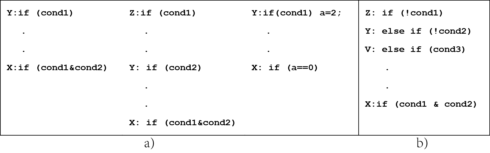
```

流水线中最早可以在取指阶段进行转移预测, 此时只有 PC[^其实还可以补充采用转移历史信息进行预测, 不过此处囿于篇幅暂不展开。] 信息可以用来进行预测, 且预测出的信息需要同时包括转移的方向和目标地址。 这里介绍此类预测器中一种最基本的结构———分支目标缓冲 (Branch Target Buffer, 简称 BTB) 。 BTB 逻辑上通常组织为一个基于内容寻址的查找表, 其结构如图 \@ref(fig:chapter9-BTB)所示。 每个表项包含 PC、 跳转目标 (Target) 和饱和计数器 (Counter) 三个部分。 BTB 的预测过程是: 用取指 PC 与表中各项的 PC 进行比较, 如果某项置相等且该项的饱和计数器值指示预测跳转, 则取出该项所存的跳转目标并跳转过去。

```{r chapter9-BTB, fig.cap='BTB结构示意图', fig.align='center', echo = FALSE, out.width='100%'}
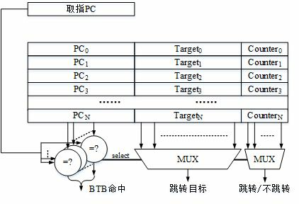
```

对于那些采用 PC 相对跳转的指令, 其在译码阶段就可以根据 PC 和指令码明确计算得到, 因此只需要对转移方向 ( 即是否跳转) 进行预测。 下面介绍此类预测器中一种最基本的结构, 即根据单条转移指令的转移历史来预测转移指令的跳转方向。 这种转移预测主要依据转移指令重复性的规律, 对于重复性特征明显的转移指令 ( 如循环) 可以取得很好的预测效果。 例如, 对于循环语句 for( i = 0; i<10; i ++ ) { ...} , 可以假设其对应的汇编代码中是由一条回跳的条件转移指令来控制循环的执行。 该转移指令前 9 次跳转, 第 10 次不跳转, 如果我们用 1 表示跳转, 0 表示不跳转, 那么这个转移指令的转移模式就记为 ( 1111111110) 。 这个转移模式的特点是, 如果上一次是跳转, 那么这一次也是跳转的概率比较大。 这个特点启发我们将该转移指令的执行历史记录下来用于猜测该转移指令是否跳转。 这种用于记录转移指令执行历史信息的表称为转移历史表 ( Branch History Table, 简称 BHT) 。 最简单的 BHT 利用 PC 的低位进行索引, 每项只有 1 位, 记录索引到该项的转移指令上一次执行时的跳转情况, 1 表示跳转, 0 表示不跳转。 由于存储的信息表征了转移的模式, 所以这种 BHT又被称为转移模式历史表(Pattern History Table, 简称 PHT) 。 利用这种 1 位 PHT 进行预测时, 首先根据转移指令的 PC 低位去索引 PHT, 如果表项值为 1, 则预测跳转, 否则预测不跳转; 其次要根据该转移指令实际的跳转情况来更新对应 PHT 的表项中的值。 仍以前面的 for 循环为例, 假设 PHT 的表项初始值都为 0, 那么转移指令第 1 次执行时, 读出的表项为 0 所以预测不跳转, 但这是一次错误的 预测, 第 1 次执行结束时会根据实际是跳转的结果将对应的表项值更新为 1; 转移指令第 2 次执行时, 从表项中读出 1 所以预测跳转, 这是一次正确的预测, 第 2 次执行结束时会根据实际是跳转的结果将对应的表项值更新为 1; ...; 转移指令第 10 次执行时, 从表项中读出 1 所以预测跳转, 这是一次错误的预测, 第 10 次执行结束时会根据实际是不跳转的结果将对应的表项值更新为 0。 可以看到进入和退出循环都要猜错一次。 这种 PHT 在应对不会多次执行的单层循环时, 或者循环次数特别多的循环时还比较有效。 但是对于如下的两重循环:

    for(i =0;i<10;i++)
      for(j =0;j<10;j++)
        {
          ...
        }

使用上述 1 位 PHT, 则内外循环每次执行都会猜错 2 次, 这样总的转移预测正确率仅有 80%。

为了提高上述情况下的转移预测正确率, 可以采用每项 2 位的 PHT。 这种 PHT 中每一项都是一个 2 位饱和计数器, 相应的转移指令每次执行跳转就加 1 ( 加到 3 为止) , 不跳转就减 1 ( 减到 0 为止) 。 预测时, 如果相应的 PHT 表项的高位为 1 ( 计数器的值为 2 或 3) 就预测跳转, 高位为 0 ( 计数器的值为 0 或 1) 就预测不跳转。 也就是说, 只有连续两次猜错, 才会改变预测的方向。 使用上述 2 位 PHT 后, 前面两重循环的例子中, 内层循环的预测正确率从 80%提高到 (7 + 81) / 100 = 88%。 图\@ref(fig:chapter9-PHT)给出了 2 位 PHT 转移预测机制的示意。 

```{r chapter9-PHT, fig.cap='2位PHT原理', fig.align='center', echo = FALSE, out.width='100%'}
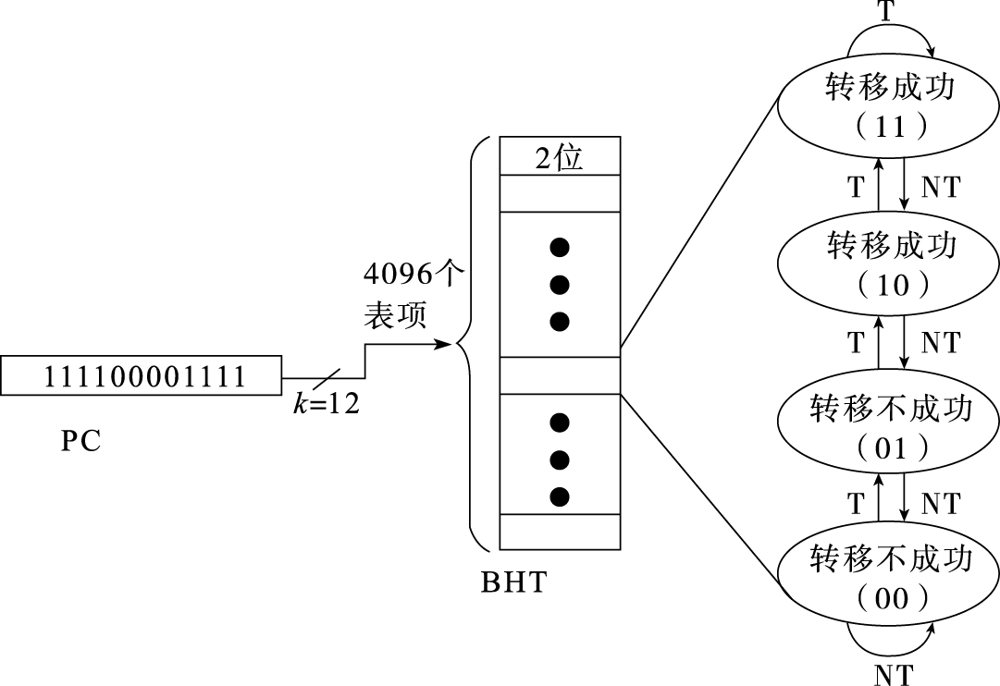
```

<!-- 图不太对？ BHT/PHT应该在前端 -->

还有很多技术可以提高分支预测的准确率。可以使用分支历史信息与PC进行哈希操作后再查预测表，让分支历史影响预测结果；可以使用多个预测器同时进行预测，并预测哪个预测器的结果更准确，这被称为锦标赛预测器。具体的实现方法，以及更高级的分支预测技术可以参见本套系列教材中的硕士课程教材。

### 高速缓存

由于物理实现上存在差异，自20世纪80年代以来CPU和内存的速度提升幅度一直存在差距，而且这种差距随着时间的推移越来越大。例如DDR3内存的访问延迟约为50ns，而高端处理器的时钟周期都在1ns以下，相当于每访问一次DDR3都需要花费至少50个处理器的时钟周期，如果程序有较多依赖访存结果的数据相关，就会严重影响处理器的性能。处理器和内存的速度差距造就了存储层次：离处理器流水线距离越近的地方，使用存储密度小的电路结构，牺牲存储容量来换取更快的访问速度；离处理器流水线距离越远的地方，使用存储密度大的电路结构，牺牲访问速度来换取存储容量。目前计算机中常见的存储层次包括寄存器、高速缓存（Cache）、内存、IO这四个层次。本节主要讨论Cache的相关概念。

Cache为了追求访问速度，容量通常较小，其中存放的内容只是主存储器内容的一个子集。Cache是微体系结构的概念，它没有程序上的意义，没有独立的编址空间，处理器访问Cache和访问存储器使用的是相同的地址，因而Cache对于编程功能正确性而言是透明的。Cache在流水线中的位置大致如图\@ref(fig:chapter9-cache)所示，这里为了避免共享Cache引入的结构相关采用了独立的指令Cache和数据Cache，前者仅供取指，后者仅供访存。


```{r chapter9-cache, fig.cap='Cache在流水线结构图中的示意', fig.align='center', echo = FALSE, out.width='100%'}
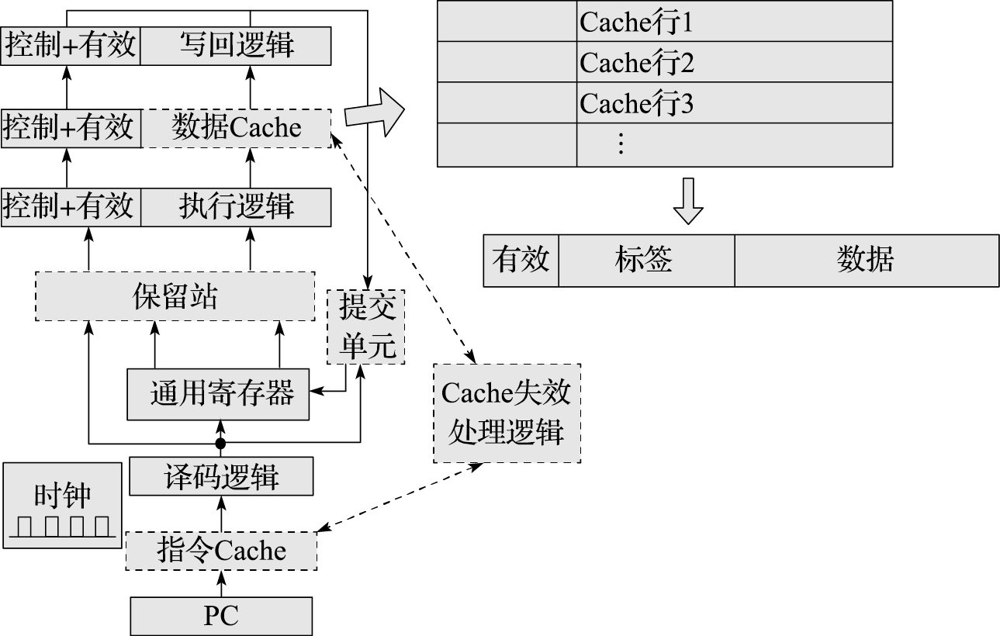
```

由于Cache没有独立的编址空间，且只能存放一部分内存的内容，所以一个Cache单元可能在不同时刻存储不同的内存单元的内容。这就需要一种机制来标明某个Cache单元当前存储的是哪个内存单元的内容。因此Cache的每一个单元不仅要存储数据，还要存储该数据对应的内存地址（称为Cache标签，Tag）以及在Cache中的状态（如是否有效，是否被改写等）。

处理器访问Cache时，除了用其中的某些位进行索引外，还要将访问地址与Cache中的Tag相比较。如果命中，则直接对Cache中的内容进行访问；如果不命中，则该指令阻塞在取指或者访存阶段，同时由Cache失效处理逻辑完成后续处理后才能继续执行，如果是读访问那么就需要从下一层存储中取回所需读取的数据，并放置在Cache中。


设计Cache结构主要考虑3方面问题：

1) Cache块索引的方式。Cache的容量远小于内存，会涉及多个内存单元映射到同一个Cache单元的情况，具体怎么映射需要考虑。通常分为3种索引方式：直接相连、全相连和组相连。
2) Cache与下一层存储的数据关系，即写策略，分为写穿透和写回两种。存数指令需要修改下一层存储的值，如果将修改后的值暂时放在Cache中，当Cache替换回下一层存储时再写回，则称为写回Cache；如果每条存数指令都要立即更新下一层存储的值，则称为写穿透Cache。
3) Cache的替换策略，分为随机替换、LRU替换和FIFO替换。当发生Cache失效而需要取回想要的Cache行，此时如果Cache满了，则需要进行替换。进行Cache替换时，如果有多个Cache行可供替换，可以选择随机进行替换，也可以替换掉最先进入Cache的Cache行（FIFO替换），或者替换掉最近最少使用的Cache行（LRU替换）。

直接相联、全相联和组相联中内存和Cache的映射关系原理如图\@ref(fig:chapter9-cacheMap)所示。将内存和Cache都分为大小一样的块，假设内存有32项，Cache有8项。在直接相联方式中，每个内存块只能放到Cache的一个位置上，假设要把内存的第12号块放到Cache中，因为Cache只有8项，所以只能放在第(12 mod 8=4)项上，其他地方都不能放；由此可知第4、12、20、28号内存块都对应到Cache的第4项上，如果冲突了就只能替换。这就是直接相联，硬件简单但效率低，如图\@ref(fig:chapter9-cacheMap)(a)所示。在全相联方式中，每个内存块都可以放到Cache的任一位置上，这样第4、12、20、28号内存块可以同时放入Cache中。这就是全相联，硬件复杂但效率高，如图\@ref(fig:chapter9-cacheMap)(b)所示。组相联是直接相联和全相联的折中。以两路组相联为例，Cache中第0、2、4、6号位置为一路（这里称为第0路），第1、3、5、7为另一路（这里称为第1路），每路4个Cache块。对于内存的第12号块，因为12除以4余数为0，所以既可以把第12号块放到Cache第0路的第0号位置（即Cache的第0号位置），也可以放到第1路的第0号位置（即Cache的第1号位置），如图\@ref(fig:chapter9-cacheMap)(c)所示。


```{r chapter9-cacheMap, fig.cap='直接相联、全相联、组相联映射', fig.align='center', echo = FALSE, out.width='100%'}
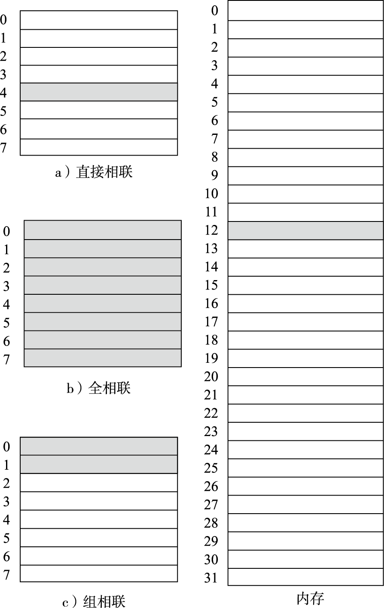
```

直接相联、全相联和组相联Cache的结构如图\@ref(fig:chapter9-cacheMapStruct)所示。从中可以看出，访问Cache时地址可分为3个部分：偏移(Offset)、索引(Index)和标签(Tag)。Offset是块内地址，在地址的低位。因为Cache块一般比较大，通常包含32字节或64字节，而指令或数据访问往往没有这么宽，需要通过Offset来指定访问对象在块内的具体位置。Index是用来索引Cache块的，将其作为地址来访问Cache。地址的高位是访问Cache的Tag，用于和Cache中保存的Tag进行比较，如果相等就给出命中信号Hit。在直接相联结构中，访问地址的Tag仅需要和Index索引的那个Cache块的Tag比较；在全相联结构中，Index位数为0，访问地址的Tag需要和每个Cache块的Tag比较，如果相等就给出命中信号Hit，同时将命中项的Cache块的Data通过Mux（多路选择器，Multiplexer）选出；在组相联结构中，访问地址的Tag需要和每一组中Index索引的那个Cache块的Tag比较，生成Hit信号并选出命中项的Data。注意Offset位数只和Cache块大小相关，但Tag和Index位数则和相联度相关。例如在32位处理器中，如果Cache大小为16KB，块大小为32字节，则Offset为5位，共有512个Cache块。采用直接相联结构Index为9位，Tag为18位；采用全相联结构Index为0位，Tag为27位；采用两路组相联结构Index为8位，Tag为19位。


```{r chapter9-cacheMapStruct, fig.cap='直接相联、全相联、组相联Cache结构', fig.align='center', echo = FALSE, out.width='100%'}
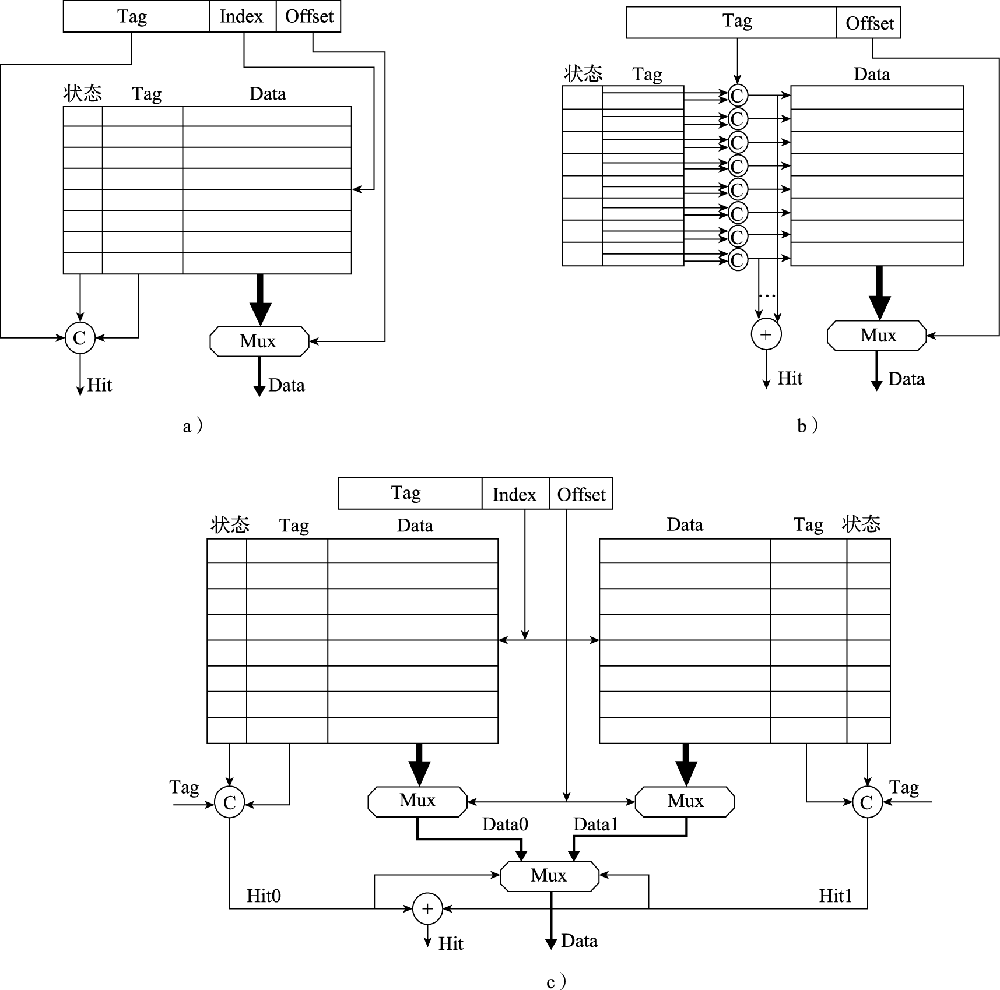
```

在基本Cache结构的基础之上，有着一系列围绕性能的优化技术，具体可以参见本套系列教材中的硕士课程教材。


## 本章小结

本章从处理器的数据通路开始，先引入流水线技术，并逐渐增加设计复杂度，最终搭建出了5级静态流水线处理器。本章还简要介绍了一些提高流水线效率的方法。

图\@ref(fig:chapter9-LS3A2000)是龙芯3A2000处理器的流水线示意图。

```{r chapter9-LS3A2000, fig.cap='龙芯3A2000流水线示意图', fig.align='center', echo = FALSE, out.width='100%'}
knitr::include_graphics('./images/chapter9/LS3A2000.png')
```

可以看出，现代处理器依然没有脱离教材中讲述的基础原理。图中左侧为PC级和译码级，并加入了分支预测、指令Cache和指令TLB；图的中间部分为重命名和提交单元，重命名后指令进入保留站，也称发射队列，并在就绪后发射并执行；图的右侧为访存执行单元，需要访问数据Cache和数据TLB，并有可能访问图下方的二级Cache。提交单元要负责将指令提交，提交后指令就可以退出流水线了。

## 习题

1.	请给出下列程序在多周期处理器（如图\@ref(fig:chapter9-multicycle)所示）上执行所需要的时钟周期数，并给出前三次循环执行的时空图。
2.	请给出题1中的程序在单发射5级静态流水线处理器（如图\@ref(fig:chapter9-pipelinestruct)所示）上执行所需要的时钟周期数，并给出前三次循环执行的流水线时空图。
3.	请给出题1中的程序在包含前递机制的单发射5级静态流水线处理器（如图\@ref(fig:chapter9-instHazardPipeline)所示）上执行所需要的时钟周期数，并给出前三次循环执行的流水线时空图。
4.  请在图\@ref(fig:chapter9-instHazardPipeline)的基础上添加必要的逻辑，使其能够实现精确异常的功能。画出修改后的处理器结构图，并进行解释。
5.	请给出题1中的程序在包含前递机制的双发射5级静态流水线处理器（如图\@ref(fig:chapter9-ctrlHazardStruct)所示）上执行所需要的时钟周期数，并给出前三次循环执行的流水线时空图。
6.	请问数据相关分为哪几种？静态流水线处理器是如何解决这几种相关的？采用寄存器重命名的动态流水线处理器是如何解决这几种相关的？
7.	假设在包含前递机制的单发射5级静态流水线处理器（如图\@ref(fig:chapter9-instHazardPipeline)所示的译码级添加了一个永远预测跳转的静态分支预测器，那么题1中的程序在这个处理器上执行需要花费多少时钟周期？
8.	对于程序段

    ```
    for(i=0; i<10; i++)
      for(j=0; j<10; j++)
        for(k=0; k<10; k++)
          {…}
    ```

计算分别使用一位BHT表和使用两位BHT表进行转移猜测时三重循环的转移猜测准确率，假设BHT表的初始值均为0。
9.	在一个32位处理器中实现一个Cache块大小为64字节、总容量为32KB的数据Cache，该数据Cache仅使用32位物理地址访问。请问，当分别采用直接映射、两路组相联和四路组相联的组织结构时，Cache访问地址中Tag、Index和Offset三部分各自如何划分？
10.	假设程序动态执行过程中load、store指令占40%。现在有两种数据Cache的设计方案，其中第一种方案的Cache容量小于第二种方案，因此采用第一种方案的Cache命中率为85%，第二种方案的Cache命中率为95%，但是采用第二种方案时处理器的主频会比第一种低10%。请问哪种设计方案性能更优？（假设Cache不命中情况下会阻塞流水线100个时钟周期。）

\newpage
