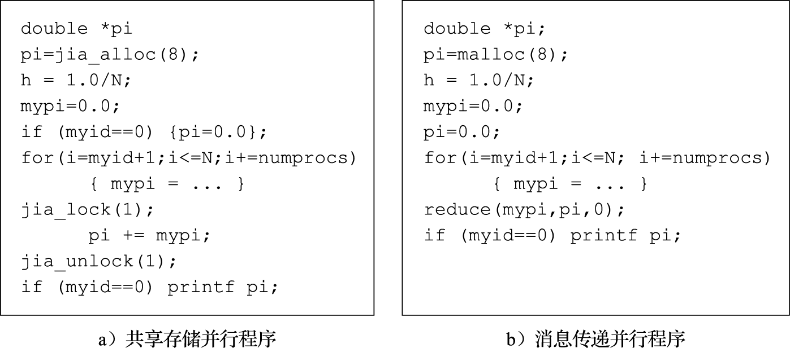
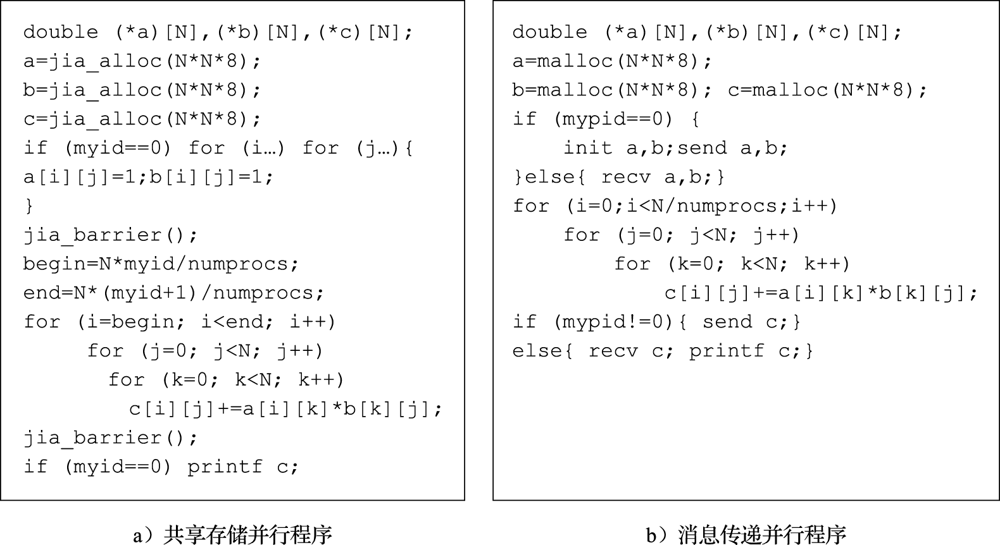
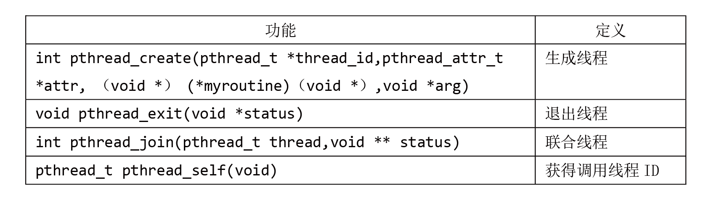
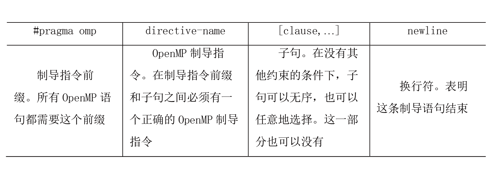

# (PART) 并行处理结构 {-}

本部分介绍并行处理结构。要深入了解并行处理结构，必须要从系统设计（即软硬件协同设计）的角度入手。本部分重点介绍并行程序的编程基础，以及广泛应用的并行处理结构——多核处理器。

# 并行编程基础

## 程序的并行行为

人们对应用程序性能的追求是无止境的，例如天气预报、药物设计、核武器模拟等应用。并行处理系统可以协同多个处理单元来解决同一个问题，从而大幅度提升性能。评价一个并行处理系统，主要看其执行程序的性能（即程序在其上的执行时间）。可以通过一些公认的并行测试程序集（如SPLASH、NAS）来进行评测。因此，在讨论并行处理结构之前，先来看一下程序的并行行为。程序的并行行为主要包括指令级并行性、数据级并行、任务级并行性。

### 指令级并行性

指令级并行性（Instruction Level Parallelism，简称ILP）主要指指令之间的并行性，当指令之间不存在相关时，这些指令可以在处理器流水线上重叠起来并行执行。在程序运行中，如果必须等前一条指令执行完成后，才能执行后一条指令，那么这两条指令是相关的。指令相关主要包括数据相关、控制相关和结构相关。数据相关包括写后读（Read After Write，简称RAW）相关、读后写（Write AfterRead，简称WAR）相关和写后写（WriteAfter Write，简称WAW）相关。其中RAW相关是真正的数据相关，因为存在真正的数据传递关系；WAR相关和WAW相关又称为假相关或者名字相关，指令之间实际不存在数据传递。控制相关主要是由于存在分支指令，一条指令的执行取决于该分支指令的执行结果，则这两条指令之间存在控制相关。结构相关是指两条指令同时需要流水线中的同一个功能部件。在这些相关中，RAW数据相关和控制相关是真正制约指令级并行执行的相关。指令相关容易造成处理器流水线上的冲突，引起流水线阻塞，从而降低流水线效率。

现代处理器采用多种微结构设计技术挖掘指令级并行性，包括指令流水线、多发射、动态调度、寄存器重命名、转移猜测等技术。指令流水线重叠执行多条不相关的指令；多发射技术允许一个时钟周期执行多条指令，类似于“多车道”；动态调度允许后续指令越过前面被阻塞的指令继续被调度执行，相当于允许“超车”；寄存器重命名主要解决RAW和WAW的假相关问题；转移猜测技术可以猜测分支指令的方向和目标，在分支指令还未执行完之前获取更多可执行指令，以减少控制相关造成的指令流水线阻塞。这方面的技术已经比较成熟。


### 数据级并行性

数据级并行性（Data Level Parallelism，简称DLP）是指对集合或者数组中的元素同时执行相同的操作。这种并行性通常来源于程序中的循环语句。下列代码块所示的代码就是一个数据并行的例子。对于数组local中的元素local[i],执行相同的操作(i+0.5)*w。可以采用将不同的数据分布到不同的处理单元的方式来实现数据级并行。

```c
for(i = 0;i<N;i++){
	local[i] = (i+0.5)*w;
}
```

数据级并行性是比较易于处理的，可以在计算机体系结构的多个层次来利用数据级并行性。例如：可以在处理器中设计向量功能部件，采用SIMD设计方法，如一个256位向量部件一次可以执行4个64位的操作；设计专门的向量处理器，如CRAY公司的CRAY-1、CRAY-2、X-MP、Y-MP等；在多处理器中，可以采用SPMD（Single Program Multi-Data）的编程方式，将数据分布到不同的处理器上执行同一个程序控制流。数据级并行性常见于科学和工程计算领域中，例如大规模线性方程组的求解等。正是由于这个原因，向量处理器在科学计算领域还是比较成功的。

### 任务级并行性

任务级并行性（Task Level Parallelism）是将不同的任务（进程或者线程）分布到不同的处理单元上执行。针对任务表现为进程或者线程，任务级并行性可分为进程级并行性或者线程级并行性。下代码块是一个任务并行的代码示例。对于一个双处理器系统，当处理器ID（processor_ID）为a时，则执行任务A；当处理器ID为b时则执行任务B。

```c
if(processor_ID=”a”) {
	task A;
}else if (processor_ID=”b”){
	Task B;
}
```

在并行处理系统中，挖掘任务并行性就是让每个处理器执行不同的线程或进程来处理相同或者不同的数据。这些线程或者进程可以执行相同或者不同的代码。通常情况下，不同线程或者进程之间还需要相互通信来协作完成整个程序的执行。任务级并行性常见于商业应用领域，如大规模数据库的事务处理等。另外，多道程序工作负载（Multiprogramming Workload），即在计算机系统上运行多道独立的程序，也是任务级并行的重要来源。

## 并行编程模型

并行处理系统上如何编程是个难题，目前并没有很好地解决。并行编程模型的目标是方便编程人员开发出能在并行处理系统上高效运行的并行程序。并行编程模型（Parallel Programming Model）是一种程序抽象的集合，它给程序员提供了一幅计算机硬件/软件系统的抽象简图，程序员利用这些模型就可以为多核处理器、多处理器、机群等并行计算系统设计并行程序[26]。


### 单任务数据并行模型

数据并行（Data Parallel）模型是指对集合或者数组中的元素同时（即并行）执行相同操作。数据并行编程模型可以在SIMD计算机上实现，为单任务数据并行；也可以在SPMD计算机上实现，为多任务数据并行。SIMD着重开发指令级细粒度的并行性，SPMD着重开发子程序级中粒度的并行性。单任务数据并行编程模型具有以下特点：

1)单线程（Single Threading）。从程序员的角度，一个数据并行程序只由一个线程执行，具有单一控制线；就控制流而言，一个数据并行程序就像一个顺序程序一样。

2）同构并行。数据并行程序的一条语句，同时作用在不同数组元素或者其他聚合数据结构，在数据并行程序的每条语句之后，均有一个隐式同步。

3）全局命名空间（Global Naming Space）。数据并行程序中的所有变量均在单一地址空间内，所有语句可访问任何变量而只要满足通常的变量作用域规则即可。

4）隐式相互作用（Implicit Interaction）。因为数据并行程序的每条语句结束时存在一个隐含的栅障（Barrier），所以不需要显式同步；通信可以由变量指派而隐含地完成。

5）隐式数据分配（Implicit Data Allocation）。程序员没必要明确指定如何分配数据，可将改进数据局部性和减少通信的数据分配方法提示给编译器。

### 多任务共享存储编程模型

在共享存储编程模型中，运行在各处理器上的进程（或者线程）可以通过读/写共享存储器中的共享变量来相互通信。它与单任务数据并行模型的相似之处在于有一个单一的全局名字空间。由于数据是在一个单一的共享地址空间中，因此不需要显式地分配数据，而工作负载则可以显式地分配也可以隐式地分配。通信通过共享的读/写变量隐式地完成，而同步必须显式地完成，以保持进程执行的正确顺序。共享存储编程模型如Pthreads和OpenMP等。

### 多任务消息传递编程模型

在消息传递编程模型中，在不同处理器节点上运行的进程，可以通过网络传递消息而相互通信。在消息传递并行程序中，用户必须明确为进程分配数据和负载，它比较适合开发大粒度的并行性，这些程序是多进程的和异步的，要求显式同步（如栅障等）以确保正确的执行顺序。然而这些进程均有独立的地址空间。

消息传递编程模型具有以下特点：

1）多进程。消息传递并行程序由多个进程组成，每个进程都有自己的控制流且可执行不同代码；多程序多数据（Multiple ProgramMultiple Data，简称MPMD）并行和单程序多数据（SPMD）并行均可支持。

2）异步并行性（Asynchronous Parallelism）。消息传递并行程序的各进程彼此异步执行，使用诸如栅障和阻塞通信等方式来同步各个进程。

3）独立的地址空间（Separate Address Space）。消息传递并行程序的进程具有各自独立的地址空间，一个进程的数据变量对其他进程是不可见的，进程的相互作用通过执行特殊的消息传递操作来实现。

4）显式相互作用（Explicit Interaction）。程序员必须解决包括数据映射、通信、同步和聚合等相互作用问题；计算任务分配通过拥有者-计算（Owner-Compute）规则来完成，即进程只能在其拥有的数据上进行计算。

5）显式分配（Explicit Allocation）。计算任务和数据均由用户显式地分配给进程，为了减少设计和编程的复杂性，用户通常采用单一代码方法来编写SPMD程序。典型的消息传递编程模型包括MPI和PVM。

### 共享存储与消息传递编程模型的编程复杂度

采用共享存储与消息传递编程模型编写的并行程序是在多处理器并行处理系统上运行的。先了解一下多处理器的结构特点，可以更好地理解并行编程模型。从结构的角度看，多处理器系统可分为共享存储系统和消息传递系统两类。在共享存储系统中，所有处理器共享主存储器，每个处理器都可以把信息存入主存储器，或从中取出信息，处理器之间的通信通过访问共享存储器来实现。而在消息传递系统中，每个处理器都有一个只有它自己才能访问的局部存储器，处理器之间的通信必须通过显式的消息传递来进行。消息传递和共享存储系统的原理结构如图\@ref(fig:programming)所示。从图中可以看出，在消息传递系统中，每个处理器的存储器是单独编址的；而在共享存储系统中，所有存储器统一编址。典型的共享存储多处理器结构包括对称多处理器机（Symmetric Multi-Processor，简称SMP）结构、高速缓存一致非均匀存储器访问（Cache Coherent Non Uniform Memory Access，简称CC-NUMA）结构。

```{r programming, echo=FALSE, fig.align='center', fig.cap="消息传递（左）和共享存储系统（右）", out.width='100%'}
knitr::include_graphics("images/chapter10/Shared_storage_and_message_passing_programming.png")
```

在消息传递编程模型中，程序员需要对计算任务和数据进行划分，并安排并行程序执行过程中进程间的所有通信。在共享存储编程模型中，由于程序的多进程（或者线程）之间存在一个统一编址的共享存储空间，程序员只需进行计算任务划分，不必进行数据划分，也不用确切地知道并行程序执行过程中进程间的通信。MPP（Massive Parallel Processing）系统和机群系统往往是消息传递系统。消息传递系统的可伸缩性通常比共享存储系统要好，可支持更多处理器。

从进程（或者线程）间通信的角度看，消息传递并行10.6程序比共享存储并行程序复杂一些，体现在时间管理和空间管理两方面。在空间管理方面，发送数据的进程需要关心自己产生的数据被谁用到，而接收数据的进程需要关心它用到了谁产生的数据；在时间管理方面，发送数据的进程通常需要在数据被接收后才能继续，而接收数据的进程通常需要等到接收数据后才能继续。在共享存储并行程序中，各进程间的通信通过访问共享存储器完成，程序员只需考虑进程间同步，不用考虑进程间通信。尤其是比较复杂的数据结构的通信，如struct{int*pa；int* pb；int*pc;}，消息传递并行程序比共享存储并行程序复杂得多。此外，对于一些在编程时难以确切知道进程间通信的程序，用消息传递的方法很难进行并行化，如{for (i,j){ x=…; y=…; a[i]\[j]=b[x]\[y];}}。这段代码中，通信特征在程序运行时才能确定，编写代码时难以确定，改写成消息传递程序就比较困难。

从数据划分的角度看，消息传递并行程序必须考虑诸如数组名称以及下标变换等因素，在将一个串行程序改写成并行程序的过程中，需要修改大量的程序代码。而在共享存储编程模型中进行串行程序的并行化改写时，不用进行数组名称以及下标变换，对代码的修改量少。虽说共享存储程序无须考虑数据划分，但是在实际应用中，为了获得更高的系统性能，有时也需要考虑数据分布，使得数据尽量分布在对其进行计算的处理器上，例如OpenMP中就有进行数据分布的扩展指导。不过，相对于消息传递程序中的数据划分考虑数据分布还是要简单得多。

总的来说，共享存储编程像BBS应用，一个人向BBS上发帖子，其他人都看得见；消息传递编程则像电子邮件(E-mail)，你得想好给谁发邮件，发什么内容。

下面举两个共享存储和消息传递程序的例子。第一个例子是通过积分求圆周率。积分求圆周率的公式如下：
$$
\pi = 4\int_{0}^{1}{\frac{1}{1+x^2}}dx = \sum^{N}_{i=1}{\frac{4}{1+(\frac{i-0.5}{N})^2}\times{\frac{1}{N}}}
$$

在上式中，N值越大，误差越小。如果N值很大，计算时间就很长。可以通过并行处理，让每个进程计算其中的一部分，最后把每个进程计算的值加在一起来减少运算时间。图\@ref(fig:get-pi)给出了计算圆周率的共享存储（基于中科院计算所开发的JIAJIA虚拟共享存储系统）和消息传递并行程序核心片段的算法示意。该并行程序采用SPMD（Single Program Multiple Data）的模式，即每个进程都运行同一个程序，但处理不同的数据。在该程序中，numprocs是参与运算的进程个数，所有参与运算的进程都有相同的numprocs值；myid是参与运算的进程的编号，每个进程都有自己的编号（一般并行编程系统都会提供接口函数让进程知道自己的编号）。例如，如果有4个进程参与运算，则每个进程的numprocs都是4，而每个进程的myid号分别为0、1、2、3。在共享存储并行程序中，由jia_alloc()分配空间的变量pi是所有参与运算的进程共享的，所有进程只有一份，其他变量都是每个进程局部的，每个进程都有一份，每个进程根据numprocs和myid号分别计算部分的圆周率值，最后通过一个临界区的机制把所有进程的计算结果加在一起。jia_lock()和jia_unlock()是一种临界区的锁机制，保证每次只有一个进程进入这个临界区，这样才能把所有进程的结果依次加在一起，不会互相冲掉。在消息传递并行程序中，由malloc()分配空间的变量每个进程都有独立的一份，互相看不见。每个进程算完部分结果后，通过归约操作reduce()把所有进程的mypi加到0号进程的pi中。

```{r get-pi, echo=FALSE, fig.align='center', fig.cap="积分求圆周率算法示意", out.width='100%'}

```

第二个例子是矩阵乘法。矩阵乘法的算法大家都很熟悉，这里就不介绍了。图\@ref(fig:get-martix-multi)给出了共享存储和消息传递并行程序。同样，由jia_alloc()分配的变量所有进程共享一份，而由malloc()分配的变量每个进程单独一份，因此在这个程序中消息传递并行程序需要更多的内存。在共享存储并行程序中，先由0号进程对A、B、C三个矩阵进行初始化，而其他进程通过jia_barrier()语句等待。barrier是并行程序中常用的同步方式，它要求所有进程都等齐后再前进。然后每个进程分别完成部分运算，再通过jia_barrier()等齐后由0号进程统一打印结果。消息传递并行程序与共享存储并行程序的最大区别是需要通过显式的发送语句send和接收语句recv进行多个进程之间的通信。先由0号进程进行初始化后发送给其他进程，每个进程分别算完后再发送给0号进程进行打印。在消息传递并行程序中要详细列出每次发送的数据大小和起始地址等信息，0号进程接收的时候还要把从其他进程收到的数据拼接在一个矩阵中，比共享存储并行程序麻烦不少。

```{r get-martix-multi, echo=FALSE, fig.align='center', fig.cap="矩阵乘法算法示意", out.width='100%'}

```

## 典型并行编程环境

本节主要介绍数据并行SIMD编程、早期的共享存储编程标准Pthreads、目前主流的共享存储编程标准OpenMP和消息传递编程模型（MPI）等。

### 数据并行SIMD编程

工业界广泛应用的单指令流多数据流(Single Instruction Multiple Data，简称SIMD)并行就是典型的数据并行技术。相比于传统的标量处理器上的单指令流单数据流(Single Instruction Single Data，简称SISD)指令，一条SIMD指令可以同时对一组数据进行相同的计算。比如将两个数组SRC0[8]和SRC1[8]中的每个对应元素求和，将结果放入数组RESULT中，对于传统的标量处理器平台，C语言实现如下：

```c
for (i = 0; i < 8; i++)
		RESULT[i] = SRC0[i] + SRC1[i];
```

也就是通过循环遍历需要求和的8组对应数据，对SRC0和SRC1的各对应项求和，将结果存入RESULT数组的对应项中。在龙芯处理器平台上，用机器指令(汇编代码)实现该运算的代码如下(这里假设$src0、 $src1、 $result分别为存储了SRC0、 SRC1和RESULT数组起始地址的通用寄存器)：

```assembly
li	$4, 0x0
li	$5, 0x8
1:	daddu	$src0, $4
	daddu	$src1, $4
	daddu$result, $4
lb	$6, 0x0($src0)
	lb	$7, 0x0($src1)
	daddu	$6, $6, $7
	sb	$6, 0x0($result)
	daddiu	$4, 0x1
	blt	$4, $5, 1b
	nop
```

如果采用龙芯处理器的SIMD指令编写程序的话，上述两个数组的求和只需要将上述两个源操作数数组SRC0[8]和SRC1[8]一次性加载到龙芯处理器的向量寄存器(龙芯向量寄存器复用了浮点寄存器)中，然后只需要一条paddb指令就可以完成上述8个对应数组项的求和，最后只需要一条store指令就可以将结果存回RESULT[8]数组所在的内存空间中。该实现的机器指令序列如下：

```assembly
	gsldxc1	$f0, 0x0($src0, $0)
	gsldxc1	$f2, 0x0($src1, $0)
	paddb	$f0, $f0, $f2
	gssdxc1	$f0, 0x0($result, $0)
```

​	图\@ref(fig:SISD-SIMD)简要示意了采用传统SISD指令和SIMD指令实现上述8个对应数组项求和的执行控制流程。

```{r SISD-SIMD, echo=FALSE, fig.align='center', fig.cap="SISD和SIMD执行控制流示意图", out.width='100%'}
knitr::include_graphics("images/chapter10/SISD_SIMD.png")
```


### POSIX编程标准

POSIX（Portable Operating System Interface）属于早期的共享存储编程模型。POSIXThreads（）即Pthreads）代表官方IEEE POSIX1003.1C_1995线程标准，是由IEEE标准委员会所建立的，主要包含线程管理、线程调度、同步等原语定义，体现为C语言的一套函数库。下面只简介其公共性质。

1．线程管理

线程库用于管理线程，Pthreads中基本线程管理原语如下表所示。其中pthread_create()在进程内生成新线程，新线程执行带有变元arg的myroutine,如果pthread_create()生成，则返回0并将新线程之ID置入thread_id，否则返回指明错误类型的错误代码；pthread_exit()结束调用线程并执行清场处理；pthread_self()返回调用线程的ID；pthread_join()等待其他线程结束。

```{r thread, echo=FALSE, fig.align='center', fig.cap="线程管理", out.width='100%'}

```

2．线程调度

pthread_yield()的功能是使调用者将处理器让位于其他线程；pthread_cancel()的功能是中止指定的线程。

3．线程同步

Pthreads中的同步原语见下表。重点讨论互斥变量mutex（Mutual Exclusion）和条件变量cond（Conditional）。前者类似于信号灯结构；后者类似于事件结构。注意，使用同步变量之前需被初始化（生成），用后应销毁。

如果mutex未被上锁，pthread_mutex_lock()将锁住mutex；如果mutex已被上锁，调用线程一直被阻塞到mutex变成有效。pthead_mutex_trylock()的功能是尝试对mutex上锁。pthread_mutex_lock()和pthead_mutex_trylock()的区别是：前者会阻塞等待另外一锁被解锁；后者尝试去加锁，如果不成功就返回非0，如果成功返回0，不会产生阻塞。pthead_mutex_unlock()解锁先前上锁的mutex,当mutex被解锁，它就能由别的线程获取。

pthread_cond_wait()自动阻塞等待条件满足的现行线程，并开锁mutex。pthread_cond_timedwait()与pthread_cond_wait()类似，除了当等待时间达到时限它将解除阻塞外。pthread_cond_signal()解除一个等待条件满足的已被阻塞的线程的阻塞。pthread_cond_broadcast()将所有等待条件满足的已被阻塞的线程解除阻塞。

| 功能                      | 含义                           |
| ------------------------- | ------------------------------ |
| pthread_mutex_init(…)     | 生成新的互斥变量               |
| pthread_mutex_destroy(…)  | 销毁互斥变量                   |
| pthread_mutex_lock(…)     | 锁住互斥变量                   |
| pthread_mutex_trylock(…)  | 尝试锁住互斥变量               |
| pthread_mutex_unlock(…)   | 解锁互斥变量                   |
| pthread_cond_init(…)      | 生成新的条件变量               |
| pthread_cond_destroy(…)   | 销毁条件变量                   |
| pthread_cond_wait(…)      | 等待（阻塞）条件变量           |
| pthread_cond_timedwait(…) | 等待条件变量直至到达时限       |
| pthread_cond_signal(…)    | 投递一个事件，解锁一个等待进程 |
| pthread_cond_broadcast(…) | 投递一个事件，解锁所有等待进程 |

4.示例

以下程序示例用数值积分法求π的近似值。

我们使用梯形规则来求解这个积分。其基本思想是用一系列矩形填充一条曲线下的区域，就是要求出在区间[0,1]内函数曲线4/（1+x2）下的面积，此面积就是π的近似值。为此先将区间[0,1]划分成N个等间隔的子区间，每个子区间的宽度为1.0/N；然后计算出各子区间中点处的函数值；再将各子区间面积相加就可得出π的近似值。N的值越大，π值的误差越小。下代码块为进行π值计算的C语言描述的串行代码。为简化起见，将积分中的迭代次数固定为1 000 000。

利用梯形规则计算π的C语言串行代码

```c
#include <stdio.h>
#include <math.h>
int main(){
    int i；
    int num_steps=1000000;
    double x,pi,step,sum=0.0;
    step = 1.0/(double) num_steps;
    for(i=0;i<num_steps;i++){  
        x=(i+0.5)*step;
    	sum = sum+4.0/(1.0+x*x);
    }
    pi = step*sum;
    printf(“pi %1f\n”, pi);
    return 0;
}
```

为采用Pthreads的并行化代码。

```c
#include <stdlib.h>
#include <stdio.h>
#include <pthread.h>
#define NUM_THREADS 4 //假设线程数目为4
int num_steps = 1000000;
double step = 0.0, sum = 0.0;
pthread_mutex_t mutex;
void *countPI(void *id) {
    int index = (int ) id;
    int start = index*(num_steps/NUM_THREADS);
    int end;
    double x = 0.0, y = 0.0;
    if (index == NUM_THREADS-1)
        end = num_steps;
    else
    	end = start+(num_steps/NUM_THREADS);

	for (int i=start; i<end; i++){
        x=(i+0.5)*step;
		y +=4.0/(1.0+x*x);
    }
    pthread_mutex_lock(&mutex);
	sum += y;
    pthread_mutex_unlock(&mutex);
}

int main() {
    int i;
    double pi;
    step = 1.0 / num_steps;
    sum = 0.0;
    pthread_t tids[NUM_THREADS];

    pthread_mutex_init(&mutex, NULL);
	for(i=0; i<NUM_THREADS; i++) {
        pthread_create(&tids[i], NULL, countPI, (void *) i);
    }
	for(i=0; i<NUM_THREADS; i++)
        pthread_join(tids[i], NULL);

    pthread_mutex_destroy(&mutex);
    pi = step*sum;
    printf("pi %1f\n", pi);
    return 0;
}
```

下面举一个矩阵乘的Pthreads并行代码例子。该例子将两个n阶的方阵A和B相乘，结果存放在方阵C中。

```c
#include <stdlib.h>
#include <stdio.h>
#include <pthread.h>
#define NUM_THREADS 4 //假设线程数目为4
#define n 1000
double *A,*B,*C;
void *matrixMult(void *id) {//计算矩阵乘
    intmy_id = (int ) id;
    inti,j,k,start,end;
    //计算进程负责的部分
    start = my_id*(n/NUM_THREADS);
    if(my_id == NUMTHREADS-1)
    end = n;
    else
    end = start+(n/NUM_THREADS);
    for(i=start;i<end;i++)
    for(j=0;j<n;j++) {
		C[i*n+j] = 0;
		for(k=0;k<n;k++)
			C[i*n+j]+=A[i*n+k]*B[k*n+j];
    	}
	}

int main() {
    inti,j;
    pthread_t tids[NUM_THREADS];
    //分配数据空间
    A = (double *)malloc(sizeof(double)*n*n);
    B = (double *)malloc(sizeof(double)*n*n);
    C = (double *)malloc(sizeof(double)*n*n);
    //初始化数组
    for(i=0;i<n;i++)
    for(j=0;j<n;j++){ 
    	A[i*n+j] = 1.0;
        B[i*n+j] = 1.0；
    }

    for(i=0; i<NUM_THREADS; i++)
    	pthread_create(&tids[i], NULL, matrixMult, (void *) i);
    for(i=0; i<NUM_THREADS; i++)
    	pthread_join(tids[i], NULL);
    return 0;
}
```


### OpenMP标准

OpenMP是由OpenMP Architecture Review Board（ARB，结构审议委员会）牵头提出的，是一种用于共享存储并行系统的编程标准。最初的OpenMP标准形成于1997年，2002年发布了OpenMP 2.0标准，2008年发布了OpenMP3.0标准，2013年发布了OpenMP 4.0标准。实际上，OpenMP不是一种新语言，是对基本编程语言进行编译制导（Compiler Directive）扩展，支持C/C++和Fortran。由于OpenMP制导嵌入到C/C++、Fortran语言中，所以就具体语言不同会有所区别，本书介绍主要参考支持C/C++的OpenMP 4.0标准。

OpenMP标准中定义了制导指令、运行库和环境变量，使得用户可以按照标准逐步将已有串行程序并行化。制导语句是对程序设计语言的扩展，提供了对并行区域、工作共享、同步构造的支持；运行库和环境变量使用户可以调整并行程序的执行环境。程序员通过在程序源代码中加入专用pragma制导语句（以“#pragmaomp”字符串开头）来指明自己的意图，支持OpenMP标准的编译器可以自动将程序进行并行化，并在必要之处加入同步互斥以及通信。当选择忽略这些pragma，或者编译器不支持OpenMP时，程序又可退化为普通程序(一般为串行)，代码仍然可以正常运行，只是不能利用多线程来加速程序执行。

由于OpenMP标准具有简单、移植性好和可扩展等优点，目前已被广泛接受，主流处理器平台均支持OpenMP编译器，如Intel、AMD、IBM、龙芯等。开源编译器GCC也支持OpenMP标准。


1.OpenMP的并行执行模型

OpenMP是一个基于线程的并行编程模型，一个OpenMP进程由多个线程组成，使用fork-join并行执行模型。OpenMP程序开始于一个单独的主线程（Master Thread），主线程串行执行，遇到一个并行域（Parallel Region）开始并行执行。接下来的过程如下：

1）fork（分叉）。主线程派生出一队并行的线程，并行域的代码在主线程和派生出的线程间并行执行。

2）join（合并）。当派生线程在并行域中执行完后，它们或被阻塞或被中断，所计算的结果会被主线程收集，最后只有主线程在执行。

实际上，OpenMP的并行化都是使用嵌入到C/C++或者Fortran语言的制导语句来实现的。以下代码为OpenMP程序的并行结构。

```c
#include <omp.h>
main(){
   int var1,var2,var3;
   …
   #pragma omp parallel private(var1,var2)  shared(var3)
   {
      …
   } 
   …
}
```

2.编译制导语句

下面介绍编译制导语句的格式。参看前面的OpenMP程序并行结构的例子，在并行开始部分需要语句“#pragma omp parallel private(var1,var2) shared(var3)”。下表是编译制导语句的格式及解释。
```{r Compiler-guidance-language, echo=FALSE, fig.align='center', fig.cap="编译制导语言", out.width='100%'}

```


3.并行域结构

一个并行域就是一个能被多个线程执行的程序块，它是最基本的OpenMP并行结构。并行域的具体格式为：

```C++
#pragma omp parallel [if(scalar_expression)| num_threads(integer-
expression）|default(shared|none)|private(list)|firstprivate(list)|shared
(list)| copyin(list)|reduction(operator:list)| 
proc_bind(master|close|spread)] 
newline
```


当一个线程执行到parallel这个指令时，线程就会生成一列线程，线程号依次从0到n-1，而它自己会成为主线程（线程号为0）。当并行域开始时，程序代码就会被复制，每个线程都会执行该代码。这就意味着，到了并行域结束就会有一个栅障,且只有主线程能够通过这个栅障。

4.共享任务结构

共享任务结构将其内封闭的代码段划分给线程队列中的各线程执行。它不产生新的线程，在进入共享任务结构时不存在栅障，但是在共享任务结构结束时存在一个隐含的栅障。图\@ref(fig:shared-task)显示了3种典型的共享任务结构。其中：do/for将循环分布到线程列中执行，可看作是一种表达数据并行s的类型； sections把任务分割成多个各个部分（section），每个线程执行一个section，可很好地表达任务并行；single由线程队列中的一个线程串行执行。

```{r shared-task, echo=FALSE, fig.align='center', fig.cap='共享任务类型', out.width='100%'}
knitr::include_graphics("images/chapter10/shared_task.png")
```

下面具体来看一下。

1）for编译制导语句。for语句（即C/C++中的for语句），表明若并行域已经初始化了，后面的循环就在线程队列中并行执行，否则就会顺序执行。语句格式如下：

```c
#pragma omp for [private(list)|firstprivate(list)|lastprivate(list)|
reduction(reduction-identifier:list)|schedule(kind[,chunk_size])|colla
pse(n)|ordered| nowait] 
newline
```


其中，schedule子句描述如何在线程队列中划分循环。kind为static时，将循环划分为chunk_size大小的循环块，静态分配给线程执行，若chunk_size没有声明，则尽量将循环在线程队列中平分；kind为dynamic时，线程会动态请求循环块来执行，执行完一个循环块后就申请下一个循环块，直到所有循环都执行完，循环块的大小为chunk_size，若chunk_size没有声明，则默认的块长度为1；kind为guide时，线程会动态请求循环块来执行，循环块的大小为未调度的循环数除以线程数，但循环块大小不能小于chunk_size（除了最后一块），若chunk_size没有声明，则默认为1。

2）sections编译制导语句。该语句是非循环的共享任务结构，它表明内部的代码是被线程队列分割的。语句格式如下：

```c
#pragma omp sections [private(list)|firstprivate(list)|lastprivate(list)|
reduction(reduction-identifier:list)|nowait] 
newline
{
    [#pragma omp section newline]
       Structured_block
    [#pragma omp section newline
       Structured_block]
}
```

值得注意的是，在没有nowait子句时，sections后面有栅障。

3）single编译制导语句。该语句表明内部的代码只由一个线程执行。语句格式如下：

```c
#pragma omp single [private(list)|firstprivate(list)| 
copyprivate(list)|nowait] newline
Structured_block
```

若没有nowait子句，线程列中没有执行single语句的线程，会一直等到代码栅障同步才会继续往下执行。

5.组合的并行共享任务结构

下面介绍两种将并行域制导和共享任务制导组合在一起的编译制导语句。

1）parallel for编译制导语句。该语句表明一个并行域包含一个单独的for语句。语句格式如下：

```c
#pragma omp parallel for [if(scalar_expression)|num_threads(integer-
expression|default(shared|none)|private(list)|firstprivate(list)|lastpriv
ate(list)|shared(list)|copyin(list)|reduction(Structured_block:list)|proc
_bind(master|close|spread)|schedule(kind[,chunk_size])|collapse(n)|ordere
d]
newline
For_loop
```

该语句的子句可以是parallel和for语句的任意子句组合，除了nowait子句。

2）parallel sections编译制导语句。该语句表明一个并行域包含单独的一个sections语句。语句格式如下：

```c
#pragma omp parallel sections [if(scalar_expression)|num_threads(integer-
expression)|default(shared|none)|private(list)|firstprivate(list)|lastpri
vate(list)|shared(list)|copyin(list)|reduction(Structured_block:list)|pro
c_bind(master|close|spread)]
{
    [#progma omp section newline]
    Structured_block
    [#progma omp section newline
    Structured_block]
    …
}
```

同样，该语句的子句可以是parallel和for语句的任意子句组合，除了nowait子句。

6.同步结构

OpenMP提供了多种同步结构来控制与其他线程相关的线程的执行。下面列出几种常用的同步编译制导语句。

1）master编译制导语句。该语句表明一个只能被主线程执行的域。线程队列中所有其他线程必须跳过这部分代码的执行，语句中没有栅障。语句格式如下：

```c
#pragma omp master newline
```

2）critical编译制导语句。该语句表明域中的代码一次只能由一个线程执行。语句格式如下：

```c
#pragma omp critical[name] newline
```

3）barrier编译指导语句。该语句同步线程队列中的所有线程。当有一个barrier语句时，线程必须要等到所有的其他线程也到达这个栅障时才能继续执行。然后所有线程并行执行栅障之后的代码。语句格式如下：

```c
#pragma omp barrier newline
```

4）atomic编译制导语句。该语句表明一个特别的存储单元只能原子地更新，而不允许让多个线程同时去写。语句格式如下：

```c
#pragma omp atomic newline
```


另外，还有flush、order等语句。

7.数据环境

OpenMP中提供了用来控制并行域在多线程队列中执行时的数据环境的制导语句和子句。下面选择主要的进行简介。

1）threadprivate编译制导语句。该语句表明变量是复制的，每个线程都有自己私有的备份。这条语句必须出现在变量序列定义之后。每个线程都复制这个变量块，所以一个线程的写数据对其他线程是不可见的。语句格式如下：

```c
#pragma omp threadprivate(list)
```

2）数据域属性子句。OpenMP的数据域属性子句用来定义变量的范围，它包括private、firstprivate、lastprivate、shared、default、reduction和copyin等。数据域变量与编译制导语句parallel、for、sections等配合使用，可控制变量的范围。它们在并行结构执行过程中控制数据环境。例如：哪些串行部分的数据变量被传到程序的并行部分以及如何传送；哪些变量对所有的并行部分是可见的；哪些变量是线程私有的；等等。具体说明如下。

- private子句：表示它列出的变量对于每个线程是局部的，即线程私有的。其格式为：

```c
private(list) 
```

- shared子句：表示它列出的变量被线程队列中的所有线程共享，程序员可以使多线程对其进行读写（例如通过critical语句）。其格式为：


```c
shared（list）
```

- default子句：该子句让用户可以规定在并行域的词法范围内所有变量的一个默认属性（如可以是private、shared、none）。其格式为：


```c
default(shared|none) 
```

- firstprivate子句：该子句包含private子句的操作，并将其列出的变量的值初始化为并行域外同名变量的值。其格式为：


```c
firstprivate(list)
```

- lastprivate子句：该子句包含private子句的操作，并将值复制给并行域外的同名变量。其格式为：


```c
lastprivate(list)
```

- copyin子句：该子句赋予线程中变量与主线程中threadprivate同名变量的值。其格式为：


```c
copyin(list)
```

- reduction子句：该子句用来归约其列表中出现的变量。归约操作可以是加、减、乘、与(and)、或(or)、相等(eqv)、不相等(neqv)、最大（max）、最小（min）等。其格式为：


```c
reduction(reduction-identifier:list)
```

利用梯形规则计算π的OpenMP并行化的C语言代码示例

```c
#include <stdio.h>
#include <omp.h>
int main(){
    int i；
    int num_steps=1000000;
    double x,pi,step,sum=0.0;
    step = 1.0/(double) num_steps;
    # pragma omp parallel for private(i, x), reduction(+:sum)
    for(i=0;i<num_steps;i++)
    {  
        x=(i+0.5)*step;
    	sum = sum+4.0/(1.0+x*x);
    }
    pi = step*sum;
    printf(“pi %1f\n”, pi);
    return 0;
}
```

将两个n阶的方阵A和B相乘，结果存放在方阵C中，矩阵乘的OpenMP并行代码示例

```c
#include <stdio.h>
#include <omp.h>
#define n 1000
double A[n][n],B[n][n],C[n][n];

int main()
{
    int i,j,k;
   //初始化矩阵A和矩阵B
    for(i=0;i<n;i++)
    for(j=0;j<n;j++) {
        A[i][j] = 1.0;
        B[i][j] = 1.0;
    }	
    //并行计算矩阵C
    #pragma omp parallel for shared(A,B,C) private(i,j,k)
    for(i=0;i<n;i++)
    for(j=0;j<n;j++){
        C[i][j] = 0;
    for(k=0;k<n;k++)
        C[i][j]+=A[i][k]*B[k][j];
     }
	Return 0;
}
```

### 消息传递编程接口

MPI（Message Passing Interface）定义了一组消息传递函数库的编程接口标准。1994年发布了MPI第1版MPI-1,1997年发布了扩充版MPI-2，2012年发布了MPI-3标准。有多种支持MPI标准的函数库实现，开源实现有MPICH（由Argonne National Laboratory (ANL) 和Mississippi State University开发）、Open MPI 和LAM/MPI（由Ohio超算中心开发）等；商业实现来自于Intel、Microsoft、HP公司等。MPI编译器用于编译和链接MPI程序，支持C、C++、Fortran语言，如mpicc支持C语言、mpic++支持C++语言、mpif90支持Fortran90。MPI具有高可移植性和易用性，对运行的硬件要求简单，是目前国际上最流行的并行编程环境之一。

在MPI编程模型中，计算由一个或多个通过调用库函数进行消息收/发通信的进程所组成。在绝大部分MPI实现中，一组固定的进程在程序初始化时生成，在一个处理器核上通常只生成一个进程。这些进程可以执行相同或不同的程序（相应地称为单程序多数据（SPMD)或多程序多数据（MPMD)模式）。进程间的通信可以是点到点的或者集合（Collective）的。MPI只是为程序员提供了一个并行环境库，程序员用标准串行语言编写代码，并在其中调用MPI的库函数来实现消息通信，进行并行处理。

1.最基本的MPI

MPI是个复杂的系统，包括129个函数（根据1994年发布的MPI标准)。事实上，1997年修订的MPI-2标准中函数已超过200个，目前最常用的也有约30个，但只需要6个最基本的函数就能编写MPI程序求解许多问题，如下表所示。

| 序号 | 函数名        | 用途                 |
| ---- | ------------- | -------------------- |
| 1    | MPI_Init()    | 初始化MPI执行环境    |
| 2    | MPI_Finalize  | 结束MPI执行环境      |
| 3    | MPI_COMM_SIZE | 确定进程数           |
| 4    | MPI_COMM_RANK | 确定自己的进程标识符 |
| 5    | MPI_SEND      | 发送一条消息         |
| 6    | MPI_RECV      | 接收一条信息         |

下面的代码显示了这6个基本函数的功能及参数情况。其中，标号IN表明函数使用但是不能修改参数；OUT表明函数不使用但是可以修改参数；INOUT表明函数既可以使用也可以修改参数。

```c
MPI_INIT(int *argc, char *** argv)
//初始化计算,其中argc,argv只在C语言程序中需要，它们是main函数的参数
// MPI_FINALIZE()
//结束计算

MPI_COMM_SIZE(comm,size)
//确定通信域的进程数
IN   comm     communicator(handle)
OUT  size     number of processes in the group of comm(integer)

MPI_COMM_RANK(comm,pid)
//确定当前进程在通信域中的进程号
IN   comm     communicator(handle)
OUT  pidrank of the calling process in group of comm(integer)

MPI_SEND（buf, count, datatype, dest, tag, comm）
//发送消息
IN   buf      initial address of send buffer(choice)
IN   count    number of elements to send(integer≥0)
IN   datatype datatype of each send buffer elements(handle)
IN   dest     rank of destination (integer)
IN   tag      message tag(integer)
IN   comm     communicator(handle)

MPI_RECV（buf, count, datatype, source, tag, comm, status）
//接收消息
OUT  buf      initial address of receivebuffer(choice)
IN   count    number of elements in receivebuffer (integer≥0)
IN   datatype datatype of eachreceive buffer elements(handle)
IN   source   rank of source or MPI_ANY_SOURCE (integer)
IN   tag      message tag or MPI_ANY_TAG (integer)
IN   comm     communicator(handle)
OUT  status   status object (Status)
```

以下代码是一个简单C语言的MPI程序的例子，其中MPI_COMM_WORLD是一个缺省的进程组，它指明所有的进程都参与计算。

```c
#include “mpi.h”
Int main(int argc,char *argv[])
{  int myid,count;
   MPI_Init(&agrc,&argv); /*启动计算*/
   MPI_Comm_size(MPI_COMM_WORLD,&count); /*获得进程总数*/
   MPI_Comm_rank(MPI_COMM_WORLD, &myid);/*获得自己进程号*/
   printf(“I am %d of %d\n)”, myid,count);  /*打印消息*/
   MPI_Finalize();/*结束计算*/
}
```

2.集体通信

并行程序中经常需要一些进程组间的集体通信(Collective Communication),包括：①栅障(MPI_BARRIER)，同步所有进程；②广播(MPI_BCAST)，从一个进程发送一条数据给所有进程；③收集（MPI_GATHER），从所有进程收集数据到一个进程；④散播（MPI_SCATTER），从一个进程散发多条数据给所有进程；⑤归约(MPI_REDUCE、MPI_ALLREDUCE)，包括求和、求积等。这些函数的功能及参数描述参见MPI3.0标准。不同于点对点通信，所有的进程都必须执行集体通信函数。集体通信函数不需要同步操作就能使所有进程同步，因此可能造成死锁。这意味着集体通信函数必须在所有进程上以相同的顺序执行。

3.通信域

通信域（Communicator）提供了MPI中独立的安全的消息传递。MPI通信域包含进程组（Process Group）和通信上下文（Context）。其中进程组是参加通信的一个有限并有序的进程集合，如果一共有N个进程参加通信，则进程的编号从0到N-1。通信上下文提供一个相对独立的通信区域，消息总是在其被发送的上下文内被接收，不同上下文的消息互不干涉。通信上下文可以将不同的通信区别开来。MPI提供了一个预定义的通信域MPI_COMM_WORLD，MPI初始化后就会产生，它包含了初始化时可得的全部进程，进程由它们在MPI_COMM_WORLD组中的进\[程号所标识。

用户可以在原有通信域的基础上定义新的通信域。MPI提供的通信域函数概括：①MPI_COMMDUP，它生成一个新的通信域，具有相同的进程组和新的上下文，这可确保不同目的通信不会混淆；②MPI_COMMSPLIT，它生成一个新的通信域，但只是给定进程组的子集，这些进程可相互通信而不必担心与其他并发计算相冲突；③MPI_INTERCOMMCREATE，它构造一个进程组之间的通信域，该通信域链接两组内的进程；④MPI_COMMFREE，它用来释放上述三个函数所生成的通信域。

4.MPI点对点通信

点到点通信（Point-to-Point Communication）是MPI中较复杂的部分，其数据传送有阻塞（Blocking）和非阻塞(Non_blocking)两种机制。在阻塞方式中，它必须等到消息从本地送出之后才可以执行后续的语句，保证了缓冲区等资源可再用；对于非阻塞方式，它无须等到消息从本地送出就可执行后续的语句，从而允许通信和计算的重叠，但非阻塞调用的返回并不保证资源的可再用性。

阻塞和非阻塞有四种通信模式：①标准模式，包括阻塞发送MPI_SEND、阻塞接收MPI_RECV、非阻塞发送MPI_ISEND和非阻塞接收MPI_IRECV；②缓冲模式，包括阻塞缓冲发送MPI_BSEND和非阻塞缓冲发送MPI_IBSEND；③同步模式，包括阻塞同步发送MPI_SSEND非阻塞同步发送MPI_ISSEND；④就绪模式，包括阻塞就绪发送MPI_RSEND和非阻塞就绪发送MPI_IRSEND。在标准通信模式中，MPI根据当前的状况选取其他三种模式或用户定义的其他模式；缓冲模式在相匹配的接收未开始的情况下，将送出的消息放在缓冲区内，这样发送者可以很快地继续计算，然后由系统处理放在缓冲区中的消息，但这占用内存且多了一次内存拷贝；在同步模式中，只有相匹配的接收操作开始后，发送才能返回；在就绪模式下，只有相匹配的接收操作启动后，发送操作才能开始。

在点到点通信中，发送和接收语句必须是匹配的。为了区分不同进程或同一进程发送来的不同消息，在这些语句中采用了通信域Comm和标志位tag来实现成对语句的匹配。

上述函数中，关于MPI_SEND和MPI_RECV的功能和定义可以参考下代码块，其他函数的描述可参考MPI3.0标准。

以下代码是计算π的C语言MPI程序的例子。

```c
#include <stdio.h>
#include “mpi.h”
int main(int argc, char **argv){
    int num_steps=1000000;
    double x,pi,step,sum,sumallprocs;
    int  i,start, end,temp;
    //进程编号及组中的进程数量, 进程编号的范围为0到num_procs-1
    int ID,num_procs;
    MPI_Status status;
    //Initialize the MPI environment
    MPI_Init(&argc,&argv);
    MPI_Comm_rank(MPI_COMM_WORLD,&ID);//
    MPI_Comm_size(MPI_COMM_WORLD,&num_procs);
    //任务划分并计算
    step = 1.0/num_steps;
    start = ID *(num_steps/num_procs) ;
    if (ID == num_procs-1)
        end = num_steps;
    else
        end = start + num_steps/num_procs;
    for(i=start; i<end;i++) {
        x=(i+0.5)*step;
        sum += 4.0/(1.0+x*x);
    }
    MPI_Barrier(MPI_COMM_WORLD);
    MPI_Reduce(&sum,&sumallprocs,1,MPI_DOUBLE,MPI_SUM,0, MPI_COMM_WORLD);
    if(ID==0) {
        pi = sumallprocs*step;
        printf(“pi %1f\n”, pi);
    }
    MPI_Finalize();
    return 0;
}
```

以下代码是进行矩阵乘的C语言MPI程序的例子。该例子将两个n阶的方阵A和B相乘，结果存放在方阵C中，A、B、C都在节点0上，采用主从进程的计算方法，主进程将数据发送给从进程，从进程将计算结果返回给主进程。

```c
#include <stdio.h>
#include “mpi.h”
#define n 1000
int main(int argc, char **argv)
{
    double*A,*B,*C;
    int i,j,k;
    int ID,num_procs,line;
    MPI_Status status；

    MPI_Init(&argc,&argv); //Initialize the MPI environment
    MPI_Comm_rank(MPI_COMM_WORLD,&ID);//获取当前进程号
    MPI_Comm_size(MPI_COMM_WORLD,&num_procs);//获取进程数目

    //分配数据空间
    A = (double *)malloc(sizeof(double)*n*n);
    B = (double *)malloc(sizeof(double)*n*n);
    C = (double *)malloc(sizeof(double)*n*n);
    line = n/num_procs;//按进程数来划分数据

    if(ID==0){ //节点0，主进程
        //初始化数组
        for(i=0;i<n;i++)
            for(j=0;j<n;j++){ 
                A[i*n+j] = 1.0;
                B[i*n+j] =  1.0；
            }
        //将矩阵A、B的相应数据发送给从进程
        for(i=1;i<num_procs;i++) {
            MPI_Send(B,n*n,MPI_DOUBLE,i,0,MPI_COMM_WORLD);
            MPI_Send(A+(i-1)*line*n,line*n,MPI_DOUBLE,i,1,MPI_COMM_WORLD);
        }
        //接收从进程计算结果
        for(i=1;i<num_procs;i++) 
            MPI_Recv(C+(i-1)*line*n,line*n,MPI_DOUBLE,i,2,MPI_COMM_WORLD,&status);
        //计算剩下的数据
        for(i=(num_procs-1)*line;i<n;i++) 
            for(j=0;j<n;j++) {
                C[i*n+j]=0;
                for(k=0;k<n;k++)
                    C[i*n+j]+=A[i*n+k]*B[k*n+j];
}
```


## 习题

1. 请介绍MPI中阻塞发送MPI_SEND/阻塞接收MPI_RECV与非阻塞发送MPI_ISEND/非阻塞接收MPI_IRECV的区别。

2. 请介绍什么是归约（Reduce）操作，MPI和OpenMP中分别采用何种函数或者子句来实现归约操作。

3. 请介绍什么是栅障（Barrier）操作，MPI和OpenMP中分别采用何种函数或者命令来实现栅障。

4. 下面的MPI程序片段是否正确？请说明理由。假定只有2个进程正在运行且mypid为每个进程的进程号。

   ```c
   If(mypid==0) {
       MPI_Bcast(buf0,count,type,0,comm,ierr);
       MPI_Send(buf1,count,type,1,tag,comm,ierr);
   } else {
       MPI_Recv(buf1,count,type,0,tag,comm,ierr);
       MPI_Bcast(buf0,count,type,0,comm,ierr);
   }
   ```

5. 矩阵乘是数值计算中的重要运算。假设有一个m×p的矩阵A，还有一个p×n的矩阵B。令C为矩阵A与B的乘积，即C=AB。表示矩阵在（i,j）位置处的值，则0≤i≤m-1, 0≤j≤n-1。请采用OpenMP，将矩阵C的计算并行化。假设矩阵在存储器中按行存放。

6. 请采用MPI将上题中矩阵C的计算并行化，并比较OpenMP与MPI并行程序的特点。

7. 分析一款GPU的存储层次。

\newpage
