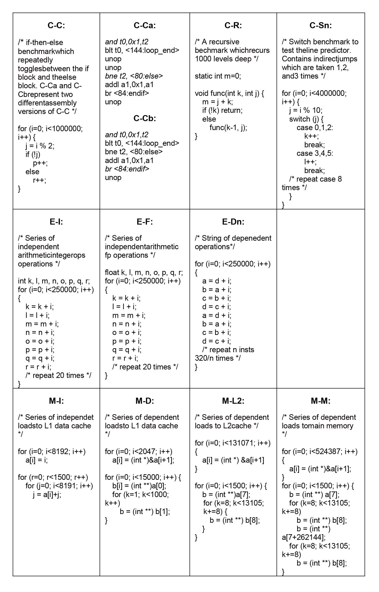
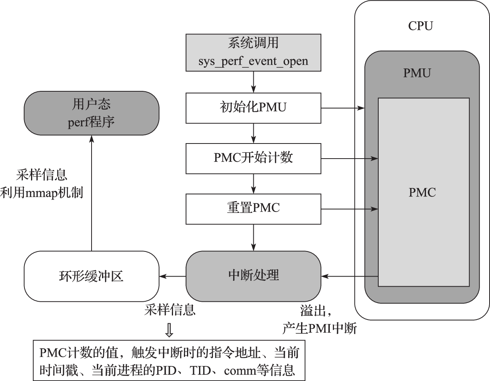
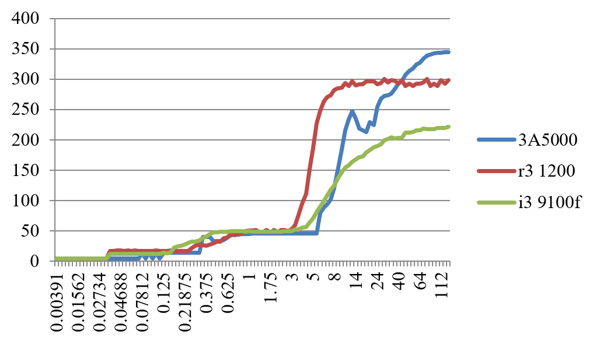
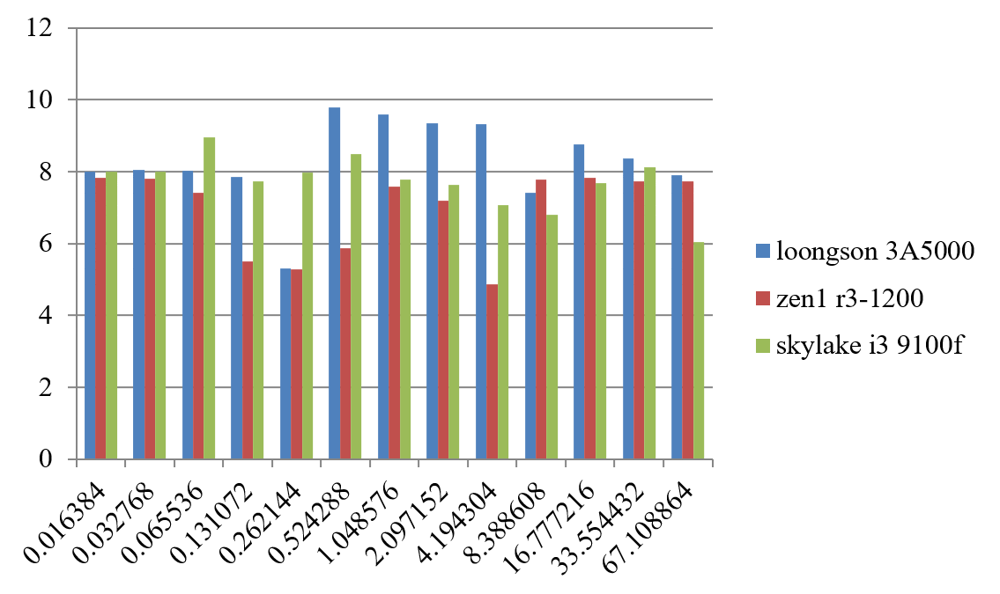

# (PART) 系统性能评价与分析 {-}

# 计算机系统性能评价与性能分析

计算机系统评价和性能分析就是采用测量、模拟、分析等方法和工具，获得计算机系统运行预定任务时的性能特性，找出已有系统的性能瓶颈，然后进行改进和提高。性能分析还可以对未来设计的系统进行性能预测。本章主要介绍计算机系统评价和性能分析方法。首先，介绍计算机的性能指标。性能的最本质定义是“完成一个任务所需要的时间”，完成一个任务所需要的时间可以由完成该任务需要的指令数、完成每条指令需要的拍数以及每拍需要的时间三个量相乘得到。然后，介绍测试程序集。由于应用的多样性，不同的计算机对不同的应用有不同的适应性，很难建立一个统一的标准来比较不同计算机的性能。因此人们通过一系列基准程序集来评价计算机性能，包括SPEC CPU、SPECweb、SPECjbb、STREAM、LMbench、Linpack、SPLASH、EEMBC等等。接下来，介绍计算机性能分析方法。性能分析可以分为性能建模和性能测量两类。性能建模主要用于设计的早期还没有实际系统阶段，又可以细分为基于模拟的建模和基于分析的建模。在原型系统出来之后，实际机器的测量提供了一个附加的反馈可以帮助验证设计阶段的分析模型。最后，对一些具体计算机系统进行性能比较和分析。通过对Intel、AMD、龙芯等CPU的性能测试及其微结构特点的分析，帮助读者理解本章介绍的部分方法和工具的应用。

## 计算机系统性能评价指标

我们经常说一台机器速度很快，这个“快”怎么衡量？对于普通用户而言，速度快就是执行一个程序运行的时间短，例如一台Core i7的机器和一台Core2的机器相比，对于一个大文件进行压缩前者完成的时间要短，采用软解码视频播放器播放H.264格式文件前者播放更为流畅。对于Web服务器而言，性能高表示每秒所完成应答的Web请求数量大，对于像京东和淘宝这样的电子商务网站，衡量的指标通常是每秒完成的交易事务（Transaction）即吞吐率。对于高性能计算机而言，衡量指标是其完成一个大的并行任务的速度，如Top500中一个重要的衡量指标是高性能Linpack的实测双精度浮点峰值。

### 计算机系统常用性能评价指标

计算机系统的性能有许多衡量指标，如执行时间或者响应时间、吞吐率、加速比、每条指令的时钟周期数（CPI）、每秒执行百万条指令数（MIPS）、每秒执行百万浮点运算数（MFLOPS）、每秒执行的事务数（TPS）和归一化的执行时间等。

我们通过一些实际的示例来看看不同的性能指标。Openbenchmarking.org网站收集了大量的开源测试程序集合，这个测试程序集合称为Phoronix Test Suite。表\@ref(tab:AMDTest)给出了AMD Athlon II X4 645的测试结果。从表中可以看出性能衡量指标包括以下方面：完成任务的执行时间，例如并行的BZIP2压缩和LAME MP3编码，执行时间越短越好。每秒多少帧，每秒的帧数是越多越好，例如H.264视频编码和射击游戏《帕德曼的世界》（World of Padman）。MIPS，例如7-ZIP测试压缩速度。MFLOPS，如Himeno中泊松压力方程求解。每秒执行了多少个事务，如PostgreSQL pgbench测试TPC-B。每秒传递多少个签名，如OpenSSL中RSA测试。每秒服务多少个请求，如Apache网页服务器。）每秒执行的百万次操作数（Mop/s），如NPB中的EP.B。每秒完成计算多少个节点，如TSCP人工智能下棋程序，每秒能下多少步棋。带宽，即每秒能完成多少MB的访存操作，如STREAM测试程序。

```{r AMDTest, echo = FALSE, message=FALSE}
autonum <- run_autonum(seq_id = "tab", bkm = "AMDTest", bkm_all = TRUE)
readr::read_csv('./materials/chapter12/AMDTest.csv') %>%
flextable() %>%
FitFlextableToPage() %>%
set_caption(caption="AMD Athlon处理器的Phoronix Test Suites测试结果", autonum = autonum) %>%
theme_box()
```

归根到底，计算机的性能最本质的定义是“完成一个任务所需要的时间”。计算机系统完成某个任务所花费的时间，我们称为执行时间。时间最直接的定义是所谓墙上时钟时间、响应时间或者持续时间。计算机中完成一个任务的时间包括CPU计算、磁盘的访问、内存的访问、输入输出的活动和操作系统的开销等所有的时间。我们常说的CPU时间表示CPU计算的时间，而不包括等待IO的时间或者执行其他程序的时间。CPU时间能进一步被分为花在程序执行上的CPU时间（用户CPU时间）和花在操作系统上的执行时间（系统CPU时间）。在比较两台机器（X和Y）的性能时，X的速度是Y的n倍是指Y的执行时间是X的执行时间的n倍。 执行时间和性能成反比，所以下述关系成立：n = (Y的执行时间/X的执行时间) = (X的性能/Y的性能)。

历史上很长一段时间，测量计算机的速度通过时钟频率（MHz或GHz）来描述，这表示CPU时钟的每秒时钟周期数。每台计算机都有一个时钟，运行在一定的频率上，这些离散的时间事件称为时钟滴答和时钟周期，计算机的设计者把时钟周期时间表示为一个持续时间如1ns（对应的时钟频率为1GHz），通常称一个时钟周期为一拍（Cycle）。2000年时主频基本就是速度的标志，主频越高的芯片卖得价格也越高。然而这种方法会有一定的误导，因为一个有很高时钟频率的机器，不一定有很高的性能，其他影响速度的因素还包括功能单元的数量、总线的速度、内存的容量、程序动态执行时指令的类型和重排序特性等。因此，厂商已经不再把时钟频率当作测量性能的唯一指标。

对于处理器的性能评价，有相应的处理器性能公式。一个程序的CPU时间可以描述为：

$$
\mbox{CPU时间}=\mbox{程序的CPU时钟周期数}\times\mbox{时钟周期}
$$
或
$$
\mbox{CPU时间}=\mbox{程序的CPU时钟周期数}/\mbox{时钟频率}
$$

CPU时间是由程序执行时钟周期数和处理器频率所决定的。除了可以统计程序的时钟周期数，还可以统计程序所执行的动态指令数目。执行的动态指令数目（Instruction Count）也称为指令路径长度。得到时钟周期数和指令数后，就可以计算出每条指令的时钟周期数（Clock cycles Per Instruction，简称CPI），即平均每条指令执行需要花费多少个时钟周期。在衡量相同指令集处理器的设计时，CPI是一个非常有效的比较方法。有时设计者也使用CPI的倒数，即每个时钟周期内所执行的指令数（Instructions Per Clock，简称IPC）。现代处理器微体系结构的性能特性通常采用IPC或CPI来描述，这种测量方法和处理器的时钟频率没有关系。历史上处理器的IPC只有零点几，而现代主流处理器的IPC通常为1.x，高性能超标量处理器每个时钟周期能发射和提交多条指令，部分程序的IPC能达到2~3，多核和多线程CPU能通过并行执行来进一步增加IPC。当然对于不同的指令集系统进行IPC指标的比较也是不公平的，因为指令集不同，每条指令所做的工作复杂程度也不同。比较RISC处理器和CISC处理器的微结构性能时，更为公平的方式是将CISC处理器每个时钟周期完成的微码操作（μop）和RISC的IPC进行比较。

程序的CPI可以通过下面公式计算：

$$
CPI = \mbox{程序的CPU时钟周期数}/\mbox{程序的执行指令数}
$$
有时，我们可以统计每一类指令的数目和该类指令的CPI，其中ICi表示指令类型i在一个程序中的执行次数，CPIi表示指令类型i的平均时钟周期数。这样，总的CPI可以表示为：

$$
CPI = \frac{\sum^{n}_{i=1}IC_i\times CPI_i}{Instruction\ count} = \sum^{n}_{i=1}\frac{IC_i}{Instruction\ count}\times CPI_i
$$
这个求CPI的公式是每类指令的CPI乘以该类指令在程序的执行指令数中所占的比例。CPIi需要通过测量得到，因为必须考虑流水线效率、Cache失效和TLB失效、保留站阻塞等情况。

由上述CPI公式知，程序的CPU时钟周期数=CPI*程序的执行指令数，所以CPU性能公式，即CPU时间的计算可以表示为：
$$
\mbox{CPU时间}=\mbox{程序的执行指令数}\times CPI \times \mbox{时钟周期}
$$
或
$$
\mbox{CPU时间}={程序的执行指令数}\times CPI/\mbox{时钟频率}
$$
通过CPU性能公式可以看出CPU的性能和三个因素有关：时钟周期或时钟频率、每条指令的时钟周期数（CPI）以及程序的执行指令数，也就是说CPU时间直接依赖于这三个参数。但是，对于这个公式的三个参数，很难只改变一个参数而不会影响到其他两个参数，因为这些参数会相互依赖。时钟周期和硬件技术及计算机组织相关，CPI和计算机组织及指令集结构相关，程序的执行指令数和指令集结构及编译技术相关。幸运的是，许多潜在的性能提高技术会提高CPU性能的一个方面，而对其他方面影响较小或是仅有可预测的影响。

如何获得CPU性能公式中这些参数的值呢？可以通过运行程序来测量CPU的执行时间，例如通过Linux系统中运行“time ./app”可以获得程序app的执行时间。时钟周期就是频率的倒数，在不开启睿频和变频技术的情况下，CPU的频率是固定的。程序的执行指令数和CPI的测量可以通过体系结构模拟器来获得，或者通过处理器中硬件计数器来获得，例如通过Linux系统中的perf工具就可以获得程序的执行指令数目和CPI。

程序的执行指令数、CPI和时钟频率实际上和实现的算法、编程语言、编译器、指令系统结构等相关，表\@ref(tab:performance-formula)列出了它们之间的关系以及它们影响了CPU性能公式中的哪些参数。

时钟周期基本由微体系结构设计、物理设计电路和工艺决定，CPI由微体系结构特性和指令系统结构决定，程序的执行指令数由指令系统结构和编译器技术决定。当前，也有研究工作进一步比较了RISC和CISC处理器，认为指令系统结构的影响越来越小，一是当前X86处理器在处理器内部把X86指令翻译为类RISC指令，二是现代的编译器更倾向于选择X86中简单的类RISC指令进行汇编，三是Cache技术的采用和流水线内部指令融合技术等使得指令系统结构的影响越来越小，处理器的最终性能还是决定于微体系结构的设计和电路的设计。

```{r performance-formula, echo = FALSE, message=FALSE}
autonum <- run_autonum(seq_id = "tab", bkm = "performance-formula", bkm_all = TRUE)
readr::read_csv('./materials/chapter12/performance-formula.csv') %>%
flextable() %>%
FitFlextableToPage() %>%
set_caption(caption="算法、编程语言、编译器、指令系统结构和CPU性能公式的关系", autonum = autonum) %>%
theme_box()
```

上述介绍了计算机系统的性能评价指标，也说明了CPU性能公式与CPI、频率以及指令数目三个要素相关。可以使用这些性能指标来衡量机器的性能或者指导计算机系统的优化。


### 并行系统的性能评价指标

上一节给出了计算机系统的性能评价指标，而对于并行的计算机系统，包括多核和众核的系统、多处理器的系统和集群的系统等，有专门的并行性评价指标。

可扩展性是并行系统的一个重要的性能评价指标。并行系统可扩展性是指随着并行系统中机器规模的扩大，并行系统的性能随之增长的特性。可扩展性好意味着当并行系统机器规模扩大时，并行系统的性能也能得到相当幅度的增长；可扩展性不好，意味着当机器规模扩大时，并行系统的性能增长幅度很小，甚至出现负增长。并行系统可扩展性是并行系统的设计和使用人员所追求的一个重要目标，体系结构设计人员希望并行系统有好的可扩展性，从而使得自己设计的并行机器规模越大性能越好。

并行系统的可扩展性可以用加速比来衡量。加速比（Speedup）是同一个任务在单处理器系统和并行处理器系统中运行所耗费时间的比率，用来衡量并行系统或程序并行化的性能和效果。加速比的计算公式为：$S_p=T_1/T_p$。Sp是加速比，$T_1$是单处理器下的运行时间，$T_p$是在有P个处理器的并行系统中的运行时间。当$S_p=P$时，此加速比称为线性加速比。如果$T_1$是在单处理器环境中效率最高的算法下的运行时间（即最适合单处理器的算法），则此加速比称为绝对加速比。如果$T_1$是在单处理器环境中采用和并行系统中一样的算法下的运行时间，则此加速比称为相对加速比。加速比超过处理器数的情况称为“超线性加速比”，超线性加速比很少出现。超线性加速比有几种可能的成因，如现代计算机的存储层次不同所带来的“高速缓存效应”。较之串行计算，在并行计算中，不仅参与计算的处理器数量更多，不同处理器的高速缓存也可集合使用，如果集合的缓存便足以提供计算所需的存储量，算法执行时便不必使用速度较慢的内存，因而存储器读写时间便能大幅降低，这便对实际计算产生了额外的加速效果。另一个用于衡量并行系统的相关指标是并行效率$E_p=S_p/P$，P为并行计算机中处理器的个数。

影响并行系统加速比的主要因素是计算时间和通信时间的占比，它与算法中计算复杂度和通信复杂度有关，也与并行系统的计算性能和通信性能有关。例如，某种并行矩阵乘法计算复杂度为$O(n_3)$，通信复杂度为$O(n_2)$，可以达到较高加速比，而某种并行FFT算法的计算复杂度为O((n/p)log(p))，通信复杂度为O(nlog(n/p))，它的加速比就低一些（这里n和p分别为样本数和处理器数目）；用万兆以太网相连的并行系统一般来说比千兆以太网相连的并行系统加速比高，片内多处理器比片间多处理器加速比高。

在并行系统中，我们经常提到Amdahl（阿姆达尔）定律，Amdahl定律实际上是一种固定负载加速性能模型。Amdahl定律的定义是系统中对某一部件采用更快执行方式所能获得的系统性能改进程度，取决于这种执行方式被使用的频率，或所占总执行时间的比例。Amdahl定律实际上定义了采取增强某部分功能处理的措施后可获得的性能改进或执行时间的加速比。对于固定负载情况下描述并行处理效果的加速比s，Amdahl给出了如下公式：s=1/((1-a)+a/n)，其中，a为并行计算部分所占比例，n为并行处理节点个数。这样，当1-a=0时（即没有串行，只有并行），最大加速比s=n；当a=0时（即只有串行，没有并行），最小加速比s=1；当n→∞时，极限加速比s→1/(1-a)，这也就是加速比的上限。例如，若串行代码占整个代码的25%，则并行处理的总体性能不可能超过4。当然，Amdahl定律只在给定问题规模的前提下成立，如果串行的部分并不随着问题规模的增加而增加，那么扩大问题规模时，加速比仍有可能继续增加。


## 测试程序集

中国有句古话：是骡子是马拉出来遛遛。衡量计算机性能最好的办法是在计算机上运行实际程序。但计算机的性能依赖于它的应用领域，这些应用可以是CPU计算密集型（如科学计算）、IO密集型（如Web服务器）或者访存密集型（如视频编辑）。那么怎样评价计算机系统的性能，采用什么样的测试程序来评价计算机系统的性能？一种办法是采用计算机上的日常任务来衡量，如办公软件Office打开一个大的Word文档并上下翻页时看看是不是会卡，压缩程序压缩一个目录文件时看看多长时间能压缩完成，浏览器打开一个网址时看看网页装载的时间是多长。然而这种测试计算机系统性能的方法没有普适性，也很难有量化的可比性。可能一台计算机运行程序A比另一台快，但运行程序B却比另一台慢。我们需要一些公共和通用的测试程序，这些测试程序需要考虑公平性、可量化、可移植等因素。为了相对公平地比较不同计算机系统的性能，逐步形成了许多专门用于性能评价的基准测试程序集。本节将介绍一些比较常见的基准测试程序集。

用于性能评价的测试程序一直以来是有争议的，因为很难定义和识别具有代表性的测试程序。早期人们曾使用MIPS、MFLOPS或者平均指令延迟等简单的指标来评价系统的性能。后来，性能评价主要是通过执行小的测试程序，例如从应用中抽取出来的kernels（如Lawrence Livermore Loops）、Dhrystone和Whetstone测试程序、Linpack、排序算法、爱拉托逊新筛法（Sieve of Eratosthenes）、八皇后问题、汉诺塔（Tower of Hanoi）等等。再后来，出现了类似于SPEC和TPC这样的组织，他们致力于为各种重要的工作负载（包括通用工作负载、Java工作负载、数据库工作负载、服务器工作负载、多媒体工作负载和嵌入式工作负载等）建立合理的基准测试程序集。除了尽可能准确地反映实际工作负载的行为，基准测试程序集还应该努力给出易于理解、容易比较的数值来体现测试结果。如已经获得了一组测试程序中每个程序的分值，可以通过算术平均、几何平均或者调和平均三种求平均的方法，找到一组数字的中心趋势，获得该程序集的数值。

采用基准测试程序对计算机和处理器进行性能分析，发现系统的瓶颈并对系统进行改进，是计算机系统设计的重要工作。

### 微基准测试程序

在处理器的设计过程中，尤其是在微体系结构的设计空间探索的过程中，我们希望有一类小的测试程序，能在很短的时间内跑完，可在模拟器、RTL仿真模型或者FPGA平台上执行，覆盖微体系结构的特性，如分支预测器的精度、Cache的行为、流水线的效率、各项队列大小、重命名寄存器数目和功能部件数量的影响等，这就导致了微基准测试程序（下面有时简称微测试程序）的出现。在处理器性能测试和分析中，常用的微基准测试程序包括：Sim-alpha的microbench、bp_microbench、LMbench、STREAM、Coremark、Coremark-pro和Unixbench等。

微测试程序(microbench)是一系列很小的测试程序或者代码片段。得克萨斯州奥斯丁大学的R.Desikan和Doug Burger在设计Sim-alpha模拟器的时候，为了将Sim-alpha模拟器和真实处理器Alpha21264进行校准，设计了一系列的微测试程序。这些测试程序对处理器核的某个模块进行了测试，同时排除了处理器其他模块的影响，所以特别适合处理器设计时对某个模块的选择和优化，例如分支预测器模块、执行单元模块和访存流水线模块，这几个模块可比较准确地反映流水线的效率。下面的图\@ref(fig:Test-procedure)中给出了部分微测试程序，第一行用于测试指令流水线的前端（front-end），例如行预测器的实现和分支预测器的实现，C表示测试的控制流，第二行用于测试指令流水线的执行核心（execution core），例如调度和发射逻辑（scheduler），E表示执行核心，最后一行用于测试内存系统的参数，例如一级Cache的延迟、二级Cache的延迟和内存的延迟，M表示内存系统。微测试程序更为详细的描述见参考文献[@desikan_sim-alpha_2002]。Sim-alpha的微测试程序的源代码可以从网站http://www.cs.utexas.edu/users/cart/code/microbench.tgz下载。

```{r Test-procedure, echo=FALSE, fig.align='center', fig.cap="微基准测试程序集", out.width='100%'}

```

亨茨维尔阿拉巴马大学的A.Milenkovic给出了一系列和分支预测器相关的微基准测试程序集，用于测试微体系结构中和分支预测器相关的参数，例如跳转目标缓存（Branch Target Buffer，简称BTB）的组织、全局历史寄存器的位数和局部预测器每一项的位数等。这些微测试程序可以用于编译器的代码优化，也可以用于处理器设计中对于各种分支预测器组织的性能评估，其网站（www.ece.uah.edu/~lacasa/bp_mbs/bp_microbench.htm）上给出了相关的代码。

其中GenCode.c程序用于处理器中BTB结构参数的测试，基本思想是构造一个微测试程序，在一个loop循环中包含B个条件分支指令，每个条件分支指令如jle和jle之间（LoongArch为bne和bne之间）的距离为D，如果增加B的大小和D的大小，所有的条件分支指令都能被装载到BTB中，也就是说当B等于NBTB-1，其中NBTB为BTB的项数，则分值误预测率趋近于零，这样就可以判断处理器中BTB的相连度和项数。

```
/*  GenCode.c */

void main(int argc, char **argv)

{

    int long unsigned    iterations;        /* number of iterations in the loop*/

    int            dist;                /* max distance in bytes between two branch */

    int            branches;            /* number of branches inside a loop */

    char file_name[30];

    FILE * fout;

    int m;

    int j, k;

    int num_mov, num_cmp, num_clc;    /* number of mov, cmp and clc instructions in the distance code*/

    m = iterations/1000000;

    fout=fopen (file_name,"w");

/* write the content of the program */

    fprintf(fout,"void main(void) { \n");

    fprintf(fout,"int long unsigned i;\n");

    fprintf(fout,"int long unsigned liter = %d;\n", iterations);

    fprintf(fout,"for (i=0; i<liter; ++i){\n");

    fprintf(fout,"_asm { \n");

/* generate sequence of asm instructions */

    dist = dist - 2;

    num_mov = dist/5;

    num_cmp = (dist%5)/3;

    num_clc = (dist%5)%3;

    fprintf(fout, "clc\n");

    fprintf(fout, "clc\n");

    for (j = 0; j < branches - 1; j++) {

        if (j == 0) {    /*  set condition code for the first branch */

            fprintf(fout, "mov eax, 10\n");

            fprintf(fout, "cmp eax, 15\n");

        }

        fprintf(fout, "jle l%d\n", j);


        for (k = 1; k <= num_mov; k++) {

            fprintf(fout, "mov eax, 10\n");

        }

        for (k = 1; k <= num_cmp; k++) {

            fprintf(fout, "cmp eax, 15\n");

        }

          for (k = 1; k <= num_clc; k++) {

            fprintf(fout, "clc\n");

        }

        fprintf(fout, "l%d: ", j);

    }


    fprintf(fout, "clc\n");

    fprintf(fout, "}\n");

    fprintf(fout, "}\n");

    fprintf(fout, "}\n");

    fclose(fout);

}
```

Step1.c一直到Step6.c程序，用于处理器中条件分支预测器的测试，基本思想在微测试程序中插入间谍分支（spy branch）语句，通过硬件计数器来获得该间谍分支的分支误预测率，由此判断条件分支预测器的内部结构和行为。例如在Step1.c程序中，for循环中只有唯一的条件分支语句，if((i%4)==0)语句在X86中被编译为jne指令（LoongArch为bnez指令），for循环语句被编译为jae和jmp指令（LoongArch为bne和b指令），如果1表示taken，0表示not taken，如当LSpy为8时，该分支历史模式为11111110，假定局部历史模式的长度为L，当LSpy小于或者等于L时，分支误预测率趋近于0，当LSpy大于L时，每LSpy次间谍分支发生误预测一次，这样通过不断增加LSpy的大小并得到该程序的分支预测率来获得局部预测器中历史模式长度L的大小。

:::: {.cols data-latex=""}

::: {.col .width48 data-latex="{0.48\textwidth}"}

```c
/* Step1.c */
/* pattern length */
#define L 10       
void main(void)
{ 
/* loop index */
int long unsigned i;
int a=1; 
/* variable with 
conditional assignment*/
int long unsigned
    liter = 10000000;
/* number of iterations */
for (i=0; i<liter; ++i){
   if ((i%L) == 0) a=0; 
   /* spy branch */
}
}


```

:::

::: {.col .width4 data-latex="{0.04\textwidth}"}

```

```

:::

::: {.col .width48 data-latex="{0.48\textwidth}"}

```c
/* Step2.c */
/* pattern length */
#define L 9        

void main(void) 
{ 
int long unsigned    i;
int a=1;            
int long unsigned    
   liter = 10000000;           
for (i=0; i<liter; ++i){
/* 2*(L-1) dummy branches */  
   if (i<0) a=1; 
   if (i<0) a=1;
   if (i<0) a=1;
   if (i<0) a=1;
   if (i<0) a=1;
   if (i<0) a=1;
   if (i<0) a=1;
   if (i<0) a=1;
   if (i<0) a=1; 
   if (i<0) a=1;
   if (i<0) a=1;
   if (i<0) a=1;
   if (i<0) a=1;
   if (i<0) a=1;
   if (i<0) a=1;
   if (i<0) a=1;
   /* spy branch */
   if ((i%L)==0) a=0;
   }
}
```

:::

::::


:::: {.cols data-latex=""}

::: {.col .width48 data-latex="{0.48\textwidth}"}

```c
/* Step3.c */
/* pattern length */
#define L1 5
/* pattern length */
#define L2 2
void main(void)
{ 
int long unsigned  i;
int a,b,c;        
int long unsigned    
    liter = 10000000;  
for (i=1;i<=liter;++i){ 
    if ((i%L1) == 0) a=1;
    else a=0;      
    if ((i%L2) == 0) b=1;
    else b=0;
/* spy branch */
    if ( (a*b) == 1) c=1; 
}
} 


```

:::

::: {.col .width4 data-latex="{0.04\textwidth}"}

```

```

:::

::: {.col .width48 data-latex="{0.48\textwidth}"}

```c
/* Step4.c */
/* pattern length */
#define L1 5 
/* pattern length */
#define L2 2
void main(void)
{ 
int long unsigned  i;
int  a,b,c;        
int long unsigned    
    liter = 10000000; 
for (i=1;i<=liter;++i){ 
    if ((i%L1) == 0) a=1;
    else a=0;
    if ((i%L2) == 0) b=1;
    else b=0;   
/* varying number of 
   dummy branches */  
    if (i<0) a=1; 
    if (i<0) a=1;
    if (i<0) a=1;
    /* spy branch */
    if ( (a*b) == 1) c=1;
}
} 
```

:::

::::


:::: {.cols data-latex=""}

::: {.col .width48 data-latex="{0.48\textwidth}"}

```c
/* Step5.c */
/* pattern length */
#define L3 6
void main(void)
{ 
int long unsigned i; 
int a; 
/*variable with 
  conditional assignment*/
   int long unsigned    
       liter = 10000000;
for (i=1;i<=liter;++i)
{ 
   /* L3 > L */
   if ((i%L3) == 0) a=1;
   if ((i%L3) == 0) a=1;
   /* spy branch */
}
} 


```

:::

::: {.col .width4 data-latex="{0.04\textwidth}"}

```

```

:::

::: {.col .width48 data-latex="{0.48\textwidth}"}

```c
/* Step6.c */
/* pattern length */
#define LSpy 4
void main(void) 
{ 
int long unsigned  i;                
int a;            
int long unsigned    
    liter = 10000000;      
for (i=0; i<liter; ++i){
/* 2*(L-1) dummy branches */
   if (i<0) a=1;
   if (i<0) a=1;
   if (i<0) a=1;
   if (i<0) a=1;
   if (i<0) a=1;
   if (i<0) a=1;
   if (i<0) a=1;
   if (i<0) a=1;
   if (i<0) a=1;
   if (i<0) a=1;
   if (i<0) a=1;
   if (i<0) a=1;
   if (i<0) a=1;
   if (i<0) a=1;
   if (i<0) a=1;
   if (i<0) a=1;
 /* spy bracnh */
   if ((i%LSpy)==0) a=0;
}
} 


```

:::

::::

LMbench是由HP以色列海法实验室开发的一套微测试程序集，可以测量许多和系统性能相关的因素。LMbench采用ANSI C编码、POSIX接口，是个多平台开源基准测试程序，能够测试包括文件读写、内存操作、进程创建和销毁开销、网络等性能。一般来说LMbench衡量两个关键特征：延迟和带宽。带宽就是系统中搬运数据的能力，如各级Cache的带宽、内存的带宽、缓存的IO带宽等，测量的方式包括bcopy库、手工循环展开bcopy、直接从内存中读、非拷贝的写、管道、进程间通信和TCP套接字等，可以采用read和mmap的API接口。延迟是系统的反馈时间或者开销，如各级Cache的访问延迟、内存访问的延迟和操作系统中某一项功能的开销，包括信号处理的开销、进程创建的时间、上下文切换的时间、进程间通信的开销、文件系统的延迟和磁盘的延迟等。Sun公司在开发UltraSPARC和Intel 公司在开发Pentium Pro的过程中都曾经使用LMbench用于发现微处理器设计上的性能瓶颈，Linux操作系统在kernel开发的性能调优中也曾使用了这些工具。表\ref{tab:LMbench}给出了LMbench测试程序集的各种工具及测试说明。

```{r LMbench, echo = FALSE, message=FALSE}
autonum <- run_autonum(seq_id = "tab", bkm = "LMbench", bkm_all = TRUE)
readr::read_csv('./materials/chapter12/LMbench.csv') %>%
flextable() %>%
FitFlextableToPage() %>%
set_caption(caption="LMbench微测试程序集", autonum = autonum) %>%
theme_box()
```

STREAM基准测试程序测量计算机的可持续内存带宽。STREAM是一个简单的合成测试程序，主要是测量内存的带宽（MB/s）和简单向量核心代码的计算速率。它由John McCalpin在Delaware大学执教的时候开发，并在随后成为工业界的标准测试程序，其有Fortran和C的代码，也有单处理器和多线程的版本，多线程版本包括OpenMP和MPI的并行。如表\@ref(tab:STREAM)所示，STREAM测试程序由Copy 、Scale 、Add 和 Triad四部分组成，测试了4个循环，并给出不同的内存带宽峰值。STREAM的基本原则是每个数组必须不小于最后一级Cache（LLC）大小的四倍或者100万个元素（取两者中较大的那个）。通常内存带宽比单线程STREAM测出来的值要高，为了能达到内存的饱和带宽，可以采用两种方法：一种是吞吐量的方法，执行多个stream的实例；另一种是执行OpenMP的版本。基于标准的STREAM测试程序，可以衍生出其他测试内存带宽的程序，改变数组访问跳步stride=1的简单循环，采用stride=N的操作（N=2,3,4,5,6,7,8,9,10,20,40），采用反向的（stride=-1）循环以及基于索引的操作，包括load采用索引的数组和store采用索引的数组。

```{r STREAM, echo = FALSE, message=FALSE}
autonum <- run_autonum(seq_id = "tab", bkm = "STREAM", bkm_all = TRUE)
readr::read_csv('./materials/chapter12/STREAM.csv') %>%
flextable() %>%
width(j=1:2, width = 1) %>%
width(j=3, width = 4) %>%
delete_part(part="header") %>%
FitFlextableToPage() %>%
set_caption(caption="STREAM基准测试程序", autonum = autonum) %>%
theme_box()
```

```c
/* stream.c */

#ifndef STREAM_ARRAY_SIZE
#   define STREAM_ARRAY_SIZE    10000000
#endif

#ifndef STREAM_TYPE
#define STREAM_TYPE double
#endif

static STREAM_TYPE    a[STREAM_ARRAY_SIZE+OFFSET],
            b[STREAM_ARRAY_SIZE+OFFSET],
            c[STREAM_ARRAY_SIZE+OFFSET];

int main()
    {
// …
    /*    --- MAIN LOOP --- repeat test cases NTIMES times --- */
    for (k=0; k<NTIMES; k++)
    {
    times[0][k] = mysecond();
#ifdef TUNED
        tuned_STREAM_Copy();
#else
#pragma omp parallel for
// COPY        
//  int stride = 1,2,3,4,5,6,7,8,9,10
//    for (j=0; j<STREAM_ARRAY_SIZE; j=j+stride)
    for (j=0; j<STREAM_ARRAY_SIZE; j++)
        c[j] = a[j];
#endif
    times[0][k] = mysecond() - times[0][k];

    times[1][k] = mysecond();
#ifdef TUNED
        tuned_STREAM_Scale(scalar);
#else
#pragma omp parallel for
// Scale        
//  int stride = 1,2,3,4,5,6,7,8,9,10
//    for (j=0; j<STREAM_ARRAY_SIZE; j=j+stride)
//    for (j=STRAEM_ARRAY_SIZE-1; j>=0; j=j-stride)  // for reverse order
    for (j=0; j<STREAM_ARRAY_SIZE; j++)
        b[j] = scalar*c[j];
#endif
    times[1][k] = mysecond() - times[1][k];

    times[2][k] = mysecond();
#ifdef TUNED
        tuned_STREAM_Add();
#else
#pragma omp parallel for
// Add        
//  int stride = 1,2,3,4,5,6,7,8,9,10
//    for (j=0; j<STREAM_ARRAY_SIZE; j=j+stride)
    for (j=0; j<STREAM_ARRAY_SIZE; j++)
        c[j] = a[j]+b[j];
#endif
    times[2][k] = mysecond() - times[2][k];

    times[3][k] = mysecond();
#ifdef TUNED
        tuned_STREAM_Triad(scalar);
#else
#pragma omp parallel for
// Triad        
//  int stride = 1,2,3,4,5,6,7,8,9,10
//    for (j=0; j<STREAM_ARRAY_SIZE; j=j+stride)
//    index [x] = (ix + iy*i)%N;
//    for (j=0; j<STREAM_ARRAY_SIZE; j=j++)
//    a[j] = b[index[j]] + scalar*c[[index[j]];
    for (j=0; j<STREAM_ARRAY_SIZE; j++)
        a[j] = b[j]+scalar*c[j];
#endif
    times[3][k] = mysecond() - times[3][k];
    }
    return 0;
}
```

CoreMark是一个综合性的基准测试程序，主要用于测量嵌入式系统中CPU的性能。2009年由嵌入式微处理器基准测试协会（英文简称EEMBC）开发，用于取代过时的Dhrystone测试程序。代码使用C语言编写，主要执行：列表操作（列表的插入和删除、反转列表和排序等），矩阵运算（矩阵加、矩阵常量乘、矩阵向量乘、矩阵和矩阵的乘），简单状态机（扫描字符串进行状态转换，主要测试switch-case和if语句的行为），CRC运算（测试循环冗余校验运算和用于测试过程的自检）。CoreMark程序有很多优点，如代码量很小、可移植性高、很容易理解、免费以及测试结果为单一的分值。CoreMark避免了Dhrystone所存在的一些问题，首先，CoreMark程序中运算所需要的值不会在编译的时候产生，这样就能确保编译器不会在编译的时候预计算结果，从而减少了编译器优化选项的干扰，其次，CoreMark没有调用库函数，第三，测试结果为单一分值，每秒钟执行了多少次迭代，便于不同处理器之间分值的比较。

CoreMark-Pro是EEMBC组织推出的并行基准测试程序，用于处理器流水线、存储子系统和多核等综合性能测试，其包含了5类定点和4类浮点应用，如JPEG压缩、ZIP压缩、XML解析、SHA-256算法和FFT、求解线性代数和神经网络算法等。

UnixBench 是一款测试类Unix系统基本性能的工具，主要测试项目如表\@ref(tab:UnixBench)所示。其中，Dhrystone测试的核心为字符串处理，Whetstone 测试用于测试浮点运算效率和速度。这些测试规模比较小容易受到编译器、代码优化、系统库以及操作系统的影响而产生波动。

```{r UnixBench, echo = FALSE, message=FALSE}
autonum <- run_autonum(seq_id = "tab", bkm = "UnixBench", bkm_all = TRUE)
readr::read_csv('./materials/chapter12/UnixBench.csv') %>%
flextable() %>%
width(j=1, width = 2) %>%
width(j=2, width = 4) %>%
FitFlextableToPage() %>%
set_caption(caption="UnixBench测试项目", autonum = autonum) %>%
theme_box()
```

### SPEC CPU基准测试程序

基准测试程序中最重要的一类就是SPEC组织推出的SPEC CPU系列测试程序集。SPEC是由计算机厂商、系统集成商、大学、研究机构、咨询公司等多家单位组成的非营利组织，这个组织的目标是建立、维护一套用于评估计算机系统的标准。SPEC组织创建了SPEC CPU系列测试程序集合，主要关注CPU的性能，如SPEC CPU89、SPEC CPU92、SPEC CPU95、SPEC CPU2000、SPEC CPU2006和SPEC CPU2017。SPEC基准测试程序来自于真实的程序，做了适当的修改，主要是为了可移植性和减少IO影响。SPEC测试代表了绝大多CPU密集型的运算，包括编程语言、压缩、人工智能、基因序列搜索、视频压缩及各种力学的计算等，包含了多种科学计算，可以用来衡量系统执行这些任务的快慢。SPEC CPU测试中，测试系统的处理器和编译器都会影响最终的测试性能，而磁盘、网络等IO和图形子系统对于SPEC CPU的影响比较小。SPEC CPU基准测试程序特别适用于桌面系统和单CPU服务器系统的CPU性能测试。

以下图表分别是SPEC CPU2000、2006和2017具体的测试项目和说明。

```{r SPEC2000, echo = FALSE, message=FALSE}
autonum <- run_autonum(seq_id = "tab", bkm = "SPEC2000", bkm_all = TRUE)
readr::read_csv('./materials/chapter12/SPEC2000.csv') %>%
flextable() %>%
set_table_properties(layout = "autofit") %>%
FitFlextableToPage() %>%
bold(i=13) %>%
align(i=13, align="center") %>%
set_caption(caption="SPEC CPU2000程序及描述", autonum = autonum) %>%
theme_box()
```

```{r SPEC2006, echo = FALSE, message=FALSE}
autonum <- run_autonum(seq_id = "tab", bkm = "SPEC2006", bkm_all = TRUE)
readr::read_csv('./materials/chapter12/SPEC2006.csv') %>%
flextable() %>%
FitFlextableToPage() %>%
bold(i=13) %>%
align(i=13, align="center") %>%
set_caption(caption="SPEC CPU2006程序及描述", autonum = autonum) %>%
theme_box()
```

```{r SPEC2017, echo = FALSE, message=FALSE}
autonum <- run_autonum(seq_id = "tab", bkm = "SPEC2017", bkm_all = TRUE)
readr::read_csv('./materials/chapter12/SPEC2017.csv') %>%
flextable() %>%
FitFlextableToPage() %>%
bold(i=11) %>%
align(i=11, align="center") %>%
set_caption(caption="SPEC CPU2017程序及描述", autonum = autonum) %>%
theme_box()
```

SPEC CPU2000包括12个定点测试程序（CINT2000）和14个浮点测试程序（CFP2000），定点测试程序包括C编译器、VLSI布局和布线工具、图形应用等。浮点测试程序包括量子色动力学、有限元建模和流体动力学等。测试机的内存应不小于256MB，以确保满足所有程序运行时的内存需求。

SPEC CPU2006中对SPEC CPU2000中的一些测试程序进行了升级，并抛弃和加入了一些测试程序，以更好地反映当时主流应用的特性。SPEC CPU2006包括了12项整数运算和17项浮点运算。SPEC CPU2006的工作集变大了一些，对测试机的最小内存需求是1GB。

SPEC CPU2017是SPEC组织于2017年再次更新的CPU基准测试程序集，其包含43个基准测试程序，分为4个测试程序集，两个定点程序集：SPECrate 2017 Integer、SPECspeed 2017 Integer，两个浮点程序集：SPECrate 2017 Floating Point和SPECspeed 2017 Floating Point。CPU2017工作集变得更大了，如SPECspeed需要最小16GB内存，SPECrate在64位系统中每份拷贝最小需要2GB内存。

为了便于比较，SPEC CPU产生一个分值来归纳基准程序的测试结果。具体方法是将被测计算机的执行时间标准化，即将被测计算机的执行时间除以一台参考计算机的执行时间，结果称为SPECratio，SPECratio值越大，表示性能越快。综合测试结果是取所有程序SPECratio的几何平均值，所有定点程序的平均值称为SPECint，浮点程序的平均值称为SPECfp。为了测试多核系统的吞吐能力，SPEC CPU还可以测试在多个CPU核同时执行多份程序拷贝的性能，并且把CPU的时间转换为SPECrate分数。SPEC CPU 2017略有不同，SPECspeed 2017允许通过OpenMP或者自动并行化对单个程序进行多线程并行化的执行，测试的是系统多线程的性能，而不仅仅是单核单线程性能，它的程序集也和SPEC rate不完全相同。

### 并行系统基准测试程序

并行计算机系统（多核、多线程和多处理器系统等）和单计算机系统不同的是，其存在并行性的瓶颈，包括多个线程之间共享资源的竞争和算法中数据的相互依赖等。面向并行系统的基准测试程序就是测试和评价并行系统的性能，在并行计算机体系结构的研究中起着重要的作用。这里主要介绍SPLASH-2、PARSEC和Linkpack三种并行基准测试程序集。

（1）SPLASH-2

1992年，斯坦福大学推出了并行测试程序SPLASH（Stanford ParalleL Applications for SHared memory），1995年推出了SPLASH-2。SPLASH-2使用C语言编写，由12个程序组成，使用Pthreads API并行编程模式。SPLASH-2包含4个核心程序：Cholesky将一个稀疏矩阵拆分成一个下三角矩阵和它的转置的积；FFT用于计算快速傅里叶变换；Radix是分配存储地址的算法；LU用于将一个稀疏矩阵拆分成一个下三角矩阵和一个上三角矩阵的积。另外还包含8个应用程序：Ocean用于通过海洋边缘的海流模拟整个海洋的运动；Radiosity用于模拟光线在不同场景下的光影现象；Barnes用于模拟一个三维多体系统（例如星系）；Raytrace使用光线追踪渲染了三维的场景；FMM采用了自适应快速多极子方法模拟了两维体系统的相互作用；Volrend使用光线投射算法渲染三维体；Water-Nsquared采用预测校正法评价了水分子系统的力和势能；Water-Spatial采用了三维格点算法评价了水分子系统的力和势能。

（2）PARSEC

2008年，普林斯顿大学推出了PARSEC(The Princeton Application Repository for Shared-Memory Computers)。它最早来自于Intel公司和普林斯顿大学的合作项目，目标是提供一个开源的并行测试程序集，主要面向新兴的应用，能评价多核处理器和多处理器系统，应用包括金融计算、计算机视觉、物理建模、未来媒体、基于内容的搜索和重复数据删除等。2009年推出PARSEC 2.1版本，PARSEC 2.1包括13个应用。2011年推出PARSEC 3.0，PARSEC 3.0支持网络的应用，以及更便利地增加新的工作负载。PARSEC能支持多种输入集，包括test、simdev、simsmall、simmedium、simlarge和native，sim输入集主要用于输入到模拟器的程序测试，native输入用于在多核和多处理器的真实的机器中进行测试。PARSEC通常采用Ptherads、OpenMP和Intel TBB三种并行编程模式，表\@ref(tab:PARSEC)给出了PARSEC的应用和并行模拟、并行粒度、数据共享和数据交换的量以及每个应用所支持的并行编程模式。

```{r PARSEC, echo = FALSE, message=FALSE}
autonum <- run_autonum(seq_id = "tab", bkm = "PARSEC", bkm_all = TRUE)
readr::read_csv('./materials/chapter12/PARSEC.csv') %>%
flextable() %>%
FitFlextableToPage() %>%
set_caption(caption="PARSEC并行测试程序集", autonum = autonum) %>%
theme_box()
```

（3）Linpack

Linpack是线性系统软件包（Linear system package）的缩写，开始于1974年，由美国阿贡国家实验室应用数学所主任Jim Pool提出并设计，是一套专门解线性系统问题的数学软件。Linpack用于用高斯消元法求解一元N次稠密线性代数方程组的测试，当前在国际上已经成为最流行的用于测试高性能计算机系统浮点性能的基准测试程序。Linpack测试包括三类，Linpack100、Linpack1000和HPL。Linpack100求解规模为100阶的稠密线性代数方程组，它只允许采用编译优化选项进行优化，不得更改代码，甚至代码中的注释也不得修改。Linpack1000求解规模为1000阶的线性代数方程组，达到指定的精度要求，可以在不改变计算量的前提下做算法和代码的优化。HPL即High Performance Linpack，也叫高度并行计算基准测试。前两种测试运行规模较小，已不适合现代计算机的发展，因此现在使用较多的测试标准为HPL。HPL是针对现代并行计算机提出的测试方式，用户在不修改任意测试程序的基础上，可以调节问题规模的大小N（矩阵大小）、使用到的CPU数目和使用各种优化方法等来执行该测试程序，以获取最佳的性能。衡量计算机性能的一个重要指标就是计算峰值，浮点计算峰值是指计算机每秒能完成的浮点计算最大次数。理论浮点峰值是该计算机理论上能达到的每秒能完成的浮点计算最大次数，它主要是由CPU的主频决定的。理论浮点峰值＝CPU主频×CPU每个时钟周期执行浮点运算的次数×系统中CPU核数。实测浮点峰值是指Linpack测试值，也就是在这台机器上运行Linpack测试程序，通过各种调优方法得到的最优的测试结果。用高斯消元法求解线性方程组，当求解问题规模为N时，浮点运算次数为(2/3 * N3+2*N2)。因此，只要给出问题规模N，测得系统计算时间T，系统的峰值=计算量(2/3 * N3+2*N2)/计算时间T，测试结果以浮点运算每秒（FLOPS）给出。一般程序的运行几乎不可能达到Linpack的实测浮点峰值，更不用说达到理论浮点峰值了。这两个值只是作为衡量机器性能的一个指标，用来表明机器的处理能力和潜能。

### 其他常见的基准测试程序集

SPECjvm2008是一种通用的多线程Java基准测试工具，它能够反映Java运行时环境（Java Runtime Environment，简称JRE）的性能表现，其中JRE包含Java虚拟机（JVM）标准实现及Java核函数库。SPECjvm2008测试程序集包含编译、压缩、加解密、数据库、音频解码、FFT和LU等科学计算、sunflow和XML等22个测试程序，给出的测量结果是每分钟执行了多少个操作。该套测试工具主要体现处理器和内存子系统的性能，与IO关系不大。

SPECjbb2005是SPEC组织推出的服务器端Java基准测试程序，用于测试服务器端的Java运行时环境的性能。SPECjbb2005基于IBM内部的测试程序pBoB，模拟了当前最典型的三层架构服务器端的Java应用，其中客户端（或称为驱动）用于产生负载，中间层实现了商业逻辑和更新数据库，数据库层使得这些更新永久保存，主要测试基于Java中间层商业逻辑引擎的性能。该基准测试程序在软件层面对Java虚拟机（JVM）、即时编译器（JIT）、垃圾收集器（GC）、用户线程以及操作系统的某些方面施加了压力，在硬件层面测试了CPU、存储层次的性能，对磁盘和网络IO没有施加压力，测试给出的结果表示为每秒完成多少笔业务操作，即BOPS(Business Operation Per Second)值。

SPECSFS是文件服务器测试程序，其使用一个文件服务器请求的脚本来测试NFS的性能，测试了IO系统（包括磁盘和网络IO）和CPU的性能。SPECWeb是一个Web服务器测试程序，模拟了多个客户端请求，包括静态的和动态的服务器的页面请求，以及客户端把页面数据传输到服务器。

TPC事务处理测试程序。事务处理性能委员会（Transaction Processing Performance Council，简称TPC)组织建立了一系列真实的事务处理测试程序。TPC事务处理测试程序测量了系统处理事务的能力，其中TPC-C于1992年创建，模拟了一个复杂的查询环境；TPC-H模拟了即席查询和决策支持系统；TPC-R模拟了商业决策支持系统；TPC-W是基于Web的事务测试程序，模拟了面向商业的事务Web服务器。所有的TPC测试程序测量性能的标准是每秒执行了多少个事务（TPS）。

SPECviewperf是SPEC组织推出的图形测试程序。用于测试3D渲染的性能。SPECviewperf使用真实应用中提取的OpenGL图形记录，并使用一个3D建模和系列OpenGL调用来转换这个模型以获得原始的帧数，用于测量运行在OpenGL应用程序接口之下的系统3D的图形性能。

Octane基准测试套件是Google推出的用于评估浏览器中JavaScript性能的基准测试工具。Octane 1.0包含了13个测试程序，Octane 2.0包含17个测试程序。例如Richards程序为模拟操作系统内核行为的测试程序，pdf.js程序采用JavaScript实现了Mozilla的PDF Reader程序，它测量了pdf文件的解码和解释的时间，其他更为详细的介绍参见下面的链接地址：

https://developers.google.com/octane/benchmark

在计算机系统性能分析中，基准测试程序起着非常重要的作用，我们不仅仅只是用它们来跑个分值，更需要深入分析测试程序的行为特性，包括与体系结构无关的特性、与体系结构相关的特性，以及对计算机系统哪一部分施加压力等。

## 性能分析方法

“曾经有那么一段时间，高性能处理器的结构完全由一个智者通过拍脑袋来决定，这段时间已经一去不复返了。现代处理器的结构是由一个队伍持续地改进和创新的结果，开发未来Alpha处理器的队伍是受到性能建模的方法所指导的。”这一段话源自Alpha处理器设计者所写的关于处理器性能分析的文章。现代处理器的设计者们需要采用高度系统化的流程来保证其设计能充分利用技术的进步并尽可能地适应目标工作负载的特性。计算机系统的设计涉及几个步骤。首先，理解和分析机器中要执行的应用或工作负载的特性，然后提出创新性的可选设计方案，接着对所提出的方案进行性能评估，最后选择最好的设计。但实际问题不像步骤流程所描述的那么简单，因为存在大量的可选设计方案，这些方案又和海量的各种工作负载交织在一起，这就导致设计和选择阶段变得非常棘手。

图表\@ref(tab:perf-eval-class)列出了性能分析和评估技术的分类，主要可以分为两类：性能建模和性能测量。性能建模又可以细分为基于分析和统计的建模和基于模拟的建模。性能建模主要用于设计过程的早期阶段，那个阶段还没有实际系统或者实际系统还不能用于性能评估，这时一些设计的决策都是基于性能模型。分析建模根据对处理器结构以及程序特性的分析，用一定的方法建立处理器的性能公式，然后将体系结构参数及程序特性参数作为输入，用数学公式计算出处理器的性能信息，通常使用数学的方法来创建概率模型、队列模型、马尔可夫模型或者Petri网模型。模拟建模是处理器设计中用得最为广泛的方法，采用模拟器进行性能建模，用于预测现有的或者一个新的系统的性能。模拟器的优点是灵活和开销小，通常用高级语言编写，其缺点是需要大量的时间或大量的计算资源来精准地建模一个相对较大和复杂的系统。通常，模拟器比真实硬件的速度慢几个数量级，模拟的结果也会受到人为因素的干扰，因为模拟器会带来一些非真实的假设。相对于模拟器而言，基于实际机器或者原型系统的性能测量方法会更为精准一些。性能测量是最可信的方法，可以精准地评估系统的性能。实际系统出来之后，性能分析和测量也是非常有价值的：一是需要理解在各种真实工作负载下的实际系统的性能，二是要验证实际机器硬件是否和设计规范要求的性能相吻合，三是发现可能的性能瓶颈以及识别出未来设计中需要做出的修改。实际机器的测量还可以帮助验证设计阶段采用的性能模型，提供了一个附加的反馈用于未来的设计。性能测量的主要缺点是只能测量现有配置的性能，而系统的现有配置通常不能改变，或者只能有限的重新配置。性能测量可以进一步分为片上硬件监测、片外硬件监测、软件监测和微码插桩。

```{r perf-eval-class, echo = FALSE, message=FALSE}
autonum <- run_autonum(seq_id = "tab", bkm = "perf-eval-class", bkm_all = TRUE)
readr::read_csv('./materials/chapter12/perf-eval-class.csv') %>%
flextable() %>%
delete_part(part="header") %>%
merge_v(j=1) %>%
merge_v(j=2) %>%
merge_h(i=10:13) %>%
valign() %>%
FitFlextableToPage() %>%
set_caption(caption="性能分析和评估技术的分类", autonum = autonum) %>%
theme_box()
```

好的性能建模和性能测量的技术和工具需要具备以下特性：

1）性能模型和测量结果要比较精确，因为这些性能结果会直接影响到设计的权衡和选择。

2）性能模型的速度要比较快，如果一个性能模型很慢，在这个模型上执行工作负载需要花费数小时或者数天，那么做性能分析工作则需要花费数星期或者数月，性能模型的速度越慢，设计空间的探索范围就越有限。

3）性能模型和测量工具的开销不能太大，搭建性能评价和测量的平台不应该耗费大量的时间以及金钱。

4）性能模型上所执行的测试程序应该是目标代码，不需要应用程序的源代码，否则就不能对一些商业的应用程序进行性能评价。

5）性能模型要能捕获用户态和内核态的行为特性，能测量机器中所有的活动部分。有些工具只能测量或者捕获用户程序的行为，这对于传统的科学计算程序和工程程序是可以接受的。然而数据库的应用、Web服务器和Java的工作负载涉及大量的操作系统代码的执行，这就需要性能模拟和测量工具也能捕获操作系统的活动。

6）性能模型和测量工具需要能很好地利用多处理器系统资源，并且能应对多线程的应用，因为当前的应用越来越多是多线程的应用。

7）性能模型和测量工具应该是非侵入式的，因为侵入式的方法会在测量过程中改变系统的行为和大幅度地降低系统的性能。

8）性能模型和测量工具应该很容易修改和扩展，能对新的设计进行建模和测量。

当然，这些需求通常是相互冲突的。例如，不可能建模一个又快又精准的模型，数学分析建模是最快的方法也是最不精准的方法。又如，图形化（GUI）的显示方式增加了用户的友好性，但图形化的模拟器也会变得很慢。

### 分析建模的方法

分析建模的方法试图快速并且有效地捕获计算机系统的行为，并且对许多性能问题快速提供答案。由于处理器是个巨复杂系统，很难用一个模型来准确描述，所以可以独立地为处理器的各个部分建立分析模型，在忽略硬件实现细节的情况下考虑其对性能的影响，从而能够量化地分析影响处理器性能的因素，且具有速度快、灵活性高的特点。举一个最简单的分析建模的例子。计算系统的平均内存访问时间T = Tc + (1-h)*Tm，T表示平均内存访问时间，h是Cache命中率，Tc是Cache的访问时间，Tm是内存的访问时间。这个模型对计算机存储系统的行为进行了简化建模，但也体现了某些特定参数的改变所产生的影响，例如Cache命中率的变化、内存访问时间的变化，都会对平均内存访问时间产生影响。

分析建模的方法中常常用到主成分分析方法。主成分分析方法也称为矩阵数据分析，是数学上用来降维的一种方法，其原理是设法将原来的变量重新组合成一组新的互相无关的综合变量，同时根据实际需要从中可以取出少数几个综合变量尽可能多地反映原来变量的信息。主成分分析方法可以用于分析程序中微体系结构无关的特性，以及对基准测试程序进行冗余性分析。

分析建模具有很好的成本效益，因为它们都是基于数学的建模方法。然而，分析建模方法通常对模型做了一些简化假设，这样在分析模型中并没有捕获某实际系统所拥有的典型细节。目前，分析建模尚未在处理器设计中得到广泛应用，这一方面是由于其构建非常复杂，需要对处理器的结构特性有深刻的认识，另一方面在于抽象模型无法反映硬件细节，误差较大。尽管对于处理器的建模不是很流行，但是分析建模的方法很适合评价大的计算机系统。计算机系统通常可以被看作一组硬件和软件资源，以及一组任务或者工作同时在竞争这些资源，分析建模就是一个合适的性能度量方法。

分析建模的一个典型应用是生成模拟建模的踪迹程序。具体做法是先使用统计方法对工作负载进行分析，并利用这些统计信息（包括指令类型分布、指令组合、指令间相关信息、分支预测率和Cache命中率等）综合生成踪迹程序。由于这种合成的程序实际上是工作负载的抽象，所以它包含的信息精炼，从而能在模拟器上得到很快的收敛。同时，这种方法也具有较高的准确性。

### 模拟建模的方法和模拟器

模拟建模的方法使用软件的方式来模拟计算机系统硬件在体系结构层面的功能和性能特性。模拟器是体系结构研究和设计的重要工具，在学术界和工业界得到广泛使用。模拟器需要具有运行速度快、模拟精度高、配置修改灵活等特点，但这些需求是相互矛盾的，很难兼得。模拟器贯穿系统设计的整个流程，只是在不同的设计阶段模拟的详细程度有所不同。初期阶段，模拟器可以用来对各种设计方案进行粗粒度模拟，通过比较模拟结果来选择最优设计方案。中期阶段，模拟器用来对各种微结构设计进行评估，对一些微结构参数的选择进行折中。后期阶段，模拟器需要和目标系统进行性能验证，保证性能模型和实际机器的吻合。系统完成之后，模拟器可以用来产生踪迹信息，对系统进行瓶颈分析和性能优化。由于模拟器具有上述重要作用，学术界和工业界都开发了大量的模拟器。常见的研究用的模拟器有SimpleScalar、SimOS、GEM5等，各个公司也都开发了自己的模拟器，如IBM公司的Mambo和Turandot模拟器、AMD的SimNow等。

模拟器使用C、C++和Python等高级语言开发，利用这些串行结构化语言的函数或者类来模拟计算机系统部件的功能和行为。模拟器最直接的方法就是将目标机器的二进制代码中的每一条指令都转换为同样语义的宿主机器的指令，在宿主机器上执行。通过将目标机器的每一个寄存器和标识位对应一个变量，目标机器的所有逻辑操作都可以被间接地翻译为变量的运算和各种各样的简单或者复杂的算法操作，这样目标机器上程序的所有操作都可以在宿主机器上以软件模拟的形式复现出来。这种翻译的方式实现起来比较简单，被多数模拟器所采用。在进行微结构级的详细模拟时，模拟器需要在时钟周期级别上记录每条动态指令的运行结果、每一级流水线触发器的状态、内部各种队列的状态以及体系结构寄存器的状态、内存和Cache的行为、分支预测器的状态等，其数据量巨大，从而导致详细模拟运行的速度缓慢。

下面介绍几个典型的模拟器，包括SimpleScalar、SimOS和GEM5。

SimpleScalar是一套完整的工具集，包括编译器、汇编器、连接器和库等，由威斯康辛（Wisconsin）大学开发，1995年发布1.0版本。发布之后Simplescalar迅速成为研究处理器设计的重要工具。Simplescalar模拟的范围非常广泛，从非流水的单处理器到具有动态调度指令和多级高速缓存的多处理器系统。它支持多种指令集，包括Alpha、PowerPC、X86和ARM，还支持多种运行模式，包括sim-safe、simi-fast、sim-profile、sim-bpred、sim-cache、sim-eio和sim-outorder等。sim-safe模拟最为简单，仅仅模拟指令集。sim-outorder最为复杂，包括动态调度、推测执行等处理器技术，并且模拟了多级Cache存储系统。SimpleScalar采用了功能模拟和时序模拟分离的方法。功能模拟模块提供指令集和IO模拟，性能模拟部分提供模拟器运行的性能模型。指令集模拟部分采用解释执行的方式，将目标系统指令集解释执行。指令集解释器采用易于理解的目标定义语言，清晰地描述了指令执行过程中对寄存器或内存的修改，并使用预处理来判断依赖关系，产生SimpleScalar需要的代码。SimpleScalar的IO模拟模块提供了丰富的IO功能，可以满足通常的系统调用需要。性能模拟部分的核心是一个时钟计数器，它循环接收功能模拟部分传递过来的指令，根据指令类型来计算指令的执行周期。通常对于非访存指令，执行的周期都设置为1，而对于访存指令，则根据所模拟的存储层次做相应的计算。SimpleScalar的4.0版本MASE相对于之前的版本做了一些增强：功能模拟部分维持不变，性能模拟部分不再简单地计算延迟，而是使用一个微核心来执行指令。微核心中执行的指令根据系统的动态特征进行分支预测。在微核心中执行的指令提交阶段和功能模拟部分的执行结果进行验证，对于不正确的指令，则从上一次正确的地方重新执行，这样性能模拟部分就可以更好地给出系统的动态性能特征。之前的版本只有分支预测失败时才可以回滚到分支预测指令，而MASE则可以回滚到任意一条指令，这样就可以有效支持猜测读、处理器精确中断等技术。MASE中还增加了可变延迟的支持，更好地体现了系统的动态特征，比如系统DRAM对访存指令进行重排序所带来的访存延迟影响。Simplescalar重点对CPU进行模拟，因此是研究CPU微结构的理想工具。但SimpleScalar不能启动操作系统，所有的应用需要用工具包中的工具进行编译链接才能执行。因此SimpleScalar上可以运行的应用程序受限，并且无法体现操作系统对系统的影响。

SimOS是斯坦福大学1998年开发的模拟器，可以模拟CPU系统或对称多处理器系统，包括存储系统、外设等。SimOS模拟的主要结构是SGI公司的MIPS和DEC公司的Alpha处理器，SimOS对系统各个部件的模拟都非常详细，可以启动和运行商业的操作系统。已经移植的操作系统包括IRIX和Linux（Alpha）等。由于SimOS可以运行完整的操作系统，所以在上面可以运行复杂的应用，如数据库和Web服务器等。为了达到速度和精确性的统一，SimOS提供了三种运行模式，分别是Embra、Mipsy和MXS。Embra采用动态二进制翻译的方法将目标指令集直接翻译成宿主机的指令集。这种模式通常用于操作系统和应用程序的启动。Mipsy模式也叫粗特性模式，包括缓存模拟和固定延迟的外设模拟。MXS模拟了详细的超标量处理器结构，该模型类MIPS R10000，采用了多发射、寄存器重命名、动态调度和带有精确异常的推测执行等技术。

GEM5模拟器是集成M5模拟器和GEMS模拟器的优点而高度定制化的模拟框架。GEM5使用C++和Python共同开发，其中C++编写底层功能单元，Python定制上层模拟器系统，整个开发方式是面向对象的，用户定制也非常方便。GEM5有4种可以相互替换的CPU模拟单元：AtomicSimpleCPU、TimingSimpleCPU、InOrderCPU和O3CPU。其中AtomicSimpleCPU最简单，仅能完成功能模拟部分，TimingSimpleCPU可以分析内存操作的时序，InOrderCPU能够模拟流水线操作，O3 CPU（Out Of Order CPU）则能够模拟流水线的乱序执行并进行超标量等的时序模拟。在指令集方面，GEM5支持目前主流的X86、Alpha、ARM、SPARC和MIPS等架构。GEM5的模拟启动方式分为两种：一种是系统调用仿真模式，可以直接装载和执行目标机器的二进制应用程序；另外一种是全系统模拟模式，可以直接启动未修改的Linux2.6操作系统内核。GEM5的模块化设计使得它在多核模拟上也体现出一定的优势，它不仅可以模拟各个部件，也能模拟部件之间的互连，这使得GEM5模拟器受到越来越多的重视。

为了在模拟速度和精度之间进行较好的折中，多种模拟加速技术被开发出来，其中有代表性的两种技术是采样模拟技术和统计模拟技术。采样模拟技术截取程序的一小部分进行模拟，并将其作为整个程序模拟结果的一个近似，如果采样程序能代表整个程序，则能获得较高的精度。通常采样方法有随机采样、SMARTS和SimPoint，其中SMARTS是对整个程序进行周期采样，SimPoint首先找到程序执行的相位，这里的相位表示程序在执行过程中重复出现的行为，然后对能够代表每个相位的部分进行采样和模拟仿真，这种采样方法大大减少了模拟时间。统计模拟技术和采样模拟技术一样，着眼于缩小需要模拟的指令数。该技术使用统计方法对工作负载进行分析，并利用这些统计信息（包括指令类型分布、指令组合、指令间相关信息、分支预测率和Cache命中率等）综合生成合成的程序踪迹，这种合成的程序踪迹实际上是对工作负载的抽象，所以它包含了提炼的信息，而且能够在模拟器上很快得到收敛。该方法在模拟速度和精度上有很大的优势，相对详细的模拟器，这种技术开发时间短，但是模拟的详细程度或覆盖度比详细的模拟及采样模拟技术差。

### 性能测量的方法

性能测量用于理解已经搭建好的系统或者原型系统。性能测量主要有两个目的，一是对现有的系统或者原型系统进行调优和改进，二是对应用进行优化。基本的过程包括：理解在这个系统上运行的应用的行为，将系统的特性和工作负载的特性进行匹配；理解现有系统的性能瓶颈；改进现有系统的设计特性，用于探索应用的特性。

计算机系统的性能测量主要包括基于硬件性能计数器的片上性能监测器、片外的硬件监测器、软件监测以及微码监测。本节重点介绍片上的硬件性能计数器，以及基于硬件性能计数器的Perf性能分析工具。

1．硬件性能计数器

所有的高性能处理器和主流的嵌入式处理器，包括龙芯3A2000及其以后的处理器、Intel公司的Core系列、AMD公司的K10和Bulldozer系列、IBM公司的Power系列和ARM公司的Cortex A系列处理器，都在片上集成了硬件性能计数器。硬件性能计数器能捕获处理器内部或者外部的各种性能事件，能在执行复杂、真实的应用时捕获处理器的性能行为和应用的行为。这种能力克服了模拟器上的限制，因为模拟器通常不能执行复杂的应用。当前，复杂的运行时系统涉及大量同时执行的应用，通过硬件性能计数器的方法可以很好地评估系统和实时地监测系统的行为。所有的处理器厂商都会在处理器用户手册上公布其性能计数器的信息。

在Intel的Nehalem处理器中，每个处理器核（Core）有3个固定的性能计数器，还有4个通用的性能计数器，每个处理器都有一个核外（Uncore）的性能监测单元（PMU），包括8个通用的性能计数器和一个固定的性能计数器。在Intel处理器中，性能计数器被称为型号特定寄存器（Model Specific Register，简称MSR），包括性能事件选择寄存器（PerfEvtSel0、PerfEvtSel1等）和性能计数寄存器PMC（PerfCtr0、PerCtr1等）两种，PerfEvtSel寄存器能使用RDMSR和WRMSR两条指令进行读和写，这两条指令只能在内核态执行，PerfCtr计数寄存器能使用RDPMC指令进行读取。PerfEvtSel寄存器主要用于选择需要监视哪些事件。PMC寄存器主要用于对所选择的事件进行计数，当PMC寄存器发生溢出时，会触发APIC中断，操作系统可以提供相应的中断向量用于处理计数器溢出产生的中断，通常需要在中断描述符表或中断向量表中提供一项，用于指向相应的例外处理函数。表\@ref(tab:perf-event-nehalem)和表\@ref(tab:perf-event-3A5000)分别给出了Intel Nehalem处理器和龙芯3A5000处理器的性能计数器部分事件示例。


```{r perf-event-nehalem, echo = FALSE, message=FALSE}
autonum <- run_autonum(seq_id = "tab", bkm = "perf-event-nehalem", bkm_all = TRUE)
readr::read_csv('./materials/chapter12/perf-event-nehalem.csv') %>%
flextable() %>%
width(j=1:2, width=0.8) %>%
width(j=3:4, width=2.7) %>%
FitFlextableToPage() %>%
set_caption(caption="Intel Nehalem处理器性能计数器事件和描述", autonum = autonum) %>%
theme_box()
```

```{r perf-event-3A5000, echo = FALSE, message=FALSE}
autonum <- run_autonum(seq_id = "tab", bkm = "perf-event-3A5000", bkm_all = TRUE)
readr::read_csv('./materials/chapter12/perf-event-3A5000.csv') %>%
flextable() %>%
width(width=7) %>%
width(j=1, width=1) %>%
width(j=2, width=2) %>%
width(j=3, width=4) %>%
FitFlextableToPage() %>%
set_caption(caption="龙芯3A5000处理器性能计数器事件和描述", autonum = autonum) %>%
theme_box()
```

性能测量和分析对于寻找处理器设计中的性能瓶颈、查找引发性能问题的原因以及代码优化具有重要的意义。表\@ref(tab:perf-tools)给出了主流的基于硬件性能计数器的性能分析工具。Intel商业化的性能分析软件Vtune能使用Intel的性能计数器来进行性能测量。Compaq公司的DCPI（连续的剖析平台）在Alpha处理器上也是一个强大的程序剖析工具。系统工具Perf-mon能使用UltraSPARC处理器的性能计数器收集统计信息。Perf是Linux内核自带的用于收集和分析性能数据的框架，有时称为Perf事件或者Perf工具，早期称为Performance Counters for Linux(PCL)，能用于统计指令执行数目、Cache失效数目、分支误预测失效数目等性能事件，也可以用于跟踪动态控制流，进行函数级和指令级的热点识别。OProfile是Linux系统的性能分析工具，是一个开源的profiling工具，它使用性能计数器来统计信息。OProfile包括一个内核模块和一个用户空间守护进程，前者可以访问性能计数寄存器，后者在后台运行，负责从这些寄存器中收集数据。AMD公司开发的CodeAnalyst是基于OProfile和Perf的开源的图形化性能分析工具，CodeAnalyst支持AMD的基于指令的采样技术（IBS），能更为精确地定位导致Cache失效或者流水线中断的指令。PAPI由田纳西大学开发，提供了一套访问性能计数器的API，使用PAPI需要对源码进行插桩，并且需要安装perfctr内核模块。

```{r perf-tools, echo = FALSE, message=FALSE}
autonum <- run_autonum(seq_id = "tab", bkm = "perf-tools", bkm_all = TRUE)
readr::read_csv('./materials/chapter12/perf-tools.csv') %>%
flextable() %>%
width(j=1, width=1) %>%
width(j=2, width=1) %>%
width(j=3, width=5) %>%
FitFlextableToPage() %>%
set_caption(caption="处理器性能分析工具", autonum = autonum) %>%
theme_box()
```

下面主要介绍Linux平台中最常用的一种性能分析工具Perf。

2．Perf性能分析工具

Perf是Linux中集成在Linux内核中的性能分析工具，也称为perf_events或者perf tools，从Linux内核2.6.31开始集成到内核中。Perf用于收集和分析性能数据，在用户态就可以对应用进行剖析。其实现包括两个部分，用户态部分为perf程序，内核部分包括对处理器硬件计数器的操作、计数器溢出中断处理程序以及新增的系统调用sys_perf_event_open。依赖硬件平台提供的硬件事件支持或者内核提供的软件事件支持，perf能够对CPU和操作系统性能相关的指标进行采样，用较低的开销收集运行时性能数据。硬件支持的事件包括提交的指令、执行的时钟周期数、Cache失效次数和分支误预测次数等，软件的事件包括进程上下文切换、缺页、任务迁移和系统调用的次数等。通过将采样的事件和采样时的指令地址对应，perf可以识别哪段代码出现某种事件的频率较高，从而定位热点代码。通过各种事件统计，Perf也能监测程序在操作系统层面对资源的利用情况，协助理解内核和操作系统的行为。

Perf的工作原理如图\@ref(fig:perf)所示。Perf通过调用sys_perf_event_open系统调用来陷入内核，采样硬件事件时，内核根据Perf提供的信息在CPU的性能监测单元（Performance Monitoring Unit，简称PMU）上初始化硬件性能计数器（Performance Monitoring Counter，简称PMC）。每当特定事件发生时，PMC会随着增加，当PMC发生溢出时，会产生性能计数器溢出中断（Performance Counter Interrupt，简称PCI）。内核在PCI的中断处理程序中记录PMC的值，以及产生中断时正在执行的指令所在地址PC、当前时间戳以及当前进程的进程号PID或线程号TID、程序的符号名称comm等数据，把这些数据作为一个采样。内核把记录的采样拷贝到环形缓冲区中，位于用户态的perf利用mmap内存映射从环形缓冲区复制采样数据，并对其进行解析。Perf按照PID、comm等数据定位相应的进程，按照指令地址PC和可执行与可链接格式（ELF）文件中的符号表定位产生PCI中断的指令所属函数。PMC会被中断处理程序按照初始化时设定的采样周期重新置位恢复初始化时的值，在后续的运行过程中再次开始计数、触发中断，直到整个Perf采样过程结束。

```{r perf, echo=FALSE, fig.align='center', fig.cap="Perf的工作原理图", out.width='100%'}

```

Perf是一个包含22种子工具的工具集，每个工具分别作为一个子命令。annotate命令读取perf.data并显示注释过的代码；diff命令读取两个perf.data文件并显示两份剖析信息之间的差异；evlist命令列出一个perf.data文件的事件名称；inject命令过滤以加强事件流，在其中加入额外的信息；kmem命令为跟踪和测量内核中slab子系统属性的工具；kvm命令为跟踪和测量kvm客户机操作系统的工具；list命令列出所有符号事件类型；lock命令分析锁事件；probe命令定义新的动态跟踪点；record命令运行一个程序，并把剖析信息记录在perf.data中；report命令读取perf.data并显示剖析信息；sched命令为跟踪和测量内核调度器属性的工具；script命令读取perf.data并显示跟踪输出；stat命令运行一个程序并收集性能计数器统计信息；timechart命令为可视化某个负载在某时间段的系统总体性能的工具；top命令为系统剖析工具。下面以示例的方式给出了一些常用子命令的用法。

perf list。perflist用来查看Perf所支持的性能事件，有软件的，也有硬件的。这些事件因系统性能监控硬件和软件配置而异。命令格式为：

`$ perf list [hw | sw | cache | tracepoint | event_glob]`

其中，hw和cache是CPU架构相关的事件，依赖于具体硬件；sw实际上是内核的计数器，与硬件无关；tracepoint是基于内核的ftrace。

下面为Nehalem平台中显示的perf list输出。

```
List of pre-defined events (to be used in -e):
cpu-cycles OR cycles                       [Hardware event]
instructions                               [Hardware event]
branch-instructions OR branches            [Hardware event]
branch-misses                              [Hardware event]

page-faults OR faults                       [Software event]
context-switches OR cs                      [Software event]
cpu-migrations OR migrations                [Software event]

L1-dcache-loads                             [Hardware cache event]
L1-dcache-load-misses                       [Hardware cache event]
LLC-loads                                   [Hardware cache event]

rNNN                               [Raw hardware event descriptor]
cpu/t1=v1[,t2=v2,t3 ...]/modifier  [Raw hardware event descriptor]
mem:<addr>[:access]                         [Hardware breakpoint]
```

其中rNNN可以表示Perf中没有出现的CPU的“裸”事件。sw实际上是内核的计数器，与硬件无关。tracepoint是基于内核的ftrace。具体的硬件事件需要参考处理器的开发者手册，如Intel开发者手册的第三卷Performance Events部分。

perf top。执行与top工具相似的功能。对于一个指定的性能事件（默认是CPU周期），显示事件发生次数最多的函数或指令。perf top主要用于实时分析各个函数在某个性能事件上的热度，能够快速定位热点函数，包括应用程序函数、模块函数与内核函数，甚至能够定位到热点指令。支持的参数包括：-p <pid>，仅分析目标进程及其创建的线程；-e <event>，指明要分析的性能事件；-G，得到函数的调用关系图。支持的交互式命令中，a表示annotate current symbol，注解当前符号，能够给出汇编语言的注解，给出各条指令的采样率。

perf stat。用于分析指定程序的性能概况。为常见性能事件提供整体数据，包括执行的指令数和所用的时钟周期。命令格式为：

`perf stat [-e <EVENT> | --event=EVENT] [-a] - <command> [<options>]。`

常用的参数为：-p，仅分析pid目标进程及其创建的线程；-a，从所有CPU上收集系统范围的性能数据；-r，重复执行命令求平均；-C，从指定CPU上收集性能数据；-v，表示verbose，显示更多性能数据；-n，只显示任务的执行时间；-o file，指定输出文件；--append，指定追加模式。下面给出了利用perf stat来分析164.gzip程序的示例。其中perf stat后面接的是可执行程序gzip_base.gcc4-nehalem-550，后续接的是gzip程序的参数，input.source表示gzip程序的输入集，60表示gzip压缩和解压缩执行60次。

`$perf stat  ./gzip_base.gcc4-nehalem-550 input.source 60`

```
Performance counter stats for './gzip_base.gcc4-nehalem-550 input.source 60':
 14250.268782  task-clock (msec)       #    0.999 CPUs utilized          
         1439  context-switches        #    0.101 K/sec                  
           38  cpu-migrations          #    0.003 K/sec                  
         1813  page-faults             #    0.127 K/sec                  
  45574155874  cycles                  #    3.198 GHz                   
  18820897922  stalled-cycles-frontend #   41.30% frontend cycles idle   
   9377488173  stalled-cycles-backend  #   20.58% backend  cycles idle   
  51583076123  instructions            #    1.13 insns per cycle        
                                       #    0.36 stalled cycles per insn
  10362771786  branches                #    727.198 M/sec                  
    569118330  branch-misses           #    5.49% of all branches       
 14.262521157  seconds time elapsed
```

上述示例表明gzip程序执行了14.26秒，执行的指令数目为51583076123，时钟周期数目为45574155874，IPC的值为1.13。CPU的利用率为99.9%，说明这是一个CPU-bound（CPU密集型）程序。前端堵的比例为41.30%，前端堵通常表现为分支误预测或者指令Cache失效，从上述可以看出分支指令的比例为20.1%，这个比例比较高，而且分支误预测率高达5.49%，也高于其他的SPEC CPU程序，同时，该Nehalem处理器每秒处理分支指令为7.27亿条，也就是说它处理分支指令的吞吐率也是较高的。perf stat是处理器性能分析中用得最多的命令之一。

下面给出了采用-e参数统计各种Cache和TLB事件的示例。-e后面接的是各种事件名称，事件和事件之间采用逗号隔开。

`$ perf stat -e L1-dcache-loads,L1-dcache-load-misses,L1-dcache-stores, L1-dcache-store-misses,L1-icache-loads,L1-icache-load-misses,LLC-loads,LLC-load-misses,LLC-stores,LLC-store-misses ./gzip …`

```
Performance counter stats for 'gzip':
     63415116185 L1-dcache-loads                             
      7985659883 L1-dcache-load-misses     #   12.59% of all L1-dcache hits   
     21910743402 L1-dcache-stores                             
       226863444 L1-dcache-store-misses                        
    131633115089 L1-icache-loads                              
        27837025 L1-icache-load-misses     #    0.02% of all L1-icache hits   
       134567750 LLC-loads                             
        11542368 LLC-load-misses           #    8.58% of all LL-cache hits    
       304000686 LLC-stores                            
        45778890 LLC-store-misses                          
   74.555108689 seconds time elapsed
```

上述示例给出了164.gzip程序访存的行为和Cache失效率，如L1 dcache load的失效率为12.59%，LLC（也就是三级Cache ）load的失效率为8.58%，这些数据反映gzip程序访存的操作的Cache失效率比较高，这样内存访问延迟对于164.gzip程序就比较重要。

perf record。将性能数据记录到当前目录下的perf.data，随后可使用 perf report或者perf annotate命令来进行性能分析。下面命令为采用perf record记录164.gzip程序执行时的剖析信息。

`$ perf record ./gzip_base.gcc4-nehalem-550 input.source 60`

perf report。此命令从上述perf record命令产生的perf.data文件中读取采样的性能数据，分析记录数据并把剖析的信息以用户可读的方式显示出来。

`$ perf report`

```
# Samples: 57K of event 'cycles'
# Event count (approx.): 45812415332
# Overhead   Command     Shared Object            Symbol
  55.13%  gzip_base  gzip_base.gcc4-nehalem  [.] longest_match                       
   9.50%  gzip_base  gzip_base.gcc4-nehalem  [.] deflate                             
   6.87%  gzip_base  gzip_base.gcc4-nehalem  [.] inflate_codes                       
   6.11%  gzip_base  gzip_base.gcc4-nehalem  [.] updcrc                              
   6.08%  gzip_base  gzip_base.gcc4-nehalem  [.] flush_window                        
   3.48%  gzip_base  gzip_base.gcc4-nehalem  [.] memcpy                              
   3.44%  gzip_base  gzip_base.gcc4-nehalem  [.] compress_block                     
```

上述示例是基于时钟周期的采样所得到的程序的剖析，事件发生了45812415332次，而采样的次数为57K次。从上述输出可以看出，164.gzip程序中longest_match函数耗费了55.13%的时间，deflate函数耗费了9.50%的时间，inflate_codes函数耗费了6.87%的时间。

`$ perf record -e branch-misses ./gzip_base.gcc4-nehalem-550 input.source 60`

```
# Samples: 55K of event 'branch-misses'
# Event count (approx.): 569672428
# Overhead     Command    Shared Object               Symbol
    55.55%  gzip_base  gzip_base.gcc4-nehalem  [.] longest_match                    
    11.67%  gzip_base  gzip_base.gcc4-nehalem  [.] deflate                          
     9.00%  gzip_base  gzip_base.gcc4-nehalem  [.] inflate_codes                    
     7.76%  gzip_base  gzip_base.gcc4-nehalem  [.] memcpy                           
     6.03%  gzip_base  gzip_base.gcc4-nehalem  [.] send_bits                     
```

上述示例是基于分支误预测次数的采样，可以看出longest_match函数由于分支指令误预测所占的比例为55.55%，而deflate函数所占的比例提高到11.67%。

`$ perf record -e LLC-loads ./gzip_base.gcc4-nehalem-550 input.source 60`

```
# Samples: 42K of event 'LLC-loads'
# Event count (approx.): 36026938
# Overhead   Command     Shared Object                 Symbol
    44.74%  gzip_base  gzip_base.gcc4-nehalem  [.] longest_match              
    34.55%  gzip_base  gzip_base.gcc4-nehalem  [.] deflate                    
     9.48%  gzip_base  gzip_base.gcc4-nehalem  [.] memcpy                     
     4.75%  gzip_base  gzip_base.gcc4-nehalem  [.] ct_tally    
```

上述示例是基于LLC load次数的采样，可以看出longest_match函数LLC load访问所占的比例为44.74%，而deflate函数所占的比例提高到34.55%。这时就需要适当考虑分析deflate函数访存的行为，因为其LLC访问所占的比例较高。

perf trace。执行与 strace 工具相似的功能，它监控特定线程或进程使用的系统调用以及该应用程序接收的所有信号。

perf annotate。读取perf.data文件，并显示注释过的代码。下面给出了使用perf annotate命令对164.gzip程序的perf.data数据进行注释的示例。

$ perf annotate

```
         :	} while ((cur_match = prev[cur_match & WMASK]) > limit
	10.58:	  402330:       and    $0x7fff,%edi
    1.55 :	  402336:       movzwl 0x6ef5e0(%rdi,%rdi,1),%edi
         :	&& --chain_length != 0);
	11.74:	  40233e:       cmp    %edi,%r9d
    0.00 :	  402341:       jae    402450 <longest_match+0x190>
    7.72 :	  402347:       sub    $0x1,%edx
    1.45 :	  40234a:       je     402450 <longest_match+0x190>
         :	    }
…
         :	do {
         :	match = window + cur_match;
	31.95 :	  40235e:       lea    0x714220(%rcx),%r15
         :	        len = (MAX_MATCH - 1) - (int)(strend-scan);
         :	        scan = strend - (MAX_MATCH-1);
```

上述示例给出的是基于时钟周期进行perf record，然后使用命令perf annotate所获得的剖析以及源代码和汇编代码的注释。由上可以看出longest_match函数中while循环的条件语句是一个复杂的条件判断，包含了一个数组元素的访问，然后再进行比较，其分别耗费了10.58%和11.74%的时间，而do语句的起始位置40235e处的指令耗费了31.95%的时间，其中cur_match变量正是来自于while条件中的cur_match = prev[cur_match & WMASK]，所以其时间也是归于do while分支的开销。也就是说通过perf annotate命令可以看出，longest_match函数大部分时间都是耗在复杂的条件判断和分支指令上。

Perf是一款优秀的性能分析工具，能够实现对单个进程或者整个系统进行性能数据采样的工作，能采集更为精准的信息，并且Perf有较低的系统开销。

## 性能测试和分析实例

与1GHz主频的龙芯3A1000相比，2.5GHz主频的龙芯3A5000在主频只提升2.5倍的情况下实现了性能10倍提升。这个成绩背后是大量的性能分析和设计优化工作。本节以龙芯3A5000处理器的部分性能测试和分析工作为例，展示相关工具与方法的实际应用。

我们采用对比分析的方法，选择了两款采用类似工艺的X86处理器作为参考对象。对这三款处理器，我们先用SPEC CPU基准程序进行宏观性能测试，然后用perf工具收集SPEC CPU运行过程的微结构相关统计数据，用LMbench等微基准程序测量系统的一些关键参数，试图通过对比分析更好地理解不同设计对性能的影响，寻找下一代龙芯处理器可能的优化方向。

表\@ref(tab:cpu-params)给出了这三款处理器的基本信息和主要设计参数。为了减少不必要的差异，三款处理器的频率被都设置为2.5G赫兹，测试软件也尽量采用相同的编译器及编译参数来编译。

```{r cpu-params, echo = FALSE, message=FALSE}
autonum <- run_autonum(seq_id = "tab", bkm = "cpu-params", bkm_all = TRUE)
readr::read_csv('./materials/chapter12/cpu-params.csv') %>%
flextable() %>%
FitFlextableToPage() %>%
set_caption(caption="三款处理器的基本信息和主要设计参数", autonum = autonum) %>%
theme_box()
```

这三款处理器总体微结构设计比较相近，但又各有特点。龙芯3A5000的“架子”（ROQ等队列大小和重命名寄存器数量等）明显小于其他两款，浮点功能部件数量少于其他两款，但它的三级Cache容量却是最大的；Skylake“架子”最大，有三个访存部件，但三级Cache容量最小，内存也相对慢。

### SPEC CPU基准测试程序的分值对比

三款处理器的测试机采用的编译器均为GCC 8，使用基本相同（除个别处理器相关选项）的SPEC CPU peak优化配置文件。表\@ref(tab:2006speed)和\@ref(tab:2006rate4)分别给出了三款处理器的SPEC CPU2006 speed和4核rate分值对比^[SPEC CPU基准测试提供了两种分值指标：一种是测试计算机能多快完成一个任务，官方称为speed指标；另一种是测试计算机完成多个任务的吞吐率，官方称为rate指标。我们把同时启动4个任务的运行结果指标称为4核rate指标。]。

```{r 2006speed, echo=FALSE, message=FALSE}
autonum <- run_autonum(seq_id = "tab", bkm = "2006speed", bkm_all = TRUE)
readr::read_csv('./materials/chapter12/2006speed.csv') %>%
flextable() %>%
bold(i=13) %>%
bold(i=31) %>%
FitFlextableToPage() %>%
set_caption(caption="SPEC CPU2006 speed分值对比", autonum = autonum) %>%
theme_box()
```

```{r 2006rate4, echo=FALSE, message=FALSE}
autonum <- run_autonum(seq_id = "tab", bkm = "2006rate4", bkm_all = TRUE)
readr::read_csv('./materials/chapter12/2006rate4.csv') %>%
flextable() %>%
bold(i=13) %>%
bold(i=31) %>%
FitFlextableToPage() %>%
set_caption(caption="SPEC CPU2006 rate4分值对比", autonum = autonum) %>%
theme_box()
```


基准测试程序的主要作用之一是评价目标产品的性能，比如SPEC CPU能够用于不同CPU之间的性能比较。通过上述数据，我们可以说3A5000定点性能和同频率的Zen处理器大致相当（单核平均相差4.2%），但浮点性能还有一定差距（单核平均相差44.8%）。

通过基准程序的比较分析可以发现一些可能的优化方向。例如，从上述数据我们不难发现，3A5000的浮点性能有比较明显的提升空间。可以在相关设计平台上尝试增加浮点功能数量来验证是否能够显著提升性能，如果单纯增加浮点部件还不够，可以继续试验扩大“架子”来进一步确定。事实上，设计中的下一代龙芯处理器在这两个方面都作了较大的改进，有望弥补这个弱点。同样，我们也可以看到，并不是每个SPEC程序的性能差异都是一样的，有些程序3A5000快，有些Zen1快，有些Skylake快。其中定点程序性能差距最大的是462.libquantum, Zen1比3A5000快78.9%，显著大于其它定点程序。我们进一步分析这个程序，发现这和编译器的自动并行化支持有关系。在关闭编译器的自动并行化选项时，差距缩小到16.5%，如表\@ref(tab:2006speed-nopara)所示。除了462，436和459等几个程序的自动并行化效果在3A5000和Zen1上也有类似情况。因此，龙芯3A5000平台的编译器自动并行化优化的实现很可能存在较大的优化空间。此外，3A5000与另外两款处理器的SPEC CPUrate分值差距比单核更大，这个和它拥有更大的三级Cache以及更高的访问访存速率不一致，需要进一步分析。类似这样，结合理论的推测来细致分析相关数据可以找到分析点，这里不再展开。

```{r 2006speed-nopara, echo=FALSE, message=FALSE}
autonum <- run_autonum(seq_id = "tab", bkm = "2006speed-nopara", bkm_all = TRUE)
readr::read_csv('./materials/chapter12/2006speed-nopara.csv') %>%
flextable() %>%
bold(i=13) %>%
bold(i=31) %>%
FitFlextableToPage() %>%
set_caption(caption="SPEC CPU2006 speed分值对比(关闭自动并行化)", autonum = autonum) %>%
theme_box()
```

基准程序的比较分析还可以帮助我们理解微结构设计与程序性能之间的关系。不同的程序对不同的微结构参数敏感，观察每个程序在不同处理器的表现，结合下节更多的微结构数据可以更好地理解它们之间的关系。当然，众多微结构参数往往会以复杂的形式互相影响，不能轻易作出结论。有条件的情况下（例如有校准过的性能设计模型或者快速仿真平台），最好通过每次只改变一个参数来观察确认。

### 微结构相关统计数据

SPEC CPU的分数只能宏观体现一个程序的性能，我们需要收集更多微观运行时数据才能更好地了解程序的行为，比如程序执行了多少指令，花了多少时钟周期，有多少分支指令猜测错误，哪部分代码运行次数多，哪里Cache不命中最频繁等等。利用12.3节介绍的perf工具就能够收集这类数据，本节展示了SPEC CPU2006动态指令数、IPC和分支预测相关的几个指标的情况。前两个是CPU性能公式中的两大要素，分支预测则对现代高性能处理器的性能有较大影响。

1） 动态指令数

CPU的性能公式说明处理器的执行时间和CPI、时钟频率以及动态执行指令数相关。表\@ref(tab:2006insts)给出了3A5000、Zen1和Skylake三款处理器SPEC CPU2006动态执行指令数的对比，其中指令数目的单位为百万条，SPEC_int和SPEC_fp为定点程序和浮点程序指令数目的累积总和。

```{r 2006insts, echo=FALSE, message=FALSE}
autonum <- run_autonum(seq_id = "tab", bkm = "2006insts", bkm_all = TRUE)
readr::read_csv('./materials/chapter12/2006insts.csv') %>%
flextable() %>%
bold(i=13) %>%
bold(i=31) %>%
FitFlextableToPage() %>%
set_caption(caption="SPEC CPU2006动态指令执行的数目（百万条）对比", autonum = autonum) %>%
theme_box()
```

对于CPU2006，3A5000定点程序比Zen1的动态指令数（累积总和）要多12.9%，浮点程序指令数（累积总和）要多13.0%。和Skylake相比，3A5000定点程序指令数要多19%，浮点程序平均要多26.2%。定点程序中403.gcc、456.hmmer、464.h264ref的指令数3A5000比Zen1多25%以上，浮点程序中410.bwaves、416.gamess、434.zeusmp和481.wrf的指令数3A5000比Zen1多30%以上。对比3A5000和Zen1的CPU2006的分值和动态指令数之间的关系，基本上符合动态指令数差距越大，性能差距也就越大。

动态指令数与指令集和编译器都有密切的关系。X86是一种复杂指令集，在动态指令数方面总体比RISC指令集略有优势可以理解的，但超过20%的差距都值得认真查看。例如，以上数据中，436.cactusADM的动态指令数3A5000比Skylake多超过一倍，即使是Zen1也比Skylake多将近一倍。查看相应的代码，可以发现主要是编译器的向量指令选择带来的差异。Skylake用256位向量指令，Zen1用128位。3A5000同样支持256位向量，但是其自动向量化支持尚不够优化，没有选择生成向量指令。按peak优化配置编译时编译选项会指定处理器的微结构型号，如-march=native或-march=loongarch，GCC编译器会根据处理器的微结构型号选取合适的指令。例如对同一段源代码，对于Zen1，编译器可能会选取128位的向量指令，因为256位的向量指令在Zen1内部需要被拆分，其效率有时候还不如128的向量指令，而对于Skylake，编译器可能会选取256位的向量指令，这也导致同样是X86指令集的Zen1和Skylake动态指令数的不同。分析动态指令数的差异原因，可以为编译器和指令集的优化提供直接线索。

2）IPC

动态执行的指令数目只是性能公式中的一个因素，CPU性能公式的第二个因素是IPC。表\@ref(tab:2006ipc)是三款处理器CPU2006测试程序IPC的对比。

```{r 2006ipc, echo=FALSE, message=FALSE}
autonum <- run_autonum(seq_id = "tab", bkm = "2006ipc", bkm_all = TRUE)
readr::read_csv('./materials/chapter12/2006ipc.csv') %>%
flextable() %>%
bold(i=13) %>%
bold(i=31) %>%
FitFlextableToPage() %>%
set_caption(caption="SPEC CPU2006 IPC对比", autonum = autonum) %>%
theme_box()
```

从表中的数据可以看出3A5000的定点程序的IPC高于Zen1，略低于Skylake，3A5000的浮点程序的平均IPC低于Zen1和Skylake。

从IPC数据的演进可以看到处理器微结构的不断发展。对于SPEC CPU2006程序，3A2000和AMD K10的定点IPC平均为1左右，浮点IPC平均为1.1左右，而3A5000和Skylake的定点IPC平均提升到1.4左右，而Zen1的浮点IPC平均提升到1.73了。

同样，IPC数据的对比分析也可以提供一些优化线索。例如，可以找到同一程序在不同处理器IPC差异很大的情况，通过热点代码块比较、微结构行为数据统计等进一步分析相应的编译器和微结构是否存在瓶颈。

3) 分支预测

分支指令处理的效率对处理器性能的影响较大，衡量分支指令处理效率的指标通常包括分支误预测率和分支指令的吞吐率。表\@ref(tab:2006brpred)、表\@ref(tab:2006brbandwidth)给出了三款处理器SPEC CPU2006测试程序分支误预测率和分支吞吐率的对比。

```{r 2006brpred, echo=FALSE, message=FALSE}
autonum <- run_autonum(seq_id = "tab", bkm = "2006brpred", bkm_all = TRUE)
readr::read_csv('./materials/chapter12/2006brpred.csv') %>%
flextable() %>%
bold(i=13) %>%
bold(i=31) %>%
FitFlextableToPage() %>%
set_caption(caption="SPEC CPU2006 分值误预测率对比", autonum = autonum) %>%
theme_box()
```

```{r 2006brbandwidth, echo=FALSE, message=FALSE}
autonum <- run_autonum(seq_id = "tab", bkm = "2006brbandwidth", bkm_all = TRUE)
readr::read_csv('./materials/chapter12/2006brbandwidth.csv') %>%
flextable() %>%
bold(i=13) %>%
bold(i=31) %>%
FitFlextableToPage() %>%
set_caption(caption="SPEC CPU2006 分支吞吐率（每秒执行的百万条分支指令数）对比", autonum = autonum) %>%
theme_box()
```

可以看到，这三款处理器总体分支误预测率的绝对值都已经比较小，skylake整体表现最优秀，3A5000还有一定的提升空间。浮点程序总体误预测率比定点程序小。影响程序性能的除了分支误预测率还有分支解决速度、错误路径指令的取消效率等，这些可以在分支吞吐率指标中有所体现。进一步针对具体程序分析相关指标差距的根源，有助于不断改进分支预测的性能。

分支预测对整体性能的影响还和分支指令的比例有关系。表\@ref(tab:2006brpercent)显示了SPEC CPU2006程序中分支指令的比例。可以看到，浮点程序中分支指令的比例明显少于定点程序。结合相对较低的误预测率，我们可以说分支预测对浮点程序的影响相对较小。分析整体影响时要综合考虑误预测率和分支比例。例如，从单个程序的数据异常看，浮点程序433.milc在3A5000上的误预测率高达6.58%，显著高于Zen1的误预测率0.4%和Skylake的0.23%。但是这个程序的分支比例非常少，在3A5000中只占1.2%，在Zen1和Skylake中占2.1%，因此它对总体性能的影响也比较小。

```{r 2006brpercent, echo=FALSE, message=FALSE}
autonum <- run_autonum(seq_id = "tab", bkm = "2006brpercent", bkm_all = TRUE)
readr::read_csv('./materials/chapter12/2006brpercent.csv') %>%
flextable() %>%
bold(i=13) %>%
bold(i=31) %>%
FitFlextableToPage() %>%
set_caption(caption="SPEC CPU2006 分支指令所占百分比", autonum = autonum) %>%
theme_box()
```


### 基础性能参数

Perf利用事件采样获取许多有用的微观运行数据，还有一些工具则从软件角度测量系统的一些基础性能参数，两者可以互相补充。例如，对于存储子系统，可以用Perf来统计各级存储的Cache命中率，用LMbench测试各级存储访问延迟和带宽等，获得更全面的理解。本节展示LMbench的部分应用案例。

1）存储访问延迟

在处理器的性能指标中，各级Cache的访存延迟是一个重要的参数，其决定如果Cache访问命中或者失效，需要多少拍能回来，图\@ref(fig:stride-delay)给出了3A5000和Zen1、Skylake的各级Cache和内存的访存延迟比较数据，其为基于跳步（stride）的访存测试结果。这个测试应用LMbench中的存储延迟测试工具，执行的命令为./lat_mem_rd 128M 4096，其中4096参数为跳步大小。其基本原理是，通过按给定间隔去循环读一定大小的内存区域，测量每个读平均的时间。如果区域大小小于L1 Cache大小，时间应该接近L1的访问延迟；如果大于L1小于L2，则接近L2访问延迟；依此类推。图中横坐标为访问的字节数，纵坐标为访存的拍数（cycles）。

```{r stride-delay, echo=FALSE, fig.align='center', fig.cap="基于跳步访问的3A5000和Zen1、Skylake各级延迟的比较（cycles）", out.width='100%'}
knitr::include_graphics("images/chapter12/基于跳步访问的3A5000和Zen1、Skylake各级延迟的比较（cycles）.png")
```

从图中可以看出，L1 Cache的延迟，3A5000和Zen1、Skylake都为4拍；L2 Cache、L3 Cache和内存延迟，3A5000都优于Zen1；L2和L3 Cache的延迟，3A5000略优于Skylake，3A5000和Skylake内存访问延迟相似。

测试中还发现，通过变化stride参数的大小，当stride为64~1024字节，3A5000和Skylake处理器的L2、L3和内存延迟没有显著的突变（断层），而Zen1处理器在stride为512字节时，已经出现明显的断层，有可能Zen1的预取器覆盖范围较小。

```{r random-delay, echo=FALSE, fig.align='center', fig.cap="基于随机访问的3A5000和Zen1、Skylake各级延迟的比较（cycles）", out.width='100%'}

```

规整的基于跳步的访存测试结果会受到处理器的硬件预取器的影响，如果采用随机访问预取器就比较难发挥作用。图\@ref(fig:random-delay)给出了3A5000和Zen1、Skylake的各级Cache和内存的随机访存延迟比较数据，执行的命令为./lat_mem_rd -t 128M 4096，其中4096为参考跳步的大小。基于随机访问的延迟比较接近相关存储的物理访问延迟。从图中可以看出，对于3A5000和Zen1、Skylake，L1 Cache的延迟都为4拍，L2 Cache的延迟分别为14拍、17拍和12拍，Skylake明显占优，L3 Cache的延迟分别为38~45拍、38~49和38~48拍，内存延迟（随机访问）分别为228~344拍、286~298拍和164~221拍。3A5000在L3 Cache的延迟上略微有优势，而Skylake在内存访问的延迟上有明显优势。从随机访问的内存延迟来看，当访问大小超过40MB时，3A5000的访存延迟会不断上升，一直到344拍，而Zen1和Skylake变化不大，基本维持在298拍和221拍左右，因此3A5000内存控制器可能存在改善空间。

表\@ref(tab:memory-latency)给出了3A5000和AMD Zen1、Zen+以及Intel的Skylake处理器的L1、L2和L3 Cache以及内存访问延迟（cycles）的对比。2018年AMD公司推出Zen1的改进版Zen+，微结构基本没有变化，只是把L2、L3 Cache和内存的访问延迟降低了，其SPEC CPU性能提高了3%，因此，各级Cache和内存访问的延迟会直接影响处理器的性能。

```{r memory-latency, echo=FALSE, message=FALSE}
autonum <- run_autonum(seq_id = "tab", bkm = "memory-latency", bkm_all = TRUE)
readr::read_csv('./materials/chapter12/memory-latency.csv') %>%
flextable() %>%
FitFlextableToPage() %>%
set_caption(caption="3A5000和对比处理器的各级Cache和内存访问延迟数据", autonum = autonum) %>%
theme_box()
```

2）存储访问操作的并发性

图\@ref(fig:memory-parallel)给出了LMbench测试得到的访存操作的并发性，执行的命令为./par_mem。访存操作的并发性是各级Cache和内存所支持并发访问的能力。在LMbench中，访存操作并发性的测试是设计一个链表，不断地遍历访问下一个链表中的元素，链表所跳的距离和需要测量的Cache容量相关，在一段时间能并发的发起对链表的追逐操作，也就是同时很多链表在遍历，如果发现这一段时间内能同时完成N个链表的追逐操作，就认为访存的并发操作是N。

```{r memory-parallel, echo=FALSE, fig.align='center', fig.cap="访存操作的并发性", out.width='100%'}

```

从图中可以看出，3A5000的访存并发性和AMD的Zen1以及Intel的Skylake处理器基本相当，在L3 Cache大小范围时略有优势。

3）功能部件延迟

表\@ref(tab:alu-delay)列出了三款处理器的功能部件操作延迟数据，使用的命令是./lat_ops。

```{r alu-delay, echo=FALSE, message=FALSE}
autonum <- run_autonum(seq_id = "tab", bkm = "alu-delay", bkm_all = TRUE)
readr::read_csv('./materials/chapter12/alu-delay.csv') %>%
flextable() %>%
FitFlextableToPage() %>%
set_caption(caption="3A5000、Zen1和Skylake的功能部件操作延迟", autonum = autonum) %>%
theme_box()
```

从测试数据来看，3A5000的定点操作延迟控制较好，多数优于其他两款处理器，但是浮点操作延迟则多数偏长，这也可能是其SPEC浮点程序性能落后的部分原因。当然，这些测试本身是否足够合理需要进一步分析相应的测试代码，不能无条件采用。LMbench的lat_ops说明文档中明确表示，这个测试程序是实验性的，有时（甚至经常）会给出误导的结论。性能分析工作中常见的误区之一就是被不准确甚至错误的数据误导，得出错误的结论。因此使用各种工具时，应该尽可能了解目标系统和工具的工作原理，对数据的合理性进行必要的判断。

4）STREAM带宽

LMbench包含了STREAM带宽测试工具，可以用来测试可持续的内存访问带宽情况。图表\@ref(tab:stream-bandwidth)列出了三款处理器的STREAM带宽数据，其中STREAM数组大小设置为1亿个元素，采用OpenMP版本同时运行四个线程来测试满载带宽；相应测试平台均为CPU的两个内存控制器各接一根内存条，3A5000和Zen1用DDR4 3200内存条，Skylake用DDR4 2400内存条（它最高只支持这个规格）。

```{r stream-bandwidth, echo=FALSE, message=FALSE}
autonum <- run_autonum(seq_id = "tab", bkm = "stream-bandwidth", bkm_all = TRUE)
readr::read_csv('./materials/chapter12/stream-bandwidth.csv') %>%
flextable() %>%
FitFlextableToPage() %>%
set_caption(caption="3A5000、Zen1和Skylake的STREAM带宽", autonum = autonum) %>%
theme_box()
```

从测试数据来看，3A5000的定点操作延迟控制较好，多数优于其他两款处理器，但是浮点操作延迟则多数偏长，这也可能是其SPEC浮点程序性能落后的部分原因。当然，这些测试本身是否足够合理需要进一步分析相应的测试代码，不能无条件采用。LMbench的lat_ops说明文档中明确表示，这个测试程序是实验性的，有时（甚至经常）会给出误导的结论。性能分析工作中常见的误区之一就是被不准确甚至错误的数据误导，得出错误的结论。因此使用各种工具时，应该尽可能了解目标系统和工具的工作原理，对数据的合理性进行必要的判断。

从数据可以看到，虽然硬件上3A5000和Zen1都实现了DDR4 3200，但3A5000的实测可持续带宽还是有一定差距。用户程序看到的内存带宽不仅仅和内存的物理频率有关系，也和处理器内部的各种访存队列、内存控制器的调度策略、预取器和内存时序参数设置等相关，需要进行更多分析来定位具体的瓶颈点。像STREAM这样的软件测试工具，能够更好地反映某个子系统的综合能力，因而被广泛采用。

## 本章小结

本章首先介绍了计算机系统的一些常用评价指标和测试程序集，然后介绍性能建模和性能测量方法，最后给出一些性能评测和分析的具体案例。通过这些内容，希望读者了解计算机系统性能与计算机体系结构之间的复杂关系，初步掌握相关工具和方法。

## 习题

1.	写两个测试程序，分别用于测量一台计算机系统最大的MIPS和最大的MFLOPS的值。
2.	阅读和分析STREAM v1基准测试程序：
    * 测出一台计算机上的测试结果并给出分析报告。
    * 调节处理器的频率，看内存的带宽和频率的关系。
    * 修改STREAM测试程序，看单精度带宽和双精度带宽的差别。
3.	分析SPEC CPU 2006中462.libquantum程序，看它对处理器微结构的压力在哪里。查阅spec.org网站，看不同编译器对462.libquantum的分值的影响，猜测Intel编译器icc采用了什么编译技术使得其分值能达到上百分。
4.	使用Perf工具，测量各种排序算法如冒泡排序、希尔排序等算法的IPC，分析排序算法对处理器微结构的压力在哪里。
5.	使用gprof工具，获得linpack程序的热点函数。
6.	使用LMbench测试程序，获得CPU的一级、二级、三级Cache和内存的访存延迟。
7.	使用SimpleScalar模拟器，分析二级Cache的延迟对性能的影响（从24变到12个时钟周期），假设使用Alpha的指令集，测试程序为SPEC CPU 2000的164.bzip和253.perlbmk（相应二进制文件可从网络获取）。
8.	嵌入式基准测试程序如EEMBC和桌面基准测试程序在行为特性上有什么差别？
9.	查找ARM Cortex A系列处理器的用户手册，列出你认为比较重要的硬件性能计数器的10个性能事件，并给出事件描述。
10.	模拟建模的方法和性能测量的方法相比有哪些优点？
11.	SimPoint的基本原理是什么，为什么其能减少模拟建模的时间？
12.	模拟器和真实的机器怎么校准，校准的评价指标通常是什么？
13.	在你的电脑上运行SPEC CPU 2000 Rate并给出分值。

\newpage
